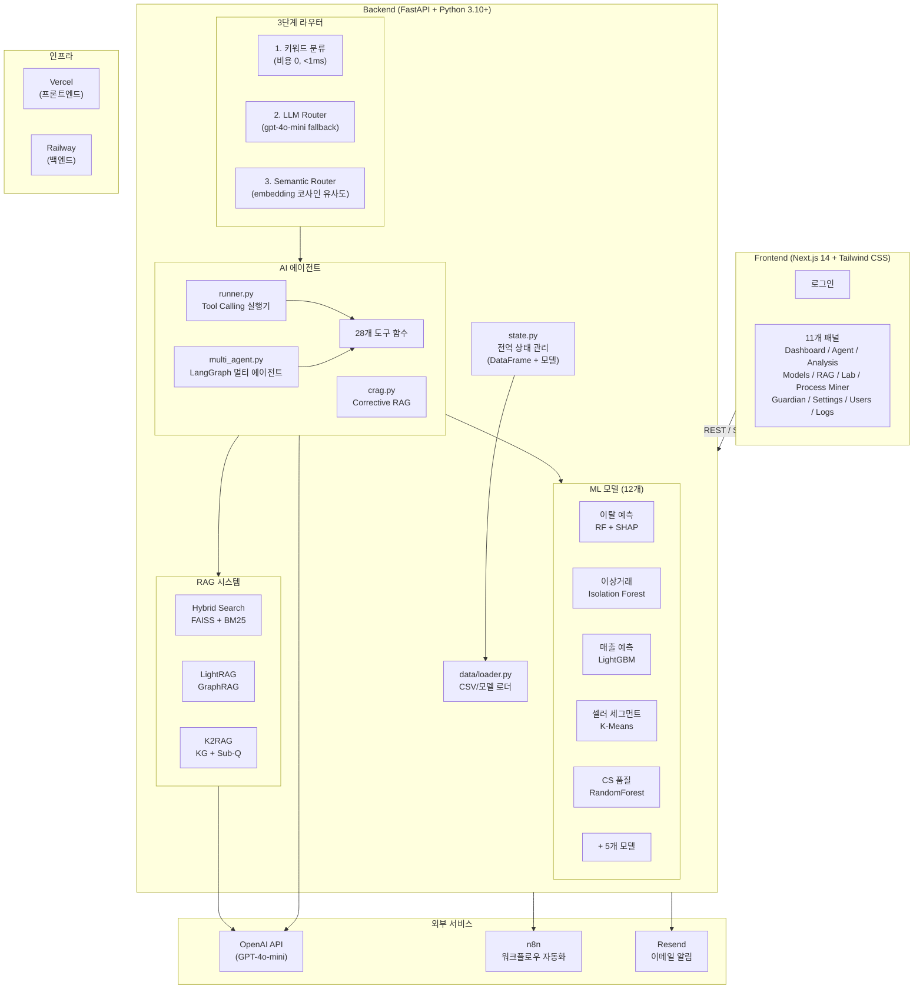
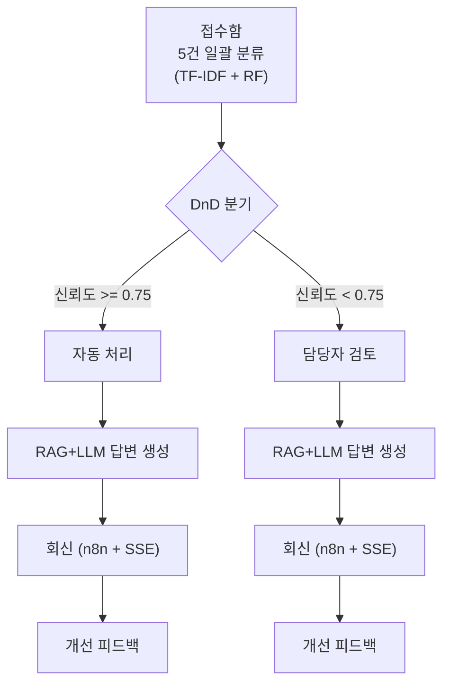
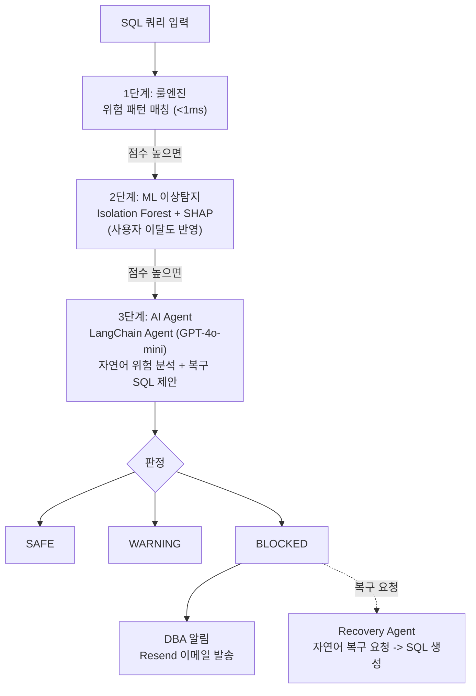
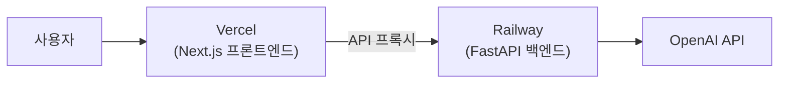

# CAFE24 AI 운영 플랫폼

<div align="center">

**카페24 이커머스 AI 기반 내부 운영 시스템**

LLM + ML 하이브리드 아키텍처로 셀러 이탈 예측, 이상거래 탐지, CS 자동화, 매출 예측을 통합 제공하는 AI 운영 플랫폼

[](https://python.org)
[](https://fastapi.tiangolo.com)
[](https://nextjs.org)
[](https://langchain.com)
[](https://langchain-ai.github.io/langgraph/)
[](https://openai.com)
[](https://mlflow.org)

[웹앱 (Vercel)](https://cafe24-frontend.vercel.app/) | [API 문서 (Swagger)](https://cafe24-backend-production.up.railway.app/docs) | 개발 기간: 2026.02.06 ~ 진행 중

</div>

---

## Executive Summary

| 지표 | 수치 |
|------|------|
| **AI 도구** | 28개 (Tool Calling 기반) |
| **ML 모델** | 12개 (RandomForest, LightGBM, XGBoost, IsolationForest, K-Means, DBSCAN 등) |
| **RAG 엔진** | Triple RAG (Hybrid + LightRAG + K2RAG) + Corrective RAG |
| **API 엔드포인트** | 89개 REST API |
| **프론트엔드 패널** | 11개 (Dashboard, Agent, Analysis, Lab, Guardian 등) |
| **배포** | Vercel (프론트엔드) + Railway (백엔드) |

---

## 목차

1. [프로젝트 개요](#1-프로젝트-개요)
2. [시스템 아키텍처](#2-시스템-아키텍처)
3. [핵심 기능](#3-핵심-기능)
4. [기술 스택](#4-기술-스택)
5. [프로젝트 구조](#5-프로젝트-구조)
6. [설치 및 실행](#6-설치-및-실행)
7. [배포](#7-배포)
8. [버전 히스토리](#8-버전-히스토리)

---

## 1. 프로젝트 개요

### 배경 및 목적

**CAFE24 AI 운영 플랫폼**은 이커머스 플랫폼(카페24) 운영에 필요한 다양한 AI/ML 기능을 하나의 통합 플랫폼으로 제공합니다. 자연어 질의 기반의 AI 에이전트가 28개의 전문 도구를 활용하여 데이터 분석, 예측, CS 자동화를 수행합니다.

> **상세 문서**: [백엔드 README](backend%20리팩토링%20시작/README.md) | [프론트엔드 README](nextjs/README.md)

### 해결하는 문제

| 문제 | 기존 방식 | AI 플랫폼 솔루션 |
|------|----------|------------------|
| **셀러 이탈** | 이탈 후 사후 분석 | RandomForest + SHAP 기반 사전 예측 + 원인 분석 |
| **이상거래 탐지** | 수동 모니터링, 신고 기반 | Isolation Forest 실시간 자동 탐지 |
| **CS 문의 처리** | CS 담당자 수동 분류/응답 | TF-IDF + RF 일괄 분류 + RAG+LLM 답변 생성 + DnD 자동/수동 분기 |
| **정산 이상** | 수작업 정산 검증 | DBSCAN 기반 정산 이상 패턴 탐지 |
| **매출 예측** | 경험 기반 예측 | LightGBM 기반 다변량 매출 예측 |
| **데이터 분석** | SQL 작성, 대시보드 개발 필요 | 자연어 질의 -> 자동 분석 (GPT-4o-mini + 28 Tools) |
| **DB 보안** | 수동 모니터링 | Data Guardian Agent (룰엔진 + ML + LangChain) 실시간 차단 |

### 기술적 차별점

| 특징 | 설명 |
|------|------|
| **LLM + ML 하이브리드** | GPT-4o-mini가 28개 도구를 선택하고, 전통 ML 모델 12개가 예측 수행 |
| **3단계 라우터** | 1) 키워드 분류(비용 0, <1ms, 7개 카테고리) -> 2) LLM Router(gpt-4o-mini fallback) -> 3) Semantic Router(text-embedding-3-small, 코사인 유사도). 카테고리별 도구만 노출하여 LLM 비용/지연 절감 |
| **Triple RAG** | FAISS Hybrid Search + LightRAG(GraphRAG) + K2RAG(KG+Sub-Q+Hybrid) |
| **Corrective RAG** | 검색 결과 품질 자동 평가(CORRECT/INCORRECT/AMBIGUOUS) -> 쿼리 재작성 -> 재검색 ([CRAG 논문](https://arxiv.org/abs/2401.15884) 기반) |
| **SHAP 해석** | 셀러 이탈 원인을 피처별 기여도(SHAP value)로 설명 |
| **실시간 스트리밍** | SSE(Server-Sent Events) 기반 토큰 단위 스트리밍 |
| **MLflow 실험 추적** | 모델 파라미터/메트릭/아티팩트 버전 관리 |
| **마케팅 최적화** | P-PSO(Particle Swarm Optimization) 기반 채널별 예산 배분 최적화 |
| **CS 자동화 파이프라인** | 접수(DnD 분류) -> 답변(RAG+LLM) -> 회신(n8n) 5단계 워크플로우 |
| **Data Guardian Agent** | 룰엔진(<1ms) + Isolation Forest + SHAP 위험 요인 + LangChain Agent + Recovery Agent + Resend 이메일 알림 |
| **셀러 종합 프로필** | 레이더 차트 (퍼센타일 기반) + 5개 ML 모델 예측 통합 조회 |
| **AI 인사이트 자동 생성** | 대시보드 실시간 데이터 기반 트렌드/리텐션/CS/이상 인사이트 동적 생성 |
| **Rule-based 전처리** | `KEYWORD_TOOL_MAPPING`으로 필수 도구 강제 실행 (LLM이 놓칠 수 있는 도구 보장) + 8종 자연어 엔티티 추출기 (seller_id, shop_id, order_id, days, date_range, month, risk_level, cohort) |
| **컨텍스트 재사용** | 사용자별 최근 도구 실행 결과 캐싱 (TTL 10분) -- "요약해줘" 등 후속 질문 시 재검색 없이 즉시 응답 |
| **안전장치** | `MAX_TOOL_ITERATIONS = 10` 무한 루프 방지 + 글로벌 예외 핸들러(traceback 포함) + 요청/응답 로깅 미들웨어 |
| **운영 DX** | numpy 2.x 호환성 패치 + 환경변수 기반 시작 제어 (`SKIP_RAG_STARTUP`, `SKIP_LIGHTRAG`) + `.env` 자동 로드 |

---

## 2. 시스템 아키텍처

### 전체 아키텍처



### 요청 처리 흐름


---

## 3. 핵심 기능

### 기능 요약

| 기능 | 설명 | 핵심 기술 |
|------|------|-----------|
| **AI 에이전트** | 자연어로 데이터 분석/예측 요청 (Single/Multi 모드) | GPT-4o-mini + Tool Calling + 28개 도구 |
| **멀티 에이전트** | Coordinator가 질의 분석 후 전문 에이전트에 라우팅 | LangGraph (Coordinator/Search/Analysis/CS Agent) |
| **Triple RAG** | 3가지 RAG 엔진 선택적 검색 | FAISS Hybrid + LightRAG(GraphRAG) + K2RAG |
| **Corrective RAG** | 검색 결과 자동 품질 평가 및 교정 | RetrievalGrader + QueryRewriter (CRAG 패턴) |
| **셀러 이탈 예측** | 셀러 이탈 확률 예측 + SHAP 해석 | RandomForest + SHAP Explainer |
| **이상거래 탐지** | 사기 거래/비정상 패턴 자동 탐지 | Isolation Forest |
| **매출 예측** | 쇼핑몰 매출 트렌드 예측 | LightGBM |
| **마케팅 최적화** | 마케팅 채널별 예산 ROI 최적화 (6개 채널) | P-PSO (메타휴리스틱 최적화) |
| **CS 자동화** | 문의 자동 분류 -> RAG 답변 -> 회신 | TF-IDF + RF + RAG + SSE + n8n |
| **Data Guardian** | DB 대량 변경 실시간 차단 + SHAP 위험 요인 분석 + 복구 SQL 생성 | 룰엔진 + Isolation Forest + SHAP + LangChain Agent |
| **AI 프로세스 마이너** | 프로세스 패턴 발견, 병목 분석, AI 자동화 추천, 이상 탐지 | Counter + IQR + GPT-4o-mini + RandomForest + IsolationForest |
| **AI 인사이트** | 대시보드 데이터 기반 동적 인사이트 자동 생성 (트렌드, 리텐션, CS, 이상 알림) | 실시간 데이터 분석 |
| **상관관계 분석** | 플랫폼 KPI 지표 간 피어슨 상관계수 분석 | pandas correlation matrix |
| **셀러 종합 프로필** | 레이더 차트 + 5개 ML 모델 예측 결과 통합 (이탈/이상거래/세그먼트/CS품질/매출) | Percentile 기반 스코어링 |
| **데이터 내보내기** | 운영 데이터 CSV/Excel 내보내기 | pandas + openpyxl |
| **OCR** | 이미지에서 텍스트 추출 | EasyOCR |
| **RBAC** | 역할 기반 접근 제어 (관리자/분석가/사용자/운영자) | Basic Auth + 역할별 패널 제한 |

### ML 모델 (12개)

> 모든 모델의 학습 데이터는 **합성 데이터**(numpy/pandas 랜덤 생성 + 카페24 도메인 상수)로 생성됩니다. `ml/train_models.py` 실행 시 18개 CSV와 10개 모델이 자동 생성됩니다.

| # | 모델명 | 알고리즘 | 비즈니스 목적 |
|---|--------|---------|-------------|
| 1 | 셀러 이탈 예측 | RandomForest + SHAP | 이탈 위험 셀러 사전 식별 + 원인 분석 |
| 2 | 이상거래 탐지 | Isolation Forest | 허위 주문/리뷰 조작 등 사기 패턴 탐지 |
| 3 | 문의 자동 분류 | TF-IDF + RandomForest | CS 문의 9개 카테고리 자동 분류 |
| 4 | 셀러 세그먼트 | K-Means (5 클러스터) | 셀러 행동 패턴 기반 군집화 |
| 5 | 매출 예측 | LightGBM | 다음 달 예상 매출 예측 |
| 6 | CS 응답 품질 | RandomForest | CS 문의 긴급도 자동 예측 |
| 7 | 고객 LTV 예측 | GradientBoosting | 고객 미래 기대 수익(LTV) 예측 |
| 8 | 리뷰 감성 분석 | TF-IDF + LogisticRegression | 상품 리뷰 감성 자동 분류 |
| 9 | 상품 수요 예측 | XGBoost | 상품별 수요량 예측 |
| 10 | 정산 이상 탐지 | DBSCAN | 정산 금액/주기 이상 패턴 탐지 |
| 11 | 다음 활동 예측 | RandomForest Classifier | 프로세스 다음 활동 Top-3 예측 |
| 12 | 이상 프로세스 탐지 | Isolation Forest | 경로 기반 이상 프로세스 케이스 탐지 |

> **모델 상세 (피처, 학습 방법, MLflow 추적 등)**: [백엔드 README](backend%20리팩토링%20시작/README.md)

### 분석 패널 (9개 서브탭)

| 서브탭 | 설명 |
|--------|------|
| **셀러 분석** | 개별 셀러 검색 + 레이더 차트 + 5개 ML 모델 예측 통합 |
| **세그먼트** | K-Means 5개 클러스터별 통계/분포 시각화 |
| **이상탐지** | Isolation Forest 이상 셀러 목록 + 상세 분석 |
| **예측 분석** | 전체 이탈 예측 분포 + 개별 이탈 SHAP 해석 |
| **코호트** | 주간 코호트 리텐션 히트맵 + 추이 분석 |
| **트렌드** | KPI 시계열 (GMV, DAU, 주문, 신규가입) + 상관관계 분석 |
| **쇼핑몰 분석** | 쇼핑몰 성과 KPI + 매출 예측 (LightGBM) |
| **CS 분석** | 카테고리별 CS 통계 + 만족도 분석 |
| **마케팅 최적화** | P-PSO 기반 6개 채널 예산 배분 최적화 |

### CS 자동화 파이프라인



### Data Guardian (3단계 + 복구 Agent)



Guardian Agent 도구: `analyze_impact` (비즈니스 영향도), `get_user_pattern` (사용자 행동 패턴), `search_similar` (과거 유사 사건), `execute_decision` (차단/승인)
Recovery Agent 도구: `search_audit_log` (감사 로그 검색), `generate_restore_sql` (복구 SQL 생성)

---

## 4. 기술 스택

### 백엔드

| 분류 | 기술 | 용도 |
|------|------|------|
| **프레임워크** | FastAPI 0.110+ | REST API, SSE 스트리밍 |
| **LLM** | OpenAI GPT-4o-mini | 에이전트 추론, RAG 답변 생성 |
| **에이전트** | LangChain 0.2+, LangGraph 0.2+ | Tool Calling, 멀티 에이전트 |
| **벡터 검색** | FAISS (faiss-cpu) | Dense Vector Search |
| **GraphRAG** | LightRAG (lightrag-hku) | 지식 그래프 기반 검색 |
| **ML** | scikit-learn, LightGBM, XGBoost | 모델 학습/추론 |
| **ML 해석** | SHAP 0.44+ | 모델 해석성 (피처 기여도) |
| **ML 최적화** | mealpy 3.0+ | P-PSO 메타휴리스틱 최적화 |
| **MLOps** | MLflow 2.10+ | 실험 추적/모델 버전 관리 |
| **OCR** | EasyOCR 1.7+ | 이미지 텍스트 추출 |
| **워크플로우** | n8n | CS 회신 자동화 |

### 프론트엔드

| 분류 | 기술 | 용도 |
|------|------|------|
| **프레임워크** | Next.js 14 (Pages Router) | SSR/CSR 하이브리드 |
| **스타일링** | Tailwind CSS 3.4 | 유틸리티 퍼스트 CSS |
| **차트** | Plotly.js, Recharts | 대시보드 시각화 |
| **SSE** | @microsoft/fetch-event-source | 에이전트 스트리밍 |
| **마크다운** | react-markdown + remark-gfm + KaTeX | 에이전트 응답 렌더링 (GFM + 수식) |
| **워크플로우** | @xyflow/react (React Flow) | n8n 워크플로우 시각화 |
| **애니메이션** | Framer Motion 11.0+ | 트랜지션, 아코디언 |

### 인프라

| 분류 | 기술 | 용도 |
|------|------|------|
| **백엔드 배포** | Railway (Docker) | FastAPI 서버 호스팅 |
| **프론트엔드 배포** | Vercel | Next.js 배포 |
| **컨테이너** | Docker (Python 3.11-slim) | 백엔드 컨테이너화 |

> **기술 스택 상세**: [백엔드 README](backend%20리팩토링%20시작/README.md) | [프론트엔드 README](nextjs/README.md)

---

## 5. 프로젝트 구조

```
카페24 프로젝트/
├── README.md                          # 프로젝트 루트 문서 (이 파일)
│
├── backend 리팩토링 시작/             # FastAPI 백엔드
│   ├── main.py                        # FastAPI 앱 진입점
│   ├── state.py                       # 전역 상태 관리
│   ├── api/routes.py                  # 89개 REST API 엔드포인트
│   ├── agent/                         # AI 에이전트 (runner, tools, router, crag, multi_agent)
│   ├── rag/                           # RAG 시스템 (Hybrid, LightRAG, K2RAG)
│   ├── ml/                            # ML 모델 학습/추론 (train_models, revenue, marketing, mlflow)
│   ├── core/                          # 유틸리티 (constants, utils, memory, parsers)
│   ├── data/                          # 데이터 로더
│   ├── process_miner/                 # AI 프로세스 마이너
│   ├── n8n/                           # n8n 워크플로우
│   ├── Dockerfile                     # Docker 빌드
│   └── README.md                      # 백엔드 상세 문서
│
└── nextjs/                            # Next.js 프론트엔드
    ├── pages/                         # Pages Router (login, app, API Routes)
    ├── components/panels/             # 11개 기능 패널
    ├── lib/                           # 유틸리티 (api, storage, cn)
    └── README.md                      # 프론트엔드 상세 문서
```

> **전체 파일 구조 상세**: [백엔드 README](backend%20리팩토링%20시작/README.md) | [프론트엔드 README](nextjs/README.md)

---

## 6. 설치 및 실행

### 요구사항

- **Python** 3.10+ (Conda 환경 권장)
- **Node.js** 18+
- **OpenAI API Key** (GPT-4o-mini)

### 백엔드

```bash
cd "카페24 프로젝트/backend 리팩토링 시작"
pip install -r requirements.txt

# OpenAI API 키 설정
set OPENAI_API_KEY=sk-...   # Windows
export OPENAI_API_KEY=sk-...  # Linux/Mac

# 데이터 생성 및 모델 학습 (최초 1회)
python ml/train_models.py

# 서버 실행
uvicorn main:app --host 0.0.0.0 --port 8001 --reload
```

### 프론트엔드

```bash
cd "카페24 프로젝트/nextjs"
npm install
npm run dev -- -H 0.0.0.0
```

### 접속

| 서비스 | URL |
|--------|-----|
| **프론트엔드** | http://localhost:3000 |
| **백엔드 API** | http://localhost:8001 |
| **Swagger 문서** | http://localhost:8001/docs |

### 테스트 계정

| 계정 | 비밀번호 | 역할 | 접근 패널 |
|------|---------|------|-----------|
| `admin` | `admin123` | 관리자 | 전체 (11개) |
| `analyst` | `analyst123` | 분석가 | 에이전트, 대시보드, 분석, 실험실, Guardian |
| `user` | `user123` | 사용자 | 에이전트, 대시보드, 분석, 실험실, Guardian |
| `operator` | `oper123` | 운영자 | 에이전트, 대시보드 |

### 환경 변수

| 변수 | 위치 | 필수 | 설명 |
|------|------|------|------|
| `OPENAI_API_KEY` | 백엔드 | 필수 | OpenAI API 키 |
| `PORT` | 백엔드 | 선택 | 서버 포트 (기본 `8001`) |
| `MLFLOW_TRACKING_URI` | 백엔드 | 선택 | MLflow 추적 URI |
| `SKIP_RAG_STARTUP` | 백엔드 | 선택 | `1`로 설정 시 시작 시 RAG 인덱스 빌드 스킵 (메모리 절약, 나중에 `/api/rag/reload`로 수동 빌드) |
| `SKIP_LIGHTRAG` | 백엔드 | 선택 | `1`로 설정 시 LightRAG 초기화 스킵 (메모리 절약) |
| `NEXT_PUBLIC_API_BASE` | 프론트엔드 | 선택 | 백엔드 API 주소 (로컬 개발용) |
| `BACKEND_INTERNAL_URL` | 프론트엔드 | 선택 | 백엔드 내부 URL (배포용) |

---

## 7. 배포

### 배포 아키텍처



| 서비스 | URL |
|--------|-----|
| **프론트엔드** | https://cafe24-frontend.vercel.app/ |
| **백엔드 API** | https://cafe24-backend-production.up.railway.app |
| **Swagger 문서** | https://cafe24-backend-production.up.railway.app/docs |

### Railway 백엔드

- **빌드**: Docker (`python:3.11-slim`)
- **헬스체크**: `/api/health`
- **환경변수**: `OPENAI_API_KEY`, `PORT=8000`

### Vercel 프론트엔드

- **환경변수**: `BACKEND_INTERNAL_URL=https://cafe24-backend-production.up.railway.app`

```bash
cd nextjs && npx vercel --prod
```

---

## 8. 버전 히스토리

| 버전 | 날짜 | 주요 변경 |
|------|------|----------|
| 7.5.0 | 2026-02-10 | README 전면 리뉴얼: 백엔드/프론트엔드/루트 README 코드 기준 정확성 검증 |
| 7.4.0 | 2026-02-10 | KaTeX 수학 렌더링, 시스템 프롬프트 통합 (constants.py), CAFE24 브랜딩 통일 |
| 7.3.0 | 2026-02-10 | RAG 패널 UI 리뉴얼: 모드 선택 (Hybrid/LightRAG/K2RAG/Auto), 기능 상태 모니터링 |
| 7.2.0 | 2026-02-09 | 프로세스 마이너 ML 확장: 다음 활동 예측, 이상 프로세스 탐지 |
| 7.1.0 | 2026-02-09 | AI 프로세스 마이너 (패턴 발견 + 병목 분석 + LLM 자동화 추천) |
| 6.9.3 | 2026-02-09 | Guardian ML 이상탐지, 감시 모드 선택, 프리셋 시나리오 8개 |
| 6.9.2 | 2026-02-09 | Data Guardian Agent (룰엔진 + LangChain Agent + Resend 알림) |
| 6.9.0 | 2026-02-09 | n8n 실제 연동, job_id 기반 SSE, 콜백 엔드포인트 |
| 6.8.0 | 2026-02-09 | React Flow n8n 워크플로우 시각화, 노드 상태 애니메이션 |
| 6.6.0 | 2026-02-09 | CS 자동화 파이프라인 (접수/답변 분리, DnD, RAG+LLM 스트리밍) |
| 6.0.0 | 2026-02-06 | 프로젝트 시작 |

---

## 현재 진행 중

- [ ] K2RAG 벤치마크
- [ ] 에이전트 응답 품질 평가
- [ ] 프론트엔드 질문-도구 매핑 정합성 검증
- [ ] n8n Cloud 연동 테스트

---

> **상세 문서**: [백엔드 README](backend%20리팩토링%20시작/README.md) | [프론트엔드 README](nextjs/README.md)

<div align="center">

**CAFE24 AI 운영 플랫폼** | 카페24 이커머스 AI 기반 내부 운영 시스템

</div>
