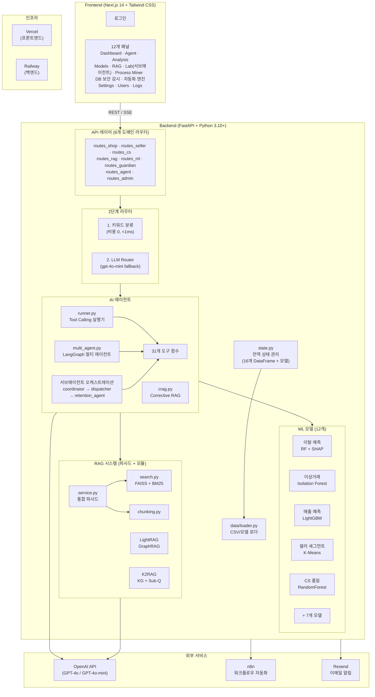
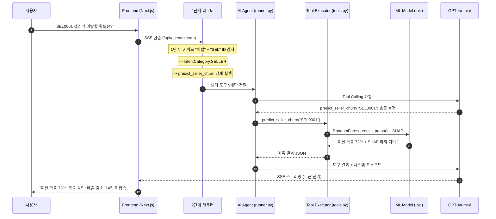
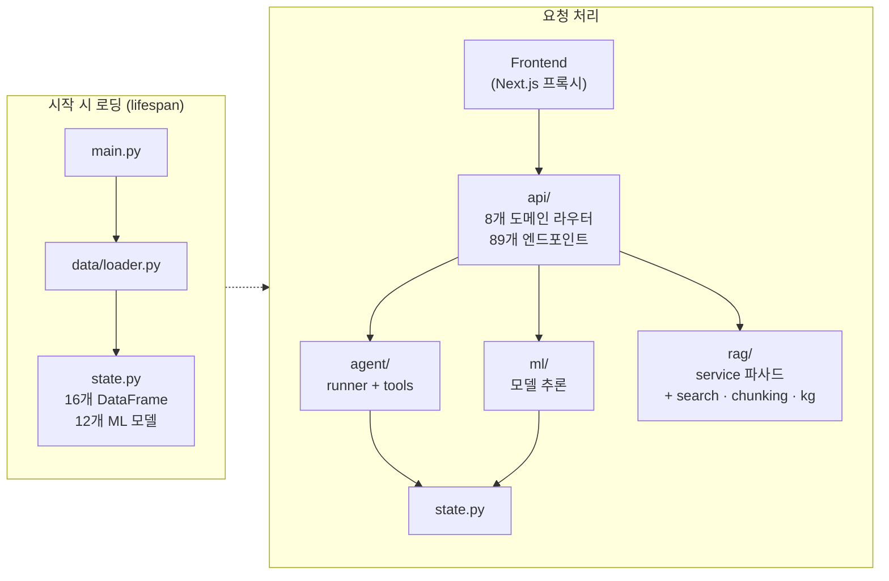
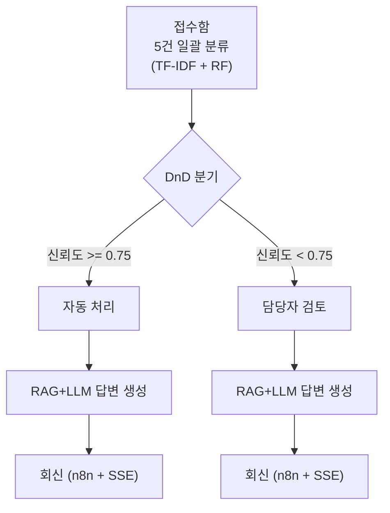
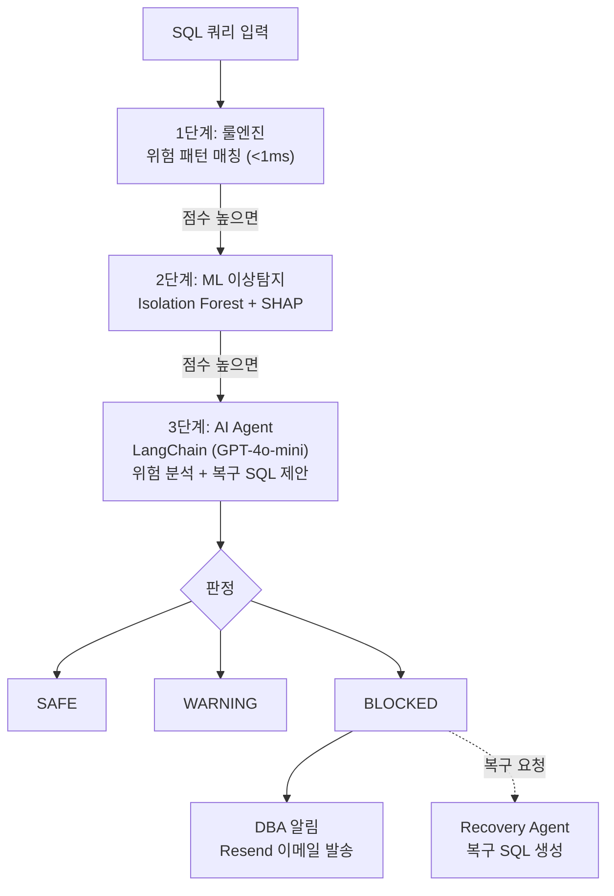
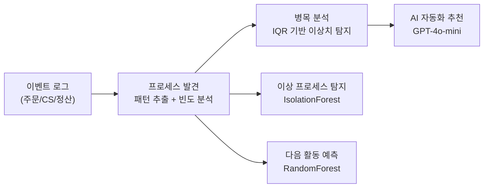
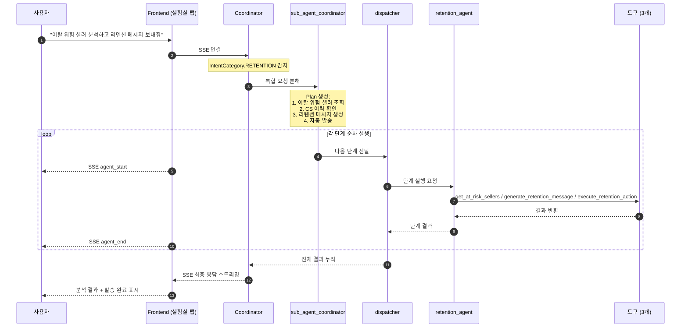
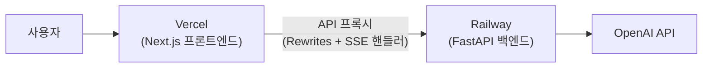

# CAFE24 AI 운영 플랫폼

<div align="center">

**카페24 이커머스 AI 기반 내부 운영 시스템**

LLM + ML 하이브리드 아키텍처로 셀러 이탈 예측, 이상거래 탐지, CS 자동화, 매출 예측을 통합 제공하는 AI 운영 플랫폼

[](https://python.org)
[](https://fastapi.tiangolo.com)
[](https://nextjs.org)
[](https://langchain.com)
[](https://langchain-ai.github.io/langgraph/)
[](https://openai.com)
[](https://mlflow.org)

v8.5.0 | [웹앱 (Vercel)](https://cafe24-frontend.vercel.app/) | [API 문서 (Swagger)](https://cafe24-backend-production.up.railway.app/docs) | 개발 기간: 2026.02.06 ~ 진행 중

</div>

---

## 최신 업데이트

> **v8.5.0** (2026-02-18) — 전체 코드 최적화 및 성능 개선 (18파일)

| 영역 | 주요 변경 |
|------|-----------|
| **백엔드 성능** | state.py 로깅 싱글톤/설정 캐시, data/loader.py 라벨인코더 병렬 로드(ThreadPoolExecutor)/build_caches 벡터화/revenue_model 비동기 학습/MLflow 캐싱, main.py RAG 비동기 백그라운드 초기화 |
| **API 최적화** | routes_shop.py set_index 캐싱/인사이트 TTL 캐시, routes_cs.py cleanup 빈도 제한, routes_admin.py 불필요한 copy() 제거 |
| **에이전트 최적화** | tools.py .copy() 5건 제거/세그먼트 캐시/JSON 파싱 헬퍼 통합, multi_agent.py 도구·프롬프트 캐시, router.py 정규식 사전 컴파일, intent.py 키워드 frozenset 변환, llm.py LLM 인스턴스 캐시, runner.py 도구 매핑 캐시/정규식 6개 사전 컴파일 |
| **프론트 렌더링** | AgentPanel ChatMessage/ToolCalls React.memo, remarkPlugins 모듈 상수화, DashboardPanel useMemo 의존성 세분화/폴링 document.hidden 체크 |
| **프론트 SSE** | useAgentStream/useSubAgentStream flushTimer 개선, cleanup 강화 (abort/timeout 리소스 정리) |
| **프론트 유틸** | app.js localStorage debounce 통합, zoom 반응형, storage.js 1MB 크기 제한 |

> **v8.4.0** (2026-02-16) — 서브에이전트 오케스트레이션 아키텍처 `🚧 개발중`

| 영역 | 주요 변경 |
|------|-----------|
| **서브에이전트 탭** | 🧬 실험실 - 서브에이전트: 복합 요청을 단계별로 분해하여 순차 실행하는 오케스트레이션 UI |
| **Retention 서브에이전트** | 셀러 이탈 분석 → CS 확인 → 리텐션 전략 생성 → 자동 발송 파이프라인 |
| **새 도구 3개** | `get_at_risk_sellers`, `generate_retention_message`, `execute_retention_action` (28→31개) |
| **인텐트 라우팅** | `IntentCategory.RETENTION` 추가 — 리텐션 키워드 기반 라우팅 (ANALYSIS보다 우선) |
| **SSE 이벤트 확장** | `agent_start`, `agent_end` 2종 추가 (기존 delta/tool_start/tool_end/done/error + 2종) |
| **오케스트레이션 흐름** | Coordinator → sub_agent_coordinator(plan) → dispatcher(순차 실행) → retention_agent(도구 호출) → 결과 누적 → 최종 응답 |

> **v8.3.0** (2026-02-12) — 전체 코드 최적화 150건 (백엔드 + 프론트엔드)

| 영역 | 주요 변경 |
|------|-----------|
| **코드 감축** | 99파일, 순 -7,000줄 — 거대 파일 4개 분리 (ProcessMiner 1293→107, Guardian 884→67, Automation 1131→87, Agent 905→539) |
| **백엔드 중복 제거** | 함수 중복 통합, OpenAI 클라이언트 팩토리, 키워드/인텐트 분류 단일 소스화, tool_schemas.py→tools.py 통합 |
| **백엔드 성능** | CRAG 배치 평가, LangGraph 캐시, RAG BM25 직렬화 캐시, k2rag O(1) 룩업, CSV/모델 병렬 로딩, PSO numpy 벡터화 |
| **프론트 번들** | plotly.js 제거 (-1MB), 12개 패널 next/dynamic 전환, recharts 코드 스플리팅, framer-motion login 분리 |
| **프론트 아키텍처** | AnalysisPanel useState 38→15개, SSE 프록시 3개 통합, 공통 컴포넌트 6개 추출, 커스텀 훅 3개 생성 |
| **브랜딩 통일** | cookie-* 전면 제거, cafe24-* 네이밍 100% 통일 |
| **접근성** | WAI-ARIA 탭 키보드 네비게이션, Escape 모달 닫기 |

> **v8.2.0** (2026-02-12) — 자동화 엔진 고도화 (파이프라인 시각화 + 버그 수정)

| 기능 | 설명 |
|------|------|
| **인터랙티브 파이프라인 시각화** | PipelineFlow 컴포넌트 — 각 탭 상단에 5단계 진행 상태 실시간 표시 (pending→processing→complete 애니메이션) |
| **RetentionTab 고도화** | 셀러 프리뷰 카드(5개 KPI) + 리스크 게이지 바 + 체크박스 벌크 액션 |
| **FaqTab 고도화** | 카테고리 드롭다운(9종) + 텍스트/상태/카테고리 검색·필터 + 모달 편집 |
| **ReportTab 고도화** | KPI 트렌드 표시(↑↓ + WoW 변화율) + 섹션 네비게이션 pill |
| **FAQ 카테고리 버그 수정** | 프롬프트 강화 + 후처리 카테고리 강제 (선택한 카테고리만 생성) |
| **파이프라인 추적 인프라** | `create_pipeline_run()` / `update_pipeline_step()` — 백엔드 3대 엔진 연동 |

- 신규 API 3개: `/categories`, `/pipeline/{run_id}`, `/retention/execute-bulk`
- 신규 컴포넌트: `PipelineFlow.js`, `automation/constants.js`
- API 엔드포인트 총 17개 (14→17), 파이프라인 스텝 업데이트 버그 3건 수정

---

## Executive Summary

| 지표 | 수치 |
|------|------|
| **AI 도구** | 31개 (Tool Calling 기반) |
| **ML 모델** | 12개 (RandomForest, LightGBM, XGBoost, IsolationForest, K-Means, DBSCAN 등) |
| **RAG 엔진** | 8종 기법 (Hybrid · RAG-Fusion · Parent-Child · Contextual · LightRAG · K2RAG · CRAG · Cross-Encoder) |
| **API 엔드포인트** | 106개 REST API |
| **프론트엔드 패널** | 12개 (Dashboard, Agent, Analysis, Lab, 서브에이전트, DB 보안 감시, 자동화 엔진 등) |
| **배포** | Vercel (프론트엔드) + Railway (백엔드) |

> **상세 문서**: [백엔드 README](backend%20리팩토링%20시작/README.md) | [프론트엔드 README](nextjs/README.md)

---

## 목차

1. [프로젝트 개요](#1-프로젝트-개요)
2. [시스템 아키텍처](#2-시스템-아키텍처)
3. [핵심 기능](#3-핵심-기능)
4. [기술 스택](#4-기술-스택)
5. [프로젝트 구조](#5-프로젝트-구조)
6. [설치 및 실행](#6-설치-및-실행)
7. [배포](#7-배포)
8. [버전 히스토리](#8-버전-히스토리)

---

## 1. 프로젝트 개요

### 배경 및 목적

**CAFE24 AI 운영 플랫폼**은 이커머스 플랫폼(카페24) 운영에 필요한 다양한 AI/ML 기능을 하나의 통합 플랫폼으로 제공합니다. 자연어 질의 기반의 AI 에이전트가 31개의 전문 도구를 활용하여 데이터 분석, 예측, CS 자동화를 수행합니다.

### 해결하는 문제

| 문제 | 기존 방식 | AI 플랫폼 솔루션 |
|------|----------|------------------|
| **셀러 이탈** | 이탈 후 사후 분석 | RandomForest + SHAP 기반 사전 예측 + 원인 분석 |
| **이상거래 탐지** | 수동 모니터링, 신고 기반 | Isolation Forest 실시간 자동 탐지 |
| **CS 문의 처리** | CS 담당자 수동 분류/응답 | TF-IDF + RF 일괄 분류 + RAG+LLM 답변 생성 + DnD 자동/수동 분기 |
| **정산 이상** | 수작업 정산 검증 | DBSCAN 기반 정산 이상 패턴 탐지 |
| **매출 예측** | 경험 기반 예측 | LightGBM 기반 다변량 매출 예측 |
| **데이터 분석** | SQL 작성, 대시보드 개발 필요 | 자연어 질의 -> 자동 분석 (GPT-4o-mini + 31 Tools) |
| **DB 보안** | 수동 모니터링 | DB 보안 감시 (룰엔진 + ML + LangChain) 실시간 차단 |
| **운영 프로세스** | 프로세스 수동 분석 | AI 프로세스 마이너 (패턴 발견 + 병목 분석 + 자동화 추천) |
| **셀러 리텐션** | 이탈 후 대응, 수동 관리 | ML 이탈 예측 → LLM 맞춤 메시지 → 자동 조치 (쿠폰/업그레이드/매니저) + 서브에이전트 오케스트레이션 (분석→CS확인→전략→발송 자동화) |
| **CS FAQ** | 수동 FAQ 작성·관리 | CS 문의 패턴 분석 → LLM FAQ 자동 생성 → 승인 워크플로우 |
| **운영 리포트** | 수동 KPI 집계·보고서 작성 | 전체 DF 자동 집계 → LLM 마크다운 리포트 (일간/주간/월간) |

### 핵심 기술 하이라이트

| 특징 | 설명 |
|------|------|
| **LLM + ML 하이브리드** | GPT-4o / GPT-4o-mini가 31개 도구를 선택하고, 전통 ML 모델 12개가 예측 수행 (Coordinator: GPT-4o, 서브에이전트: GPT-4o-mini) |
| **2단계 라우터** | 키워드 분류(비용 0, <1ms) -> LLM Router(gpt-4o-mini fallback) |
| **RAG 8종 기법** | FAISS Hybrid + RAG-Fusion + Parent-Child + Contextual + LightRAG(GraphRAG) + K2RAG(KG+Sub-Q) + CRAG(검색 품질 교정) + Cross-Encoder Reranking |
| **SHAP 해석** | 셀러 이탈 원인을 피처별 기여도(SHAP value)로 설명 |
| **서브에이전트 오케스트레이션** | 복합 요청 자동 분해 → 단계별 순차 실행 (Coordinator → Plan → Dispatch → Agent → 결과 누적) |
| **실시간 스트리밍** | SSE(Server-Sent Events) 기반 토큰 단위 스트리밍 (delta/tool_start/tool_end/agent_start/agent_end/done/error) |
| **DB 보안 감시** | 룰엔진(<1ms) + Isolation Forest + SHAP + LangChain Agent + Recovery Agent |
| **CS 자동화** | 접수(DnD 분류) -> 답변(RAG+LLM) -> 회신(n8n) 워크플로우 |
| **마케팅 최적화** | P-PSO(Particle Swarm Optimization) 기반 채널별 예산 배분 최적화 |
| **보안** | 프롬프트 인젝션 방어, CS 콜백 인증, 대화 메모리 TTL/세션 제한, 스택트레이스 비노출 |
| **모듈형 아키텍처** | 라우터 9개 도메인 분리, RAG 서비스 파사드 패턴, 프론트엔드 패널 컴포넌트 분리 |

> **기술 상세**: [백엔드 README](backend%20리팩토링%20시작/README.md) | [프론트엔드 README](nextjs/README.md)

---

## 2. 시스템 아키텍처

### 전체 아키텍처



### 요청 처리 흐름



### 데이터 플로우



---

## 3. 핵심 기능

### 기능 요약

| 기능 | 설명 | 핵심 기술 |
|------|------|-----------|
| **AI 에이전트** | 자연어로 데이터 분석/예측 요청 (Single/Multi/서브에이전트 모드) | GPT-4o-mini + Tool Calling + 31개 도구 |
| **멀티 에이전트** | Coordinator가 질의 분석 후 전문 에이전트에 라우팅 | LangGraph (Coordinator/Search/Analysis/CS Agent) |
| **서브에이전트 오케스트레이션** `🚧 개발중` | 복합 요청을 자동 분해 → 단계별 순차 실행 (Retention 서브에이전트) | sub_agent_coordinator + dispatcher + retention_agent |
| **RAG 8종 기법** | 8가지 RAG 기법 조합 검색 | Hybrid + RAG-Fusion + Parent-Child + Contextual + LightRAG + K2RAG + CRAG + Cross-Encoder |
| **Corrective RAG** | 검색 결과 자동 품질 평가 및 교정 | RetrievalGrader + QueryRewriter (CRAG 패턴) |
| **셀러 이탈 예측** | 셀러 이탈 확률 예측 + SHAP 해석 | RandomForest + SHAP Explainer |
| **이상거래 탐지** | 사기 거래/비정상 패턴 자동 탐지 | Isolation Forest |
| **매출 예측** | 쇼핑몰 매출 트렌드 예측 | LightGBM |
| **마케팅 최적화** | 마케팅 채널별 예산 ROI 최적화 (6개 채널) | P-PSO (메타휴리스틱 최적화) |
| **CS 자동화** | 문의 자동 분류 -> RAG 답변 -> 회신 | TF-IDF + RF + RAG + SSE + n8n |
| **DB 보안 감시** | DB 대량 변경 실시간 차단 + SHAP 위험 분석 + 복구 SQL 생성 | 룰엔진 + Isolation Forest + SHAP + LangChain Agent |
| **프로세스 마이너** | 프로세스 패턴 발견, 병목 분석, AI 자동화 추천, 이상 탐지 | Counter + IQR + GPT-4o-mini + RandomForest + IsolationForest |
| **AI 인사이트** | 대시보드 데이터 기반 동적 인사이트 자동 생성 | 실시간 데이터 분석 |
| **셀러 종합 프로필** | 레이더 차트 + 5개 ML 모델 예측 결과 통합 | Percentile 기반 스코어링 |
| **OCR** | 이미지에서 텍스트 추출 + RAG 문서 등록 | EasyOCR |
| **RBAC** | 역할 기반 접근 제어 (관리자/분석가/사용자/운영자) | Basic Auth + 역할별 패널 제한 |

### ML 모델 (12개)

> 모든 모델의 학습 데이터는 **합성 데이터**(numpy/pandas 랜덤 생성 + 카페24 도메인 상수)로 생성됩니다. `ml/train_models.py` 실행 시 18개 CSV와 12개 모델이 자동 생성됩니다.

| # | 모델명 | 알고리즘 | 비즈니스 목적 |
|---|--------|---------|-------------|
| 1 | 셀러 이탈 예측 | RandomForest + SHAP | 이탈 위험 셀러 사전 식별 + 원인 분석 |
| 2 | 이상거래 탐지 | Isolation Forest | 허위 주문/리뷰 조작 등 사기 패턴 탐지 |
| 3 | 문의 자동 분류 | TF-IDF + RandomForest | CS 문의 9개 카테고리 자동 분류 |
| 4 | 셀러 세그먼트 | K-Means (5 클러스터) | 셀러 행동 패턴 기반 군집화 |
| 5 | 매출 예측 | LightGBM | 다음 달 예상 매출 예측 |
| 6 | CS 응답 품질 | RandomForest | CS 문의 긴급도 자동 예측 |
| 7 | 고객 LTV 예측 | GradientBoosting | 고객 미래 기대 수익(LTV) 예측 |
| 8 | 리뷰 감성 분석 | TF-IDF + LogisticRegression | 상품 리뷰 감성 자동 분류 |
| 9 | 상품 수요 예측 | XGBoost | 상품별 수요량 예측 |
| 10 | 정산 이상 탐지 | DBSCAN | 정산 금액/주기 이상 패턴 탐지 |
| 11 | 다음 활동 예측 | RandomForest Classifier | 프로세스 다음 활동 Top-3 예측 |
| 12 | 이상 프로세스 탐지 | Isolation Forest | 경로 기반 이상 프로세스 케이스 탐지 |

> **모델 상세 (피처, 학습 방법, MLflow 추적 등)**: [백엔드 README](backend%20리팩토링%20시작/README.md)

### CS 자동화 파이프라인



### DB 보안 감시 (3단계 + 복구 Agent)



### 프로세스 마이너



### 서브에이전트 오케스트레이션



---

## 4. 기술 스택

### 백엔드

| 분류 | 기술 | 용도 |
|------|------|------|
| **프레임워크** | FastAPI 0.110+ | REST API, SSE 스트리밍 |
| **LLM** | OpenAI GPT-4o / GPT-4o-mini | 에이전트 추론, RAG 답변 생성 (Coordinator: GPT-4o) |
| **에이전트** | LangChain 0.2+, LangGraph 0.2+ | Tool Calling, 멀티 에이전트 |
| **벡터 검색** | FAISS (faiss-cpu) | Dense Vector Search |
| **GraphRAG** | LightRAG (lightrag-hku) | 지식 그래프 기반 검색 |
| **ML** | scikit-learn, LightGBM, XGBoost | 모델 학습/추론 |
| **ML 해석** | SHAP 0.44+ | 모델 해석성 (피처 기여도) |
| **ML 최적화** | mealpy 3.0+ | P-PSO 메타휴리스틱 최적화 |
| **MLOps** | MLflow 2.10+ | 실험 추적/모델 버전 관리 |
| **OCR** | EasyOCR 1.7+ | 이미지 텍스트 추출 |
| **워크플로우** | n8n | CS 회신 자동화 |

### 프론트엔드

| 분류 | 기술 | 용도 |
|------|------|------|
| **프레임워크** | Next.js 14 (Pages Router) | SSR/CSR 하이브리드 |
| **스타일링** | Tailwind CSS 3.4 | 유틸리티 퍼스트 CSS |
| **차트** | Recharts 3.7 | 대시보드 시각화 |
| **SSE** | @microsoft/fetch-event-source | 에이전트 스트리밍 |
| **마크다운** | react-markdown + remark-gfm + KaTeX | 에이전트 응답 렌더링 (GFM + 수식) |
| **워크플로우** | @xyflow/react (React Flow) | n8n 워크플로우 시각화 |
| **애니메이션** | Framer Motion 11.0+ | 트랜지션, 아코디언 |

### 인프라

| 분류 | 기술 | 용도 |
|------|------|------|
| **백엔드 배포** | Railway (Docker) | FastAPI 서버 호스팅 |
| **프론트엔드 배포** | Vercel | Next.js 배포 |
| **컨테이너** | Docker (Python 3.11-slim) | 백엔드 컨테이너화 |

> **기술 스택 상세**: [백엔드 README](backend%20리팩토링%20시작/README.md) | [프론트엔드 README](nextjs/README.md)

---

## 5. 프로젝트 구조

```
카페24 프로젝트/
├── README.md                          # 프로젝트 루트 문서 (이 파일)
│
├── backend 리팩토링 시작/             # FastAPI 백엔드
│   ├── main.py                        # FastAPI 앱 진입점 (lifespan 패턴)
│   ├── state.py                       # 전역 상태 관리 (16개 DataFrame + 모델)
│   ├── api/                           # REST API 엔드포인트 (도메인별 분리)
│   │   ├── common.py                  # 공통 의존성/유틸
│   │   ├── routes.py                  # 라우터 허브 (9개 도메인 라우터 통합)
│   │   ├── routes_shop.py             # 쇼핑몰/주문/상품 API
│   │   ├── routes_seller.py           # 셀러 관리 API
│   │   ├── routes_cs.py               # CS 자동화 API
│   │   ├── routes_rag.py              # RAG 검색/문서 관리 API
│   │   ├── routes_ml.py               # ML 모델 추론/학습 API
│   │   ├── routes_guardian.py         # DB 보안 감시 API
│   │   ├── routes_automation.py       # 자동화 엔진 API (14개 엔드포인트)
│   │   ├── routes_agent.py            # AI 에이전트 API
│   │   └── routes_admin.py            # 관리/설정/로그 API
│   ├── automation/                    # 자동화 엔진 (이탈방지/FAQ/리포트)
│   │   ├── action_logger.py           # 조치 로깅 + FAQ/리포트/리텐션 저장소 + 파이프라인 추적
│   │   ├── retention_engine.py        # 셀러 이탈 방지 자동 조치 엔진
│   │   ├── faq_engine.py              # CS FAQ 자동 생성 엔진
│   │   └── report_engine.py           # 운영 리포트 자동 생성 엔진
│   ├── agent/                         # AI 에이전트
│   │   ├── runner.py                  # Tool Calling 실행기
│   │   ├── tools.py                   # 31개 도구 함수 (비즈니스 로직)
│   │   ├── tool_schemas.py            # 31개 @tool 래퍼 (LLM 인터페이스)
│   │   ├── router.py                  # 에이전트 라우팅
│   │   ├── llm.py                     # LLM 클라이언트 설정
│   │   ├── intent.py                  # 의도 분류 (RETENTION 인텐트 포함)
│   │   ├── semantic_router.py         # 시맨틱 라우터
│   │   ├── crag.py                    # Corrective RAG
│   │   ├── multi_agent.py             # LangGraph 멀티 에이전트
│   │   └── sub_agent/                 # 서브에이전트 오케스트레이션
│   │       ├── coordinator.py         # 복합 요청 분해 (plan 생성)
│   │       ├── dispatcher.py          # 서브에이전트 순차 실행
│   │       └── retention_agent.py     # Retention 서브에이전트 (이탈분석→CS확인→전략→발송)
│   ├── rag/                           # RAG 시스템 (모듈별 분리)
│   │   ├── service.py                 # RAG 파사드 (통합 인터페이스)
│   │   ├── chunking.py                # 문서 청킹 로직
│   │   ├── search.py                  # 검색 엔진 (Hybrid/BM25)
│   │   ├── kg.py                      # 지식 그래프 처리
│   │   ├── contextual.py              # Contextual RAG 로직
│   │   ├── light_rag.py               # LightRAG (GraphRAG) 엔진
│   │   └── k2rag.py                   # K2RAG (KG+Sub-Q+Hybrid) 엔진
│   ├── ml/                            # ML 모델 학습/추론 (train_models, helpers, revenue, marketing, mlflow)
│   ├── core/                          # 유틸리티 (constants, utils, memory, parsers)
│   ├── data/                          # 데이터 로더
│   ├── automation/                    # 자동화 엔진 (이탈방지/FAQ/리포트)
│   │   ├── action_logger.py           # 자동화 조치 로깅 + FAQ/리포트 저장소
│   │   ├── retention_engine.py        # 셀러 이탈 방지 자동 조치 엔진
│   │   ├── faq_engine.py              # CS FAQ 자동 생성 엔진
│   │   └── report_engine.py           # 운영 리포트 자동 생성 엔진
│   ├── process_miner/                 # AI 프로세스 마이너 (6개 엔드포인트)
│   ├── n8n/                           # n8n 워크플로우
│   ├── Dockerfile                     # Docker 빌드
│   └── README.md                      # 백엔드 상세 문서
│
└── nextjs/                            # Next.js 프론트엔드
    ├── pages/                         # Pages Router (login, app, API Routes)
    │   └── api/                       # SSE 프록시 핸들러 (agent, cs)
    ├── components/
    │   ├── common/                    # 공통 컴포넌트 (CustomTooltip, StatCard, constants)
    │   ├── automation/                # 자동화 엔진 공통 컴포넌트
    │   │   ├── PipelineFlow.js      # 인터랙티브 파이프라인 시각화 (5단계 노드 + 애니메이션)
    │   │   └── constants.js         # 파이프라인 스텝 상수 + CS 카테고리
    │   └── panels/                    # 12개 기능 패널
    │       ├── AutomationPanel.js     # 자동화 엔진 (이탈방지/FAQ/리포트 3탭)
    │       ├── lab/                   # CS 자동화 실험실 + 🧬 서브에이전트 탭 (11개+ 파일)
    │       ├── analysis/              # 분석 패널 (9개 탭 + 1 컨테이너, 10개 파일)
    │       └── ...                    # 기타 패널
    ├── lib/                           # 유틸리티 (api, storage, cn, sse)
    └── README.md                      # 프론트엔드 상세 문서
```

> **전체 파일 구조 상세**: [백엔드 README](backend%20리팩토링%20시작/README.md) | [프론트엔드 README](nextjs/README.md)

---

## 6. 설치 및 실행

### 요구사항

- **Python** 3.10+ (Conda 환경 권장)
- **Node.js** 18+
- **OpenAI API Key** (GPT-4o-mini)

### 백엔드

```bash
cd "카페24 프로젝트/backend 리팩토링 시작"
pip install -r requirements.txt

# OpenAI API 키 설정
set OPENAI_API_KEY=sk-...   # Windows
export OPENAI_API_KEY=sk-...  # Linux/Mac

# 데이터 생성 및 모델 학습 (최초 1회)
python ml/train_models.py

# 서버 실행
uvicorn main:app --host 0.0.0.0 --port 8001 --reload
```

### 프론트엔드

```bash
cd "카페24 프로젝트/nextjs"
npm install
npm run dev -- -H 0.0.0.0
```

### 접속

| 서비스 | URL |
|--------|-----|
| **프론트엔드** | http://localhost:3000 |
| **백엔드 API** | http://localhost:8001 |
| **Swagger 문서** | http://localhost:8001/docs |

### 테스트 계정

| 계정 | 비밀번호 | 역할 | 접근 패널 |
|------|---------|------|-----------|
| `admin` | `admin123` | 관리자 | 전체 (12개) |
| `analyst` | `analyst123` | 분석가 | 에이전트, 대시보드, 분석, 실험실, DB 보안 감시, 프로세스 마이너, 자동화 엔진 |
| `user` | `user123` | 사용자 | 에이전트, 대시보드, 분석, 실험실, DB 보안 감시, 프로세스 마이너, 자동화 엔진 |
| `operator` | `oper123` | 운영자 | 에이전트, 대시보드, 분석, 실험실, DB 보안 감시, 프로세스 마이너, 자동화 엔진 |

### 환경 변수

| 변수 | 위치 | 필수 | 설명 |
|------|------|------|------|
| `OPENAI_API_KEY` | 백엔드 | 필수 | OpenAI API 키 |
| `PORT` | 백엔드 | 선택 | 서버 포트 (기본 `8001`) |
| `MLFLOW_TRACKING_URI` | 백엔드 | 선택 | MLflow 추적 URI |
| `SKIP_RAG_STARTUP` | 백엔드 | 선택 | `1`로 설정 시 시작 시 RAG 인덱스 빌드 스킵 (나중에 `/api/rag/reload`로 수동 빌드) |
| `SKIP_LIGHTRAG` | 백엔드 | 선택 | `1`로 설정 시 LightRAG 초기화 스킵 (메모리 절약) |
| `NEXT_PUBLIC_API_BASE` | 프론트엔드 | 선택 | 백엔드 API 주소 (로컬 개발용) |
| `BACKEND_INTERNAL_URL` | 프론트엔드 | 선택 | 백엔드 내부 URL (배포용, 기본 `http://127.0.0.1:8001`) |

---

## 7. 배포

### 배포 아키텍처



| 서비스 | URL |
|--------|-----|
| **프론트엔드** | https://cafe24-frontend.vercel.app/ |
| **백엔드 API** | https://cafe24-backend-production.up.railway.app |
| **Swagger 문서** | https://cafe24-backend-production.up.railway.app/docs |

### Railway 백엔드

- **빌드**: Docker (`python:3.11-slim`)
- **헬스체크**: `/api/health`
- **환경변수**: `OPENAI_API_KEY`, `PORT=8000`

### Vercel 프론트엔드

- **환경변수**: `BACKEND_INTERNAL_URL=https://cafe24-backend-production.up.railway.app`
- **프록시**: `next.config.js` rewrites로 `/api/*` -> 백엔드, SSE는 전용 API Route 핸들러

```bash
cd nextjs && npx vercel --prod
```

---

## 8. 버전 히스토리

| 버전 | 날짜 | 주요 변경 |
|------|------|----------|
| 8.5.0 | 2026-02-18 | 전체 코드 최적화 및 성능 개선 (18파일): 백엔드 로깅 싱글톤/병렬 로드/벡터화/비동기 학습/MLflow 캐싱, API set_index 캐싱/TTL 캐시/cleanup 빈도 제한, 에이전트 copy() 제거/세그먼트 캐시/정규식 사전 컴파일/LLM 인스턴스 캐시, 프론트 React.memo/useMemo 세분화/SSE cleanup 강화/localStorage debounce |
| 8.4.0 | 2026-02-16 | `🚧 개발중` 서브에이전트 오케스트레이션: 복합 요청 자동 분해→순차 실행 아키텍처, Retention 서브에이전트(이탈분석→CS확인→전략→발송), 도구 3개 추가(31개), IntentCategory.RETENTION 라우팅, SSE agent_start/agent_end 이벤트, 실험실 서브에이전트 탭 |
| 8.3.0 | 2026-02-12 | 전체 코드 최적화 150건: 99파일 순 -7,000줄, 백엔드 중복 제거/캐시/병렬화, 프론트 번들 -1MB/dynamic import, WAI-ARIA 접근성 |
| 8.2.0 | 2026-02-12 | 자동화 엔진 고도화: 인터랙티브 파이프라인 시각화, RetentionTab/FaqTab/ReportTab 고도화, API 17개 |
| 8.1.0 | 2026-02-12 | 자동화 엔진 3대 기능: 셀러 이탈 방지(ML+SHAP→LLM→자동조치), CS FAQ 자동 생성(패턴분석→LLM→승인관리), 운영 리포트 자동 생성(KPI집계→LLM 마크다운). API 14개, 자동화 패널 추가 |
| 8.0.0 | 2026-02-10 | 대규모 리팩토링: routes.py 8개 도메인 라우터 분리, service.py 파사드+모듈 분리, LabPanel/AnalysisPanel 컴포넌트 분리, 보안 강화(프롬프트 인젝션 방어, CS 콜백 인증, 대화 메모리 TTL), CSS 변수 리네이밍, 접근성 개선 |
| 7.6.0 | 2026-02-10 | README 체계화: 루트(프로젝트 개요) / 백엔드(기술 상세) / 프론트엔드(UI 상세) 역할 분리 |
| 7.5.0 | 2026-02-10 | README 전면 리뉴얼: 백엔드/프론트엔드/루트 README 코드 기준 정확성 검증 |
| 7.4.0 | 2026-02-10 | KaTeX 수학 렌더링, 시스템 프롬프트 통합 (constants.py), CAFE24 브랜딩 통일 |
| 7.3.0 | 2026-02-10 | RAG 패널 UI 리뉴얼: 모드 선택 (Hybrid/LightRAG/K2RAG/Auto), 기능 상태 모니터링 |
| 7.2.0 | 2026-02-09 | 프로세스 마이너 ML 확장: 다음 활동 예측, 이상 프로세스 탐지 |
| 7.1.0 | 2026-02-09 | AI 프로세스 마이너 (패턴 발견 + 병목 분석 + LLM 자동화 추천) |
| 6.9.3 | 2026-02-09 | DB 보안 감시 ML 이상탐지, 감시 모드 선택, 프리셋 시나리오 8개 |
| 6.9.2 | 2026-02-09 | DB 보안 감시 (룰엔진 + LangChain Agent + Resend 알림) |
| 6.9.0 | 2026-02-09 | n8n 실제 연동, job_id 기반 SSE, 콜백 엔드포인트 |
| 6.8.0 | 2026-02-09 | React Flow n8n 워크플로우 시각화, 노드 상태 애니메이션 |
| 6.6.0 | 2026-02-09 | CS 자동화 파이프라인 (접수/답변 분리, DnD, RAG+LLM 스트리밍) |
| 6.0.0 | 2026-02-06 | 프로젝트 시작 |

<div align="center">

**CAFE24 AI 운영 플랫폼** | 카페24 이커머스 AI 기반 내부 운영 시스템

</div>
