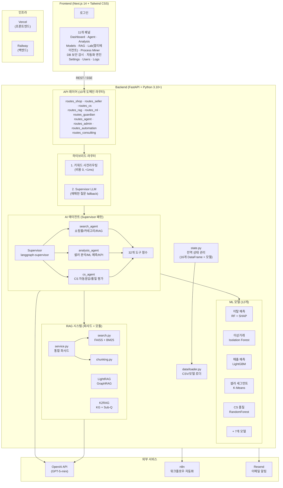
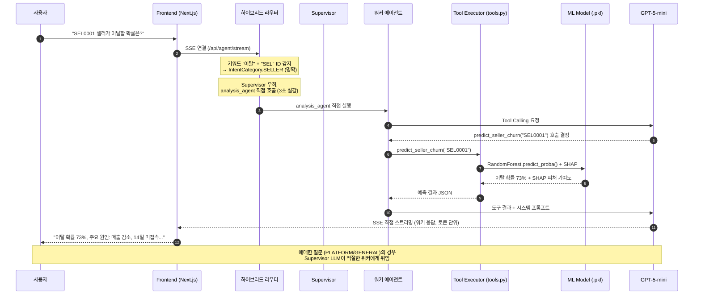
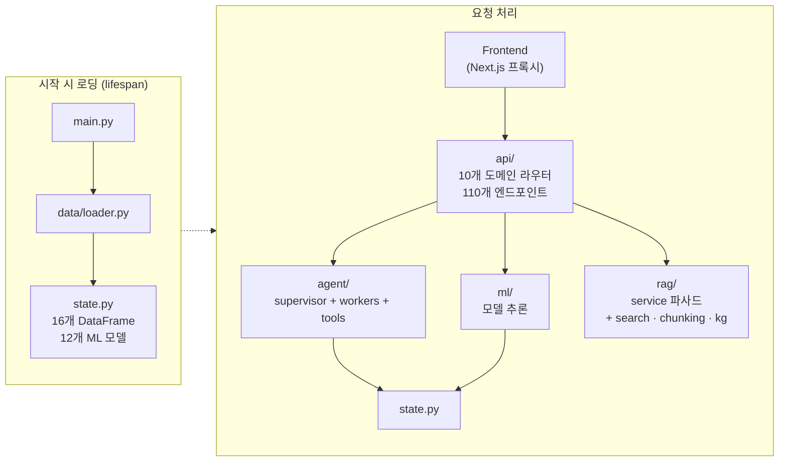
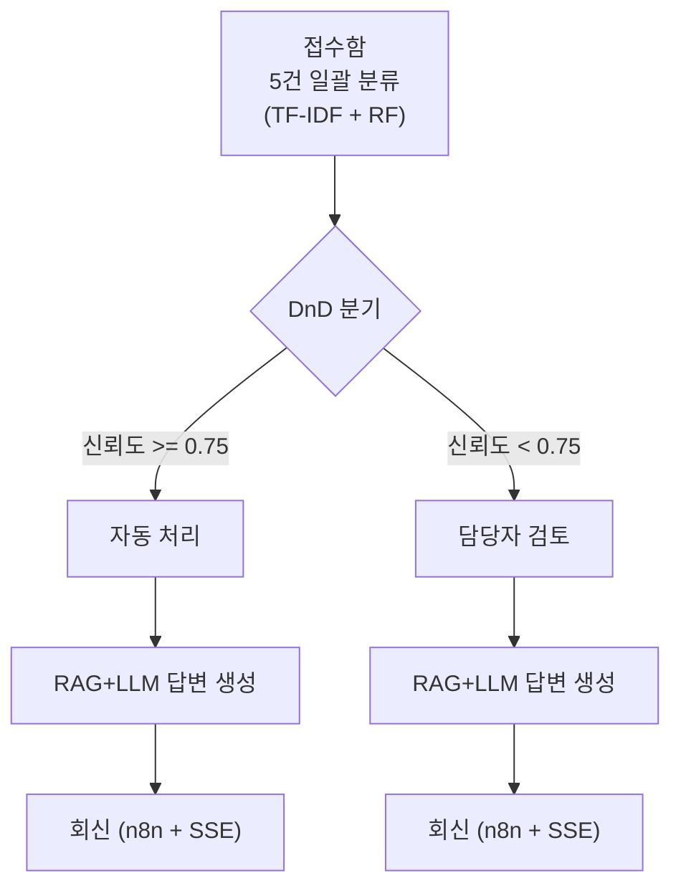
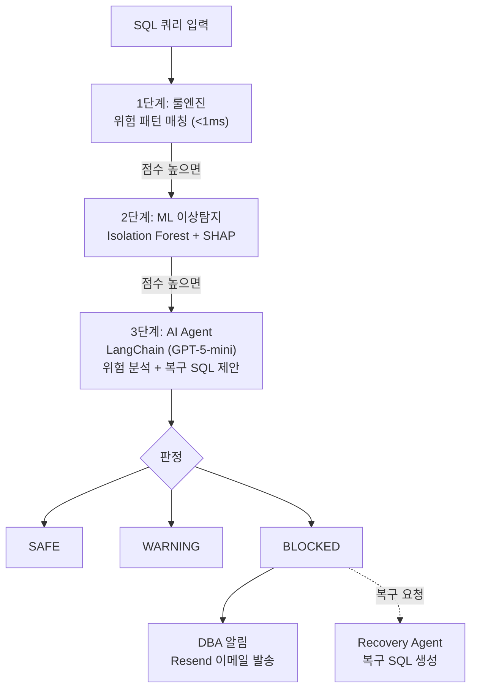
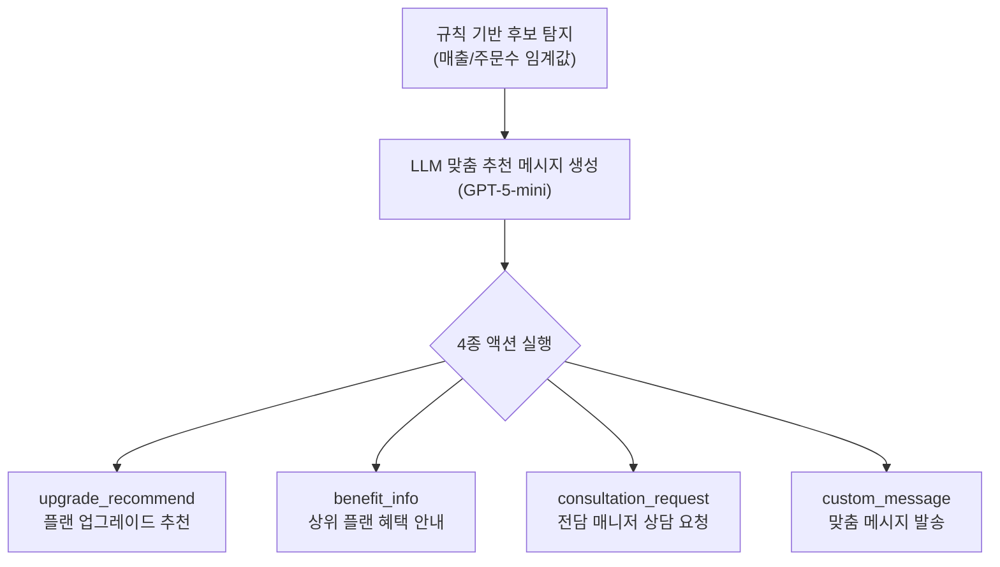
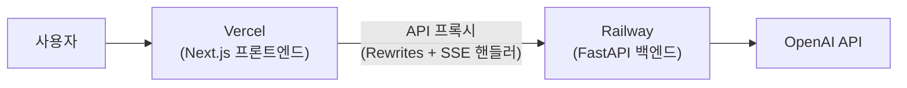

# CAFE24 AI 운영 플랫폼

<div align="center">

**카페24 이커머스 AI 기반 내부 운영 시스템**

LLM + ML 하이브리드 아키텍처로 셀러 이탈 예측, 이상거래 탐지, CS 자동화, 매출 예측을 통합 제공하는 AI 운영 플랫폼

[](https://python.org)
[](https://fastapi.tiangolo.com)
[](https://nextjs.org)
[](https://langchain.com)
[](https://langchain-ai.github.io/langgraph/)
[](https://openai.com)

v9.9.0 | [웹앱 (Vercel)](https://cafe24-frontend.vercel.app/) | [API 문서 (Swagger)](https://cafe24-backend-production.up.railway.app/docs) | 개발 기간: 2026.02.06 ~ 진행 중

</div>

---

## TODO

- [ ] Python 3.13 버전업 코드 대응 및 테스트 (asyncio.to_thread 병렬화, 타입 힌트 모던화, 라이브러리 호환성 검증)
- [ ] 컨설팅 모드(Human-in-the-Loop) 속도 개선 + SSE 이벤트 누락 수정 (SHAP 제거, tool_start/tool_end/agent_start/agent_end 이벤트 발행 추가)
- [x] 컨설팅 에이전트 LangGraph 전환 (consulting_agent.py ~800줄 → consulting_graph.py ~280줄)
- [x] LangGraph interrupt() + MemorySaver 체크포인터 기반 단계 간 사용자 입력 대기
- [x] Supervisor 워크플로우 규칙 강화 (복합 질문 2개+ 워커 순차 호출, 조건부 판단 범위 제한)
- [x] 실행 현황 카드에 에이전트별 도구 호출 트리 표시
- [x] 채팅 메시지 접기/펼치기 + ToolCalls 버튼 토글 애니메이션
- [x] avg_order_value 데이터 정합성 수정 (DataFrame 독립 생성 → total_revenue / total_orders 재계산)

---

## 최신 업데이트

> **v9.9.0** (2026-03-17) — 쿼리 디컴포지션 + 컨설팅 에이전트 LangGraph 전환 + Supervisor 규칙 강화 + 프론트엔드 인터랙티브 개선

| 영역 | 주요 변경 |
|------|-----------|
| **쿼리 디컴포지션** | 복합 질문("~하고 ~해줘") 자동 감지 → 경량 LLM(gpt-4o-mini)으로 서브 질문 분리, 복합 패턴 없으면 LLM 호출 스킵(비용 절약), 같은 전문가 영역이면 분리 안 함, 분리된 서브 질문을 Supervisor에 구조화된 지시문으로 전달 (`_DECOMPOSE_PROMPT` + `_decompose_query()`) |
| **컨설팅 에이전트 LangGraph 전환** | consulting_agent.py (~800줄, 수동 스테이트 머신) → consulting_graph.py (~280줄, LangGraph interrupt() + MemorySaver), 키워드 라우팅 제거 → 그래프 상태 기반 자동 라우팅 |
| **Supervisor 워크플로우 규칙 강화** | 복합 질문("~하고 ~해줘") 시 2개+ 워커 순차 호출 강제, "조건부 판단" 범위를 분석→실행 흐름에만 제한 (독립 요청은 항상 호출) |
| **프론트엔드 인터랙티브 개선** | 실행 현황 카드에 에이전트별 도구 호출 트리 표시, 채팅 메시지 접기/펼치기 (framer-motion), ToolCalls 버튼 토글 + 애니메이션 |
| **데이터 정합성 수정** | avg_order_value: DataFrame 독립 생성 값 → total_revenue / total_orders 재계산 |

<details>
<summary><b>v9.8.0</b> (2026-03-16) — 셀러 컨설팅 에이전트 추가</summary>

| 영역 | 주요 변경 |
|------|-----------|
| **셀러 컨설팅 에이전트** | 4단계 멀티스텝 워크플로우 (진단 → 전략 수립 → 실행 계획 → 실행), rollback 지원 |
| **Human-in-the-Loop** | 각 단계 사용자 확인 후 다음 단계 진행 |
| **Context Summary Layer** | 단계별 요약을 다음 단계에 전달 |
| **API 3개 추가** | `POST /api/consulting/stream`, `GET /api/consulting/sessions`, `DELETE /api/consulting/sessions/{id}` |
| **프론트엔드 패널** | 셀러 컨설팅 워크플로우를 AI 에이전트 탭에 통합 (자동 라우팅 + 자유 대화) |

</details>

<details>
<summary><b>v9.7.0</b> (2026-03-12) — 멀티에이전트 도구 데이터 품질 개선 + 전수 테스트 검증</summary>

| 영역 | 주요 변경 |
|------|-----------|
| **도구 데이터 정합성 수정** | `get_shop_performance` 컬럼 매핑 수정(monthly_revenue/monthly_orders/return_rate), `get_cs_statistics` 가중평균 전환, `get_seller_activity_report` total_events 계산 수정 |
| **LLM 범위 혼동 방지** | `get_cs_statistics`, `get_cohort_analysis`에 `_llm_instruction` 추가 (플랫폼 전체 데이터임을 명시) |
| **data_warnings 자동 감지** | `get_shop_performance`에 데이터 모순(주문수 0인데 전환율 >0) 자동 감지 경고 추가 |
| **워커 도구 배정 최적화** | retention_strategist 중복 도구 제거, seller_analyst에 CS 통계 도구 추가 |
| **Supervisor 프롬프트 강화** | 워커 분기 판단 규칙 3개 추가 |
| **프론트엔드 추천 질문 확장** | 추천 질문 6→8개 확장 (7종 워커 전체 커버) |
| **전수 테스트 시스템** | 8개 질문 전수 테스트 스크립트 및 자동 검증 시스템 구축 |

</details>

<details>
<summary><b>v9.6.0</b> (2026-03-12) — GPT-5-mini 전환 + 도구 데이터 품질 개선 + 프롬프트 YAML 전환 + Railway 메모리 최적화</summary>

| 영역 | 주요 변경 |
|------|-----------|
| **GPT-5-mini 전환** | Supervisor·7종 워커·Intent 라우터·프론트 기본값 전체를 gpt-5-mini로 통일 (기존 사용자 sessionStorage 자동 마이그레이션) |
| **도구 데이터 품질 개선** | `analyze_seller`: avg_order_value 계산 fallback (total_revenue/total_orders), data_warnings (0값 지표 미집계 경고), 플랫폼 평균/동일 등급 비교 데이터·백분위·세그먼트 정보 포함. `predict_seller_churn`: 확률 floor 0.5% (과신 방지), importance_note (모델 전체 기준 변수 중요도임을 명시) |
| **프롬프트 YAML 전환** | `multi_agent_prompts.json` → `.yaml` 전환 — `\n` 이스케이프 제거, `\|` 블록으로 가독성 향상, 데이터 품질 해석 규칙 추가 (0값 지표·비교 기준·이탈 확률 해석) |
| **Railway 메모리 최적화** | ML 모델 lazy loading (시작 시 파일 존재 확인만, 첫 사용 시 로드), torch/easyocr 비활성화 (~500MB 절감), LLM 캐시 20→5, 세션 캐시 1000→200, Supervisor 캐시 MAX=3 |
| **프론트엔드 개선** | Agent/Lab 패널 대화 보존 (display:none 방식), 로그인 페이지 서버 운영 시간 표시, 동적 모델명 표시, 해석 톤 규칙 (원인 단정 금지) |

</details>

<details>
<summary><b>v9.5.0</b> (2026-03-10) — 멀티에이전트 워커 최적화 + LLM 응답 정확도 개선</summary>

| 영역 | 주요 변경 |
|------|-----------|
| **워커 통합 (8→7종)** | fraud_investigator를 seller_analyst에 흡수 — 도구 완전 부분집합이므로 Supervisor 라우팅 단순화 |
| **도구 출력 마크다운 표** | get_trend_analysis, get_dashboard_summary, get_cs_statistics, get_order_statistics 4개 도구에 `_markdown` 필드 추가 — LLM이 라벨을 패러프레이징하지 않고 원본 표를 그대로 인용하도록 유도 |
| **라벨 보호 프롬프트** | common_rules에 도구 결과 라벨/수치 변형 금지 규칙 + 올바른/잘못된 예시 few-shot 표 추가 (활성쇼핑몰→활성 셀러 수 변환 방지 등) |
| **performance_analyst vs report_writer 경계 명확화** | Supervisor 라우팅에 구분 규칙 추가 — 특정 쇼핑몰 개별 분석 vs 플랫폼 전체 종합 보고서 |
| **cs_quality_analyst 도구 정리** | 불필요한 get_ecommerce_glossary 제거 (platform_searcher 전담) |

</details>

<details>
<summary><b>v9.4.0</b> (2026-03-09) — 멀티에이전트 응답 품질 개선 + 데이터 품질 보정 + 프론트 예시 칩 개편</summary>

| 영역 | 주요 변경 |
|------|-----------|
| **Supervisor 분석 기반 판단** | 앞선 워커 분석 결과에 따라 후속 워커 실행 여부를 판단 (예: churn_analyst가 LOW 이탈 위험 → retention_strategist 위임 생략, "리텐션 조치 불필요" 직접 판단) |
| **복합 요청 워커 순차 호출 강제** | "~하고 ~해줘" 같은 복합 요청 시 반드시 2개 이상의 서로 다른 워커를 순차 호출 — 첫 번째 워커가 두 번째 작업까지 응답하더라도 두 번째 워커 별도 호출 강제 |
| **워커 간 이전 결과 참조** | `output_mode="full_history"` 활용 — retention_strategist가 churn_analyst의 수치(이탈 확률·위험 등급·영향 변수)를 직접 인용하여 전략 수립 |
| **churn_analyst 용어 정립** | top_factors를 "주요 예측 영향 변수"로 통일 (feature importance는 예측에 많이 사용한 변수일 뿐 이탈 직접 원인이 아님), LOW 위험 셀러의 top_factors는 이탈을 낮추는 방향으로 해석하도록 가이드 추가 |
| **retention_strategist LOW 판단** | LOW 위험 셀러 → "이탈 위험이 낮아 별도 리텐션 조치는 불필요합니다" 자체 판단, `generate_retention_message`의 judgment 필드 존중 |
| **generate_retention_message LOW 분기** | LOW 위험 시 LLM 미호출, 즉시 "리텐션 조치 불필요" 판단 반환 (불필요한 LLM 비용 절감) |
| **churn_probability 정밀도 향상** | tools.py 이탈 예측 결과 소수점 2자리로 향상 (`round(prob*100, 2)`) |
| **코호트 분석 폴백** | 존재하지 않는 월 요청 시 에러 대신 전체 코호트 반환 + 사용 가능 월 목록 로깅 |
| **쇼핑몰 성과 데이터 보정** | 주문 0건 시 `avg_order_value`를 0으로 보정 (0으로 나누기 방지) |
| **플랫폼 전체 vs 개별 쇼핑몰 구분** | performance_analyst·report_writer 프롬프트에 `get_trend_analysis`는 플랫폼 전체 데이터임을 명시, 개별 쇼핑몰 데이터와 혼동 금지 규칙 추가 |
| **멀티에이전트 예시 칩 개편** | 멀티 워커 연계 질문 6개로 변경 (이탈 분석+리텐션, 셀러 진단+이탈 분석, 이상거래+CS 품질, CS 통계+대시보드, 이탈 셀러+세그먼트, 셀러 활동+마케팅 최적화) |

</details>

<details>
<summary><b>v9.3.2</b> (2026-03-08) — 멀티에이전트 워커 프롬프트 전면 개편 + 데드코드 대규모 정리</summary>

| 영역 | 주요 변경 |
|------|-----------|
| **워커 프롬프트 전면 개편** | `_WORKER_COMMON_RULES` 공통 응답 규칙 상수 추출 (5가지 분석 관점: 추세 파악·이상값 발견·비교 분석·원인 추론·실행 제안), 7개 워커 각각 역할별 특화 분석 지침 추가 (예: churn_analyst SHAP 원인 순위 표, cs_quality_analyst 카테고리별 비교 표 등) |
| **Supervisor 프롬프트 강화** | 대화 맥락 유지(이전 대상 자동 추적), 형식적 응답 금지("성공적으로 조회했습니다" 등), 최소 3개 인사이트 필수, 금액 포맷 규칙(₩+콤마, 억/만원 환산) |
| **백엔드 데드코드 삭제** | 미사용 파일 12개 삭제 — crag.py, semantic_router.py, parsers.py, n8n/_writer.py, ml/helpers.py, ml/mlflow_tracker.py, 크롤러 2개, 테스트 스크립트 3개, CS 티켓 생성 스크립트 |
| **프론트엔드 데드코드 삭제** | 미사용 파일 2개 삭제 — DataState.js, useCheckboxSelection.js |
| **미사용 함수 제거** | marketing_optimizer.py에서 2개, revenue_model.py에서 1개 (`__main__` 전용 함수) |
| **RAG 기법 정정** | 8종 → 7종 (CRAG는 구현만 되고 실제 연동되지 않아 제거) |
| **문서 동기화** | README 3개 + 포트폴리오 HTML에서 삭제된 모듈 참조 일괄 제거 |

</details>


---

## Executive Summary

| 지표 | 수치 |
|------|------|
| **AI 도구** | 32개 (Tool Calling 기반) |
| **ML 모델** | 12개 (RandomForest, LightGBM, XGBoost, IsolationForest, K-Means, DBSCAN 등) |
| **RAG 엔진** | 7종 기법 (Hybrid · RAG-Fusion · Parent-Child · Contextual · LightRAG · K2RAG · Cross-Encoder) |
| **API 엔드포인트** | 110개 REST API |
| **프론트엔드 패널** | 11개 (Agent, Dashboard, Analysis, Models, RAG, Lab, Guardian, Automation, Settings, Users, Logs) |
| **배포** | Vercel (프론트엔드) + Railway (백엔드) |

> **상세 문서**: [백엔드 README](backend%20리팩토링%20시작/README.md) | [프론트엔드 README](nextjs/README.md)

---

## 목차

1. [프로젝트 개요](#1-프로젝트-개요)
2. [시스템 아키텍처](#2-시스템-아키텍처)
3. [핵심 기능](#3-핵심-기능)
4. [기술 스택](#4-기술-스택)
5. [프로젝트 구조](#5-프로젝트-구조)
6. [설치 및 실행](#6-설치-및-실행)
7. [배포](#7-배포)
8. [버전 히스토리](#8-버전-히스토리)

---

## 1. 프로젝트 개요

### 배경 및 목적

**CAFE24 AI 운영 플랫폼**은 이커머스 플랫폼(카페24) 운영에 필요한 다양한 AI/ML 기능을 하나의 통합 플랫폼으로 제공합니다. 자연어 질의 기반의 AI 에이전트가 32개의 전문 도구를 활용하여 데이터 분석, 예측, CS 자동화를 수행합니다.

### 해결하는 문제

| 문제 | 기존 방식 | AI 플랫폼 솔루션 |
|------|----------|------------------|
| **셀러 이탈** | 이탈 후 사후 분석 | RandomForest + SHAP 기반 사전 예측 + 원인 분석 |
| **이상거래 탐지** | 수동 모니터링, 신고 기반 | Isolation Forest 실시간 자동 탐지 |
| **CS 문의 처리** | CS 담당자 수동 분류/응답 | TF-IDF + RF 일괄 분류 + RAG+LLM 답변 생성 + DnD 자동/수동 분기 |
| **정산 이상** | 수작업 정산 검증 | DBSCAN 기반 정산 이상 패턴 탐지 |
| **매출 예측** | 경험 기반 예측 | LightGBM 기반 다변량 매출 예측 |
| **데이터 분석** | SQL 작성, 대시보드 개발 필요 | 자연어 질의 -> 자동 분석 (GPT-5-mini + 32 Tools) |
| **DB 보안** | 수동 모니터링 | DB 보안 감시 (룰엔진 + ML + LangChain) 실시간 차단 |
| **셀러 리텐션** | 이탈 후 대응, 수동 관리 | ML 이탈 예측 → LLM 맞춤 메시지 → 자동 조치 (쿠폰/업그레이드/매니저) |
| **플랜 업그레이드** | 수동 셀러 분석, 일괄 안내 | 규칙 기반 후보 탐지 (매출/주문수 임계값) → LLM 맞춤 추천 메시지 → 4종 액션 자동 실행 |
| **CS FAQ** | 수동 FAQ 작성·관리 | TF-IDF + 실루엣 최적 K-Means / LLM 의미 분류 듀얼 클러스터링 → FAQ 자동 생성 → 승인 워크플로우 |
| **운영 리포트** | 수동 KPI 집계·보고서 작성 | 전체 DF 자동 집계 → LLM 마크다운 리포트 (일간/주간/월간) |

### 핵심 기술 하이라이트

| 특징 | 설명 |
|------|------|
| **LLM + ML 하이브리드** | GPT-5-mini가 32개 도구를 선택하고, 전통 ML 모델 12개가 예측 수행 |
| **하이브리드 라우팅** | 명확한 질문: 키워드 라우터가 워커 직접 호출 (supervisor 우회, 3초 절감) · 애매한 질문: Supervisor LLM이 판단하여 워커 위임 |
| **Supervisor 멀티에이전트** | `langgraph-supervisor` 기반 Supervisor(7워커) 항상 활성 — 전문 워커 7개(churn_analyst, retention_strategist, seller_analyst, performance_analyst, cs_quality_analyst, report_writer, platform_searcher) 위임 패턴, **쿼리 디컴포지션**(복합 질문 자동 감지 → gpt-4o-mini로 서브 질문 분리 → Supervisor에 구조화된 지시문 전달, 복합 패턴 없으면 LLM 스킵), 워커 직접 스트리밍, 분석 결과 기반 후속 판단(LOW 이탈 위험 시 retention 위임 생략), 복합 요청 시 2개+ 워커 순차 호출 강제, `full_history` 모드로 워커 간 이전 결과 참조, 공통 응답 규칙(`_WORKER_COMMON_RULES`: 5가지 분석 관점) + 워커별 역할 특화 분석 지침 |
| **RAG 7종 기법** | FAISS Hybrid + RAG-Fusion + Parent-Child + Contextual + LightRAG(GraphRAG) + K2RAG(KG+Sub-Q) + Cross-Encoder Reranking |
| **SHAP 해석** | 셀러 이탈 원인을 피처별 기여도(SHAP value)로 설명 |
| **실시간 스트리밍** | SSE(Server-Sent Events) 기반 토큰 단위 스트리밍 — 워커 에이전트 직접 스트리밍 (7종 이벤트: delta/tool_start/tool_end/agent_start/agent_end/done/error) |
| **DB 보안 감시** | 룰엔진(<1ms) + Isolation Forest + SHAP + LangChain Agent + Recovery Agent |
| **CS 자동화** | 접수(DnD 분류) -> 답변(RAG+LLM) -> 회신(n8n) 워크플로우 |
| **마케팅 최적화** | P-PSO(Particle Swarm Optimization) 기반 채널별 예산 배분 최적화 |
| **보안** | 프롬프트 인젝션 방어, CS 콜백 인증, 대화 메모리 TTL/세션 제한, 스택트레이스 비노출 |
| **인터랙티브 도구 탐색기** | 32개 AI 도구를 6개 카테고리(쇼핑몰/셀러/CS/ML/RAG/시스템)로 분류한 아코디언 UI — 도구명·설명·파라미터 실시간 탐색 |
| **모듈형 아키텍처** | 라우터 10개 도메인 분리, RAG 서비스 파사드 패턴, 프론트엔드 패널 컴포넌트 분리 |

> **기술 상세**: [백엔드 README](backend%20리팩토링%20시작/README.md) | [프론트엔드 README](nextjs/README.md)

---

## 2. 시스템 아키텍처

### 전체 아키텍처


```mermaid
flowchart TB
    subgraph Frontend["Frontend (Next.js 14 + Tailwind CSS)"]
        Login[로그인]
        Panels["11개 패널<br/>Dashboard · Agent · Analysis<br/>Models · RAG · Lab(멀티에이전트) · Process Miner<br/>DB 보안 감시 · 자동화 엔진<br/>Settings · Users · Logs"]
    end

    subgraph Backend["Backend (FastAPI + Python 3.10+)"]
        subgraph API["API 레이어 (10개 도메인 라우터)"]
            Routes["routes_shop · routes_seller · routes_cs<br/>routes_rag · routes_ml · routes_guardian<br/>routes_agent · routes_admin · routes_automation<br/>routes_consulting"]
        end

        subgraph Router["하이브리드 라우터"]
            R1["1. 키워드 사전라우팅<br/>(비용 0, <1ms)"]
            R2["2. Supervisor LLM<br/>(애매한 질문 fallback)"]
        end

        subgraph Agent["AI 에이전트 (Supervisor 패턴)"]
            Supervisor["Supervisor<br/>langgraph-supervisor"]
            SearchAgent["search_agent<br/>쇼핑몰/카테고리/RAG"]
            AnalysisAgent["analysis_agent<br/>셀러 분석/ML 예측/KPI"]
            CSAgent["cs_agent<br/>CS 자동응답/품질 평가"]
            Tools["32개 도구 함수"]
        end

        subgraph RAGSystem["RAG 시스템 (파사드 + 모듈)"]
            Service["service.py<br/>통합 파사드"]
            HybridRAG["search.py<br/>FAISS + BM25"]
            LightRAGNode["LightRAG<br/>GraphRAG"]
            K2RAGNode["K2RAG<br/>KG + Sub-Q"]
            Chunking["chunking.py"]
        end

        subgraph MLModels["ML 모델 (12개)"]
            Churn["이탈 예측<br/>RF + SHAP"]
            Fraud["이상거래<br/>Isolation Forest"]
            Revenue["매출 예측<br/>LightGBM"]
            Segment["셀러 세그먼트<br/>K-Means"]
            CSQuality["CS 품질<br/>RandomForest"]
            Others["+ 7개 모델"]
        end

        State["state.py<br/>전역 상태 관리<br/>(16개 DataFrame + 모델)"]
        DataLoader["data/loader.py<br/>CSV/모델 로더"]
    end

    subgraph External["외부 서비스"]
        OpenAI["OpenAI API<br/>(GPT-5-mini)"]
        n8n["n8n<br/>워크플로우 자동화"]
        Resend["Resend<br/>이메일 알림"]
    end

    subgraph Infra["인프라"]
        Vercel["Vercel<br/>(프론트엔드)"]
        Railway["Railway<br/>(백엔드)"]
    end

    Frontend -->|"REST / SSE"| API
    API --> Router
    Router --> Agent
    Agent --> RAGSystem
    Agent --> MLModels
    Agent --> OpenAI
    Service --> HybridRAG
    Service --> Chunking
    RAGSystem --> OpenAI
    Supervisor --> SearchAgent
    Supervisor --> AnalysisAgent
    Supervisor --> CSAgent
    SearchAgent --> Tools
    AnalysisAgent --> Tools
    CSAgent --> Tools
    Backend --> n8n
    Backend --> Resend
    State --> DataLoader
```

### 요청 처리 흐름 (하이브리드 라우팅)


```mermaid
sequenceDiagram
    autonumber
    participant User as 사용자
    participant FE as Frontend (Next.js)
    participant Router as 하이브리드 라우터
    participant Sup as Supervisor
    participant Worker as 워커 에이전트
    participant Tool as Tool Executor (tools.py)
    participant ML as ML Model (.pkl)
    participant LLM as GPT-5-mini

    User->>FE: "SEL0001 셀러가 이탈할 확률은?"
    FE->>Router: SSE 연결 (/api/agent/stream)

    Note over Router: 키워드 "이탈" + "SEL" ID 감지<br/>→ IntentCategory.SELLER (명확)
    Note over Router: Supervisor 우회,<br/>analysis_agent 직접 호출 (3초 절감)
    Router->>Worker: analysis_agent 직접 실행

    Worker->>LLM: Tool Calling 요청
    LLM-->>Worker: predict_seller_churn("SEL0001") 호출 결정

    Worker->>Tool: predict_seller_churn("SEL0001")
    Tool->>ML: RandomForest.predict_proba() + SHAP
    ML-->>Tool: 이탈 확률 73% + SHAP 피처 기여도
    Tool-->>Worker: 예측 결과 JSON

    Worker->>LLM: 도구 결과 + 시스템 프롬프트
    LLM-->>FE: SSE 직접 스트리밍 (워커 응답, 토큰 단위)
    FE-->>User: "이탈 확률 73%, 주요 원인: 매출 감소, 14일 미접속..."

    Note over User,LLM: 애매한 질문 (PLATFORM/GENERAL)의 경우<br/>Supervisor LLM이 적절한 워커에게 위임
```

### 데이터 플로우


```mermaid
flowchart LR
    subgraph Startup["시작 시 로딩 (lifespan)"]
        main["main.py"] --> loader["data/loader.py"]
        loader --> state["state.py<br/>16개 DataFrame<br/>12개 ML 모델"]
    end

    subgraph Request["요청 처리"]
        FE["Frontend<br/>(Next.js 프록시)"] --> routes["api/<br/>10개 도메인 라우터<br/>110개 엔드포인트"]
        routes --> agent["agent/<br/>supervisor + workers + tools"]
        routes --> ml["ml/<br/>모델 추론"]
        routes --> rag["rag/<br/>service 파사드<br/>+ search · chunking · kg"]
        agent --> state2["state.py"]
        ml --> state2
    end

    Startup -.-> Request
```

---

## 3. 핵심 기능

### 기능 요약

| 기능 | 설명 | 핵심 기술 |
|------|------|-----------|
| **AI 에이전트** | 자연어로 데이터 분석/예측 요청 — 항상 Supervisor(7워커) 모드로 동작 + 인터랙티브 도구 탐색기 | GPT-5-mini + Tool Calling + 32개 도구 |
| **Supervisor 멀티에이전트** | Supervisor가 전문 워커 에이전트 7개에 작업 위임 + **쿼리 디컴포지션**(복합 질문 자동 감지 → gpt-4o-mini 서브 질문 분리 → 구조화된 지시문 전달, 단일 영역이면 분리 안 함) + 분석 결과 기반 후속 판단(LOW → retention 위임 생략) + 복합 요청 2개+ 워커 순차 호출 강제 + `full_history` 워커 간 결과 참조 + 공통 응답 규칙(5가지 분석 관점) + 워커별 역할 특화 프롬프트 | langgraph-supervisor (Supervisor → 7워커: churn_analyst, retention_strategist, seller_analyst, performance_analyst, cs_quality_analyst, report_writer, platform_searcher) |
| **RAG 7종 기법** | 7가지 RAG 기법 조합 검색 | Hybrid + RAG-Fusion + Parent-Child + Contextual + LightRAG + K2RAG + Cross-Encoder |
| **셀러 이탈 예측** | 셀러 이탈 확률 예측 + SHAP 해석 | RandomForest + SHAP Explainer |
| **이상거래 탐지** | 사기 거래/비정상 패턴 자동 탐지 | Isolation Forest |
| **매출 예측** | 쇼핑몰 매출 트렌드 예측 | LightGBM |
| **마케팅 최적화** | 마케팅 채널별 예산 ROI 최적화 (6개 채널) | P-PSO (메타휴리스틱 최적화) |
| **CS 자동화** | 문의 자동 분류 -> RAG 답변 -> 회신 | TF-IDF + RF + RAG + SSE + n8n |
| **DB 보안 감시** | DB 대량 변경 실시간 차단 + SHAP 위험 분석 + 복구 SQL 생성 | 룰엔진 + Isolation Forest + SHAP + LangChain Agent |
| **AI 인사이트** | 대시보드 데이터 기반 동적 인사이트 자동 생성 | 실시간 데이터 분석 |
| **셀러 종합 프로필** | 레이더 차트 + 5개 ML 모델 예측 결과 통합 | Percentile 기반 스코어링 |
| **셀러 컨설팅** | AI 에이전트 탭 통합, 자동 라우팅(IntentCategory.CONSULTING), 4단계 멀티스텝 워크플로우 (진단→전략→계획→실행), Human-in-the-Loop, rollback 지원 | LangGraph interrupt() + MemorySaver 체크포인터 + Context Summary Layer |
| **OCR** | 이미지에서 텍스트 추출 + RAG 문서 등록 | EasyOCR |
| **RBAC** | 역할 기반 접근 제어 (관리자/분석가/사용자/운영자) | Basic Auth + 역할별 패널 제한 |

### ML 모델 (12개)

> 모든 모델의 학습 데이터는 **합성 데이터**(numpy/pandas 랜덤 생성 + 카페24 도메인 상수)로 생성됩니다. `ml/train_models.py` 실행 시 18개 CSV와 12개 모델이 자동 생성됩니다.

| # | 모델명 | 알고리즘 | 비즈니스 목적 |
|---|--------|---------|-------------|
| 1 | 셀러 이탈 예측 | RandomForest + SHAP | 이탈 위험 셀러 사전 식별 + 원인 분석 |
| 2 | 이상거래 탐지 | Isolation Forest | 허위 주문/리뷰 조작 등 사기 패턴 탐지 |
| 3 | 문의 자동 분류 | TF-IDF + RandomForest | CS 문의 9개 카테고리 자동 분류 |
| 4 | 셀러 세그먼트 | K-Means (5 클러스터) | 셀러 행동 패턴 기반 군집화 |
| 5 | 매출 예측 | LightGBM | 다음 달 예상 매출 예측 |
| 6 | CS 응답 품질 | RandomForest | CS 문의 긴급도 자동 예측 |
| 7 | 고객 LTV 예측 | GradientBoosting | 고객 미래 기대 수익(LTV) 예측 |
| 8 | 리뷰 감성 분석 | TF-IDF + LogisticRegression | 상품 리뷰 감성 자동 분류 |
| 9 | 상품 수요 예측 | XGBoost | 상품별 수요량 예측 |
| 10 | 정산 이상 탐지 | DBSCAN | 정산 금액/주기 이상 패턴 탐지 |
| 11 | 다음 활동 예측 | RandomForest Classifier | 프로세스 다음 활동 Top-3 예측 |
| 12 | 이상 프로세스 탐지 | Isolation Forest | 경로 기반 이상 프로세스 케이스 탐지 |

> **모델 상세 (피처, 학습 방법 등)**: [백엔드 README](backend%20리팩토링%20시작/README.md)

### CS 자동화 파이프라인


```mermaid
flowchart TD
    A["접수함<br/>5건 일괄 분류<br/>(TF-IDF + RF)"]
    B{"DnD 분기"}
    C["자동 처리"]
    D["담당자 검토"]
    E1["RAG+LLM 답변 생성"]
    E2["RAG+LLM 답변 생성"]
    F1["회신 (n8n + SSE)"]
    F2["회신 (n8n + SSE)"]

    A --> B
    B -->|"신뢰도 >= 0.75"| C
    B -->|"신뢰도 < 0.75"| D
    C --> E1
    D --> E2
    E1 --> F1
    E2 --> F2
```

### DB 보안 감시 (3단계 + 복구 Agent)


```mermaid
flowchart TD
    A["SQL 쿼리 입력"]
    B["1단계: 룰엔진<br/>위험 패턴 매칭 (<1ms)"]
    C["2단계: ML 이상탐지<br/>Isolation Forest + SHAP"]
    D["3단계: AI Agent<br/>LangChain (GPT-5-mini)<br/>위험 분석 + 복구 SQL 제안"]
    E{"판정"}
    F["SAFE"]
    G["WARNING"]
    H["BLOCKED"]
    I["DBA 알림<br/>Resend 이메일 발송"]
    J["Recovery Agent<br/>복구 SQL 생성"]

    A --> B
    B -->|"점수 높으면"| C
    C -->|"점수 높으면"| D
    D --> E
    E --> F
    E --> G
    E --> H
    H --> I
    H -.->|"복구 요청"| J
```

### 셀러 플랜 업그레이드 자동 추천


```mermaid
flowchart TD
    A["규칙 기반 후보 탐지<br/>(매출/주문수 임계값)"]
    B["LLM 맞춤 추천 메시지 생성<br/>(GPT-5-mini)"]
    C{"4종 액션 실행"}
    D["upgrade_recommend<br/>플랜 업그레이드 추천"]
    E["benefit_info<br/>상위 플랜 혜택 안내"]
    F["consultation_request<br/>전담 매니저 상담 요청"]
    G["custom_message<br/>맞춤 메시지 발송"]

    A --> B --> C
    C --> D
    C --> E
    C --> F
    C --> G
```

| 항목 | 설명 |
|------|------|
| **후보 탐지** | 매출/주문수 임계값 기반 규칙 엔진으로 업그레이드 대상 셀러 자동 탐지 |
| **메시지 생성** | GPT-5-mini가 셀러별 매출·주문·카테고리 데이터를 분석하여 맞춤 추천 메시지 작성 |
| **액션 실행** | upgrade_recommend · benefit_info · consultation_request · custom_message 4종 |
| **API** | `GET /api/automation/upgrade/candidates` · `POST /api/automation/upgrade/message` · `POST /api/automation/upgrade/execute` |

---

## 4. 기술 스택

### 백엔드

| 분류 | 기술 | 용도 |
|------|------|------|
| **프레임워크** | FastAPI 0.110+ | REST API, SSE 스트리밍 |
| **LLM** | OpenAI GPT-5-mini | 에이전트 추론, RAG 답변 생성 |
| **에이전트** | LangChain 0.2+, LangGraph 0.2+, langgraph-supervisor | Tool Calling, Supervisor 멀티에이전트 |
| **벡터 검색** | FAISS (faiss-cpu) | Dense Vector Search |
| **GraphRAG** | LightRAG (lightrag-hku) | 지식 그래프 기반 검색 |
| **ML** | scikit-learn, LightGBM, XGBoost | 모델 학습/추론 |
| **ML 해석** | SHAP 0.44+ | 모델 해석성 (피처 기여도) |
| **ML 최적화** | mealpy 3.0+ | P-PSO 메타휴리스틱 최적화 |
| **OCR** | EasyOCR 1.7+ | 이미지 텍스트 추출 |
| **워크플로우** | n8n | CS 회신 자동화 |

### 프론트엔드

| 분류 | 기술 | 용도 |
|------|------|------|
| **프레임워크** | Next.js 14 (Pages Router) | SSR/CSR 하이브리드 |
| **스타일링** | Tailwind CSS 3.4 | 유틸리티 퍼스트 CSS |
| **차트** | Recharts 3.7 | 대시보드 시각화 |
| **SSE** | @microsoft/fetch-event-source | 에이전트 스트리밍 |
| **마크다운** | react-markdown + remark-gfm + KaTeX | 에이전트 응답 렌더링 (GFM + 수식) |
| **워크플로우** | @xyflow/react (React Flow) | n8n 워크플로우 시각화 |
| **애니메이션** | Framer Motion 11.0+ | 트랜지션, 아코디언 |

### 인프라

| 분류 | 기술 | 용도 |
|------|------|------|
| **백엔드 배포** | Railway (Docker) | FastAPI 서버 호스팅 |
| **프론트엔드 배포** | Vercel | Next.js 배포 |
| **컨테이너** | Docker (Python 3.11-slim) | 백엔드 컨테이너화 |

> **기술 스택 상세**: [백엔드 README](backend%20리팩토링%20시작/README.md) | [프론트엔드 README](nextjs/README.md)

---

## 5. 프로젝트 구조

```
카페24 프로젝트/
├── README.md                          # 프로젝트 루트 문서 (이 파일)
│
├── backend 리팩토링 시작/             # FastAPI 백엔드
│   ├── main.py                        # FastAPI 앱 진입점 (lifespan 패턴)
│   ├── state.py                       # 전역 상태 관리 (16개 DataFrame + 모델)
│   ├── api/                           # REST API 엔드포인트 (도메인별 분리)
│   │   ├── common.py                  # 공통 의존성/유틸
│   │   ├── routes.py                  # 라우터 허브 (10개 도메인 라우터 통합)
│   │   ├── routes_shop.py             # 쇼핑몰/주문/상품 API
│   │   ├── routes_seller.py           # 셀러 관리 API
│   │   ├── routes_cs.py               # CS 자동화 API
│   │   ├── routes_rag.py              # RAG 검색/문서 관리 API
│   │   ├── routes_ml.py               # ML 모델 추론/학습 API
│   │   ├── routes_guardian.py         # DB 보안 감시 API
│   │   ├── routes_automation.py       # 자동화 엔진 API (23개 엔드포인트)
│   │   ├── routes_agent.py            # AI 에이전트 API
│   │   ├── routes_consulting.py       # 셀러 컨설팅 에이전트 API
│   │   └── routes_admin.py            # 관리/설정/로그 API
│   ├── automation/                    # 자동화 엔진 (이탈방지/업그레이드/FAQ/리포트)
│   │   ├── action_logger.py           # 조치 로깅 + FAQ/리포트/리텐션 저장소 + 파이프라인 추적
│   │   ├── retention_engine.py        # 셀러 이탈 방지 자동 조치 엔진
│   │   ├── upgrade_engine.py          # 셀러 플랜 업그레이드 자동 추천 엔진
│   │   ├── faq_engine.py              # CS FAQ 자동 생성 엔진
│   │   └── report_engine.py           # 운영 리포트 자동 생성 엔진
│   ├── agent/                         # AI 에이전트
│   │   ├── runner.py                  # Tool Calling 실행기
│   │   ├── tools.py                   # 32개 도구 함수 (비즈니스 로직)
│   │   ├── tool_schemas.py            # 32개 @tool 래퍼 (LLM 인터페이스)
│   │   ├── router.py                  # 에이전트 라우팅
│   │   ├── llm.py                     # LLM 클라이언트 설정
│   │   ├── intent.py                  # 의도 분류 (RETENTION 인텐트 포함)
│   │   ├── multi_agent.py             # Supervisor 멀티에이전트 (langgraph-supervisor)
│   │   ├── consulting_graph.py         # 셀러 컨설팅 에이전트 (LangGraph interrupt() + MemorySaver, ~280줄)
│   │   └── consulting_prompts.yaml    # 컨설팅 에이전트 프롬프트
│   ├── api/
│   │   └── routes_consulting.py       # 컨설팅 에이전트 API (3개 엔드포인트)
│   ├── rag/                           # RAG 시스템 (모듈별 분리)
│   │   ├── service.py                 # RAG 파사드 (통합 인터페이스)
│   │   ├── chunking.py                # 문서 청킹 로직
│   │   ├── search.py                  # 검색 엔진 (Hybrid/BM25)
│   │   ├── kg.py                      # 지식 그래프 처리
│   │   ├── contextual.py              # Contextual RAG 로직
│   │   ├── light_rag.py               # LightRAG (GraphRAG) 엔진
│   │   └── k2rag.py                   # K2RAG (KG+Sub-Q+Hybrid) 엔진
│   ├── ml/                            # ML 모델 학습/추론 (train_models, revenue, marketing)
│   ├── core/                          # 유틸리티 (constants, utils, memory)
│   ├── data/                          # 데이터 로더
│   ├── automation/                    # 자동화 엔진 (이탈방지/업그레이드/FAQ/리포트)
│   │   ├── action_logger.py           # 자동화 조치 로깅 + FAQ/리포트/리텐션 저장소
│   │   ├── retention_engine.py        # 셀러 이탈 방지 자동 조치 엔진
│   │   ├── upgrade_engine.py          # 셀러 플랜 업그레이드 자동 추천 엔진
│   │   ├── faq_engine.py              # CS FAQ 자동 생성 엔진
│   │   └── report_engine.py           # 운영 리포트 자동 생성 엔진
│   ├── Dockerfile                     # Docker 빌드
│   └── README.md                      # 백엔드 상세 문서
│
└── nextjs/                            # Next.js 프론트엔드
    ├── pages/                         # Pages Router (login, app, API Routes)
    │   └── api/                       # SSE 프록시 핸들러 (agent, cs)
    ├── components/
    │   ├── common/                    # 공통 컴포넌트 (CustomTooltip, StatCard, constants)
    │   ├── agent/                     # AI 에이전트 컴포넌트
    │   │   ├── toolRegistry.js      # 32개 도구 메타데이터 (6개 카테고리 분류)
    │   │   └── ToolExplorer.js      # 인터랙티브 도구 탐색기 (아코디언 UI)
    │   ├── automation/                # 자동화 엔진 공통 컴포넌트
    │   │   ├── PipelineFlow.js      # 인터랙티브 파이프라인 시각화 (5단계 노드 + 애니메이션)
    │   │   ├── UpgradeTab.js        # 셀러 플랜 업그레이드 추천 탭
    │   │   └── constants.js         # 파이프라인 스텝 상수 + CS 카테고리
    │   └── panels/                    # 12개 기능 패널
    │       ├── AgentPanel.js          # AI 에이전트 (19줄 래퍼, Supervisor 통합)
    │       ├── AutomationPanel.js     # 자동화 엔진 (이탈방지/업그레이드/FAQ/리포트 4탭)
    │       ├── lab/                   # CS 자동화 실험실 + 멀티에이전트 탭 (11개+ 파일)
    │       ├── analysis/              # 분석 패널 (9개 탭 + 1 컨테이너, 10개 파일)
    │       └── ...                    # 기타 패널
    ├── lib/                           # 유틸리티 (api, storage, cn, sse)
    └── README.md                      # 프론트엔드 상세 문서
```

> **전체 파일 구조 상세**: [백엔드 README](backend%20리팩토링%20시작/README.md) | [프론트엔드 README](nextjs/README.md)

---

## 6. 설치 및 실행

### 요구사항

- **Python** 3.10+ (Conda 환경 권장)
- **Node.js** 18+
- **OpenAI API Key** (GPT-5-mini)

### 백엔드

```bash
cd "카페24 프로젝트/backend 리팩토링 시작"
pip install -r requirements.txt

# OpenAI API 키 설정
set OPENAI_API_KEY=sk-...   # Windows
export OPENAI_API_KEY=sk-...  # Linux/Mac

# 데이터 생성 및 모델 학습 (최초 1회)
python ml/train_models.py

# 서버 실행
uvicorn main:app --host 0.0.0.0 --port 8001 --reload
```

### 프론트엔드

```bash
cd "카페24 프로젝트/nextjs"
npm install
npm run dev -- -H 0.0.0.0
```

### 접속

| 서비스 | URL |
|--------|-----|
| **프론트엔드** | http://localhost:3000 |
| **백엔드 API** | http://localhost:8001 |
| **Swagger 문서** | http://localhost:8001/docs |

### 테스트 계정

| 계정 | 비밀번호 | 역할 | 접근 패널 |
|------|---------|------|-----------|
| `admin` | `admin123` | 관리자 | 전체 (12개) |
| `analyst` | `analyst123` | 분석가 | 에이전트, 대시보드, 분석, 실험실, DB 보안 감시, 자동화 엔진 |
| `user` | `user123` | 사용자 | 에이전트, 대시보드, 분석, 실험실, DB 보안 감시, 자동화 엔진 |
| `operator` | `oper123` | 운영자 | 에이전트, 대시보드, 분석, 실험실, DB 보안 감시, 자동화 엔진 |

### 환경 변수

| 변수 | 위치 | 필수 | 설명 |
|------|------|------|------|
| `OPENAI_API_KEY` | 백엔드 | 필수 | OpenAI API 키 |
| `PORT` | 백엔드 | 선택 | 서버 포트 (기본 `8001`) |
| `SKIP_RAG_STARTUP` | 백엔드 | 선택 | `1`로 설정 시 시작 시 RAG 인덱스 빌드 스킵 (나중에 `/api/rag/reload`로 수동 빌드) |
| `SKIP_LIGHTRAG` | 백엔드 | 선택 | `1`로 설정 시 LightRAG 초기화 스킵 (메모리 절약) |
| `NEXT_PUBLIC_API_BASE` | 프론트엔드 | 선택 | 백엔드 API 주소 (로컬 개발용) |
| `BACKEND_INTERNAL_URL` | 프론트엔드 | 선택 | 백엔드 내부 URL (배포용, 기본 `http://127.0.0.1:8001`) |

---

## 7. 배포

### 배포 아키텍처


```mermaid
flowchart LR
    User[사용자]
    Vercel["Vercel<br/>(Next.js 프론트엔드)"]
    Railway["Railway<br/>(FastAPI 백엔드)"]
    OpenAI["OpenAI API"]

    User --> Vercel -->|"API 프록시<br/>(Rewrites + SSE 핸들러)"| Railway --> OpenAI
```

| 서비스 | URL |
|--------|-----|
| **프론트엔드** | https://cafe24-frontend.vercel.app/ |
| **백엔드 API** | https://cafe24-backend-production.up.railway.app |
| **Swagger 문서** | https://cafe24-backend-production.up.railway.app/docs |

### Railway 백엔드

- **빌드**: Docker (`python:3.11-slim`)
- **헬스체크**: `/api/health`
- **환경변수**: `OPENAI_API_KEY`, `PORT=8000`

### Vercel 프론트엔드

- **환경변수**: `BACKEND_INTERNAL_URL=https://cafe24-backend-production.up.railway.app`
- **프록시**: `next.config.js` rewrites로 `/api/*` -> 백엔드, SSE는 전용 API Route 핸들러

```bash
cd nextjs && npx vercel --prod
```

---

## 8. 버전 히스토리

| 버전 | 날짜 | 주요 변경 |
|------|------|----------|
| 9.9.0 | 2026-03-17 | 쿼리 디컴포지션: 복합 질문("~하고 ~해줘") 자동 감지→경량 LLM(gpt-4o-mini)으로 서브 질문 분리, 복합 패턴 없으면 LLM 스킵(비용 절약), 같은 전문가 영역이면 분리 안 함, Supervisor에 구조화된 지시문 전달(`_DECOMPOSE_PROMPT`+`_decompose_query()`). 컨설팅 에이전트 LangGraph 전환: consulting_agent.py(~800줄, 수동 스테이트 머신+_sessions)→consulting_graph.py(~280줄, LangGraph interrupt()+MemorySaver 체크포인터), 키워드 라우팅 제거→그래프 상태 기반 자동 라우팅. Supervisor 워크플로우 규칙 강화: 복합 질문 2개+ 워커 순차 호출 강제, "조건부 판단" 범위를 분석→실행 흐름에만 제한(독립 요청 항상 호출). 프론트엔드 인터랙티브 개선: 실행 현황 카드에 에이전트별 도구 호출 트리 표시, 채팅 메시지 접기/펼치기(framer-motion), ToolCalls 버튼 토글+애니메이션, useMultiAgentStream에 activeAgentRef 추가. 데이터 정합성: avg_order_value를 total_revenue/total_orders 재계산으로 수정 |
| 9.8.0 | 2026-03-16 | 셀러 컨설팅 에이전트 추가: 4단계 멀티스텝 워크플로우(진단→전략 수립→실행 계획→실행), rollback 지원, Human-in-the-Loop 각 단계 사용자 확인, Context Summary Layer 단계별 요약 전달. API 3개 추가(POST /consulting/stream, GET /sessions, DELETE /sessions/{id}). 프론트엔드 AI 에이전트 탭에 컨설팅 워크플로우 통합 (자동 라우팅, 자유 대화 루프) |
| 9.7.0 | 2026-03-12 | 멀티에이전트 도구 데이터 품질 개선: `get_shop_performance` 컬럼 매핑 수정(monthly_revenue/monthly_orders/return_rate), `get_cs_statistics` 가중평균 전환, `get_seller_activity_report` total_events 계산 수정. LLM 범위 혼동 방지: `get_cs_statistics`·`get_cohort_analysis`에 `_llm_instruction` 추가. `get_shop_performance` data_warnings 자동 감지(주문수 0인데 전환율 >0). 워커 도구 배정 최적화(retention_strategist 중복 제거, seller_analyst에 CS 통계 추가). Supervisor 프롬프트 워커 분기 판단 규칙 3개 추가. 프론트 추천 질문 6→8개 확장(7종 워커 전체 커버). 8개 질문 전수 테스트 스크립트 및 자동 검증 시스템 구축 |
| 9.6.0 | 2026-03-12 | GPT-5-mini 전환: Supervisor·7종 워커·Intent 라우터·프론트 기본값 전체 gpt-5-mini 통일(sessionStorage 자동 마이그레이션). 도구 데이터 품질 개선: analyze_seller avg_order_value fallback·data_warnings·플랫폼 비교 데이터, predict_seller_churn 확률 floor 0.5%·importance_note. 프롬프트 YAML 전환: multi_agent_prompts.json→.yaml, 데이터 품질 해석 규칙 추가. Railway 메모리 최적화: ML lazy loading·torch/easyocr 비활성화(~500MB 절감)·캐시 축소. 프론트: Agent/Lab 대화 보존·서버 운영 시간 표시·해석 톤 규칙 |
| 9.5.0 | 2026-03-10 | 멀티에이전트 워커 최적화: fraud_investigator를 seller_analyst에 흡수(8→7워커), 도구 완전 부분집합이므로 Supervisor 라우팅 단순화. LLM 응답 정확도 개선: 4개 도구에 `_markdown` 필드 추가(라벨 패러프레이징 방지), common_rules에 라벨/수치 변형 금지 규칙+few-shot 예시, performance_analyst vs report_writer 라우팅 경계 명확화, cs_quality_analyst에서 불필요한 get_ecommerce_glossary 제거 |
| 9.4.0 | 2026-03-09 | 멀티에이전트 응답 품질 개선: Supervisor 분석 결과 기반 후속 판단(LOW 이탈 위험 시 retention 위임 생략), 복합 요청 2개+ 워커 순차 호출 강제, full_history 워커 간 결과 참조, churn_analyst "주요 예측 영향 변수" 용어 정립+feature importance 해석 가이드, retention_strategist LOW 판단 로직, generate_retention_message LOW 시 LLM 미호출 즉시 반환. 데이터 품질 개선: churn_probability 소수점 2자리, 코호트 분석 폴백(없는 월 → 전체 반환), 쇼핑몰 성과 주문 0건 avg_order_value 0 보정, 플랫폼 전체 vs 개별 쇼핑몰 데이터 구분 명시. 프론트: 멀티에이전트 예시 칩을 멀티 워커 연계 질문 6개로 변경 |
| 9.3.2 | 2026-03-08 | 멀티에이전트 워커 프롬프트 전면 개편: `_WORKER_COMMON_RULES` 공통 응답 규칙 상수 추출(5가지 분석 관점: 추세 파악·이상값 발견·비교 분석·원인 추론·실행 제안), 7개 워커 역할별 특화 분석 지침 추가, Supervisor 프롬프트 강화(대화 맥락 유지·형식적 응답 금지·최소 3개 인사이트 필수·금액 포맷 규칙). 데드코드 대규모 정리: 백엔드 미사용 파일 12개+프론트 2개 삭제, 미사용 함수 3개 제거, RAG 기법 8→7종 정정, README 3개+포트폴리오 문서 동기화 |
| 9.3.1 | 2026-03-07 | 멀티에이전트 리네이밍("서브에이전트"→"멀티에이전트" 프론트/백 전면 리네이밍), platform_searcher 8번째 워커 추가(RAG+LightRAG+쇼핑몰/카테고리/용어 조회), 도구 재시도 3회 제한(무한 루프 방지), 워커+Supervisor 이중 스트리밍 버그 수정, 사이드바 독립 스크롤, 답변 말풍선 내 에이전트 뱃지+도구 정보 표시 |
| 9.3.0 | 2026-03-07 | Supervisor 통합(항상 7워커 모드, 토글 제거), 인터랙티브 도구 탐색기(31개 도구 6개 카테고리 아코디언 UI, toolRegistry.js+ToolExplorer.js), 위험 추천 질문 제거(전체 셀러/전체 데이터 → 개별 엔티티), AgentPanel 638→19줄 래퍼 경량화, useAgentStream.js 삭제, app.js 불필요 state 제거 |
| 9.2.2 | 2026-03-06 | FAQ 클러스터 선택 기능(체크박스+전체 토글), FAQ 생성 개수 자동 계산(선택 클러스터 수 × 1~3), LLM 모드 카테고리 제한(상위 랜덤 3개만 호출), 카테고리 변경 시 아코디언 자동 펼침, FAQ 생성 크래시 버그 3건 수정(Pydantic 422/toast.error/Recharts Cell+shape), ChartErrorBoundary 도입 |
| 9.2.1 | 2026-03-06 | CS FAQ 클러스터링 고도화: TF-IDF + 실루엣 최적 K-Means + PCA 2D 시각화 / LLM 의미 분류 듀얼 모드, Recharts 실루엣 바 차트 + 군집 산점도, 클러스터당 FAQ 수 자동 계산, cs_tickets.csv 503건 |
| 9.2.0 | 2026-03-05 | Supervisor 멀티에이전트 패턴: langgraph-supervisor 기반 Supervisor → 전문 워커(search/analysis/cs) 위임, 하이브리드 라우팅(키워드 사전라우팅 + Supervisor fallback), 워커 직접 스트리밍(supervisor 재요약 제거), 평균 첫 delta 3.9초/총시간 7.6초 |
| 9.1.0 | 2026-03-04 | RAG 검색 품질 근본 개선: 6가설 검증 기반 수정 — garbage filter 한국어 보호, ## 헤더 섹션 분할, bullet 청크 태그/parent 보정, 쿼리 확장 정제, BM25 hybrid 활성화, 소스 매칭 보너스(복합어 분해+가이드 가산), 검색 후보 3배 확대 |
| 9.0.0 | 2026-03-04 | 전체 코드 속도 최적화: iterrows() 26곳 벡터화(API 10-100x), SHOP_PERF_MAP 캐시 프리빌드, ML 동적 워커+SHAP 배치, LightRAG threading.Event, SSE O(1) 인덱스 캐싱, next.config optimizePackageImports, GET API 캐시(TTL 60s), 패널 로딩 스켈레톤 |
| 8.6.0 | 2026-02-18 | `🚧 개발중` 서브에이전트 6개 파이프라인 확장: 리텐션·셀러진단·쇼핑몰성과·딥분석·이상거래·CS품질, 제네릭 _STEP_CONFIG(29스텝)+_PIPELINE_PLANS(6종, 최대 5단계), sub_agent 플래그, 5개 전문 프롬프트, STEP_LABELS 29개 한글 매핑 |
| 8.5.0 | 2026-02-18 | 전체 코드 최적화 1차+2차 통합 (~71파일): 백엔드 싱글톤/병렬 로드/캐시, 에이전트 정규식 사전 컴파일/LLM 캐시, 프론트 useBaseStream 공통 훅/React.memo 12건/보안 강화 |
| 8.4.0 | 2026-02-16 | 서브에이전트 오케스트레이션: Retention 파이프라인, 도구 3개 추가(31개), SSE agent_start/agent_end, 실험실 서브에이전트 탭 |
| 8.3.0 | 2026-02-12 | 전체 코드 최적화 150건: 99파일 순 -7,000줄, 프론트 번들 -1MB, WAI-ARIA 접근성 |
| 8.2.0 | 2026-02-12 | 자동화 엔진 고도화: 파이프라인 시각화, RetentionTab/UpgradeTab/FaqTab/ReportTab, API 20개 |
| 8.1.0 | 2026-02-12 | 자동화 엔진 4대 기능: 셀러 이탈 방지(ML+SHAP→LLM→자동조치), 셀러 플랜 업그레이드 추천(규칙 기반 후보 탐지→LLM 맞춤 메시지→4종 액션), CS FAQ 자동 생성(패턴분석→LLM→승인관리), 운영 리포트 자동 생성(KPI집계→LLM 마크다운). API 17개, 자동화 패널 추가 |
| 8.0.0 | 2026-02-10 | 대규모 리팩토링: routes.py 8개 도메인 라우터 분리, service.py 파사드+모듈 분리, LabPanel/AnalysisPanel 컴포넌트 분리, 보안 강화(프롬프트 인젝션 방어, CS 콜백 인증, 대화 메모리 TTL), CSS 변수 리네이밍, 접근성 개선 |
| 7.6.0 | 2026-02-10 | README 체계화: 루트(프로젝트 개요) / 백엔드(기술 상세) / 프론트엔드(UI 상세) 역할 분리 |
| 7.5.0 | 2026-02-10 | README 전면 리뉴얼: 백엔드/프론트엔드/루트 README 코드 기준 정확성 검증 |
| 7.4.0 | 2026-02-10 | KaTeX 수학 렌더링, 시스템 프롬프트 통합 (constants.py), CAFE24 브랜딩 통일 |
| 7.3.0 | 2026-02-10 | RAG 패널 UI 리뉴얼: 모드 선택 (Hybrid/LightRAG/K2RAG/Auto), 기능 상태 모니터링 |
| 6.9.3 | 2026-02-09 | DB 보안 감시 ML 이상탐지, 감시 모드 선택, 프리셋 시나리오 8개 |
| 6.9.2 | 2026-02-09 | DB 보안 감시 (룰엔진 + LangChain Agent + Resend 알림) |
| 6.9.0 | 2026-02-09 | n8n 실제 연동, job_id 기반 SSE, 콜백 엔드포인트 |
| 6.8.0 | 2026-02-09 | React Flow n8n 워크플로우 시각화, 노드 상태 애니메이션 |
| 6.6.0 | 2026-02-09 | CS 자동화 파이프라인 (접수/답변 분리, DnD, RAG+LLM 스트리밍) |
| 6.0.0 | 2026-02-06 | 프로젝트 시작 |

<div align="center">

**CAFE24 AI 운영 플랫폼** | 카페24 이커머스 AI 기반 내부 운영 시스템

</div>
