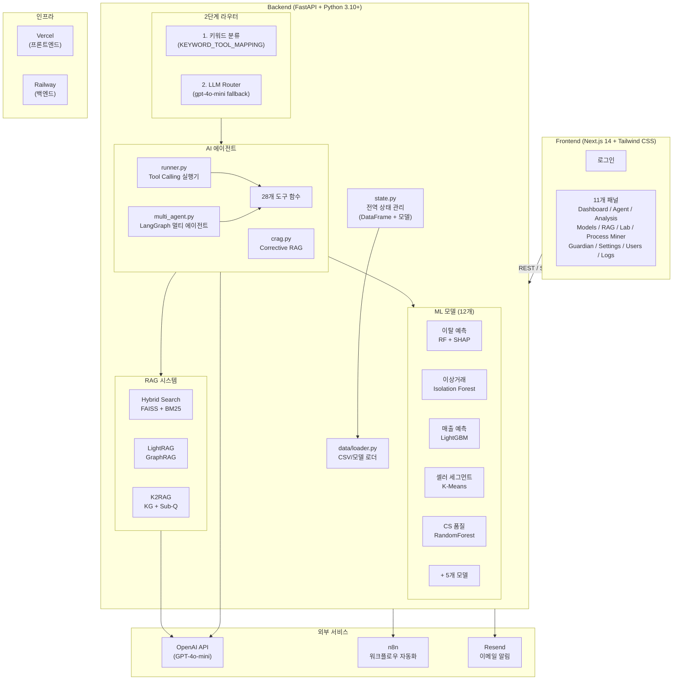

# CAFE24 AI 운영 플랫폼

<div align="center">

**카페24 이커머스 AI 기반 내부 운영 시스템**

LLM + ML 하이브리드 아키텍처로 셀러 이탈 예측, 이상거래 탐지, CS 자동화, 매출 예측을 통합 제공하는 AI 운영 플랫폼

[](https://python.org)
[](https://fastapi.tiangolo.com)
[](https://nextjs.org)
[](https://langchain.com)
[](https://langchain-ai.github.io/langgraph/)
[](https://openai.com)
[](https://mlflow.org)

[API 문서 (Swagger)](https://cafe24-api-production.up.railway.app/docs) | 개발 기간: 2026.02.06 ~ 진행 중

</div>

---

## 목차

1. [프로젝트 개요](#1-프로젝트-개요)
2. [핵심 기능](#2-핵심-기능)
3. [시스템 아키텍처](#3-시스템-아키텍처)
4. [기술 스택](#4-기술-스택)
5. [프로젝트 구조](#5-프로젝트-구조)
6. [AI 에이전트 시스템](#6-ai-에이전트-시스템)
7. [RAG 시스템](#7-rag-시스템)
8. [ML 모델](#8-ml-모델)
9. [API 엔드포인트](#9-api-엔드포인트)
10. [프론트엔드](#10-프론트엔드)
11. [설치 및 실행](#11-설치-및-실행)
12. [환경 변수 설정](#12-환경-변수-설정)
13. [배포](#13-배포)
14. [데이터](#14-데이터)
15. [버전 히스토리](#15-버전-히스토리)

---

## 1. 프로젝트 개요

### 배경 및 목적

**CAFE24 AI 운영 플랫폼**은 이커머스 플랫폼(카페24) 운영에 필요한 다양한 AI/ML 기능을 하나의 통합 플랫폼으로 제공합니다. 자연어 질의 기반의 AI 에이전트가 28개의 전문 도구를 활용하여 데이터 분석, 예측, CS 자동화를 수행합니다.

> **상세 문서**: [백엔드 README](backend%20리팩토링%20시작/README.md) | [프론트엔드 README](nextjs/README.md)

### 해결하는 문제

| 문제 | 기존 방식 | AI 플랫폼 솔루션 |
|------|----------|------------------|
| **셀러 이탈** | 이탈 후 사후 분석 | RandomForest + SHAP 기반 사전 예측 + 원인 분석 |
| **이상거래 탐지** | 수동 모니터링, 신고 기반 | Isolation Forest 실시간 자동 탐지 |
| **CS 문의 처리** | CS 담당자 수동 분류/응답 | TF-IDF + RF 일괄 분류 + RAG+LLM 답변 생성 + DnD 자동/수동 분기 |
| **정산 이상** | 수작업 정산 검증 | DBSCAN 기반 정산 이상 패턴 탐지 |
| **매출 예측** | 경험 기반 예측 | LightGBM 기반 다변량 매출 예측 |
| **데이터 분석** | SQL 작성, 대시보드 개발 필요 | 자연어 질의 -> 자동 분석 (GPT-4o-mini + 28 Tools) |
| **DB 보안** | 수동 모니터링 | Data Guardian Agent (룰엔진 + ML + LangChain) 실시간 차단 |

### 기술적 차별점

| 특징 | 설명 |
|------|------|
| **LLM + ML 하이브리드** | GPT-4o-mini가 28개 도구를 선택하고, 전통 ML 모델 12개가 예측 수행 |
| **2단계 라우터** | 키워드 기반 분류(비용 0, <1ms) -> LLM Router(fallback) + `KEYWORD_TOOL_MAPPING` 강제 실행 |
| **Triple RAG** | FAISS Hybrid Search + LightRAG(GraphRAG) + K2RAG(KG+Sub-Q+Hybrid) |
| **Corrective RAG** | 검색 결과 품질 평가 -> 쿼리 재작성 -> 재검색 (CRAG 패턴) |
| **SHAP 해석** | 셀러 이탈 원인을 피처별 기여도(SHAP value)로 설명 |
| **실시간 스트리밍** | SSE(Server-Sent Events) 기반 토큰 단위 스트리밍 |
| **MLflow 실험 추적** | 모델 파라미터/메트릭/아티팩트 버전 관리 |
| **마케팅 최적화** | P-PSO(Particle Swarm Optimization) 기반 채널별 예산 배분 최적화 |
| **CS 자동화 파이프라인** | 접수(DnD 분류) -> 답변(RAG+LLM) -> 회신(n8n) 5단계 워크플로우 |
| **Data Guardian Agent** | 룰엔진(<1ms) + Isolation Forest + LangChain Agent + Resend 이메일 알림 |

---

## 2. 핵심 기능

### 기능 요약

| 기능 | 설명 | 핵심 기술 |
|------|------|-----------|
| **AI 에이전트** | 자연어로 데이터 분석/예측 요청 | GPT-4o-mini + Tool Calling + 28개 도구 |
| **RAG 검색** | 플랫폼 지식 기반 답변 생성 | FAISS + BM25 Hybrid Search + Cross-Encoder Reranking |
| **LightRAG** | 지식 그래프 기반 멀티홉 검색 | LightRAG (99% 토큰 절감 vs GraphRAG) |
| **K2RAG** | KG + Sub-Question + Hybrid 고정밀 검색 | Dense(80%) + Sparse(20%) + Summarization |
| **Corrective RAG** | 검색 결과 자동 품질 평가 및 교정 | RetrievalGrader + QueryRewriter |
| **셀러 이탈 예측** | 셀러 이탈 확률 예측 + SHAP 해석 | RandomForest + SHAP Explainer |
| **이상거래 탐지** | 사기 거래/비정상 패턴 자동 탐지 | Isolation Forest |
| **매출 예측** | 쇼핑몰 매출 트렌드 예측 | LightGBM |
| **마케팅 최적화** | 마케팅 채널별 예산 ROI 최적화 | P-PSO (메타휴리스틱 최적화) |
| **CS 자동화** | 문의 자동 분류 -> RAG 답변 -> 회신 | TF-IDF + RF + RAG + SSE + n8n |
| **Data Guardian** | DB 대량 변경 실시간 차단 및 복구 | 룰엔진 + Isolation Forest + LangChain Agent |
| **OCR** | 이미지에서 텍스트 추출 | EasyOCR |
| **AI 프로세스 마이너** | 이벤트 로그 기반 프로세스 패턴 발견, 병목 분석, AI 자동화 추천, 다음 활동 예측, 이상 프로세스 탐지 | Counter + IQR + GPT-4o-mini + RandomForest + IsolationForest |

### ML 모델 (12개)

> 모든 모델의 학습 데이터는 **합성 데이터**(numpy/pandas 랜덤 생성 + 카페24 도메인 상수)로 생성됩니다. 실제 카페24 데이터는 사용하지 않으며, `ml/train_models.py` 실행 시 18개 CSV와 10개 모델이 자동 생성됩니다.

| # | 모델명 | 알고리즘 | 비즈니스 목적 | 파일 |
|---|--------|---------|-------------|------|
| 1 | 셀러 이탈 예측 | RandomForest + SHAP | 이탈 위험 셀러를 사전 식별하여 선제적 리텐션 전략 수립 | `model_seller_churn.pkl` |
| 2 | 이상거래 탐지 | Isolation Forest | 허위 주문/리뷰 조작/비정상 환불 등 사기 거래 패턴 자동 탐지 | `model_fraud_detection.pkl` |
| 3 | 문의 자동 분류 | TF-IDF + RandomForest | CS 문의를 9개 카테고리로 자동 분류하여 처리 효율화 | `model_inquiry_classification.pkl` |
| 4 | 셀러 세그먼트 | K-Means (5 클러스터) | 셀러 행동 패턴 기반 군집화로 맞춤형 운영 지원 | `model_seller_segment.pkl` |
| 5 | 매출 예측 | LightGBM | 쇼핑몰 과거 매출 패턴 분석으로 다음 달 예상 매출 예측 | `model_revenue_prediction.pkl` |
| 6 | CS 응답 품질 | RandomForest | CS 문의 긴급도 자동 예측으로 우선 처리 대상 선별 | `model_cs_quality.pkl` |
| 7 | 고객 LTV 예측 | GradientBoosting | 고객 미래 기대 수익(LTV) 예측으로 VIP 관리 및 마케팅 전략 수립 | `model_customer_ltv.pkl` |
| 8 | 리뷰 감성 분석 | TF-IDF + LogisticRegression | 상품 리뷰 감성 자동 분류로 셀러 품질 모니터링 | `model_review_sentiment.pkl` |
| 9 | 상품 수요 예측 | XGBoost | 상품별 수요량 예측으로 재고 관리 및 프로모션 기획 지원 | `model_demand_forecast.pkl` |
| 10 | 정산 이상 탐지 | DBSCAN | 정산 금액/주기 이상 패턴 탐지로 정산 오류 및 부정 거래 방지 | `model_settlement_anomaly.pkl` |
| 11 | 다음 활동 예측 | RandomForest Classifier | 프로세스 현재 활동 기준 다음 활동 Top-3 예측 | `process_miner/predictor.py` |
| 12 | 이상 프로세스 탐지 | Isolation Forest | 경로 기반 이상 프로세스 케이스 탐지 | `process_miner/anomaly_detector.py` |

#### 데이터 생성 방법

`ml/train_models.py`의 PART 2에서 numpy/pandas 랜덤 생성기(`np.random.default_rng(42)`)와 카페24 도메인 상수(업종, 지역, 플랜, 상품명 등)를 조합하여 18개 CSV를 생성합니다.

- **쇼핑몰/셀러 데이터**: 플랜 등급(Basic 35%, Standard 30%, Premium 25%, Enterprise 10%), 8개 업종, 8개 지역 가중 분포
- **운영 로그**: 주문/정산/환불/CS/마케팅 등 이벤트 타입별 시계열 데이터 (3만건 제한)
- **셀러 행동 데이터**: 주문 수, 매출, 반품률, 응답 시간, 마지막 접속일 등 이탈 관련 피처
- **상품 데이터**: 업종별 실제 상품명 템플릿 (패션 15종, 뷰티 15종, 식품 15종 등)

---

## 3. 시스템 아키텍처

### 전체 아키텍처



### 요청 처리 흐름


### CS 자동화 파이프라인 흐름


### Data Guardian 아키텍처


---

## 4. 기술 스택

### 백엔드

| 분류 | 기술 | 용도 |
|------|------|------|
| **프레임워크** | FastAPI 0.110+ | REST API, SSE 스트리밍 |
| **서버** | Uvicorn | ASGI 서버 |
| **LLM** | OpenAI GPT-4o-mini | 에이전트 추론, RAG 답변 생성 |
| **에이전트** | LangChain 0.2+, LangGraph 0.2+ | Tool Calling, 멀티 에이전트 |
| **벡터 검색** | FAISS (faiss-cpu) | Dense Vector Search |
| **키워드 검색** | rank-bm25 | BM25 Sparse Search |
| **리랭킹** | sentence-transformers | Cross-Encoder Reranking |
| **GraphRAG** | LightRAG (lightrag-hku) | 지식 그래프 기반 검색 |
| **그래프** | NetworkX 3.0+ | Knowledge Graph 구축 |
| **ML 학습** | scikit-learn 1.3+, LightGBM 4.0+, XGBoost 2.0+ | 모델 학습/추론 |
| **ML 해석** | SHAP 0.44+ | 모델 해석성 (피처 기여도) |
| **ML 최적화** | mealpy 3.0+ | P-PSO 메타휴리스틱 최적화 |
| **MLOps** | MLflow 2.10+ | 실험 추적/모델 버전 관리 |
| **OCR** | EasyOCR 1.7+ | 이미지 텍스트 추출 |
| **PDF 파싱** | PyMuPDF, PyPDF2, pypdf | PDF 문서 파싱 |
| **데이터** | pandas, numpy, joblib | 데이터 처리/모델 직렬화 |
| **워크플로우** | n8n | CS 회신 자동화 |
| **이메일** | Resend | DBA 알림 이메일 |
| **DB** | SQLite | Guardian 감사 로그 |

### 프론트엔드

| 분류 | 기술 | 용도 |
|------|------|------|
| **프레임워크** | Next.js 14 (Pages Router) | SSR/CSR 하이브리드 |
| **UI 라이브러리** | React 18 | 컴포넌트 기반 UI |
| **스타일링** | Tailwind CSS 3.4, tailwind-merge | 유틸리티 퍼스트 CSS |
| **차트** | Plotly.js (react-plotly.js) | 대시보드 시각화 |
| **애니메이션** | Framer Motion 11.0+ | 트랜지션, 아코디언 |
| **SSE** | @microsoft/fetch-event-source | 에이전트 스트리밍 |
| **마크다운** | react-markdown + remark-gfm | 에이전트 응답 렌더링 (GFM 지원) |
| **수학 수식** | KaTeX + remark-math + rehype-katex | 수학 수식 렌더링 ($...$, $$...$$) |
| **상태 관리** | SWR 2.2+ | 서버 상태 캐싱 |
| **워크플로우** | @xyflow/react (React Flow) | n8n 워크플로우 시각화 |
| **차트 (보조)** | Recharts 3.7+ | 추가 차트 시각화 |
| **아이콘** | lucide-react | UI 아이콘 |
| **토스트** | react-hot-toast | 알림 |

### 인프라

| 분류 | 기술 | 용도 |
|------|------|------|
| **백엔드 배포** | Railway (Docker) | FastAPI 서버 호스팅 |
| **프론트엔드 배포** | Vercel | Next.js 배포 |
| **컨테이너** | Docker (Python 3.11-slim) | 백엔드 컨테이너화 |
| **DB** | SQLite (Guardian 감사 로그) | 경량 로컬 DB |

---

## 5. 프로젝트 구조

```
카페24 프로젝트/
│
├── README.md                              # 프로젝트 루트 문서 (이 파일)
├── requirements.txt                       # 루트 의존성
├── 실행 명령어.txt                        # 로컬 실행 명령어 메모
│
├── backend 리팩토링 시작/                 # === FastAPI 백엔드 ===
│   ├── main.py                            # FastAPI 앱 진입점 (CORS, 미들웨어, startup)
│   ├── state.py                           # 전역 상태 관리 (DataFrame, 모델, 설정, 캐시)
│   ├── Dockerfile                         # Docker 빌드 (python:3.11-slim)
│   ├── railway.toml                       # Railway 배포 설정
│   ├── requirements.txt                   # Python 의존성 (54개 패키지)
│   ├── README.md                          # 백엔드 상세 문서
│   │
│   ├── api/                               # REST API 라우트
│   │   └── routes.py                      # 83개 엔드포인트 정의 (Pydantic 모델 포함)
│   │
│   ├── agent/                             # AI 에이전트 시스템
│   │   ├── runner.py                      # Tool Calling 실행기 (동기/스트리밍/멀티 에이전트 모드)
│   │   ├── tools.py                       # 28개 도구 함수 구현 (tool_*)
│   │   ├── tool_schemas.py                # @tool 데코레이터 스키마 (LangChain 호환)
│   │   ├── router.py                      # LLM Router (IntentCategory 7개 분류)
│   │   ├── intent.py                      # 인텐트 감지 + 컨텍스트 재활용
│   │   ├── multi_agent.py                 # LangGraph 멀티 에이전트 (Coordinator/Search/Analysis/CS)
│   │   ├── crag.py                        # Corrective RAG (RetrievalGrader + QueryRewriter)
│   │   ├── llm.py                         # LLM 호출 래퍼 (ChatOpenAI + 메모리)
│   │   └── semantic_router.py             # Semantic Router (임베딩 기반 의도 분류)
│   │
│   ├── rag/                               # RAG 시스템
│   │   ├── service.py                     # FAISS + BM25 Hybrid Search + Cross-Encoder Reranking + KG
│   │   ├── light_rag.py                   # LightRAG (경량 GraphRAG, 듀얼 레벨 검색)
│   │   └── k2rag.py                       # K2RAG (KG + Hybrid + Corpus Summarization)
│   │
│   ├── ml/                                # ML 모델
│   │   ├── train_models.py                # 데이터 생성(18 CSV) + 모델 학습(10개)
│   │   ├── train_models.ipynb             # Jupyter 노트북 버전
│   │   ├── revenue_model.py               # 매출 예측 모델 (LightGBM 독립 학습)
│   │   ├── marketing_optimizer.py         # 마케팅 예산 최적화 (P-PSO)
│   │   ├── mlflow_tracker.py              # MLflow 실험 추적 유틸리티
│   │   └── helpers.py                     # ML 유틸리티
│   │
│   ├── core/                              # 핵심 유틸리티
│   │   ├── constants.py                   # 상수 (이커머스 용어, 피처 컬럼, 프롬프트)
│   │   ├── utils.py                       # 유틸 함수 (safe_str, json_sanitize, normalize_model_name)
│   │   ├── memory.py                      # 사용자별 대화 메모리 관리 (deque, 10턴)
│   │   └── parsers.py                     # 텍스트 파싱 (top-k 추출, 날짜 범위 파싱)
│   │
│   ├── data/                              # 데이터 관리
│   │   └── loader.py                      # CSV/모델 안전 로딩 (init_data_models)
│   │
│   ├── n8n/                               # n8n 워크플로우
│   │   ├── cs_reply_workflow.json          # CS 회신 자동화 워크플로우 정의
│   │   └── _writer.py                     # 유틸리티
│   │
│   ├── process_miner/                     # AI 프로세스 마이너
│   │   ├── event_generator.py             #   데모 이벤트 로그 생성 (주문/CS/정산)
│   │   ├── miner.py                       #   프로세스 패턴 발견 + 전이 행렬 + Mermaid
│   │   ├── bottleneck.py                  #   병목 분석 (IQR 이상치, 효율성 점수)
│   │   ├── recommender.py                 #   LLM 자동화 추천 + SOP 생성
│   │   ├── predictor.py                   #   다음 활동 예측 (RandomForest, Top-3 확률)
│   │   ├── anomaly_detector.py            #   이상 프로세스 탐지 (IsolationForest, 경로 기반)
│   │   └── routes.py                      #   전용 API 라우터 (/api/process-miner/*)
│   │
│   ├── crawl_cafe24_guide.py              # 카페24 서비스 가이드 크롤러 (rag_docs 수집)
│   ├── crawl_cafe24_helpcenter.py         # 카페24 헬프센터 크롤러
│   │
│   ├── rag_docs/                          # RAG 소스 문서 (플랫폼 가이드 PDF/MD)
│   ├── rag_faiss/                         # FAISS 벡터 인덱스
│   ├── lightrag_data/                     # LightRAG 지식 그래프 데이터
│   │
│   ├── *.csv (18개)                       # 이커머스 시뮬레이션 데이터
│   │   ├── shops.csv                      #   쇼핑몰 정보
│   │   ├── sellers.csv                    #   셀러 정보
│   │   ├── products.csv                   #   상품 리스팅
│   │   ├── categories.csv                 #   상품 카테고리
│   │   ├── services.csv                   #   플랫폼 서비스
│   │   ├── operation_logs.csv             #   운영 로그 (3만건)
│   │   ├── seller_analytics.csv           #   셀러 분석 데이터
│   │   ├── seller_activity.csv            #   셀러 일별 활동
│   │   ├── seller_products.csv            #   셀러별 상품
│   │   ├── seller_resources.csv           #   셀러 리소스
│   │   ├── shop_performance.csv           #   쇼핑몰 성과 KPI
│   │   ├── daily_metrics.csv              #   일별 플랫폼 지표 (GMV, DAU 등)
│   │   ├── cs_stats.csv                   #   CS 문의 통계
│   │   ├── fraud_details.csv              #   이상거래 상세
│   │   ├── cohort_retention.csv           #   셀러 코호트 리텐션
│   │   ├── conversion_funnel.csv          #   전환 퍼널
│   │   └── platform_docs.csv             #   플랫폼 문서
│   │
│   ├── *.pkl (20개+)                      # 학습된 ML 모델/스케일러/인코더
│   │   ├── model_seller_churn.pkl         #   이탈 예측 모델
│   │   ├── model_fraud_detection.pkl      #   이상거래 탐지 모델
│   │   ├── model_inquiry_classification.pkl #  문의 분류 모델
│   │   ├── model_seller_segment.pkl       #   셀러 세그먼트 모델
│   │   ├── model_revenue_prediction.pkl   #   매출 예측 모델
│   │   ├── model_cs_quality.pkl           #   CS 품질 예측 모델
│   │   ├── model_customer_ltv.pkl         #   고객 LTV 모델
│   │   ├── model_review_sentiment.pkl     #   리뷰 감성 모델
│   │   ├── model_demand_forecast.pkl      #   수요 예측 모델
│   │   ├── model_settlement_anomaly.pkl   #   정산 이상 탐지 모델
│   │   ├── shap_explainer_churn.pkl       #   SHAP Explainer
│   │   ├── tfidf_vectorizer.pkl           #   TF-IDF (문의 분류용)
│   │   ├── tfidf_vectorizer_sentiment.pkl #   TF-IDF (감성 분석용)
│   │   ├── scaler_cluster.pkl             #   StandardScaler (세그먼트용)
│   │   ├── scaler_revenue.pkl             #   StandardScaler (매출 예측용)
│   │   └── le_*.pkl                       #   LabelEncoder (4종)
│   │
│   ├── guardian.db                         # Guardian 감사 로그 SQLite DB
│   ├── churn_model_config.json            # 이탈 모델 설정
│   └── revenue_model_config.json          # 매출 모델 설정
│
└── nextjs/                                # === Next.js 프론트엔드 ===
    ├── package.json                       # Node 의존성 (v4.0.0)
    ├── next.config.js                     # API 프록시 rewrite 설정
    ├── tailwind.config.js                 # Tailwind CSS 설정
    ├── postcss.config.js                  # PostCSS 설정
    │
    ├── pages/                             # Next.js Pages Router
    │   ├── index.js                       # 루트 (-> /login 리다이렉트)
    │   ├── login.js                       # 로그인 페이지
    │   ├── app.js                         # 메인 앱 (10개 패널 탭)
    │   ├── _app.js                        # Next.js App wrapper
    │   └── api/                           # Next.js API Routes (SSE 프록시)
    │       └── agent/                     # 에이전트 스트리밍 프록시
    │
    ├── components/                        # React 컴포넌트
    │   ├── Layout.js                      # 레이아웃 (사이드바 + 메인)
    │   ├── Sidebar.js                     # 사이드바 (예시 질문 카테고리)
    │   ├── Topbar.js                      # 상단바
    │   ├── Tabs.js                        # 탭 네비게이션
    │   ├── KpiCard.js                     # KPI 카드 컴포넌트
    │   ├── SectionHeader.js               # 섹션 헤더
    │   ├── Skeleton.js                    # 로딩 스켈레톤
    │   ├── EmptyState.js                  # 빈 상태 UI
    │   ├── ToastProvider.js               # 토스트 알림
    │   └── panels/                        # 기능별 패널 (11개)
    │       ├── AgentPanel.js              # AI 에이전트 (채팅 + 스트리밍)
    │       ├── DashboardPanel.js          # 대시보드 (KPI, 차트)
    │       ├── AnalysisPanel.js           # 상세 분석 (셀러/세그먼트/이상탐지/예측/코호트/트렌드)
    │       ├── ModelsPanel.js             # MLflow 모델 관리
    │       ├── RagPanel.js                # RAG 문서/인덱스 관리
    │       ├── LabPanel.js                # 실험실 (CS 자동화 파이프라인)
    │       ├── GuardianPanel.js           # Data Guardian (실시간 감시/복구/대시보드)
    │       ├── SettingsPanel.js           # 설정 (시스템 프롬프트, LLM 파라미터)
    │       ├── UsersPanel.js              # 사용자 관리
    │       ├── ProcessMinerPanel.js       # AI 프로세스 마이너 (패턴/병목/추천 3탭)
    │       └── LogsPanel.js               # 로그 뷰어
    │
    ├── lib/                               # 유틸리티
    │   ├── api.js                         # API 호출 (apiCall, Basic Auth)
    │   ├── storage.js                     # 로컬/세션 스토리지 관리
    │   ├── cn.js                          # className 유틸 (clsx + tailwind-merge)
    │   ├── progress.js                    # 프로그레스 바 (NProgress)
    │   └── utils.js                       # 공용 유틸리티
    │
    └── styles/                            # 전역 스타일
```

---

## 6. AI 에이전트 시스템

### 에이전트 아키텍처

에이전트는 사용자의 자연어 질의를 분석하여 적절한 도구를 자동 선택/실행하고, 결과를 자연어로 요약하여 응답합니다.

#### 2단계 라우터 (`agent/router.py`)

```
사용자 질의
    |
    v
[1단계] 키워드 분류 (비용 0, <1ms)
    |-- IntentCategory: ANALYSIS / PLATFORM / SHOP / SELLER / CS / DASHBOARD / GENERAL
    |-- KEYWORD_TOOL_MAPPING: 특정 키워드 -> 도구 강제 실행
    |
    v (키워드 미매칭 시)
[2단계] LLM Router (gpt-4o-mini)
    |-- 질의를 분석하여 카테고리 분류
    v
해당 카테고리의 도구만 Agent에 전달 (도구 범위 제한)
```

**IntentCategory 7개:**
- `ANALYSIS` - 매출, GMV, 이탈, DAU, 코호트, 트렌드 분석
- `PLATFORM` - 플랫폼 정책, 기능, 운영 가이드 (RAG)
- `SHOP` - 쇼핑몰 정보, 서비스, 성과, 매출
- `SELLER` - 셀러 분석, 세그먼트, 부정행위 탐지
- `CS` - CS 자동응답, 품질 검사, 문의 분류
- `DASHBOARD` - 대시보드, 전체 현황
- `GENERAL` - 일반 대화, 인사

#### 키워드-도구 강제 매핑 (`agent/runner.py`)

특정 키워드가 포함된 질의는 LLM 판단 없이 해당 도구를 강제 실행합니다:

| 키워드 | 강제 실행 도구 |
|--------|---------------|
| "이탈 예측", "이탈 확률", "churn" | `predict_seller_churn` |
| "이상거래", "부정거래", "사기 통계" | `get_fraud_statistics` |
| "세그먼트 통계", "셀러 분포" | `get_segment_statistics` |
| "대시보드", "전체 현황" | `get_dashboard_summary` |
| "마케팅 추천", "ROAS 최적화" | `optimize_marketing` |
| "코호트 분석", "리텐션 분석" | `get_cohort_analysis` |
| "트렌드 분석", "KPI 분석" | `get_trend_analysis` |
| "매출 예측", "GMV 예측" | `get_gmv_prediction` |
| "문의 분류", "분류해줘" | `classify_inquiry` |
| "쇼핑몰 목록", "쇼핑몰 리스트" | `list_shops` |
| "카테고리 목록", "업종 전체" | `list_categories` |
| "성과 분석", "쇼핑몰 매출" | `get_shop_performance` |

#### 28개 에이전트 도구 (`agent/tools.py`)

| 카테고리 | 도구 함수 | 설명 |
|----------|-----------|------|
| **쇼핑몰** | `tool_get_shop_info(shop_id)` | 쇼핑몰 상세 조회 (ID/이름 검색) |
| | `tool_list_shops(category, tier, region)` | 쇼핑몰 목록 필터링 |
| | `tool_get_shop_services(shop_id)` | 쇼핑몰 이용 서비스 조회 |
| | `tool_get_shop_performance(shop_id)` | 쇼핑몰 성과 KPI 분석 |
| | `tool_predict_shop_revenue(shop_id)` | 쇼핑몰 매출 예측 (LightGBM) |
| **카테고리** | `tool_get_category_info(category_id)` | 카테고리 상세 조회 |
| | `tool_list_categories()` | 전체 카테고리 목록 |
| **CS** | `tool_auto_reply_cs(text, ...)` | CS 자동 응답 생성 |
| | `tool_check_cs_quality(...)` | CS 응답 품질 예측 |
| | `tool_classify_inquiry(text)` | 문의 자동 분류 (9개 카테고리) |
| | `tool_get_cs_statistics()` | CS 통계 조회 |
| | `tool_get_ecommerce_glossary(term)` | 이커머스 용어 조회 |
| **셀러 분석** | `tool_analyze_seller(seller_id)` | 셀러 종합 분석 |
| | `tool_get_seller_segment(seller_id)` | 셀러 세그먼트 분류 (K-Means) |
| | `tool_detect_fraud(seller_id)` | 이상거래 탐지 (Isolation Forest) |
| | `tool_predict_seller_churn(seller_id)` | 이탈 예측 + SHAP 해석 |
| | `tool_get_seller_activity_report(seller_id, days)` | 셀러 활동 리포트 |
| **통계** | `tool_get_segment_statistics()` | 세그먼트별 통계 |
| | `tool_get_fraud_statistics()` | 이상거래 전체 통계 |
| | `tool_get_order_statistics(event_type, days)` | 운영 이벤트/주문 통계 |
| | `tool_get_dashboard_summary()` | 대시보드 요약 |
| **분석** | `tool_get_churn_prediction(risk_level, limit)` | 전체 이탈 예측 분석 |
| | `tool_get_cohort_analysis(cohort, month)` | 코호트 리텐션 분석 |
| | `tool_get_trend_analysis(start_date, end_date, days)` | KPI 트렌드 분석 |
| | `tool_get_gmv_prediction(days)` | GMV/매출 예측 분석 |
| **RAG** | `tool_search_platform(query, top_k)` | 플랫폼 지식 검색 (FAISS) |
| | `tool_search_platform_lightrag(query, mode)` | LightRAG 검색 |
| **마케팅** | `tool_optimize_marketing(seller_id, ...)` | 마케팅 예산 최적화 (P-PSO) |

#### 멀티 에이전트 (`agent/multi_agent.py`)

LangGraph 기반 멀티 에이전트 시스템으로, Coordinator가 질의를 분석하여 전문 에이전트에 라우팅합니다:

- **Coordinator** - 사용자 질의 분석 및 에이전트 할당
- **Search Agent** - 쇼핑몰/카테고리 조회, RAG 검색
- **Analysis Agent** - 셀러 분석, ML 예측, 통계
- **CS Agent** - CS 응답 생성, 품질 평가

#### Corrective RAG (`agent/crag.py`)

검색 결과의 품질을 자동 평가하고 교정하는 CRAG 패턴:

1. **RetrievalGrader** - 검색 결과 관련성 평가 (GPT-4o-mini)
2. **QueryRewriter** - 관련성 낮을 경우 쿼리 재작성
3. **CRAGWorkflow** - `CORRECT`(바로 사용) / `INCORRECT`(재검색) / `AMBIGUOUS`(병합) 분기 처리

#### Semantic Router (`agent/semantic_router.py`)

임베딩 기반 의도 분류로, 키워드 기반 분류의 한계를 극복합니다:

- LLM 호출 없이 빠른 분류 (OpenAI 임베딩 유사도만 계산)
- 유사한 의미의 다양한 표현 인식 ("매출" = "수익" = "돈 벌이")
- 카테고리별 예시 쿼리(Route Utterances)로 학습

---

## 7. RAG 시스템

### Triple RAG 아키텍처

3가지 RAG 엔진을 용도에 맞게 선택적으로 사용합니다:

| RAG 엔진 | 파일 | 검색 방식 | 적합한 질의 |
|----------|------|-----------|-------------|
| **Hybrid RAG** | `rag/service.py` | FAISS(Dense) + BM25(Sparse) + Cross-Encoder Reranking | 단일 문서 검색, 키워드+의미 혼합 질의 |
| **LightRAG** | `rag/light_rag.py` | 지식 그래프 기반 듀얼 레벨 (Entity + Theme) | 멀티홉 추론, 개념 연결 질의 |
| **K2RAG** | `rag/k2rag.py` | KG Search -> Sub-Q 생성 -> Hybrid Retrieval -> Summary | 복합 질의, 요약이 필요한 질의 |

#### Hybrid RAG (`rag/service.py`)

```
[쿼리] -> [BM25 키워드 검색] ------+
                                     |-> [점수 병합 (RRF)] -> [Cross-Encoder Reranking] -> [Top-K]
[쿼리] -> [FAISS 벡터 검색] ------+
```

- **임베딩**: OpenAI `text-embedding-3-small`
- **벡터 DB**: FAISS (faiss-cpu)
- **키워드 검색**: BM25Okapi
- **리랭킹**: sentence-transformers Cross-Encoder
- **Knowledge Graph**: 엔티티-관계 추출 (NetworkX)
- **문서 포맷**: PDF, MD, TXT, JSON, CSV, LOG

#### LightRAG (`rag/light_rag.py`)

```
[쿼리] -> [듀얼 레벨 검색]
            ├── Low-level: 엔티티(개체) 검색
            └── High-level: 테마(주제) 검색
          -> [결과 병합] -> [응답 생성]
```

- 99% 토큰 절감 (vs Microsoft GraphRAG)
- 증분 업데이트 지원
- 별도 이벤트 루프에서 비동기 실행 (FastAPI 충돌 방지)

#### K2RAG (`rag/k2rag.py`)

논문 기반 구현 ([arXiv:2507.07695](https://arxiv.org/abs/2507.07695)):

```
[쿼리] -> [KG 검색] -> [KG 결과 요약]
                          |
                          v
                    [Sub-Q 생성 (3개)]
                          |
            +-------------+-------------+
            v             v             v
      [Hybrid Retrieval] [Hybrid]     [Hybrid]
      (Dense 80% + Sparse 20%)
            v             v             v
      [Sub-answer]   [Sub-answer]  [Sub-answer]
            +-------------+-------------+
                          v
                    [최종 요약 -> 답변]
```

- Dense 80% + Sparse 20% 하이브리드 가중치
- Corpus Summarization: Longformer LED 기반 (`pszemraj/led-base-book-summary`)
- Sub-question Generation: KG 결과에서 서브 질문 자동 생성
- 학습 시간 93% 감소

---

## 8. ML 모델

### 모델 학습 (`ml/train_models.py`)

`train_models.py`를 실행하면 18개 CSV 데이터를 생성하고 10개 ML 모델을 학습합니다 (나머지 2개는 프로세스 마이너에서 실시간 학습):

```bash
cd "backend 리팩토링 시작"
python ml/train_models.py
```

모든 학습 결과는 MLflow로 추적됩니다 (`mlruns/` 디렉토리).

### 모델별 상세

#### 1. 셀러 이탈 예측 (RandomForest + SHAP)

- **입력 피처**: `total_orders`, `total_revenue`, `product_count`, `cs_tickets`, `refund_rate`, `avg_response_time`, `days_since_last_login`, `days_since_register`, `plan_tier_encoded`
- **출력**: 이탈 확률 (0~1) + SHAP 피처 기여도
- **SHAP 해석**: 각 피처가 이탈 확률에 미치는 영향 (방향 + 크기)

#### 2. 매출 예측 (LightGBM)

- **입력 피처**: `monthly_revenue`, `monthly_orders`, `monthly_visitors`, `avg_order_value`, `customer_retention_rate`, `conversion_rate`, `review_score`
- **출력**: 다음 달 예측 매출
- **교차 검증**: 5-fold CV R2 스코어 기록

#### 3. 마케팅 최적화 (P-PSO)

- **6개 채널**: 검색 광고, 디스플레이 광고, 소셜미디어, 이메일, 인플루언서, 콘텐츠
- **최적화**: 총 예산 제약 하에서 채널별 최적 배분 탐색
- **출력**: 채널별 추천 예산, 예상 ROAS, 예상 매출 증가율

### MLflow 실험 추적

`ml/mlflow_tracker.py`에서 모든 학습 파라미터, 메트릭, 모델 아티팩트를 추적합니다:

- **파라미터**: `n_estimators`, `max_depth`, `learning_rate` 등
- **메트릭**: `accuracy`, `f1_macro`, `r2_score`, `silhouette_score` 등
- **아티팩트**: 학습된 모델 `.pkl` 파일
- **UI**: 프론트엔드 ModelsPanel에서 실험/모델 조회 및 선택 가능

---

## 9. API 엔드포인트

### 엔드포인트 전체 목록 (89개)

모든 엔드포인트는 `/api` 프리픽스를 사용합니다.

#### 시스템

| 메서드 | 경로 | 설명 |
|--------|------|------|
| `GET` | `/api/health` | 헬스체크 |
| `POST` | `/api/login` | 로그인 (Basic Auth) |
| `GET` | `/api/tools` | 사용 가능한 도구 목록 |

#### 쇼핑몰

| 메서드 | 경로 | 설명 |
|--------|------|------|
| `GET` | `/api/shops` | 쇼핑몰 목록 (필터링) |
| `GET` | `/api/shops/{shop_id}` | 쇼핑몰 상세 |
| `GET` | `/api/shops/{shop_id}/services` | 쇼핑몰 서비스 |
| `GET` | `/api/categories` | 카테고리 목록 |
| `GET` | `/api/categories/{category_id}` | 카테고리 상세 |

#### CS (Customer Service)

| 메서드 | 경로 | 설명 |
|--------|------|------|
| `POST` | `/api/cs/reply` | CS 자동 응답 생성 |
| `POST` | `/api/cs/quality` | CS 응답 품질 예측 |
| `GET` | `/api/cs/glossary` | 이커머스 용어집 |
| `GET` | `/api/cs/statistics` | CS 통계 |
| `POST` | `/api/cs/pipeline` | CS 파이프라인 (분류 + 품질) |
| `POST` | `/api/cs/pipeline/answer` | CS 파이프라인 RAG+LLM 답변 |
| `POST` | `/api/cs/send-reply` | 회신 전송 (SSE + n8n) |
| `GET` | `/api/cs/stream` | CS 스트리밍 |
| `POST` | `/api/cs/callback` | n8n 콜백 |

#### 셀러

| 메서드 | 경로 | 설명 |
|--------|------|------|
| `GET` | `/api/sellers/autocomplete` | 셀러 자동완성 검색 |
| `GET` | `/api/sellers/search` | 셀러 검색 |
| `GET` | `/api/sellers/analyze/{seller_id}` | 셀러 종합 분석 |
| `POST` | `/api/sellers/segment` | 셀러 세그먼트 분류 |
| `POST` | `/api/sellers/fraud` | 이상거래 탐지 |
| `GET` | `/api/sellers/segments/statistics` | 세그먼트 통계 |
| `GET` | `/api/users/segments/{segment_name}/details` | 세그먼트별 셀러 상세 |
| `GET` | `/api/sellers/{seller_id}/activity` | 셀러 활동 리포트 |
| `GET` | `/api/sellers/performance` | 셀러 성과 |

#### 분석

| 메서드 | 경로 | 설명 |
|--------|------|------|
| `GET` | `/api/orders/statistics` | 주문/이벤트 통계 |
| `POST` | `/api/classify/inquiry` | 문의 분류 |
| `GET` | `/api/dashboard/summary` | 대시보드 요약 |
| `GET` | `/api/dashboard/insights` | AI 인사이트 |
| `GET` | `/api/dashboard/alerts` | 알림/경고 |
| `GET` | `/api/analysis/anomaly` | 이상 탐지 분석 |
| `GET` | `/api/analysis/prediction/churn` | 이탈 예측 분석 |
| `GET` | `/api/analysis/prediction/churn/user/{user_id}` | 개별 이탈 예측 |
| `GET` | `/api/analysis/cohort/retention` | 코호트 리텐션 |
| `GET` | `/api/analysis/trend/kpis` | KPI 트렌드 |
| `GET` | `/api/analysis/correlation` | 상관관계 분석 |
| `GET` | `/api/stats/summary` | 통계 요약 |

#### RAG

| 메서드 | 경로 | 설명 |
|--------|------|------|
| `POST` | `/api/rag/search` | RAG 검색 (FAISS) |
| `POST` | `/api/rag/search/hybrid` | 하이브리드 검색 (BM25 + FAISS) |
| `GET` | `/api/rag/status` | RAG 상태 |
| `POST` | `/api/rag/reload` | RAG 인덱스 리빌드 |
| `POST` | `/api/rag/upload` | 문서 업로드 |
| `GET` | `/api/rag/files` | 문서 목록 |
| `POST` | `/api/rag/delete` | 문서 삭제 |

#### LightRAG

| 메서드 | 경로 | 설명 |
|--------|------|------|
| `GET` | `/api/lightrag/status` | LightRAG 상태 |
| `POST` | `/api/lightrag/build` | LightRAG 빌드 |
| `POST` | `/api/lightrag/search` | LightRAG 검색 |
| `POST` | `/api/lightrag/search-dual` | LightRAG 듀얼 검색 |
| `POST` | `/api/lightrag/clear` | LightRAG 초기화 |

#### K2RAG

| 메서드 | 경로 | 설명 |
|--------|------|------|
| `GET` | `/api/k2rag/status` | K2RAG 상태 |
| `POST` | `/api/k2rag/search` | K2RAG 검색 |
| `POST` | `/api/k2rag/config` | K2RAG 설정 변경 |
| `POST` | `/api/k2rag/load` | K2RAG 기존 RAG에서 로드 |
| `POST` | `/api/k2rag/summarize` | K2RAG 텍스트 요약 |

#### AI 에이전트

| 메서드 | 경로 | 설명 |
|--------|------|------|
| `POST` | `/api/agent/chat` | 에이전트 채팅 (동기) |
| `POST` | `/api/agent/stream` | 에이전트 스트리밍 (SSE) |
| `POST` | `/api/agent/memory/clear` | 대화 메모리 초기화 |

#### OCR

| 메서드 | 경로 | 설명 |
|--------|------|------|
| `POST` | `/api/ocr/extract` | 이미지 텍스트 추출 (EasyOCR) |
| `GET` | `/api/ocr/status` | OCR 상태 |

#### MLflow

| 메서드 | 경로 | 설명 |
|--------|------|------|
| `GET` | `/api/mlflow/experiments` | MLflow 실험 목록 |
| `GET` | `/api/mlflow/models` | 모델 목록 (런별) |
| `GET` | `/api/mlflow/models/selected` | 선택된 모델 상태 |
| `POST` | `/api/mlflow/models/select` | 모델 선택/변경 |

#### 마케팅

| 메서드 | 경로 | 설명 |
|--------|------|------|
| `GET` | `/api/marketing/seller/{seller_id}` | 셀러 마케팅 현황 |
| `POST` | `/api/marketing/optimize` | 마케팅 예산 최적화 (P-PSO) |
| `GET` | `/api/marketing/status` | 최적화 모듈 상태 |

#### 설정 / 사용자

| 메서드 | 경로 | 설명 |
|--------|------|------|
| `GET` | `/api/settings/default` | 기본 설정 |
| `GET/POST` | `/api/settings/prompt` | 시스템 프롬프트 조회/변경 |
| `POST` | `/api/settings/prompt/reset` | 프롬프트 초기화 |
| `GET/POST` | `/api/settings/llm` | LLM 설정 조회/변경 |
| `POST` | `/api/settings/llm/reset` | LLM 설정 초기화 |
| `GET` | `/api/users` | 사용자 목록 |
| `POST` | `/api/users` | 사용자 추가 |

#### 내보내기

| 메서드 | 경로 | 설명 |
|--------|------|------|
| `GET` | `/api/export/csv` | CSV 내보내기 |
| `GET` | `/api/export/excel` | Excel 내보내기 (openpyxl) |

#### Data Guardian

| 메서드 | 경로 | 설명 |
|--------|------|------|
| `POST` | `/api/guardian/analyze` | SQL 쿼리 위험 분석 (룰엔진 + ML) |
| `POST` | `/api/guardian/recover` | 자연어 복구 요청 -> SQL 제안 |
| `GET` | `/api/guardian/logs` | 감사 로그 조회 |
| `GET` | `/api/guardian/stats` | Guardian 통계 |
| `POST` | `/api/guardian/notify-dba` | DBA 이메일 알림 (Resend) |

#### 프로세스 마이너

별도 라우터: `APIRouter(prefix="/api/process-miner")`

| 메서드 | 경로 | 설명 |
|--------|------|------|
| `POST` | `/api/process-miner/discover` | 프로세스 패턴 발견 (전이 행렬, Mermaid 다이어그램) |
| `POST` | `/api/process-miner/bottlenecks` | 병목 분석 (IQR 이상치, 효율성 점수, 시간대별 분포) |
| `POST` | `/api/process-miner/recommend` | AI 자동화 추천 (GPT-4o-mini 분석 + SOP 문서 생성) |
| `POST` | `/api/process-miner/predict` | 다음 활동 예측 (RandomForest, Top-3 확률 + 피처 중요도) |
| `POST` | `/api/process-miner/anomalies` | 이상 프로세스 탐지 (IsolationForest, 경로 기반 이상 케이스) |
| `GET` | `/api/process-miner/dashboard` | 3개 프로세스(주문/CS/정산) 요약 대시보드 |

---

## 10. 프론트엔드

### 페이지 구조

| 경로 | 컴포넌트 | 설명 |
|------|---------|------|
| `/` | `index.js` | 루트 -> `/login` 리다이렉트 |
| `/login` | `login.js` | 로그인 (Basic Auth, 테스트 계정 드롭다운) |
| `/app` | `app.js` | 메인 앱 (11개 패널 탭 전환) |

### 패널 (11개)

| 패널 | 파일 | 설명 | 접근 권한 |
|------|------|------|-----------|
| **AI 에이전트** | `AgentPanel.js` | 채팅 인터페이스, SSE 스트리밍, 도구 실행 결과, 마크다운 렌더링 | 전체 |
| **대시보드** | `DashboardPanel.js` | KPI 카드, Plotly 차트 (Pie, Bar, Area) | 전체 |
| **상세 분석** | `AnalysisPanel.js` | 9개 서브탭 (셀러/세그먼트/이상탐지/예측/코호트/트렌드/쇼핑몰/CS/마케팅) | 관리자, 분석가, 사용자 |
| **모델 관리** | `ModelsPanel.js` | MLflow 실험/런 조회, 모델 선택/교체 | 관리자 |
| **RAG 관리** | `RagPanel.js` | RAG 인덱스 관리, 모드 선택 (Hybrid/LightRAG/K²RAG/Auto), 기능 상태 모니터링 | 관리자 |
| **실험실** | `LabPanel.js` | CS 자동화 5단계 파이프라인 | 관리자, 분석가, 사용자 |
| **Guardian** | `GuardianPanel.js` | DB 보안 3탭 (실시간 감시/복구/대시보드), 프리셋 시나리오 | 관리자, 분석가, 사용자 |
| **설정** | `SettingsPanel.js` | 시스템 프롬프트, LLM 파라미터 (모델, temperature, topP 등) | 관리자 |
| **사용자** | `UsersPanel.js` | 사용자 계정 관리 | 관리자 |
| **프로세스 마이너** | `ProcessMinerPanel.js` | 프로세스 패턴 발견 + 다음 활동 예측, 병목 분석 + 이상 프로세스 탐지, AI 자동화 추천 (3탭) | 전체 |
| **로그** | `LogsPanel.js` | 백엔드 로그 뷰어 | 관리자 |

### API 프록시

`next.config.js`에서 `/api/*` 요청을 백엔드로 프록시합니다:

```javascript
// next.config.js
async rewrites() {
  const backend = process.env.BACKEND_INTERNAL_URL || 'http://127.0.0.1:8000';
  return [
    { source: '/api/agent/stream', destination: '/api/agent/stream' },  // SSE는 Next API Route
    { source: '/api/:path*', destination: `${backend}/api/:path*` },    // 나머지는 백엔드 프록시
  ];
}
```

**Next.js API Routes** (SSE 프록시, 5개):
- `pages/api/agent/stream.js` - 에이전트 스트리밍 프록시
- `pages/api/cs/pipeline-answer.js` - CS 파이프라인 RAG+LLM 답변
- `pages/api/cs/send-reply.js` - CS 회신 전송 SSE
- `pages/api/cs/stream.js` - CS 스트리밍 프록시
- `pages/api/cs/callback.js` - n8n 콜백 프록시

### 테스트 계정

| 계정 | 비밀번호 | 역할 | 접근 패널 |
|------|---------|------|-----------|
| `admin` | `admin123` | 관리자 | 전체 (10개) |
| `analyst` | `analyst123` | 분석가 | 에이전트, 대시보드, 분석, 실험실, Guardian |
| `user` | `user123` | 사용자 | 에이전트, 대시보드, 분석, 실험실, Guardian |
| `operator` | `oper123` | 운영자 | 에이전트, 대시보드 |

---

## 11. 설치 및 실행

### 요구사항

- **Python** 3.10 이상 (Conda 환경 권장)
- **Node.js** 18 이상
- **OpenAI API Key** (GPT-4o-mini 사용)

### 백엔드 설치 및 실행

```bash
# 1. 디렉토리 이동
cd "카페24 프로젝트/backend 리팩토링 시작"

# 2. Python 가상환경 생성 (Conda 사용 시)
conda activate 3.10

# 또는 venv 사용 시
python -m venv venv
# Windows:
venv\Scripts\activate
# Linux/Mac:
source venv/bin/activate

# 3. 의존성 설치
pip install -r requirements.txt

# 4. OpenAI API 키 설정 (방법 1: 환경변수)
set OPENAI_API_KEY=sk-...   # Windows
export OPENAI_API_KEY=sk-...  # Linux/Mac

# 또는 (방법 2: 파일)
# openai_api_key.txt 파일에 API 키 작성

# 5. 데이터 생성 및 모델 학습 (최초 1회)
python ml/train_models.py

# 6. 서버 실행
uvicorn main:app --host 0.0.0.0 --port 8001 --reload
```

### 프론트엔드 설치 및 실행

```bash
# 1. 디렉토리 이동
cd "카페24 프로젝트/nextjs"

# 2. 의존성 설치
npm install

# 3. 개발 서버 실행
npm run dev -- -H 0.0.0.0
```

### 접속

| 서비스 | URL |
|--------|-----|
| **프론트엔드** | http://localhost:3000 |
| **백엔드 API** | http://localhost:8001 |
| **Swagger 문서** | http://localhost:8001/docs |
| **ReDoc** | http://localhost:8001/redoc |

---

## 12. 환경 변수 설정

### 백엔드 (`backend 리팩토링 시작/.env`)

| 변수 | 필수 | 설명 | 기본값 |
|------|------|------|--------|
| `OPENAI_API_KEY` | 필수 | OpenAI API 키 | `openai_api_key.txt`에서 로드 |
| `PORT` | 선택 | 서버 포트 | `8001` |
| `MLFLOW_TRACKING_URI` | 선택 | MLflow 추적 URI | `file:./mlruns` |
| `MLFLOW_EXPERIMENT_NAME` | 선택 | MLflow 실험명 | `cafe24-ops-ai` |

### 프론트엔드

| 변수 | 필수 | 설명 | 기본값 |
|------|------|------|--------|
| `NEXT_PUBLIC_API_BASE` | 선택 | 백엔드 API 주소 (로컬 개발용) | `""` (same origin) |
| `BACKEND_INTERNAL_URL` | 선택 | 백엔드 내부 URL (배포용) | `http://127.0.0.1:8000` |

### LLM 설정 (백엔드 중앙 관리)

`state.py`의 `DEFAULT_LLM_SETTINGS`에서 기본값이 설정되며, 프론트엔드 설정 패널에서 변경 가능합니다:

| 파라미터 | 기본값 | 설명 |
|----------|--------|------|
| `selectedModel` | `gpt-4o-mini` | 사용할 OpenAI 모델 |
| `temperature` | `0.3` | 응답 랜덤성 (0~2) |
| `topP` | `1.0` | 토큰 샘플링 범위 |
| `maxTokens` | `8000` | 최대 응답 토큰 |
| `stream` | `true` | SSE 스트리밍 활성화 |
| `timeoutMs` | `30000` | 요청 타임아웃 (ms) |
| `retries` | `2` | 재시도 횟수 |

---

## 13. 배포

### 배포 아키텍처


### Railway 백엔드 배포

```bash
cd "backend 리팩토링 시작"

# Docker 빌드
docker build -t cafe24-api:latest .

# Railway 환경변수 설정
# OPENAI_API_KEY=sk-...
# PORT=8000
```

**`railway.toml` 설정:**
```toml
[build]
builder = "dockerfile"
dockerfilePath = "Dockerfile"

[deploy]
healthcheckPath = "/api/health"
healthcheckTimeout = 300
restartPolicyType = "on_failure"
```

**`Dockerfile` 설정:**
- 베이스 이미지: `python:3.11-slim`
- 포트: `8000`
- 환경변수: `PYTHONUNBUFFERED=1`, `KMP_DUPLICATE_LIB_OK=TRUE`

### Vercel 프론트엔드 배포

```bash
cd nextjs
npx vercel
```

환경변수: `BACKEND_INTERNAL_URL=https://cafe24-api-production.up.railway.app`

---

## 14. 데이터

### CSV 데이터 (18개)

`ml/train_models.py` 실행 시 자동 생성되는 시뮬레이션 데이터입니다 (numpy/pandas 랜덤 생성 + 카페24 도메인 상수 조합):

| 파일 | 설명 | 주요 컬럼 |
|------|------|-----------|
| `shops.csv` | 쇼핑몰 정보 | shop_id, shop_name, plan_tier, category, region |
| `sellers.csv` | 셀러 정보 | seller_id, total_orders, total_revenue, refund_rate, days_since_last_login |
| `products.csv` | 상품 리스팅 | product_id, shop_id, category, price |
| `categories.csv` | 업종 카테고리 | category_id, name, shop_count |
| `services.csv` | 플랫폼 서비스 | service_id, name, shop_id |
| `operation_logs.csv` | 운영 로그 | event_type, timestamp, seller_id (3만건 제한) |
| `seller_analytics.csv` | 셀러 분석 | seller_id, segment, churn_risk, revenue_trend |
| `seller_activity.csv` | 일별 활동 | seller_id, date, orders, revenue |
| `seller_products.csv` | 셀러별 상품 | seller_id, product_count |
| `seller_resources.csv` | 셀러 리소스 | seller_id, resource_type |
| `shop_performance.csv` | 쇼핑몰 KPI | shop_id, monthly_revenue, monthly_orders, conversion_rate |
| `daily_metrics.csv` | 플랫폼 일별 지표 | date, gmv, active_sellers, new_signups, orders |
| `cs_stats.csv` | CS 통계 | category, count, avg_response_time |
| `fraud_details.csv` | 이상거래 | seller_id, fraud_score, fraud_type |
| `cohort_retention.csv` | 코호트 리텐션 | cohort, week, retention_rate |
| `conversion_funnel.csv` | 전환 퍼널 | step, count, rate |
| `platform_docs.csv` | 플랫폼 문서 | doc_id, title, content |
| `ecommerce_glossary.csv` | 용어집 | term, definition |

### 전역 상태 관리 (`state.py`)

`state.py`에서 모든 공유 가변 상태를 중앙 관리합니다:

| 분류 | 상태 변수 | 설명 |
|------|-----------|------|
| **데이터** | `SHOPS_DF`, `SELLERS_DF`, `PRODUCTS_DF` 등 | pandas DataFrame (CSV 로드) |
| **ML 모델** | `CS_QUALITY_MODEL`, `SELLER_CHURN_MODEL` 등 | joblib 로드된 학습 모델 |
| **RAG** | `RAG_STORE`, `RAG_LOCK` | FAISS 인덱스/상태 |
| **메모리** | `CONVERSATION_MEMORY` | 사용자별 대화 기록 (deque, 10턴) |
| **설정** | `CUSTOM_SYSTEM_PROMPT`, `CUSTOM_LLM_SETTINGS` | 시스템 프롬프트/LLM 파라미터 |
| **캐시** | `SHOP_SERVICE_MAP`, `SELLER_CACHE`, `LAST_CONTEXT_STORE` | 조회 결과 캐시 |

### 이커머스 도메인 상수 (`core/constants.py`)

- **셀러 플랜**: Basic, Standard, Premium, Enterprise
- **쇼핑몰 업종**: 패션, 뷰티, 식품, 전자기기, 생활용품, IT서비스, 교육, 스포츠
- **셀러 지역**: 서울, 경기, 인천, 부산, 대구, 대전, 광주, 제주
- **결제 수단**: 카드, 간편결제, 계좌이체, 가상계좌, 휴대폰결제
- **주문 상태**: 주문완료, 결제완료, 배송준비, 배송중, 배송완료, 교환요청, 환불요청, 취소
- **이커머스 핵심 용어**: GMV, CVR, AOV, ROAS, SKU, LTV, CAC, ARPU, MAU 등 15개 용어 정의

### 데이터 로딩 프로세스 (`data/loader.py`)

앱 시작 시 `init_data_models()` 함수가 호출되어 아래 순서로 로딩합니다:

1. CSV 데이터 로드 (18개 파일)
2. ML 모델 로드 (10개 `.pkl` 파일)
3. SHAP Explainer 로드
4. TF-IDF 벡터라이저 로드 (2종)
5. StandardScaler 로드 (2종)
6. LabelEncoder 로드 (4종)
7. 매출 예측 모델 자동 학습 (미학습 시)
8. 마케팅 최적화 모듈 확인
9. 캐시 구축 (쇼핑몰-서비스 매핑, 셀러 분석 캐시)

---

## 15. 버전 히스토리

| 버전 | 날짜 | 주요 변경 |
|------|------|----------|
| 7.5.0 | 2026-02-10 | README 전면 리뉴얼: 백엔드/프론트엔드/루트 README 코드 기준 정확성 검증 및 ML 모델 비즈니스 목적·데이터 생성 방법 문서화 |
| 7.4.0 | 2026-02-10 | KaTeX 수학 렌더링 지원 (remark-math + rehype-katex), 시스템 프롬프트 통합 (constants.py 단일 소스), CAFE24 로고/브랜딩 통일, 프론트엔드 v4.0.0 |
| 7.3.0 | 2026-02-10 | RAG 패널 UI 리뉴얼: 인덱스 재빌드 활성화(관리자), RAG 모드 선택 (Hybrid 활성/LightRAG 시험용/K²RAG 시험중/Auto 비활성), 기능 상태 모니터링 (Contextual Retrieval 미적용, Hybrid Search, Reranking·Simple KG 비활성), 문서 업로드·OCR·삭제 비활성화 |
| 7.2.0 | 2026-02-09 | 프로세스 마이너 ML 확장: 다음 활동 예측 (RandomForest Top-3), 이상 프로세스 탐지 (IsolationForest 경로 기반) |
| 7.1.0 | 2026-02-09 | AI 프로세스 마이너 (이벤트 로그 기반 패턴 발견 + 병목 분석 + LLM 자동화 추천/SOP 생성) |
| 6.9.3 | 2026-02-09 | Guardian ML 이상탐지 (Isolation Forest + 사용자 이탈도), 감시 모드 선택 (룰/ML/룰+ML), 프리셋 시나리오 8개 |
| 6.9.2 | 2026-02-09 | Data Guardian Agent (룰엔진 + LangChain Agent + Resend DBA 알림) |
| 6.9.0 | 2026-02-09 | n8n 실제 연동 (패턴 A: 프론트->FastAPI->n8n), job_id 기반 SSE, 콜백 엔드포인트 |
| 6.8.0 | 2026-02-09 | React Flow n8n 워크플로우 시각화, /cs/send-reply SSE, 노드 상태 애니메이션 |
| 6.7.0 | 2026-02-09 | 회신 채널 다중 선택, 고객 희망 채널 per-inquiry 할당 |
| 6.6.0 | 2026-02-09 | 접수/답변 역할 분리 (접수=분류, 답변=RAG 생성), 자동 모드 검토 스킵 |
| 6.5.0 | 2026-02-09 | 자동/수동 분기 플로우, 답변 인라인 수정, 재생성 방지 |
| 6.4.0 | 2026-02-09 | HTML5 DnD 리디자인 (자동/수동 드래그 이동, 일괄/부분 답변) |
| 6.3.0 | 2026-02-09 | CS 파이프라인 셀러 컨텍스트 + 일괄 분류 UI (접수함 5건, 2열 분기) |
| 6.2.0 | 2026-02-09 | CS 자동화 파이프라인 + 실험실 탭 (5단계 UI, RAG+LLM 스트리밍) |
| 6.1.0 | 2026-02-09 | 에이전트 라우팅 고도화 (KEYWORD_TOOL_MAPPING, 키워드 정밀화) |
| 6.0.0 | 2026-02-06 | 프로젝트 시작 |

---

## 현재 진행 중

- [ ] K2RAG 벤치마크
- [ ] 에이전트 응답 품질 평가
- [ ] 프론트엔드 질문-도구 매핑 정합성 검증
- [x] n8n 워크플로우 시각화 (React Flow) + SSE 연동
- [x] KaTeX 수학 렌더링 지원
- [x] 시스템 프롬프트 통합 (constants.py 단일 소스)
- [x] CAFE24 로고/브랜딩 통일
- [ ] n8n Cloud 연동 테스트

---

> **상세 문서**: [백엔드 README](backend%20리팩토링%20시작/README.md) | [프론트엔드 README](nextjs/README.md)

<div align="center">

**CAFE24 AI 운영 플랫폼** | 카페24 이커머스 AI 기반 내부 운영 시스템

</div>
