# CAFE24 Ops AI Platform - Backend

<div align="center">

**FastAPI 기반 AI 에이전트 + 이커머스 운영 데이터 분석 API**

[](https://fastapi.tiangolo.com)
[](https://python.org)
[](https://langchain.com)
[](https://langchain-ai.github.io/langgraph/)
[](https://mlflow.org)

</div>

---

## 목차

1. [프로젝트 개요](#1-프로젝트-개요)
2. [기술 스택](#2-기술-스택)
3. [프로젝트 구조](#3-프로젝트-구조)
4. [설치 및 실행](#4-설치-및-실행)
5. [전역 상태 관리](#5-전역-상태-관리-statepy)
6. [AI 에이전트 시스템](#6-ai-에이전트-시스템)
7. [RAG 시스템](#7-rag-시스템)
8. [ML 모델](#8-ml-모델)
9. [데이터 생성](#9-데이터-생성)
10. [API 엔드포인트](#10-api-엔드포인트)
11. [n8n 워크플로우 자동화](#11-n8n-워크플로우-자동화)
12. [환경 설정](#12-환경-설정)
13. [Core 모듈](#13-core-모듈)
14. [DB 보안 감시 (Data Guardian)](#14-db-보안-감시-data-guardian)
15. [AI 프로세스 마이너](#15-ai-프로세스-마이너)

---

## 1. 프로젝트 개요

카페24 AI 운영 플랫폼 백엔드는 **300개 쇼핑몰, 300명 셀러, ~7,500개 상품** 규모의 이커머스 플랫폼 내부 운영을 위한 AI 기반 분석 및 자동화 시스템입니다. Anthropic의 [Building Effective Agents](https://www.anthropic.com/research/building-effective-agents) 패턴을 기반으로 설계된 2단계 라우터(키워드 0ms + LLM fallback)가 **28개 AI 도구**를 정밀 라우팅하며, **12개 ML 모델** + **8종 RAG 기법** + **8개 도메인별 라우터(89개 REST API)**로 운영 전 영역을 커버합니다.

**핵심 기능:**
- **AI 에이전트**: Anthropic Building Effective Agents 패턴 기반 2단계 인텐트 라우터(키워드 분류 0ms + LLM Router fallback). 7개 IntentCategory로 28개 도구를 분류하고 `tool_choice="required"`로 PLATFORM 카테고리의 RAG 강제 호출을 구현. LangGraph `StateGraph` 기반 멀티 에이전트(Coordinator/Search/Analysis/CS) 실험 모드 포함
- **RAG 시스템 (8종 기법)**: Hybrid Search(FAISS + BM25 + RRF), RAG-Fusion(4개 변형 쿼리), Parent-Child Chunking(500자/3,000자), Anthropic [Contextual Retrieval](https://www.anthropic.com/news/contextual-retrieval)(검색 정확도 +20~35%), LightRAG(지식 그래프, 99% 토큰 절감), K2RAG(KG + Corpus Summarization, Longformer LED), CRAG([논문](https://arxiv.org/abs/2401.15884) 기반 검색 품질 자동 교정), Cross-Encoder Reranking
- **ML 파이프라인**: 셀러 이탈 예측(RandomForest + SHAP TreeExplainer, F1 93.3%), 이상거래 탐지(IsolationForest), 셀러 세그먼트(K-Means k=5), 매출 예측(LightGBM) 등 12개 ML 모델 + P-PSO 마케팅 최적화(mealpy) + MLflow 실험 추적/모델 레지스트리
- **합성 데이터**: `np.random.default_rng(42)` 시드 고정으로 재현 가능한 18개 CSV 자동 생성. 로그정규분포(가격/매출), 베타분포(환불률), 포아송분포(주문수) 등 도메인별 통계적 분포로 실제 이커머스 패턴을 모사 (Faker 미사용)
- **CS 자동화**: ML 문의 분류(TF-IDF + RF, 9개 카테고리) -> RAG+LLM 답변 생성(SSE 스트리밍) -> n8n Cloud 워크플로우 -> Resend 이메일 발송. 신뢰도 >= 0.75 자동 처리, 미만 시 담당자 검토 분기
- **DB 보안 감시 (Data Guardian)**: 룰엔진(<1ms, O(1) 조건 분기) + IsolationForest ML(7개 피처) + LangChain `create_agent` AI Agent 3단계 쿼리 위험도 분석. 복구 SQL은 "제안만" (DBA 승인 필수)
- **AI 프로세스 마이너**: 이벤트 로그(주문/CS/정산 3종) 기반 프로세스 패턴 발견(전이 행렬 + Mermaid), IQR 병목 분석, GPT-4o-mini 자동화 추천 + SOP 생성, RandomForest 다음 활동 예측(Top-3), IsolationForest 이상 프로세스 탐지
- **시스템 프롬프트 통합**: 백엔드 중앙 관리 프롬프트(constants.py -> state.py -> runner.py) + 프론트엔드 실시간 수정. `system_prompt.json` 영속화, KaTeX 수식 렌더링 지원

### 시스템 아키텍처

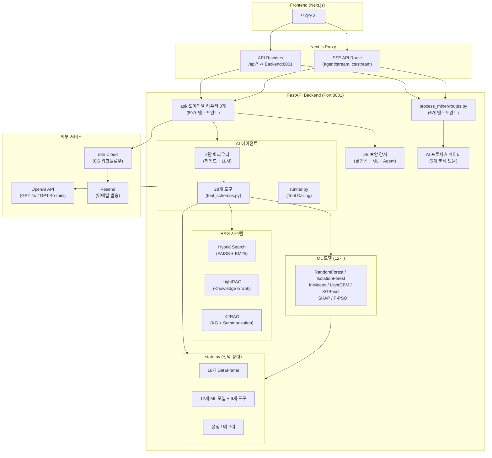

---

## 2. 기술 스택

### 프레임워크 및 런타임

| 기술 | 용도 | 비고 |
|------|------|------|
| **FastAPI** | REST API 프레임워크 | 비동기, OpenAPI 자동 문서화 |
| **Uvicorn** | ASGI 서버 | `0.0.0.0:8001` (기본 포트) |
| **Python 3.10+** | 런타임 | `match` 구문 등 3.10+ 기능 사용 |

### AI / LLM

| 기술 | 용도 | 비고 |
|------|------|------|
| **LangChain** (`langchain-openai`) | LLM 래퍼, Tool Calling | `ChatOpenAI` 기반 |
| **LangGraph** | 멀티 에이전트 그래프 | `StateGraph`, `ToolNode` |
| **OpenAI GPT-4o / GPT-4o-mini** | LLM 모델 | Tool Calling, 분류, 답변 생성 |
| **OpenAI Embeddings** | 벡터 임베딩 | `text-embedding-3-small` |

### RAG / 검색

| 기술 | 용도 | 비고 |
|------|------|------|
| **FAISS** | 벡터 검색 | 코사인 유사도 기반 |
| **rank-bm25** | 키워드 검색 | BM25 알고리즘 |
| **LightRAG** | 지식 그래프 RAG | 경량 Knowledge Graph |
| **Longformer LED** | 문서 요약 (K2RAG) | `pszemraj/led-base-book-summary` |

### ML / 데이터

| 기술 | 용도 | 비고 |
|------|------|------|
| **scikit-learn** | 분류, 클러스터링, 이상탐지 | RandomForest, K-Means, IsolationForest, DBSCAN |
| **LightGBM** | 매출 예측 | 회귀 모델 |
| **XGBoost** | 수요 예측 | 회귀 모델 |
| **SHAP** | 모델 해석 | TreeExplainer |
| **MLflow** | 실험 추적, 모델 레지스트리 | 로컬 파일 기반 |
| **Pandas / NumPy** | 데이터 처리 | DataFrame 중심 |
| **joblib** | 모델 직렬화 | `.pkl` 파일 |
| **mealpy** | 마케팅 최적화 | P-PSO 알고리즘 |

### 외부 서비스

| 기술 | 용도 | 비고 |
|------|------|------|
| **n8n Cloud** | CS 회신 워크플로우 자동화 | Webhook 트리거 |
| **Resend** | 이메일 발송 API | CS 회신, DBA 알림 |
| **EasyOCR** | 이미지 텍스트 인식 | 선택적 설치 |

---

## 3. 프로젝트 구조

```
backend 리팩토링 시작/
│
├── main.py                          # FastAPI 진입점 (lifespan 패턴, 미들웨어)
├── state.py                         # 전역 상태 관리 (DataFrame, 모델, 설정, TTL 30분/최대 1000세션)
├── Dockerfile                       # Docker 이미지 빌드 (Railway/프로덕션 배포)
├── .env                             # 환경 변수 (API 키, n8n URL 등)
├── requirements.txt                 # Python 의존성 목록
│
├── api/                             # REST API (도메인별 라우터 분리)
│   ├── common.py                    # 공통 유틸리티 (응답 형식, 인증 헬퍼)
│   ├── routes.py                    # 레거시 라우터 (하위 호환)
│   ├── routes_shop.py               # 쇼핑몰/상품 API
│   ├── routes_seller.py             # 셀러 분석 API
│   ├── routes_cs.py                 # CS/고객지원 API (X-Callback-Token 인증)
│   ├── routes_rag.py                # RAG/LightRAG/K2RAG API
│   ├── routes_ml.py                 # ML/MLflow/마케팅 API
│   ├── routes_guardian.py           # Guardian/보안감시 API
│   ├── routes_agent.py              # 에이전트/채팅 API (SSE 스트리밍)
│   └── routes_admin.py              # 관리/설정/사용자 API
│
├── agent/                           # AI 에이전트 시스템
│   ├── runner.py                    # Tool Calling 실행기 (동기/스트리밍, KEYWORD_TOOL_MAPPING)
│   ├── tools.py                     # 28개 도구 함수 구현체 (실제 비즈니스 로직)
│   ├── tool_schemas.py              # @tool 데코레이터 스키마 (LLM 바인딩용)
│   ├── router.py                    # 2단계 라우터 (키워드 분류 + LLM Router)
│   ├── intent.py                    # 인텐트 감지 (router.py와 통합된 키워드 분류)
│   ├── multi_agent.py               # LangGraph 멀티 에이전트 (Coordinator → Search/Analysis/CS)
│   ├── crag.py                      # Corrective RAG (검색 품질 평가 + 쿼리 재작성)
│   ├── semantic_router.py           # Semantic Router (레거시 카테고리 정리됨, 현재 비활성)
│   └── llm.py                       # LLM 호출 래퍼 (프롬프트 인젝션 방어, invoke_with_retry 지수 백오프)
│
├── rag/                             # RAG 시스템 (모듈 분리)
│   ├── service.py                   # RAG 파사드 (823줄, 검색 인터페이스 통합)
│   ├── chunking.py                  # 청킹 로직 (Parent-Child Chunking)
│   ├── search.py                    # 검색 엔진 (BM25, Vector, Hybrid, RAG-Fusion)
│   ├── kg.py                        # Knowledge Graph
│   ├── contextual.py                # Contextual Retrieval (LLM 컨텍스트 생성)
│   ├── light_rag.py                 # LightRAG (지식 그래프 기반 검색, 검색 캐시 Lock)
│   └── k2rag.py                     # K2RAG (ThreadPoolExecutor, 한국어 BM25 토큰화)
│
├── ml/
│   ├── train_models.py              # 합성 데이터 생성 (18개 CSV) + 12개 ML 모델 학습 + if __name__ 가드
│   ├── revenue_model.py             # 매출 예측 (LightGBM 회귀)
│   ├── marketing_optimizer.py       # 마케팅 최적화 (P-PSO 알고리즘, mealpy)
│   ├── mlflow_tracker.py            # MLflow 실험 추적 유틸리티
│   └── helpers.py                   # ML 유틸리티 함수
│
├── core/                            # 핵심 유틸리티
│   ├── constants.py                 # 상수 (플랜, 카테고리, 피처, 프롬프트, 용어)
│   ├── utils.py                     # 유틸 함수 (extract_seller_id 등 중복 통합)
│   ├── memory.py                    # 대화 메모리 관리 (세션별 최대 10턴)
│   └── parsers.py                   # 텍스트 파서 (레거시 함수 정리됨)
│
├── process_miner/                   # AI 프로세스 마이너
│   ├── __init__.py
│   ├── event_generator.py           # 데모 이벤트 로그 생성 (주문/CS/정산 3종)
│   ├── miner.py                     # 프로세스 패턴 발견 + 전이 행렬 + Mermaid 다이어그램
│   ├── bottleneck.py                # 병목 분석 (IQR 이상치, 시간대별 분포, 효율성 점수)
│   ├── predictor.py                 # 다음 활동 예측 (RandomForest, SHA256 해시 기반 모델 캐싱)
│   ├── anomaly_detector.py          # 이상 프로세스 탐지 (IsolationForest, 경로 기반)
│   ├── recommender.py               # LLM 자동화 추천 + SOP 생성 (GPT-4o-mini / 규칙 기반 fallback)
│   └── routes.py                    # 전용 API 라우터 (/api/process-miner/*)
│
├── data/
│   └── loader.py                    # 데이터 로더 (CSV 16개 -> DataFrame + ML 모델 12개 + 스케일러/인코더)
│
├── n8n/                             # n8n 워크플로우 정의
│   └── cs_reply_workflow.json       # CS 회신 자동화 워크플로우
│
├── rag_docs/                        # RAG 소스 문서 (카페24 가이드 PDF)
├── rag_faiss/                       # FAISS 인덱스 파일
├── lightrag_data/                   # LightRAG 지식 그래프 데이터
│
├── churn_model_config.json          # 이탈 예측 모델 설정 (피처, SHAP, 성능)
├── revenue_model_config.json        # 매출 예측 모델 설정
│
└── [데이터/모델 파일]
    ├── shops.csv, categories.csv     # 쇼핑몰/카테고리 (300개, 8개)
    ├── sellers.csv, seller_analytics.csv # 셀러 (300명, 쇼핑몰과 1:1)
    ├── products.csv                   # 상품 (~7,500개, 쇼핑몰당 10~40개)
    ├── services.csv                   # 서비스 (~1,200건)
    ├── operation_logs.csv             # 운영 로그 (~30,000행)
    ├── seller_activity.csv            # 셀러 일별 활동 (90일 x 300명 = 27,000건)
    ├── seller_products.csv            # 셀러-상품 매핑 (~7,500건)
    ├── seller_resources.csv           # 셀러 리소스 (300건)
    ├── daily_metrics.csv              # 일별 KPI (GMV, 활성셀러, 주문수, 90일)
    ├── cohort_retention.csv           # 코호트 리텐션 (2024-07 ~ 2024-12)
    ├── conversion_funnel.csv          # 전환 퍼널 (6개월)
    ├── shop_performance.csv           # 쇼핑몰 성과 (매출, 전환율, 300개)
    ├── cs_stats.csv                   # CS 문의/응답 데이터 (9개 카테고리)
    ├── fraud_details.csv              # 이상거래 상세 (~15건)
    ├── platform_docs.csv              # 플랫폼 문서 (12건)
    ├── ecommerce_glossary.csv         # 이커머스 용어 (14건)
    └── model_*.pkl, shap_*.pkl        # ML 모델 + SHAP + 스케일러 (20개+)
```

---

## 4. 설치 및 실행

### 사전 요구사항

- Python 3.10+
- OpenAI API Key

### 설치

```bash
# 의존성 설치
pip install -r requirements.txt

# 환경 변수 설정
cp .env.example .env
# .env 파일에 OPENAI_API_KEY 설정
```

### 데이터 및 모델 초기화

```bash
# 합성 데이터 생성 + ML 모델 학습 (최초 1회)
python ml/train_models.py
```

### 실행

```bash
# 개발 모드
uvicorn main:app --reload --port 8001

# 프로덕션
uvicorn main:app --host 0.0.0.0 --port 8001 --workers 4

# 직접 실행
python main.py  # 0.0.0.0:8001
```

### Docker

```bash
docker build -t cafe24-backend .
docker run -d -p 8000:8000 -e OPENAI_API_KEY=your_key cafe24-backend
```

> **포트 참고**: Dockerfile은 `${PORT:-8000}`을 사용합니다 (Railway 배포 호환). 로컬 개발 시에는 `uvicorn main:app --port 8001`로 8001 포트를 사용합니다.

### 기본 계정

| 사용자 | 비밀번호 | 역할 |
|--------|----------|------|
| `admin` | `admin123` | 관리자 |
| `operator` | `oper123` | 운영자 |
| `analyst` | `analyst123` | 분석가 |
| `user` | `user123` | 사용자 |

---

## 5. 전역 상태 관리 (state.py)

모든 공유 상태를 중앙에서 관리합니다.

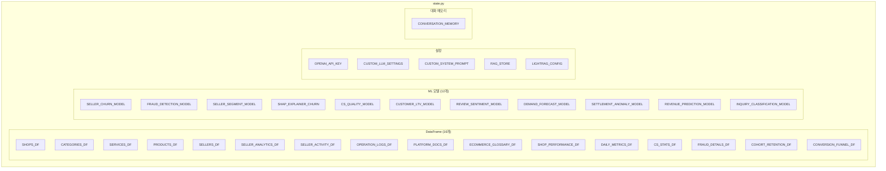

### DataFrame 상세

| 변수 | CSV 파일 | 행 수 | 설명 |
|------|----------|-------|------|
| `SHOPS_DF` | `shops.csv` | 300 | 쇼핑몰 정보 (ID, 이름, 플랜, 카테고리, 지역, 상태) |
| `CATEGORIES_DF` | `categories.csv` | 8 | 상품 카테고리 (패션~스포츠) |
| `SERVICES_DF` | `services.csv` | ~1,200 | 쇼핑몰별 서비스 (호스팅/결제/배송/마케팅) |
| `PRODUCTS_DF` | `products.csv` | ~7,500 | 상품 정보 (쇼핑몰당 10~40개) |
| `SELLERS_DF` | `sellers.csv` | 300 | 셀러 기본 정보 (쇼핑몰과 1:1 매핑) |
| `SELLER_ANALYTICS_DF` | `seller_analytics.csv` | 300 | 셀러 분석 (세그먼트, 이탈확률, SHAP) |
| `SELLER_ACTIVITY_DF` | `seller_activity.csv` | 27,000 | 셀러 일별 활동 (90일 x 300명) |
| `OPERATION_LOGS_DF` | `operation_logs.csv` | 30,000 (제한) | 운영 이벤트 로그 |
| `SHOP_PERFORMANCE_DF` | `shop_performance.csv` | 300 | 쇼핑몰 성과 KPI |
| `DAILY_METRICS_DF` | `daily_metrics.csv` | 90 | 일별 플랫폼 KPI |
| `CS_STATS_DF` | `cs_stats.csv` | 9 | CS 카테고리별 통계 |
| `FRAUD_DETAILS_DF` | `fraud_details.csv` | ~15 | 이상거래 상세 (랜덤 추출 셀러) |
| `COHORT_RETENTION_DF` | `cohort_retention.csv` | 6 | 코호트 리텐션 (2024-07~12) |
| `CONVERSION_FUNNEL_DF` | `conversion_funnel.csv` | 6 | 전환 퍼널 (등록→활성→참여→전환→잔존) |
| `PLATFORM_DOCS_DF` | `platform_docs.csv` | 12 | 플랫폼 문서 메타 |
| `ECOMMERCE_GLOSSARY_DF` | `ecommerce_glossary.csv` | 14 | 이커머스 용어 사전 |

### ML 모델 상세

| 변수 | 파일 | 알고리즘 | 용도 |
|------|------|---------|------|
| `SELLER_CHURN_MODEL` | `model_seller_churn.pkl` | RandomForest | 셀러 이탈 예측 |
| `FRAUD_DETECTION_MODEL` | `model_fraud_detection.pkl` | IsolationForest | 이상거래 탐지 |
| `INQUIRY_CLASSIFICATION_MODEL` | `model_inquiry_classification.pkl` | TF-IDF + RF | 문의 자동 분류 |
| `SELLER_SEGMENT_MODEL` | `model_seller_segment.pkl` | K-Means (5) | 셀러 세그먼트 |
| `CS_QUALITY_MODEL` | `model_cs_quality.pkl` | RandomForest | CS 응답 품질 |
| `REVENUE_PREDICTION_MODEL` | `model_revenue_prediction.pkl` | LightGBM | 매출 예측 |
| `CUSTOMER_LTV_MODEL` | `model_customer_ltv.pkl` | GradientBoosting | 고객 LTV 예측 |
| `REVIEW_SENTIMENT_MODEL` | `model_review_sentiment.pkl` | LogisticRegression | 리뷰 감성 분석 |
| `DEMAND_FORECAST_MODEL` | `model_demand_forecast.pkl` | XGBoost | 상품 수요 예측 |
| `SETTLEMENT_ANOMALY_MODEL` | `model_settlement_anomaly.pkl` | DBSCAN | 정산 이상 탐지 |
| `SHAP_EXPLAINER_CHURN` | `shap_explainer_churn.pkl` | TreeExplainer | 이탈 예측 해석 |

### 공용 도구 (스케일러/인코더)

| 변수 | 파일 | 용도 |
|------|------|------|
| `TFIDF_VECTORIZER` | `tfidf_vectorizer.pkl` | 문의 분류 텍스트 벡터화 |
| `TFIDF_VECTORIZER_SENTIMENT` | `tfidf_vectorizer_sentiment.pkl` | 감성 분석 벡터화 |
| `SCALER_CLUSTER` | `scaler_cluster.pkl` | 셀러 세그먼트 정규화 |
| `LE_TICKET_CATEGORY` | `le_ticket_category.pkl` | 티켓 카테고리 인코더 |
| `LE_SELLER_TIER` | `le_seller_tier.pkl` | 셀러 등급 인코더 |
| `LE_CS_PRIORITY` | `le_cs_priority.pkl` | CS 우선순위 인코더 |
| `LE_INQUIRY_CATEGORY` | `le_inquiry_category.pkl` | 문의 카테고리 인코더 |

### 설정 변수

| 변수 | 설명 |
|------|------|
| `OPENAI_API_KEY` | API 키 (환경변수 > 파일) |
| `CUSTOM_LLM_SETTINGS` | 모델, temperature, maxTokens, timeoutMs |
| `CUSTOM_SYSTEM_PROMPT` | 사용자 수정 시스템 프롬프트 (`system_prompt.json` 영속화) |
| `LIGHTRAG_CONFIG` | top_k, context_max_chars |
| `CONVERSATION_MEMORY` | 세션별 대화 기록 (최대 10턴, TTL 30분, 최대 1000세션) |
| `CHURN_MODEL_CONFIG` | 이탈 모델 설정 (피처, SHAP, 정확도) |
| `SHOP_SERVICE_MAP` | 쇼핑몰별 서비스 캐시 |
| `CS_JOB_QUEUES` | CS 작업 큐 (TTL 기반 자동 정리) |

---

## 6. AI 에이전트 시스템

> **설계 기반**: Anthropic [Building Effective Agents](https://www.anthropic.com/research/building-effective-agents) - Routing, Tool Use, Agents 패턴을 실제 이커머스 운영에 적용. "빠른 규칙 우선 + AI fallback" 원칙을 프로젝트 전반(라우터, Guardian, CS 파이프라인)에 일관 적용.

### 6.1 아키텍처

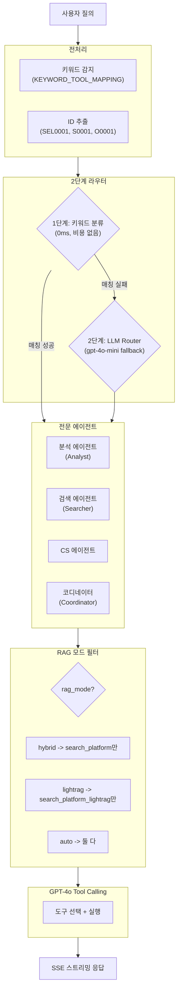

### 6.2 에이전트 상세

| 에이전트 | 역할 | 모델 | 트리거 키워드 |
|----------|------|------|--------------|
| **Analyst** | 셀러/쇼핑몰 데이터 분석 | GPT-4o-mini | 분석, 통계, 세그먼트, 이탈, 이상거래, 매출 |
| **Searcher** | 플랫폼 정보 검색 | GPT-4o-mini | 플랫폼, 정책, 정산, 가이드 |
| **CS Agent** | 셀러 문의 분류/응답 관리 | GPT-4o-mini | CS, 셀러 문의, 기술지원, 용어 |
| **Coordinator** | 복잡한 요청 조율 | GPT-4o | 기타 일반 질문, 대시보드 |

### 6.3 RAG 모드 선택

프론트엔드 설정에서 AI 에이전트의 플랫폼 지식 검색 방식을 선택합니다.

| 모드 | 도구 | 설명 | 프론트엔드 상태 |
|------|------|------|----------------|
| `hybrid` | `search_platform` | FAISS + BM25 + RRF 융합 | **활성** (기본값) |
| `lightrag` | `search_platform_lightrag` | 지식 그래프 기반 검색 | 시험용 (비활성) |
| `k2rag` | - | KG + Sub-Q + Hybrid | 시험중 (비활성) |
| `auto` | 둘 다 | AI가 질문에 맞게 자동 선택 | 비활성 |

> **현재 상태**: 프론트엔드에서 `hybrid` 모드만 선택 가능. LightRAG(시험용), K²RAG(시험중), 자동 선택은 UI에서 비활성화됨.

**백엔드 처리 흐름:**

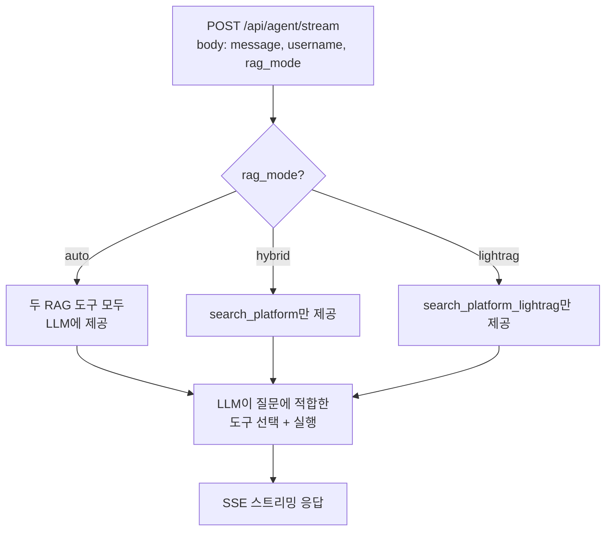

### 6.4 2단계 인텐트 라우터

> **설계 출처**: Anthropic [Building Effective Agents](https://www.anthropic.com/research/building-effective-agents) - "For complex systems, rather than letting agents decide all tools, narrow the tool set by classifying the intent first" 패턴 적용

**문제**: 28개 도구를 한 번에 노출하면 LLM이 잘못된 도구 선택 (예: 분석 질문에 RAG 호출). 도구 수가 증가할수록 Tool Calling 정확도가 하락하는 것은 LLM의 알려진 한계.

**해결**: 2단계 Router 패턴으로 도구 선택 공간을 축소. 1단계 키워드 분류(O(1), 비용 0)가 대부분의 질의를 처리하고, 분류 실패 시에만 2단계 LLM Router(gpt-4o-mini)가 fallback으로 동작. 이 패턴은 프로젝트 전반(DB 보안 감시의 룰엔진+AI Agent, CS 파이프라인의 신뢰도 분기)에서 일관되게 적용된 **"빠른 규칙 우선 + AI fallback"** 설계 원칙.

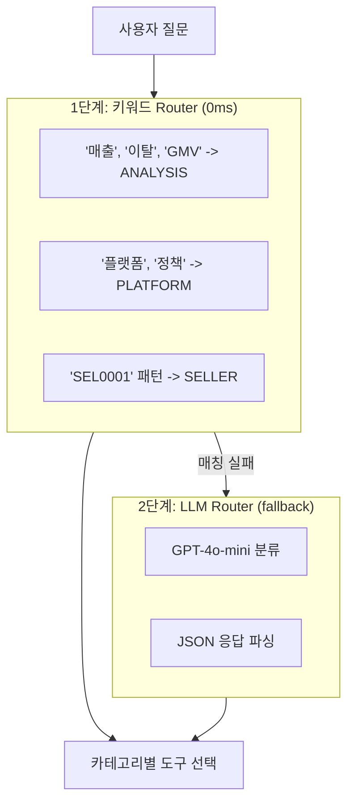

**구현 위치** (키워드 분류 로직 통합 - 중복 제거):
- `agent/router.py` - `_keyword_classify()` + `route_intent_llm()` + `classify_and_get_tools()`
- `agent/intent.py` - `detect_intent()` + `run_deterministic_tools()` (router.py와 키워드 분류 로직 통합)
- `agent/runner.py` - `KEYWORD_TOOL_MAPPING` 강제 도구 실행 + `run_agent()`

#### 6.4.1 IntentCategory (7개)

`agent/router.py`에서 정의하는 질문 의도 카테고리:

```python
class IntentCategory(str, Enum):
    ANALYSIS = "analysis"       # 매출, GMV, 이탈, DAU, 코호트, 트렌드
    PLATFORM = "platform"       # 플랫폼 정책, 기능, 운영 가이드
    SHOP = "shop"               # 쇼핑몰 정보, 서비스, 성과, 매출
    SELLER = "seller"           # 셀러 분석, 세그먼트, 부정행위 탐지
    CS = "cs"                   # CS 자동응답, 품질 검사, 문의 분류
    DASHBOARD = "dashboard"     # 대시보드, 전체 현황
    GENERAL = "general"         # 일반 대화, 인사
```

#### 6.4.2 Semantic Router (비활성)

`agent/semantic_router.py`의 `SemanticRouterCache` 클래스는 OpenAI `text-embedding-3-small` 임베딩으로 카테고리별 예시 쿼리를 사전 계산하고, 코사인 유사도로 분류하는 구조입니다. 키워드 분류의 높은 커버리지와 LLM fallback의 정확도로 인해 Semantic Router 단계를 제거하고 2단계 구조로 단순화했습니다.

#### 6.4.3 KEYWORD_TOOL_MAPPING (강제 도구 실행)

`agent/runner.py`에서 키워드 기반 **강제 도구 실행** (LLM 호출 전 선처리):

```python
KEYWORD_TOOL_MAPPING = {
    "detect_fraud": ["부정행위 탐지", "비정상 셀러", "어뷰징", ...],
    "get_fraud_statistics": ["이상거래", "이상 셀러", "부정행위 통계", ...],
    "get_segment_statistics": ["세그먼트 통계", "성장형 셀러", "휴면 셀러", ...],
    "get_order_statistics": ["운영 이벤트", "주문 이벤트", "정산 이벤트", ...],
    "predict_seller_churn": ["이탈 예측", "이탈 확률", "churn", ...],
    "optimize_marketing": ["마케팅 최적화", "광고 전략", "ROAS 최적화", ...],
    "get_trend_analysis": ["트렌드 분석", "활성 셀러", "가입 추이", ...],
    "get_cohort_analysis": ["코호트 분석", "리텐션 분석", ...],
    "get_gmv_prediction": ["매출 예측", "GMV 분석", "ARPU", ...],
    "get_churn_prediction": ["이탈 분석", "이탈 현황", "고위험 셀러", ...],
    "list_shops": ["쇼핑몰 목록", "쇼핑몰 리스트", ...],
    "list_categories": ["카테고리 목록", "업종 목록", ...],
    "get_dashboard_summary": ["대시보드", "전체 현황", ...],
    "get_cs_statistics": ["CS 통계", "상담 현황", ...],
    "classify_inquiry": ["카테고리 분류", "문의 분류", ...],
    "get_shop_performance": ["성과 분석", "쇼핑몰 성과", ...],
    # ... 총 16개 도구 매핑
}
```

**동작 방식**: 사용자 질문에 키워드 매칭 -> 매칭된 도구를 LLM 호출 전에 강제 실행 -> 결과를 LLM 컨텍스트에 전달

#### 6.4.4 파라미터 자동 추출

`agent/runner.py`에서 사용자 텍스트로부터 도구 파라미터를 자동 추출합니다:

| 함수 | 추출 대상 | 패턴 예시 |
|------|----------|----------|
| `extract_seller_id()` | 셀러 ID | `SEL0001` ~ `SEL000001` (1~6자리) |
| `extract_shop_id()` | 쇼핑몰 ID | `S0001` ~ `S000001` (4~6자리) |
| `extract_order_id()` | 주문 ID | `O0001` ~ `O00000001` (4~8자리) |
| `extract_days()` | 일수 | "최근 7일", "30일간", "지난 14일" |
| `extract_date_range()` | 날짜 범위 | `2024-01-01` ~ `2024-12-31` |
| `extract_month()` | 월 | `2024-11`, "11월" |
| `extract_risk_level()` | 위험 등급 | "고위험", "중위험", "저위험" |
| `extract_cohort()` | 코호트명 | `2024-11 W1` |

#### 6.4.5 카테고리별 도구 매핑

| 카테고리 | 키워드 | 도구 | 비고 |
|----------|--------|------|------|
| `analysis` | 매출, 이탈, GMV, 코호트, 트렌드 | `get_churn_prediction`, `get_gmv_prediction`, `get_trend_analysis`, `get_cohort_analysis` | |
| `platform` | 플랫폼, 정책, 정산, 가이드 | `search_platform`, `search_platform_lightrag` | **tool_choice="required"** |
| `shop` | 쇼핑몰, 매출, 성과, 카테고리 | `get_shop_info`, `list_shops`, `get_shop_services`, `get_shop_performance`, `predict_shop_revenue`, `optimize_marketing`, `get_category_info`, `list_categories`, `get_dashboard_summary`, `search_platform`, `search_platform_lightrag` | |
| `seller` | 셀러, SEL0001, 세그먼트, 이상 | `analyze_seller`, `predict_seller_churn`, `get_seller_segment`, `detect_fraud`, `get_fraud_statistics`, `get_segment_statistics`, `optimize_marketing`, `get_shop_performance`, `predict_shop_revenue` | |
| `cs` | CS, 문의, 상담, 용어집 | `auto_reply_cs`, `check_cs_quality`, `get_ecommerce_glossary`, `get_cs_statistics`, `classify_inquiry` | |
| `dashboard` | 대시보드, 전체 현황 | `get_dashboard_summary`, `get_segment_statistics`, `get_cs_statistics`, `get_order_statistics` | |
| `general` | 안녕, 고마워 | (도구 없음 - 직접 대화) | |

#### 6.4.6 분류 우선순위

```python
# agent/router.py - _keyword_classify()
def _keyword_classify(text: str) -> Optional[IntentCategory]:
    # 0. 셀러 ID(SEL0001) 포함 -> SELLER (최고 우선순위)
    if re.search(r'SEL\d{1,6}', text, re.IGNORECASE):
        return IntentCategory.SELLER

    # 1. 분석 키워드 (매출, 이탈, GMV, 코호트, 트렌드, 활성 셀러)
    # 2. 셀러 분석 (세그먼트 이름, 이상 셀러 등)
    # 3. 쇼핑몰 관련 (성과, 정보, 마케팅)
    # 4. CS 관련
    # 5. 대시보드 관련
    # 6. 플랫폼 관련 (정책, 기능, 용어)
    # 7. 일반 대화
    # 불확실 -> None -> LLM Router (2단계 fallback)
```

#### 6.4.7 PLATFORM 강제 RAG (tool_choice="required")

> **문제**: 플랫폼 정책 질문에서 LLM이 자체 지식으로 답변 -> 부정확/할루시네이션

> **해결**: PLATFORM 카테고리일 때 `tool_choice="required"` 적용 -> RAG 도구 강제 호출

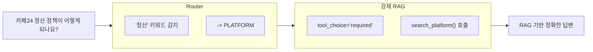

#### 6.4.8 성능 최적화

| 최적화 | 설명 |
|--------|------|
| **키워드 우선** | LLM 호출 없이 빠른 분류 (대부분 여기서 처리) |
| **KEYWORD_TOOL_MAPPING** | 키워드 매칭 -> LLM 호출 전 강제 도구 실행 |
| **LLM Fallback** | 키워드 분류 실패 시만 gpt-4o-mini 호출 |
| **RAG 스킵** | `analysis`, `seller`, `shop` 카테고리는 RAG 검색 완전 스킵 |
| **PLATFORM 강제 RAG** | `tool_choice="required"`로 LLM 자체 지식 사용 방지 |
| **GENERAL 모드** | 인사/단답은 도구 없이 직접 LLM 응답 |
| **MAX_TOOL_ITERATIONS** | 무한 루프 방지 (최대 10회) |

### 6.5 도구 함수 목록 (28개)

| # | 도구명 | 설명 | 에이전트 |
|---|--------|------|----------|
| 1 | `get_shop_info` | 쇼핑몰 정보 조회 (ID 또는 이름 검색) | Searcher |
| 2 | `list_shops` | 쇼핑몰 목록 (카테고리/티어/지역 필터) | Searcher |
| 3 | `get_shop_services` | 서비스 정보 조회 | Searcher |
| 4 | `get_category_info` | 카테고리 정보 조회 | Searcher |
| 5 | `list_categories` | 카테고리 목록 | Searcher |
| 6 | `search_platform` | Hybrid RAG 검색 (FAISS + BM25 + RRF) | Searcher |
| 7 | `search_platform_lightrag` | LightRAG 검색 (local/global/hybrid/naive 모드) | Searcher |
| 8 | `auto_reply_cs` | CS 자동 응답 (카테고리별 정책 반영) | CS Agent |
| 9 | `check_cs_quality` | CS 응답 품질 예측 (긴급/보통/낮음) | CS Agent |
| 10 | `analyze_seller` | 셀러 종합 분석 (세그먼트, 지표, 이상 여부) | Analyst |
| 11 | `get_seller_segment` | 세그먼트 예측 (K-Means 기반) | Analyst |
| 12 | `detect_fraud` | 이상거래 탐지 (IsolationForest) | Analyst |
| 13 | `get_segment_statistics` | 세그먼트별 통계 (셀러 수, 평균 GMV) | Analyst |
| 14 | `get_fraud_statistics` | 이상거래 전체 통계 | Analyst |
| 15 | `predict_seller_churn` | 개별 셀러 이탈 예측 + SHAP 해석 | Analyst |
| 16 | `get_churn_prediction` | 이탈 예측 전체 (고/중/저위험 분포) | Analyst |
| 17 | `get_cohort_analysis` | 코호트 리텐션 분석 (Week1~Week12) | Analyst |
| 18 | `get_trend_analysis` | KPI 트렌드 분석 (활성셀러, ARPU, 변화율) | Analyst |
| 19 | `get_gmv_prediction` | GMV 예측 (ARPU/ARPPU, 티어별 분포) | Analyst |
| 20 | `predict_shop_revenue` | 쇼핑몰 매출 예측 (LightGBM) | Analyst |
| 21 | `get_shop_performance` | 쇼핑몰 성과 조회 (실제 + 예측) | Analyst |
| 22 | `optimize_marketing` | P-PSO 마케팅 최적화 (최대 10개 추천) | Analyst |
| 23 | `get_seller_activity_report` | 셀러 활동 리포트 (N일간) | Analyst |
| 24 | `get_order_statistics` | 운영 이벤트 통계 (8종 이벤트 타입) | Analyst |
| 25 | `classify_inquiry` | 문의 카테고리 분류 (9개 카테고리, 신뢰도) | CS Agent |
| 26 | `get_ecommerce_glossary` | 이커머스 용어 조회 (검색 또는 전체) | CS Agent |
| 27 | `get_cs_statistics` | CS 통계 (카테고리별/채널별) | CS Agent |
| 28 | `get_dashboard_summary` | 대시보드 요약 (쇼핑몰/셀러/CS/주문) | Coordinator |

### 6.6 멀티 에이전트 시스템 (LangGraph)

`agent/multi_agent.py`에서 LangGraph `StateGraph` 기반 멀티 에이전트를 구현합니다.

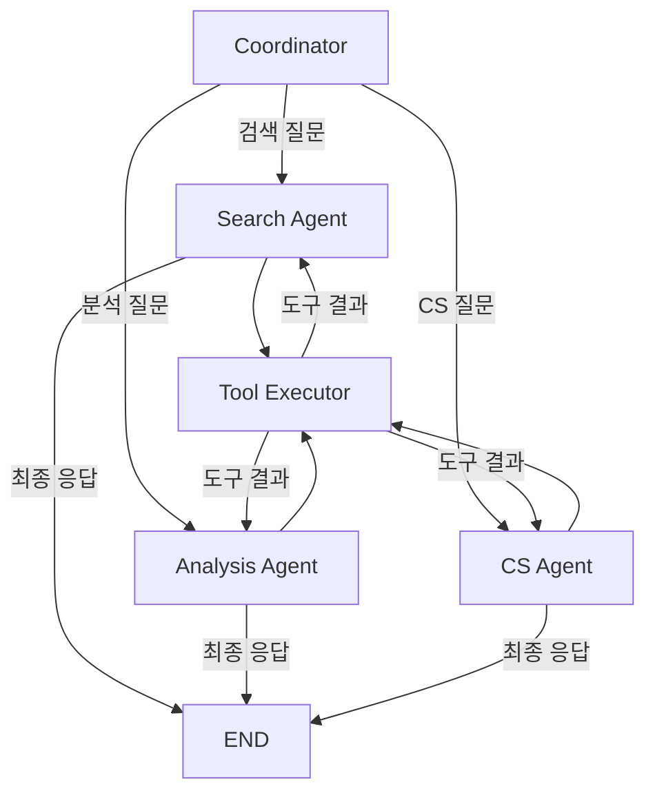

**AgentState 구조:**
```python
class AgentState(TypedDict):
    messages: Annotated[Sequence[BaseMessage], operator.add]
    next_agent: str           # 다음 에이전트 ("search"/"analysis"/"cs"/"end")
    current_agent: str        # 현재 에이전트
    tool_calls_log: List[dict] # 도구 호출 이력
    iteration: int            # 반복 횟수 (최대 3회)
    final_response: str       # 최종 응답
```

**에이전트별 도구 분류:**
- `SEARCH_AGENT_TOOLS`: 7개 (쇼핑몰/카테고리/RAG 검색)
- `ANALYSIS_AGENT_TOOLS`: 16개 (셀러 분석, ML 예측, 통계)
- `CS_AGENT_TOOLS`: 5개 (CS 응답, 품질, 용어, 분류)

**모드 선택 (`agent_mode`):**
- `"single"` (기본값): 단일 에이전트 + 다중 도구 (Tool Calling) — 실제 운영 모드
- `"multi"`: LangGraph 기반 멀티 에이전트 (langgraph 설치 필요) — Coordinator가 질의를 분석하여 Search/Analysis/CS 에이전트로 라우팅

> **참고**: 기본 운영은 single 모드로, 하나의 LLM이 2단계 라우터(키워드 + LLM)로 필터링된 도구 세트를 tool calling 방식으로 호출합니다. multi 모드는 에이전트별 독립 프롬프트 + 도구 세트로 동작하며, 실험적 기능입니다.

### 6.7 Corrective RAG (CRAG)

`agent/crag.py`에서 검색 품질을 자동 평가하고 교정하는 CRAG 패턴을 구현합니다.

> **현재 상태**: 모듈 구현 완료, 메인 파이프라인 미통합. 향후 RAG 검색 품질 개선 시 연결 예정.

> **출처**: [CRAG Paper](https://arxiv.org/abs/2401.15884)

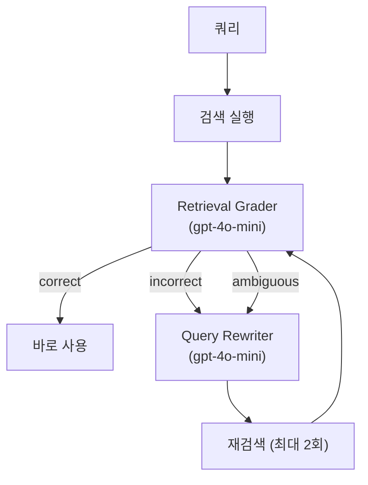

**핵심 컴포넌트:**

| 클래스 | 역할 | 모델 |
|--------|------|------|
| `RetrievalGrader` | 검색 결과 관련성 평가 (yes/no) | gpt-4o-mini (temperature=0, max_tokens=10) |
| `QueryRewriter` | 검색 실패 시 쿼리 재작성 | gpt-4o-mini (temperature=0.3, max_tokens=100) |
| `CRAGWorkflow` | 전체 워크플로우 오케스트레이션 | max_retries=2 |

**RetrievalDecision:**
- `CORRECT`: 관련성 높음 -> 바로 사용
- `INCORRECT`: 관련성 없음 -> 쿼리 재작성 후 재검색
- `AMBIGUOUS`: 애매함 -> 재검색 결과 병합

### 6.8 대화 메모리

| 설정 | 값 | 설명 |
|------|-----|------|
| `MAX_MEMORY_TURNS` | 10 | 세션당 최대 대화 턴 |
| `MEMORY_TTL_SEC` | 1800 | 대화 메모리 TTL (30분, 미사용 세션 자동 정리) |
| `MAX_SESSIONS` | 1000 | 최대 동시 세션 수 (초과 시 오래된 세션 제거) |
| `LAST_CONTEXT_TTL_SEC` | 600 | 컨텍스트 캐시 유효시간 (10분) |

```python
CONVERSATION_MEMORY = {
    "username": [
        {"role": "user", "content": "질문"},
        {"role": "assistant", "content": "답변"},
        # ... 최대 10턴, 초과 시 오래된 것부터 삭제
    ]
}
```

### 6.9 LLM 호출 모듈 (`agent/llm.py`)

LLM 호출의 안정성, 확장성, 세밀한 파라미터 제어를 담당하는 래퍼 모듈입니다.

**API 키 우선순위 체인 (`pick_api_key`):**
```
요청 헤더 api_key > state.OPENAI_API_KEY > 환경 변수 OPENAI_API_KEY
```

**프롬프트 인젝션 방어 (`_sanitize_user_input`):**
- 사용자 입력에서 시스템 프롬프트 변조 시도를 탐지/제거
- 위험한 지시어 패턴(ignore previous instructions 등) 필터링

**자동 재시도 (`invoke_with_retry`):**
- 최대 3회 재시도, 지수 백오프 (1초 → 2초 → 4초)
- `RateLimitError`, `APIConnectionError` 등 일시적 오류 자동 복구
- 3회 실패 시 마지막 예외를 상위로 전파

**고급 LLM 파라미터:**

| 파라미터 | 기본값 | 용도 |
|----------|--------|------|
| `temperature` | 0.7 | 응답 다양성 (0 = 결정적, 2 = 최대 랜덤) |
| `max_tokens` | 4096 | 최대 응답 토큰 수 |
| `top_p` | 1.0 | 누적 확률 기반 토큰 샘플링 (nucleus sampling) |
| `presence_penalty` | 0.0 | 새로운 주제 도입 장려 (-2.0 ~ 2.0) |
| `frequency_penalty` | 0.0 | 반복 억제 (-2.0 ~ 2.0) |
| `seed` | None | 재현 가능한 응답을 위한 시드 값 |

**GPT-5 호환성:**
- `model.startswith("gpt-5")` 감지 시 `temperature` 파라미터 자동 제외 (API 호환성)

**스트리밍 지원:**
- `chunk_text()`: 스트리밍 응답에서 텍스트 청크 추출
- `_tool_context_block()`: 도구 실행 결과를 구조화된 컨텍스트 블록으로 포매팅 (사용 원칙 포함)

---

## 7. RAG 시스템

### 7.1 적용 기법 요약 (8종)

단일 RAG 기법만으로는 이커머스 도메인의 다양한 질문 유형(정책 조회, 개념 설명, 절차 안내 등)을 커버하기 어렵습니다. 키워드 매칭이 강한 BM25, 의미 검색이 강한 FAISS, 관계 추론이 강한 Knowledge Graph 등 각 기법의 강점을 조합하여 검색 품질을 극대화합니다.

| # | 기법 | 효과 | 출처/논문 | 런타임 추가 | 프론트엔드 상태 |
|---|------|------|-----------|-------------|----------------|
| 1 | **Hybrid Search** (FAISS + BM25 + RRF) | 의미 + 키워드 검색 결합 | - | ~30ms | 활성 |
| 2 | **RAG-Fusion** (Multi-Query) | 4개 변형 쿼리로 리콜 향상 | - | ~50ms (LLM) | 활성 |
| 3 | **Parent-Child Chunking** | 정밀 검색(500자) + 충분한 컨텍스트(3,000자) | - | 0ms | 활성 |
| 4 | **Contextual Retrieval** | 검색 정확도 +20~35% | [Anthropic Blog](https://www.anthropic.com/news/contextual-retrieval) | 인덱싱 시 | 미적용 |
| 5 | **LightRAG** | 경량 지식그래프, 99% 토큰 절감 | [arXiv:2410.05779](https://arxiv.org/abs/2410.05779) | ~100ms | 시험용 |
| 6 | **K2RAG** | KG + Hybrid + Corpus Summarization | [arXiv:2507.07695](https://arxiv.org/abs/2507.07695) | 가변 | 시험중 |
| 7 | **CRAG** | 검색 품질 자동 교정 (Retrieval Grader + Query Rewriter) | [arXiv:2401.15884](https://arxiv.org/abs/2401.15884) | ~200ms (LLM) | 모듈 구현 완료 (미통합) |
| 8 | **Cross-Encoder Reranking** | 정밀 재순위 정확도 향상 | - | ~80ms | 비활성 |

### 7.1.1 모듈 아키텍처 (리팩토링)

기존 `service.py` 단일 파일(2,984줄)을 **파사드 패턴**으로 분리하여 유지보수성을 개선했습니다.

| 모듈 | 줄 수 | 역할 |
|------|-------|------|
| `service.py` | 823 | RAG 파사드 (검색 인터페이스 통합, content 짧을 시 parent chunk 보강) |
| `chunking.py` | - | 청킹 로직 (Parent 3,000자 / Child 500자) |
| `search.py` | - | 검색 엔진 (BM25, Vector, Hybrid, RAG-Fusion) |
| `kg.py` | - | Knowledge Graph |
| `contextual.py` | - | Contextual Retrieval (LLM 컨텍스트 생성) |

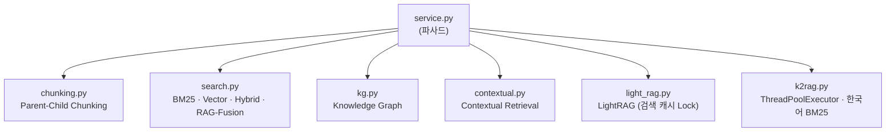

### 7.2 Hybrid Search (FAISS + BM25)

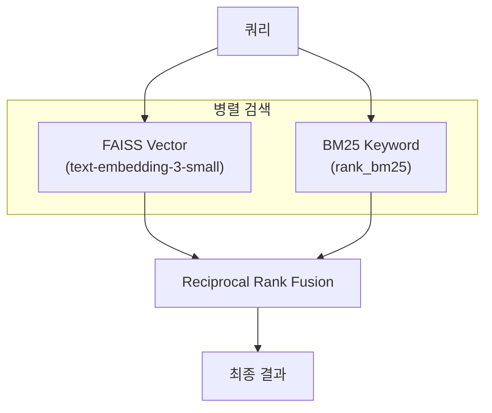

- **Vector Search**: 의미적 유사도 (코사인 거리)
- **BM25**: 정확한 키워드 매칭 (TF-IDF 기반)
- **RRF**: 두 결과를 순위 기반으로 융합

### 7.3 RAG-Fusion (Multi-Query)

단일 쿼리를 LLM으로 4개 변형 쿼리로 확장 후 병렬 검색:

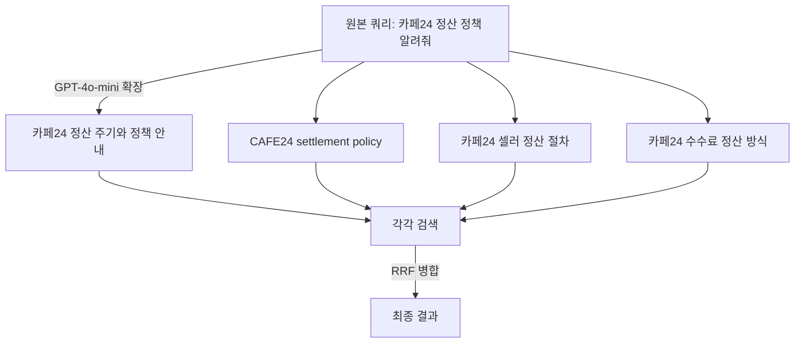

### 7.4 Contextual Retrieval

> **출처**: [Anthropic Blog](https://www.anthropic.com/news/contextual-retrieval) | 검색 정확도 +20~35%

인덱싱 시점에 각 청크에 **LLM 생성 컨텍스트**를 추가하여 검색 품질 향상:

```
원본 청크:
"정산은 매월 1일과 15일에 진행됩니다"

-> GPT-4o-mini 컨텍스트 생성

컨텍스트 추가된 청크:
"[문서: 카페24 정산 정책 가이드] [섹션: 3. 정산 주기]
이 청크는 카페24 플랫폼의 셀러 정산 주기에 대한 내용입니다.
정산은 매월 1일과 15일에 진행됩니다"
```

**구현**: `rag/contextual.py` - `_generate_contextual_prefix()`

### 7.5 Parent-Child Chunking

작은 청크(Child)로 정밀 검색, 큰 청크(Parent)로 충분한 컨텍스트 반환:

| 레벨 | 크기 | 용도 |
|------|------|------|
| **Parent** | 3,000자 | 최종 반환 (충분한 문맥). content가 짧을 시 parent chunk로 자동 보강 |
| **Child** | 500자 | 검색 인덱싱 (정밀 매칭) |

### 7.6 LightRAG (지식 그래프)

> **출처**: [LightRAG Paper](https://arxiv.org/abs/2410.05779) | 99% 토큰 절감

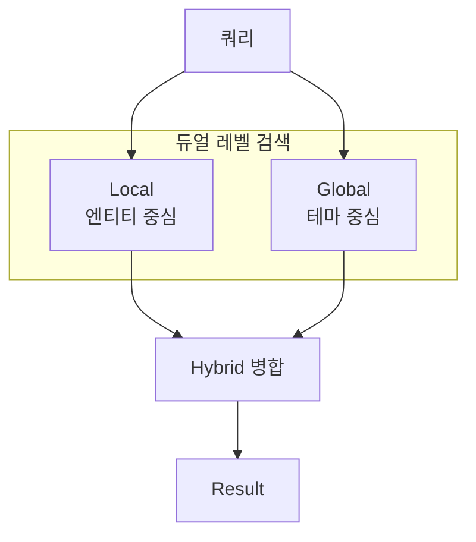

| 모드 | 용도 | 예시 |
|------|------|------|
| `local` | 구체적 엔티티 | "카페24 정산 주기는?" |
| `global` | 추상적 테마 | "카페24 플랫폼 전체 운영 정책은?" |
| `hybrid` | 조합 (권장) | 대부분의 질문 |
| `naive` | 단순 검색 | 워밍업 등 |

**성능 최적화:**

| 최적화 | 설명 |
|--------|------|
| **검색 캐싱** | TTL 5분, 최대 100개 항목, `threading.Lock` 스레드 안전성 확보 |
| **쿼리 정규화** | 대소문자/공백/물음표 통일 -> 캐시 히트율 향상 |
| **단순 쿼리 스킵** | 인사, 단답, 3글자 이하 -> RAG 호출 생략 |
| **OpenAI 클라이언트 싱글톤** | 연결 오버헤드 감소 |

### 7.7 K2RAG (개발 중)

> **출처**: [arxiv:2507.07695](https://arxiv.org/abs/2507.07695) (July 2025)

K2RAG는 Knowledge Graph + Hybrid Search + Corpus Summarization을 결합한 고급 RAG:

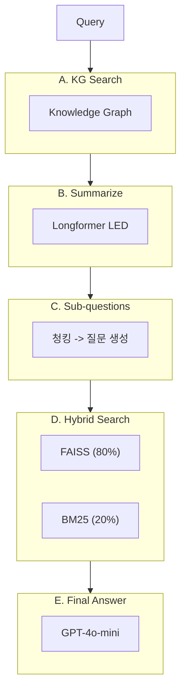

**핵심 특징:**

| 특징 | 설명 | 효과 |
|------|------|------|
| **Corpus Summarization** | 인덱싱 시 문서 요약 | 학습 시간 93% 감소 |
| **Hybrid Search** | lambda=0.8 (Dense 80% + Sparse 20%) | 정확도 + 리콜 균형 |
| **Sub-question Generation** | KG 결과에서 서브 질문 생성 | 복잡한 질문 분해 |
| **Longformer LED** | `pszemraj/led-base-book-summary` | 긴 문서 요약 (GPU 지원) |
| **ThreadPoolExecutor** | `asyncio.run()` → ThreadPoolExecutor 우회 | 이벤트 루프 충돌 방지 |
| **한국어 BM25 토큰화** | 조사 제거 + 바이그램 생성 | 한국어 검색 정확도 향상 |

### 7.8 문서 소스

`rag_docs/` 폴더의 **카페24 플랫폼 가이드 PDF**:

| 파일 | 내용 |
|------|------|
| `카페24_플랫폼_가이드.pdf` | 플랫폼 종합 가이드 |
| `카페24_정산_정책.pdf` | 정산 주기, 수수료, 정산 절차 |
| `카페24_CS_매뉴얼.pdf` | CS 응대 매뉴얼 |
| `카페24_셀러_온보딩.pdf` | 셀러 가입/쇼핑몰 개설 절차 |
| `카페24_배송_가이드.pdf` | 배송 설정, 택배사 연동 |
| `카페24_마케팅_가이드.pdf` | 프로모션, 쿠폰, 할인 설정 |
| `카페24_API_레퍼런스.pdf` | 외부 연동 API 문서 |
| `카페24_보안_정책.pdf` | 보안 가이드라인, 사기방지 |

---

## 8. ML 모델

### 8.0 왜 ML 모델을 만들었는가

카페24 플랫폼 운영에서 반복적으로 발생하는 **수작업 분석/판단**을 자동화하기 위해 10개의 ML 모델 + 마케팅 최적화 메타휴리스틱 + Guardian 이상탐지 모델을 개발했습니다. 각 모델은 실제 운영에서 직면하는 구체적 비즈니스 문제를 해결합니다.

**핵심 설계 원칙:**
- **AI 에이전트 통합**: 모든 ML 모델은 독립 실행이 아닌 AI 에이전트의 Tool Calling을 통해 호출됩니다. 사용자가 자연어로 질문하면 에이전트가 적절한 모델을 선택하여 결과를 자연어로 설명합니다.
- **MLflow 추적**: 모든 학습 실험은 MLflow에 기록되어, 프론트엔드에서 모델 버전을 선택하면 실시간으로 state.py의 모델이 교체됩니다.
- **Graceful Degradation**: LightGBM/XGBoost/SHAP 미설치 시 scikit-learn 기본 알고리즘으로 자동 대체됩니다.

**데이터 부재 해결**: 실제 카페24 데이터에 접근할 수 없으므로, `ml/train_models.py`에서 **NumPy 기반 통계적 분포**로 현실적 합성 데이터를 생성합니다 (Faker 미사용). `np.random.default_rng(42)` 시드 고정으로 재현성을 보장하며, 로그정규분포(가격/매출), 베타분포(환불률), 포아송분포(주문수) 등 도메인에 맞는 분포를 사용하여 실제 이커머스 패턴을 모사합니다.

### 8.1 모델 개요

| # | 모델 | 알고리즘 | 비즈니스 문제 | 출력 |
|---|------|---------|-------------|------|
| 1 | **셀러 이탈 예측** | RandomForest + SHAP | 이탈 위험 셀러를 사전 식별하여 선제적 리텐션 조치 | 확률 (0~1) + SHAP 원인 분석 |
| 2 | **이상거래 탐지** | Isolation Forest | 허위 주문, 리뷰 조작 등 비정상 패턴의 자동 감지 | 정상(1)/이상(-1) + 이상 점수 |
| 3 | **문의 자동 분류** | TF-IDF + RF | CS 담당자 수동 분류 업무를 자동화 (9개 카테고리) | 카테고리 + 신뢰도 |
| 4 | **셀러 세그먼트** | K-Means (5) | 셀러 행동 패턴별 맞춤 운영 전략 수립 | 클러스터 ID (0~4) |
| 5 | **매출 예측** | LightGBM | 다음 달 매출을 예측하여 리소스 배분/KPI 설정 지원 | 금액 (원) |
| 6 | **CS 응답 품질** | RandomForest | CS 문의 긴급도를 자동 판단하여 우선 처리 대상 선별 | urgent/high/normal/low |
| 7 | **고객 LTV 예측** | GradientBoosting | 고객 생애가치를 예측하여 VIP 관리/마케팅 전략 수립 | 금액 (원) |
| 8 | **리뷰 감성 분석** | TF-IDF + LogisticRegression | 상품 리뷰 감성 자동 분류로 셀러 품질 모니터링 | 긍정/부정/중립 |
| 9 | **상품 수요 예측** | XGBoost | 다음 주 주문량을 예측하여 재고 관리/프로모션 기획 | 수량 |
| 10 | **정산 이상 탐지** | DBSCAN | 정산 금액/주기의 이상 패턴을 탐지하여 오류/부정 방지 | 정상/이상 클러스터 |
| + | **마케팅 최적화** | P-PSO (mealpy) | 예산 제약 내 GMV 증가를 최대화하는 채널 조합 탐색 | 채널별 투자 추천 |

### 8.1.1 모델별 데이터 생성 방법

모든 학습 데이터는 `ml/train_models.py`에서 **NumPy random** (`np.random.default_rng(42)`)으로 생성합니다. 외부 라이브러리(Faker 등)는 사용하지 않습니다.

| # | 모델 | 학습 데이터 | 생성 방법 | 데이터 규모 |
|---|------|-----------|----------|-----------|
| 1 | 셀러 이탈 예측 | `seller_analytics_df` | 셀러 상태(active/dormant/churned)를 label로, 9개 피처(주문수, 매출, 환불률, 로그인 경과일 등)를 beta/exponential 분포로 생성 | 300명 (churned ~12%) |
| 2 | 이상거래 탐지 | `seller_analytics_df` (비지도) | 정상 셀러 데이터에서 StandardScaler 정규화 후 비지도 학습, contamination=5% | 300명 |
| 3 | 문의 자동 분류 | `CS_INQUIRY_TEMPLATES` | 9개 카테고리(배송~기타) x 10개 템플릿 x 20개 노이즈 변형 = 1,800건. TF-IDF(1000, ngram 1~2) 벡터화 | ~1,800건 |
| 4 | 셀러 세그먼트 | `seller_analytics_df` (비지도) | 6개 피처를 StandardScaler 정규화 후 K-Means(k=5) 클러스터링. 센트로이드 매출 기준으로 이름 자동 부여 | 300명 |
| 5 | 매출 예측 | 셀러별 매출 + 성장률 | `total_revenue * (1 + growth_rate) + noise`로 다음달 매출 타겟 생성. 업종/지역을 정수 인코딩 | 300건 |
| 6 | CS 응답 품질 | 합성 CS 티켓 | 7개 카테고리 x 4등급 x 6피처를 규칙 기반으로 생성 (환불+부정감성 → urgent 확률 상승 등) | 2,000건 |
| 7 | 고객 LTV | 합성 고객 데이터 | 구매횟수(Poisson), 주문금액(LogNormal), 가입일수 등으로 LTV 공식 적용 (`total * log(count) * (1-return_rate)`) | 3,000명 |
| 8 | 리뷰 감성 분석 | `REVIEW_TEMPLATES_*` | 긍정/부정/중립 각 15개 템플릿 x 30개 노이즈 변형 = 1,200건. TF-IDF(1000, ngram 1~2) 벡터화 | ~1,200건 |
| 9 | 상품 수요 예측 | 합성 주간 주문 데이터 | 4주 주문량(Poisson) + 추세/프로모션 효과로 다음주 수요 산출 | 2,000건 |
| 10 | 정산 이상 탐지 | 합성 정산 데이터 | 정상 ~950건(LogNormal 금액) + 이상 50건(고액/고수수료/장기정산) 결합 후 DBSCAN | ~1,000건 |

### 8.1.2 알고리즘 선택 근거

| 모델 | 알고리즘 | 선택 이유 |
|------|---------|----------|
| 셀러 이탈 예측 | RandomForest | 피처 중요도 해석 가능 + SHAP 호환성이 좋고, 불균형 데이터에 class_weight 적용 용이 |
| 이상거래 탐지 | Isolation Forest | 라벨 없는 비지도 학습에 적합, 고차원 데이터에서 이상치를 효율적으로 분리 |
| 문의 자동 분류 | TF-IDF + RF | 한국어 텍스트의 n-gram 패턴 포착 + 다중 클래스 분류 성능이 우수 |
| 셀러 세그먼트 | K-Means | 구현 단순, 해석 용이 (센트로이드 비교로 세그먼트 특성 파악 가능) |
| 매출 예측 | LightGBM | 범주형 피처 네이티브 지원, 빠른 학습 속도, 회귀 성능 우수 (미설치 시 GradientBoosting 대체) |
| CS 응답 품질 | RandomForest | 소규모 피처(6개)에서 안정적 성능, class_weight로 불균형 처리 |
| 고객 LTV | GradientBoosting | 비선형 관계 포착, 회귀 문제에 강건한 앙상블 |
| 리뷰 감성 분석 | LogisticRegression | TF-IDF 고차원 희소 행렬에 효율적, 다중 클래스(OvR) 지원 |
| 상품 수요 예측 | XGBoost | 시계열적 피처(주간 주문량)와 정적 피처(가격, 카테고리) 동시 처리 (미설치 시 GradientBoosting 대체) |
| 정산 이상 탐지 | DBSCAN | 클러스터 수를 사전 지정할 필요 없음, noise(-1)로 자연스럽게 이상치 분리 |

### 8.2 셀러 이탈 예측 + SHAP 해석

**비즈니스 문제**: 이커머스 플랫폼에서 셀러 이탈은 매출 직결 이슈입니다. 300명 중 약 12%가 churned 상태이며, 이탈 전 징후를 조기에 포착하면 선제적 리텐션 활동(쿠폰 발급, 전담 매니저 배정 등)이 가능합니다.

**기술적 접근**:
- **알고리즘**: RandomForest (`n_estimators=100`, `class_weight="balanced"`) -- 불균형 데이터(active 70% vs churned 12%)에서 소수 클래스 가중치 자동 조정
- **피처 엔지니어링**: 셀러 상태(active/dormant/churned)를 이진 라벨로 변환, 9개 행동/거래 피처 사용
- **모델 해석**: SHAP TreeExplainer로 개별 셀러의 이탈 원인을 피처 기여도로 분해

**이탈 모델 설정** (`churn_model_config.json`):

```json
{
  "features": [
    "total_orders", "total_revenue", "product_count",
    "cs_tickets", "refund_rate", "avg_response_time",
    "days_since_last_login", "days_since_register", "plan_tier_encoded"
  ],
  "feature_importances": {
    "total_orders": 0.357,
    "total_revenue": 0.304,
    "days_since_last_login": 0.188,
    "cs_tickets": 0.094, ...
  },
  "shap_available": true,
  "model_accuracy": 0.983,
  "model_f1": 0.933
}
```

**성능 지표**:
- **Accuracy**: 98.3% (test set 60명)
- **F1-score**: 93.3% (class_weight="balanced"로 소수 클래스 성능 확보)
- **Top 3 피처 중요도**: total_orders (35.7%) > total_revenue (30.4%) > days_since_last_login (18.8%)

**SHAP 출력 예시:**
```
SEL0123 이탈 예측: 73% (high)

피처                              SHAP     영향
--------------------------------------------------
days_since_last_login (14일)      +0.35   이탈 증가 (가장 큰 기여)
order_count (감소)                +0.22   이탈 증가
total_gmv (높음)                  -0.12   이탈 감소 (방어 요인)
```

**에이전트 연동**: `predict_seller_churn(seller_id)` Tool이 호출되면, 해당 셀러의 9개 피처를 추출하여 이탈 확률 + SHAP 기여도를 JSON으로 반환합니다. LLM이 이를 자연어로 설명합니다.

### 8.3 셀러 세그먼트 (K-Means)

**비즈니스 문제**: 300명의 셀러를 일괄적으로 관리하면 리소스 낭비가 발생합니다. 행동 패턴 기반으로 그룹화하여 세그먼트별 차별화된 운영 전략(파워 셀러에게 프리미엄 지원, 휴면 셀러에게 재활성화 프로모션 등)을 수립합니다.

**기술적 접근**:
- **피처**: total_orders, total_revenue, product_count, refund_rate, avg_response_time, days_since_last_login (6개)
- **전처리**: StandardScaler 정규화 (피처 스케일 차이 제거)
- **K=5 선정**: Silhouette Score 기반으로 최적 클러스터 수 결정
- **세그먼트 이름 자동 부여**: 센트로이드의 total_revenue를 기준으로 내림차순 정렬하여 의미 있는 이름 매핑

| ID | 세그먼트 | 특징 | 운영 전략 |
|----|----------|------|-----------|
| 0 | 성장형 셀러 (Growing Seller) | 중간 매출, 성장 가능성 | 교육 프로그램, 성장 가이드 |
| 1 | 휴면 셀러 (Dormant Seller) | 낮은 매출, 높은 환불률 (29%) | 재활성화 쿠폰, 원인 분석 |
| 2 | 우수 셀러 (Excellent Seller) | 높은 GMV (2.1억), 낮은 환불률 (8%) | 전담 매니저, 마케팅 지원 |
| 3 | 파워 셀러 (Power Seller) | 최고 GMV (2.7억), 최다 주문 (3,900+) | VIP 프로그램, 수수료 우대 |
| 4 | 관리 필요 셀러 (At-Risk Seller) | 낮은 매출, 적은 상품 수 | 긴급 개입, 이탈 방지 |

### 8.4 마케팅 최적화 (P-PSO)

**비즈니스 문제**: 마케팅 예산이 제한된 상황에서, 6개 광고 채널에 예산을 어떻게 배분해야 ROAS/매출이 최대화되는지를 결정하는 연속 최적화 문제입니다. 각 채널은 포화점(saturation point)이 있어 투자 대비 수익이 체감하므로, 단순 비례 배분이 아닌 메타휴리스틱 알고리즘을 사용합니다.

**기술적 접근**:
- **1단계 (매출 예측)**: `RevenuePredictor`(LightGBM)로 현재 셀러의 다음 달 매출 베이스라인을 예측
- **2단계 (최적화)**: mealpy 라이브러리의 P-PSO (Phasor Particle Swarm Optimization)로 6개 채널 예산 비율을 연속 변수(`FloatVar`)로 탐색
- **목적함수**: 3가지 목표 모드에 따라 ROAS 가중 / 매출 가중 / 균형 목적함수를 선택

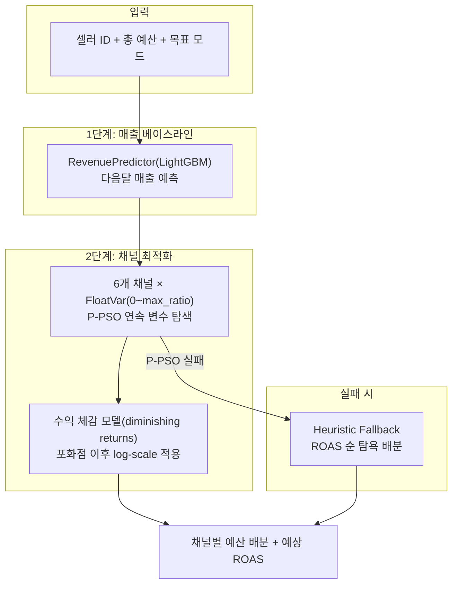

**6개 마케팅 채널** (`ml/marketing_optimizer.py`):

| 채널 | 기대 ROAS | 포화점 (saturation) | 매출 상승 계수 | 최대 예산 비율 |
|------|-----------|---------------------|---------------|---------------|
| **검색 광고** (search_ads) | 4.5x | 300만원 | 0.15 | 40% |
| **디스플레이 광고** (display_ads) | 2.8x | 500만원 | 0.08 | 30% |
| **소셜 미디어** (social_media) | 3.2x | 200만원 | 0.12 | 35% |
| **이메일 마케팅** (email_marketing) | 6.0x | 100만원 | 0.05 | 15% |
| **인플루언서** (influencer) | 2.5x | 400만원 | 0.10 | 25% |
| **콘텐츠 마케팅** (content_marketing) | 3.8x | 150만원 | 0.07 | 20% |

**수익 체감 모델 (Diminishing Returns)**:
```
예산 <= 포화점: revenue_uplift = budget × uplift_coefficient  (선형 구간)
예산 >  포화점: revenue_uplift = saturation_rev × (1 + log(budget / saturation_point))  (체감 구간)
```
포화점 이전에는 투자 금액에 비례하여 매출이 증가하지만, 포화점을 넘으면 로그 스케일로 체감합니다.

**3가지 최적화 목표 모드**:

| 모드 | 목적함수 | 적합한 상황 |
|------|---------|------------|
| `maximize_roas` | `total_revenue / total_cost` 최대화 (ROAS 가중 1.5) | 예산 효율 중시, 소규모 셀러 |
| `maximize_revenue` | `total_revenue` 최대화 (매출 가중 1.5) | 공격적 성장, 파워 셀러 |
| `balanced` | `revenue × roas` 균형 최적화 | 일반적 상황 (기본값) |

**P-PSO 파라미터:**

| 파라미터 | 값 | 설명 |
|----------|-----|------|
| `epoch` | 200 | 최적화 반복 횟수 |
| `pop_size` | 50 | 입자 수 (탐색 다양성) |
| `bounds` | `FloatVar` (0.0 ~ max_ratio) | 각 채널 예산 비율 (연속 변수) |
| `penalty` | 예산 초과 시 -999999 | 제약 조건 위반 패널티 |

**Graceful Degradation**:
- P-PSO 최적화 실패 시 → Heuristic Fallback: ROAS 내림차순으로 채널을 정렬하여 탐욕적(greedy) 배분
- 예산이 최소 채널 비용 미만 시 → Limited Budget Mode: ROAS 최상위 채널 1개에 집중 배분

### 8.5 MLflow 실험 추적

**도입 목적**: 12개 ML 모델의 학습 파라미터, 성능 메트릭, 모델 아티팩트를 체계적으로 관리하여, 모델 재학습 시 이전 실험과 비교하고 최적 버전을 선택할 수 있도록 합니다.

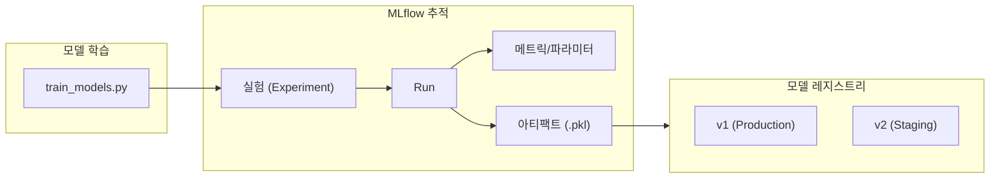

**기술 스택:**
- **저장소**: 로컬 파일 기반 (`file:./mlruns`) -- 별도 서버 불필요
- **실험명**: `cafe24-ops-ai` (단일 실험에 모든 모델 Run 집중)
- **선택적 의존성**: MLflow 미설치 시 실험 추적을 건너뛰고 joblib 직렬화만 수행

**`ml/mlflow_tracker.py` 주요 API:**

| 함수/클래스 | 설명 |
|------------|------|
| `init_mlflow()` | MLflow 초기화 + 실험 생성/조회 + `MlflowClient` 반환 |
| `start_run(run_name, tags)` | 새 실험 Run 시작 (model_type, domain 등 태그 기록) |
| `log_params(params)` | 하이퍼파라미터 로깅 (n_estimators, max_depth 등) |
| `log_metrics(metrics)` | 성능 메트릭 로깅 (accuracy, f1_score, r2_score 등) |
| `log_model_sklearn(model, path, model_name)` | sklearn 모델 아티팩트 로깅 + 레지스트리 등록 |
| `load_model_from_registry(name, version)` | 레지스트리에서 특정 버전 모델 로드 |
| `get_latest_model_version(name)` | 등록된 모델의 최신 버전 번호 조회 |
| `MLflowExperiment` | 컨텍스트 매니저 (`with` 구문으로 Run 자동 시작/종료) |

**프론트엔드 연동 (실시간 모델 교체):**

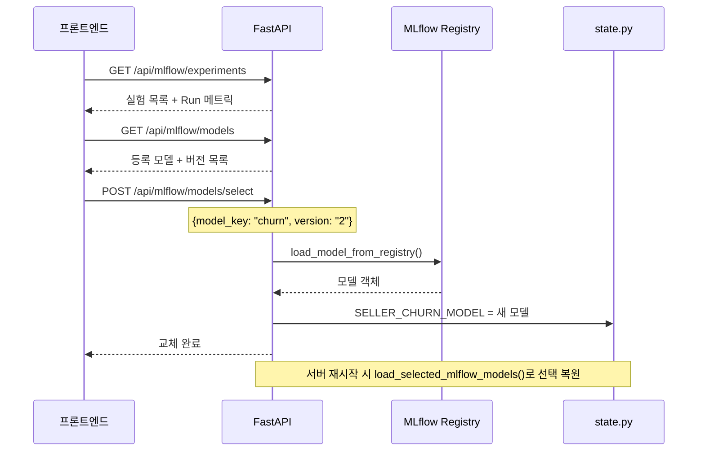

- 프론트엔드 ML모델 패널에서 실험/모델 목록을 조회하고 버전을 선택
- 선택 즉시 state.py의 글로벌 모델 변수가 교체되어 다음 API 호출부터 새 모델 적용
- 선택 상태는 파일에 영속화되어 서버 재시작 후에도 유지

### 8.6 매출 예측 모듈 상세 (RevenuePredictor)

`ml/revenue_model.py`의 `RevenuePredictor` 클래스는 개별 쇼핑몰의 다음 달 매출을 예측하는 독립 모듈입니다. 마케팅 최적화(8.4)의 베이스라인 매출 계산에도 사용됩니다.

**핵심 설계:**
- **싱글턴 패턴**: `get_predictor()` 함수로 전역 인스턴스를 1회만 생성하여, 서버 전체에서 동일한 모델 객체를 재사용합니다
- **Auto-Training**: 서버 시작 시 `data/loader.py`에서 `shop_performance.csv`가 존재하면 자동으로 학습을 수행합니다
- **MLflow 연동**: 학습 완료 시 자동으로 MLflow에 등록되어 프론트엔드에서 버전 관리가 가능합니다

**7개 입력 피처:**

| # | 피처 | 설명 | 데이터 증강 시 영향 가중치 |
|---|------|------|--------------------------|
| 1 | `monthly_revenue` | 현재 월 매출 | 0.30 |
| 2 | `monthly_orders` | 월간 주문 수 | 0.25 |
| 3 | `monthly_visitors` | 월간 방문자 수 | 0.15 |
| 4 | `avg_order_value` | 평균 주문 금액 | 0.20 |
| 5 | `customer_retention_rate` | 고객 재구매율 | 0.25 |
| 6 | `conversion_rate` | 전환율 | 0.20 |
| 7 | `review_score` | 리뷰 평점 | 0.10 |

**합성 데이터 증강 전략** (`_generate_synthetic_data()`):
```
target_revenue = sum(feature[i] × impact_weight[i]) × (1 + noise)
noise ~ Uniform(-0.1, +0.1)
```
각 피처에 도메인 기반 영향 가중치를 적용하여 현실적인 매출 타겟을 생성합니다. 이 방식으로 실제 데이터가 부족한 상황에서도 모델 학습이 가능합니다.

**모델 사양:**
- **알고리즘**: LightGBM Regressor (`n_estimators=100`, `max_depth=4`, `learning_rate=0.1`)
- **검증**: 5-Fold Cross-Validation (R2 score)
- **배치 예측**: `predict_batch(df)` 메서드로 전체 쇼핑몰 일괄 예측 지원

### 8.7 에이전트 도구 레지스트리 (28개 Tool)

모든 ML 모델은 `agent/tool_schemas.py`의 `ALL_TOOLS` 리스트에 등록되어, AI 에이전트의 Tool Calling을 통해 호출됩니다. 사용자가 자연어로 질문하면 2단계 인텐트 라우터(키워드 + LLM fallback)가 적절한 도구를 선택합니다.

| 카테고리 | 도구명 | ML 모델 | 설명 |
|---------|--------|---------|------|
| **쇼핑몰** | `get_shop_info` | - | 쇼핑몰 정보 + 성과 KPI 조인 조회 |
| | `list_shops` | - | 카테고리/플랜/지역 필터링 목록 |
| | `get_shop_services` | - | 쇼핑몰별 이용 서비스 조회 |
| | `get_shop_performance` | - | 쇼핑몰 성과 KPI 상세 |
| **카테고리** | `get_category_info` | - | 상품 카테고리 정보 (ID/이름 검색) |
| | `list_categories` | - | 전체 카테고리 목록 |
| **CS** | `auto_reply_cs` | - | CS 자동 응답 초안 생성 (LLM 연계) |
| | `check_cs_quality` | RandomForest | CS 티켓 우선순위 예측 + 권장사항 |
| | `get_cs_statistics` | - | CS 카테고리별 통계 집계 |
| | `get_ecommerce_glossary` | - | 이커머스 용어 검색 (부분 매칭) |
| **셀러 분석** | `analyze_seller` | - | 셀러 운영 데이터 종합 분석 |
| | `get_seller_segment` | K-Means | 셀러 세그먼트 분류 (ID 또는 피처) |
| | `detect_fraud` | IsolationForest | 이상거래 탐지 (기록 조회 + 실시간) |
| | `get_segment_statistics` | K-Means | 세그먼트별 평균 매출/주문/환불률 |
| | `get_fraud_statistics` | - | 전체 이상거래 유형별 통계 |
| **운영 로그** | `get_order_statistics` | - | 이벤트 유형별 통계 + 일별 추이 |
| | `get_seller_activity_report` | - | 셀러 활동 리포트 (2개 데이터소스 폴백) |
| **문의 분류** | `classify_inquiry` | TF-IDF + RF | CS 문의 텍스트 자동 분류 (Top-3 확률) |
| **RAG** | `search_platform` | - | FAISS 벡터 검색 |
| | `search_platform_lightrag` | - | LightRAG 듀얼 레벨 검색 |
| **대시보드** | `get_dashboard_summary` | - | 플랫폼 전체 운영 현황 종합 |
| **예측 분석** | `get_churn_prediction` | RandomForest+SHAP | 이탈 위험 셀러 목록 + SHAP 요인 분석 |
| | `get_gmv_prediction` | - | 월간 GMV 예측 + 플랜별 매출 분포 |
| | `get_cohort_analysis` | - | 코호트 리텐션 분석 (와이드 포맷) |
| | `get_trend_analysis` | - | KPI 트렌드 + 상관관계 분석 |
| **ML 예측** | `predict_seller_churn` | RandomForest+SHAP | 개별 셀러 이탈 확률 + SHAP 해석 |
| | `predict_shop_revenue` | LightGBM | 쇼핑몰 다음달 매출 예측 + 성과 분석 |
| | `optimize_marketing` | P-PSO | 마케팅 예산 최적 배분 (6채널) |

**Heuristic Fallback 패턴**: `predict_seller_churn`은 ML 모델 미로드 시 규칙 기반 스코어링(접속 경과일, 주문수, 매출, 환불률, CS 건수 가중합)으로 대체 작동합니다.

---

## 9. 데이터 생성

### 9.1 합성 데이터 생성 (train_models.py)

> 데이터 생성의 배경과 설계 원칙은 [8.0 왜 ML 모델을 만들었는가](#80-왜-ml-모델을-만들었는가) 참조. 이 섹션에서는 생성되는 CSV 파일 스펙과 데이터 분포 규칙을 상세 기술합니다.

```bash
python ml/train_models.py
# PART 1: 설정 및 환경
# PART 2: 데이터 생성 (18개 CSV)
# PART 3: 모델 학습 (12개 ML 모델)
# PART 4: 저장 및 테스트 (+ Guardian 이상탐지 모델)
```

### 9.2 생성되는 CSV 파일 (18개)

| # | 파일명 | 행 수 | 설명 | 주요 분포/규칙 |
|---|--------|-------|------|---------------|
| 1 | `shops.csv` | 300 | 쇼핑몰 정보 (이름, 플랜, 카테고리, 지역, 상태) | active 70% / dormant 18% / churned 12% |
| 2 | `categories.csv` | 8 | 상품 카테고리 (패션~스포츠) | 고정 데이터 |
| 3 | `services.csv` | ~1,200 | 쇼핑몰별 서비스 (호스팅/결제/배송/마케팅) | 쇼핑몰당 2~6개 |
| 4 | `products.csv` | ~7,500 | 상품 정보 (이름, 가격, 카테고리) | 가격: LogNormal, 쇼핑몰당 10~40개 |
| 5 | `sellers.csv` | 300 | 셀러 기본 정보 (쇼핑몰과 1:1 매핑) | `S0001` → `SEL0001` |
| 6 | `operation_logs.csv` | ~30,000 | 운영 이벤트 로그 (8종 이벤트) | 셀러 상태별 로그 수 차등 |
| 7 | `seller_analytics.csv` | 300 | 셀러 분석 (세그먼트, 이탈확률, SHAP) | 모델 학습 후 예측값 기록 |
| 8 | `shop_performance.csv` | 300 | 쇼핑몰 성과 (매출, 전환율, 방문수) | 상태별 차등 분포 |
| 9 | `daily_metrics.csv` | 90 | 일별 플랫폼 KPI (90일간) | 주말 효과 1.12배 |
| 10 | `cs_stats.csv` | 9 | CS 카테고리별 통계 | 9개 카테고리 집계 |
| 11 | `fraud_details.csv` | ~15 | 이상거래 상세 (랜덤 추출 셀러) | 4종 이상 유형 |
| 12 | `cohort_retention.csv` | 6 | 코호트 리텐션 (2024-07~12) | Week1~12 감쇠 패턴 |
| 13 | `conversion_funnel.csv` | 6 | 전환 퍼널 (등록→활성→참여→전환→잔존) | 단계별 이탈률 반영 |
| 14 | `seller_activity.csv` | 27,000 | 셀러 일별 활동 (300명 x 90일) | 상태별 활동 승수 적용 |
| 15 | `platform_docs.csv` | 12 | 플랫폼 문서 메타데이터 | 고정 데이터 |
| 16 | `ecommerce_glossary.csv` | 14 | 이커머스 용어 사전 | 고정 데이터 |
| 17 | `seller_products.csv` | ~7,500 | 셀러-상품 매핑 | products.csv 기반 |
| 18 | `seller_resources.csv` | 300 | 셀러 리소스 (스토리지, API 호출, 마케팅 예산) | 플랜별 쿼터 차등 |

### 9.3 데이터 생성 규칙

#### 쇼핑몰/셀러 상태별 데이터 분포

셀러 데이터는 쇼핑몰 상태(active/dormant/churned)에 따라 현실적 차등을 적용합니다:

| 피처 | active | dormant | churned |
|------|--------|---------|---------|
| `total_orders` | 100~5,000 | 50~800 | 5~200 |
| `total_revenue` | 주문수 x 25,000~120,000 | 주문수 x 20,000~90,000 | 주문수 x 15,000~80,000 |
| `last_login` 경과 | 0~7일 | 14~60일 | 가입일+α (오래 전) |
| `refund_rate` | Beta(2,20) 평균 ~9% | Beta(3,10) 평균 ~23% | Beta(3,10) |
| `avg_response_time` | Exponential(4)+0.5 | 동일 | 동일 |

#### 이벤트 로그 분포 (8종)

| 이벤트 | 가중치 | 설명 |
|--------|--------|------|
| `order_received` | 25% | 주문 접수 |
| `cs_ticket` | 15% | CS 문의 |
| `payment_settled` | 13% | 결제 정산 |
| `product_listed` | 12% | 상품 등록 |
| `product_updated` | 10% | 상품 수정 |
| `login` | 10% | 로그인 |
| `refund_processed` | 8% | 환불 처리 |
| `marketing_campaign` | 7% | 마케팅 캠페인 |

#### 이상거래 데이터

전체 300명 중 15명을 랜덤 추출하여 이상거래 플래그 부여:

| 이상 유형 | 설명 |
|----------|------|
| `high_refund` | 환불률 급증 |
| `fake_review` | 비정상 리뷰 패턴 |
| `price_manipulation` | 가격 이상 변동 |
| `unusual_volume` | 주문량 급변 |

---

## 10. API 엔드포인트

모든 API는 `/api` prefix를 사용합니다. 기존 단일 `routes.py`(4,570줄)에서 **8개 도메인별 라우터**로 분리되었습니다.

### 라우터 파일 매핑

| 라우터 파일 | 도메인 | 주요 엔드포인트 |
|------------|--------|---------------|
| `routes_shop.py` | 쇼핑몰/상품 | `/api/shops/*`, `/api/categories/*` |
| `routes_seller.py` | 셀러 분석 | `/api/sellers/*`, `/api/analysis/*` |
| `routes_cs.py` | CS/고객지원 | `/api/cs/*`, `/api/classify/*` |
| `routes_rag.py` | RAG/LightRAG/K2RAG | `/api/rag/*`, `/api/lightrag/*`, `/api/k2rag/*` |
| `routes_ml.py` | ML/MLflow/마케팅 | `/api/mlflow/*`, `/api/marketing/*` |
| `routes_guardian.py` | Guardian/보안감시 | `/api/guardian/*` |
| `routes_agent.py` | 에이전트/채팅 | `/api/agent/*` |
| `routes_admin.py` | 관리/설정/사용자 | `/api/settings/*`, `/api/users`, `/api/login` |

### API 응답 형식

모든 API 응답은 소문자 상태 코드를 사용합니다 (기존 `SUCCESS`/`ERROR`/`FAILED` → `success`/`error`로 통일):

```json
{
  "status": "success",
  "data": { ... }
}
```

### 인증/헬스

| Method | Endpoint | 설명 |
|--------|----------|------|
| POST | `/api/login` | 로그인 (Basic Auth) |
| GET | `/api/health` | 헬스체크 |

### 쇼핑몰/카테고리

| Method | Endpoint | 설명 |
|--------|----------|------|
| GET | `/api/shops` | 쇼핑몰 목록 |
| GET | `/api/shops/{id}` | 쇼핑몰 상세 |
| GET | `/api/shops/{id}/services` | 쇼핑몰 서비스 |
| GET | `/api/shops/{id}/performance` | 쇼핑몰 성과 |
| GET | `/api/categories` | 카테고리 목록 |
| GET | `/api/categories/{id}` | 카테고리 상세 |

### 셀러 분석

| Method | Endpoint | 설명 |
|--------|----------|------|
| GET | `/api/sellers/search` | 셀러 검색 |
| GET | `/api/sellers/autocomplete` | 자동완성 검색 (seller_id + shop_name 매칭, 최대 10건) |
| GET | `/api/sellers/analyze/{seller_id}` | 셀러 종합 분석 |
| GET | `/api/sellers/{seller_id}/activity` | 셀러 활동 이력 (최근 주문/CS/로그인) |
| GET | `/api/sellers/performance` | 셀러 성과 순위 (Top 100, GMV/주문수 기준) |
| POST | `/api/sellers/segment` | 세그먼트 예측 |
| POST | `/api/sellers/fraud` | 이상거래 탐지 |
| GET | `/api/sellers/segments/statistics` | 세그먼트 통계 |
| GET | `/api/users/segments/{segment_name}/details` | 세그먼트 드릴다운 (소속 셀러 목록 + 개별 지표) |

### 분석

| Method | Endpoint | 설명 |
|--------|----------|------|
| GET | `/api/analysis/anomaly` | 이상치 분석 (IsolationForest 기반 이상 메트릭 탐지) |
| GET | `/api/analysis/prediction/churn` | 이탈 예측 전체 |
| GET | `/api/analysis/prediction/churn/user/{user_id}` | 개별 이탈 예측 |
| GET | `/api/analysis/cohort/retention` | 코호트 리텐션 |
| GET | `/api/analysis/trend/kpis` | KPI 트렌드 |
| GET | `/api/analysis/correlation` | Pearson 상관관계 행렬 (KPI 간 상관계수 히트맵) |

### CS

| Method | Endpoint | 설명 |
|--------|----------|------|
| POST | `/api/cs/reply` | CS 자동 응답 |
| POST | `/api/cs/quality` | CS 응답 품질/우선순위 예측 |
| GET | `/api/cs/glossary` | 이커머스 용어집 |
| GET | `/api/cs/statistics` | CS 통계 |

### CS 자동화 파이프라인

> **문의 주체**: 셀러(쇼핑몰 운영자)가 카페24 플랫폼에 보내는 문의 (배송 연동, PG 설정, API 개발 요청, 정산 문의 등)

| Method | Endpoint | 설명 |
|--------|----------|------|
| POST | `/api/classify/inquiry` | 단건 문의 분류 (9개 카테고리, 신뢰도) |
| POST | `/api/cs/pipeline` | 5단계 파이프라인 실행 (분류->검토->답변->회신->통계) |
| POST | `/api/cs/pipeline/answer` | RAG+LLM 답변 초안 생성 (SSE 스트리밍) |
| POST | `/api/cs/send-reply` | 회신 작업 시작 (job_id 발급 + n8n 트리거) |
| GET | `/api/cs/stream` | SSE 스트림 (job_id 기반 실시간 워크플로우 상태) |
| POST | `/api/cs/callback` | n8n 콜백 수신 (X-Callback-Token 인증, 단계별 상태 보고) |

**문의 카테고리 (9개):**
`배송` / `환불` / `결제` / `상품` / `계정` / `정산` / `기술지원` / `마케팅` / `기타`

**파이프라인 흐름:**

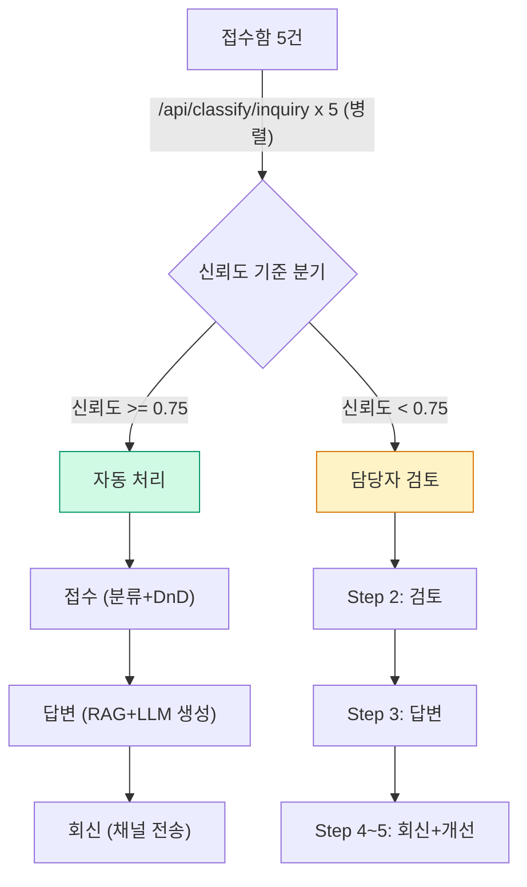

**API 엔드포인트 흐름:**

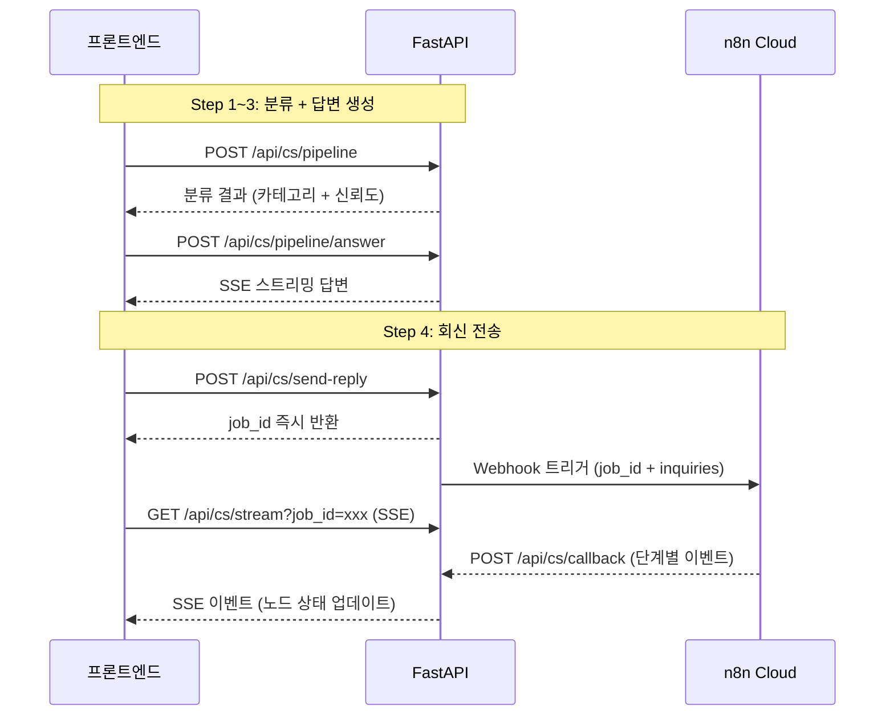

### 운영 통계

| Method | Endpoint | 설명 |
|--------|----------|------|
| GET | `/api/orders/statistics` | 주문/운영 이벤트 통계 (이벤트 유형별, 기간별) |

### 대시보드

| Method | Endpoint | 설명 |
|--------|----------|------|
| GET | `/api/dashboard/summary` | 대시보드 KPI |
| GET | `/api/dashboard/insights` | AI 인사이트 (트렌드/리텐션/CS품질/이상치 4종 동적 생성) |
| GET | `/api/dashboard/alerts` | 실시간 알림 (이상치 기반 자동 경고, severity 3단계) |
| GET | `/api/stats/summary` | 통계 요약 |

### RAG

| Method | Endpoint | 설명 |
|--------|----------|------|
| POST | `/api/rag/search` | 벡터 검색 |
| POST | `/api/rag/search/hybrid` | Hybrid Search |
| GET | `/api/rag/status` | RAG 상태 |
| GET | `/api/rag/files` | 업로드된 RAG 문서 목록 조회 |
| POST | `/api/rag/upload` | 문서 업로드 |
| POST | `/api/rag/delete` | RAG 문서 삭제 |
| POST | `/api/rag/reload` | 인덱스 재빌드 |

### LightRAG

| Method | Endpoint | 설명 |
|--------|----------|------|
| POST | `/api/lightrag/search` | LightRAG 검색 |
| POST | `/api/lightrag/search-dual` | 듀얼 검색 (모든 모드) |
| POST | `/api/lightrag/build` | 지식 그래프 빌드 |
| GET | `/api/lightrag/status` | LightRAG 상태 |
| POST | `/api/lightrag/clear` | 지식 그래프 초기화 (전체 삭제) |

### K2RAG

| Method | Endpoint | 설명 |
|--------|----------|------|
| POST | `/api/k2rag/search` | K2RAG 검색 (KG + Hybrid + Summary) |
| GET | `/api/k2rag/status` | K2RAG 상태 |
| POST | `/api/k2rag/config` | K2RAG 설정 업데이트 |
| POST | `/api/k2rag/load` | 기존 RAG 데이터 로드 |
| POST | `/api/k2rag/summarize` | 문서 요약 (Longformer LED 기반 Corpus Summarization) |

### AI 에이전트

| Method | Endpoint | 설명 |
|--------|----------|------|
| POST | `/api/agent/chat` | 동기 응답 |
| POST | `/api/agent/stream` | **SSE 스트리밍** |
| POST | `/api/agent/memory/clear` | 대화 메모리 초기화 |

#### SSE 스트리밍 상세 (`/api/agent/stream`)

**요청:**
```json
{
  "message": "이탈 예측 분석해줘",
  "username": "admin",
  "rag_mode": "auto"
}
```

**응답 헤더:**
```
Content-Type: text/event-stream
Cache-Control: no-cache
Connection: keep-alive
X-Accel-Buffering: no
```

**이벤트 흐름:**
```
event: tool_start
data: {"tool": "get_churn_prediction"}

event: tool_end
data: {"tool": "get_churn_prediction", "result": {...}}

event: delta
data: {"content": "이탈"}

event: delta
data: {"content": " 예측"}

event: done
data: {"full_response": "...", "tool_calls": ["get_churn_prediction"]}
```

**구현 메커니즘:**
- LangGraph `astream_events` (v2) 사용
- 클라이언트 연결 단절 감지: `request.is_disconnected()`
- RAG 모드에 따른 도구 필터링

### MLflow

| Method | Endpoint | 설명 |
|--------|----------|------|
| GET | `/api/mlflow/experiments` | 실험 목록 |
| GET | `/api/mlflow/models` | 모델 레지스트리 |
| POST | `/api/mlflow/models/select` | 모델 선택/적용 |
| GET | `/api/mlflow/models/selected` | 현재 선택된 모델 버전 조회 |

### 설정

| Method | Endpoint | 설명 |
|--------|----------|------|
| GET/POST | `/api/settings/llm` | LLM 설정 (모델, temperature, maxTokens, top_p, presence_penalty, frequency_penalty, seed) |
| GET | `/api/settings/default` | 기본 설정 조회 (활성 시스템 프롬프트 포함) |
| GET/POST | `/api/settings/prompt` | 시스템 프롬프트 |
| POST | `/api/settings/prompt/reset` | 프롬프트 초기화 |
| POST | `/api/settings/llm/reset` | LLM 설정 초기화 (admin 전용) |

### 프로세스 마이너

별도 라우터: `pm_router = APIRouter(prefix="/api/process-miner")`

| Method | Endpoint | 설명 |
|--------|----------|------|
| POST | `/api/process-miner/discover` | 프로세스 패턴 발견 (전이 행렬, Mermaid 다이어그램) |
| POST | `/api/process-miner/bottlenecks` | 병목 분석 (IQR 이상치, 효율성 점수, 시간대별 분포) |
| POST | `/api/process-miner/recommend` | AI 자동화 추천 (GPT-4o-mini 분석 + SOP 문서 생성) |
| POST | `/api/process-miner/predict` | 다음 활동 예측 (RandomForest, Top-3 확률) |
| POST | `/api/process-miner/anomalies` | 이상 프로세스 탐지 (IsolationForest, 경로 기반) |
| GET | `/api/process-miner/dashboard` | 3개 프로세스(주문/CS/정산) 요약 대시보드 |

### OCR

| Method | Endpoint | 설명 |
|--------|----------|------|
| POST | `/api/ocr/extract` | 이미지 텍스트 추출 (EasyOCR, 선택적 RAG 연동으로 추출 텍스트 기반 문서 검색) |
| GET | `/api/ocr/status` | OCR 모듈 사용 가능 여부 (EasyOCR 설치 상태 확인) |

### 데이터 내보내기

| Method | Endpoint | 설명 |
|--------|----------|------|
| GET | `/api/export/csv` | CSV 내보내기 (`StreamingResponse`, sellers/shops/products/cs 지원) |
| GET | `/api/export/excel` | Excel 내보내기 (openpyxl, 다중 시트 + 서식 적용) |

### 마케팅 최적화

| Method | Endpoint | 설명 |
|--------|----------|------|
| GET | `/api/marketing/seller/{seller_id}` | 셀러별 마케팅 현황 (채널별 ROI, 예산 배분) |
| POST | `/api/marketing/optimize` | P-PSO 기반 마케팅 예산 최적화 (mealpy 라이브러리) |
| GET | `/api/marketing/status` | 최적화 작업 상태 조회 (비동기 실행 결과) |

### 사용자 관리 (RBAC)

| Method | Endpoint | 설명 |
|--------|----------|------|
| GET | `/api/users` | 사용자 목록 (admin 전용) |
| POST | `/api/users` | 사용자 생성 (admin 전용, 역할: admin/manager/viewer) |

### 도구/유틸리티

| Method | Endpoint | 설명 |
|--------|----------|------|
| GET | `/api/tools` | 사용 가능한 AI 도구 목록 (28개 도구 메타데이터) |

### Pydantic 요청 모델

주요 요청 모델 (`api/common.py` 및 각 도메인 라우터):

| 모델 | 용도 | 주요 필드 |
|------|------|----------|
| `AgentRequest` | 에이전트 호출 | `user_input`, `model`, `rag_mode`, `agent_mode`, `temperature`, `max_tokens` |
| `RagRequest` | RAG 검색 | `query`, `api_key`, `top_k` |
| `CsPipelineRequest` | CS 파이프라인 | `inquiry_text`, `seller_tier`, `confidence_threshold` |
| `CsPipelineAnswerRequest` | CS 답변 생성 | `inquiry_text`, `inquiry_category`, `rag_mode` |
| `HybridSearchRequest` | Hybrid Search | `query`, `top_k`, `use_reranking`, `use_kg` |
| `K2RagSearchRequest` | K2RAG 검색 | `query`, `top_k`, `use_kg`, `use_summary` |
| `MarketingOptimizeRequest` | 마케팅 최적화 | `seller_id`, `top_n`, `budget_constraints`, `max_iterations` |

### 에러 응답 형식

모든 API는 일관된 에러 응답 형식을 사용합니다 (소문자 `error` 상태):

```json
{
  "status": "error",
  "detail": "에러 메시지",
  "error_code": "ERROR_CODE"
}
```

**주요 에러 코드:**

| HTTP | 에러 코드 | 설명 |
|------|-----------|------|
| 400 | `INVALID_REQUEST` | 잘못된 요청 파라미터 |
| 401 | `UNAUTHORIZED` | 인증 실패 |
| 404 | `SELLER_NOT_FOUND` | 셀러 ID 없음 |
| 404 | `SHOP_NOT_FOUND` | 쇼핑몰 ID 없음 |
| 500 | `MODEL_NOT_LOADED` | ML 모델 로드 실패 |
| 500 | `RAG_NOT_READY` | RAG 인덱스 미준비 |
| 500 | `OPENAI_ERROR` | OpenAI API 호출 실패 |

---

## 11. n8n 워크플로우 자동화

### 11.1 아키텍처

CS 회신 전송을 n8n Cloud 워크플로우로 자동화합니다.

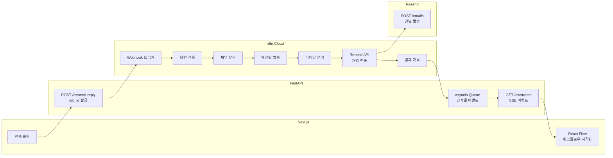

### 11.2 워크플로우 노드 (10개)

| # | 노드 | 타입 | 역할 |
|---|------|------|------|
| 1 | Webhook 트리거 | Webhook v2 | POST `/cs-reply` 수신 |
| 2 | 답변 검증 | Code | `answer_text` 존재 여부 검증 |
| 3 | 채널 분기 | Code | 채널별 문의 매핑 (`channelMap`) |
| 4 | 채널별 발송 | Code | 이메일 아이템 생성 + 결과 배열 |
| 5 | 이메일 있는지 확인 | IF v2.2 | `hasEmail === true` (loose 모드) |
| 6 | 이메일 분리 | Code | `emailItems[]` -> 개별 n8n 아이템 분리 |
| 7 | Resend 이메일 발송 | HTTP Request v4.2 | `POST /emails` 건별 호출 |
| 8 | 이메일 결과 병합 | Code | 개별 응답 수집 -> 메타데이터 병합 |
| 9 | 결과 기록 | Code | 최종 로그 생성 |
| 10 | Respond to Webhook | Respond | JSON 응답 반환 |

#### 11.2.1 노드별 상세

**노드 1: Webhook 트리거** (`n8n-nodes-base.webhook` v2)
- HTTP Method: `POST`
- Path: `/cs-reply`
- Response Mode: `responseNode` (마지막 Respond 노드에서 응답)
- 입력 Payload: `{ job_id, inquiries[], channels[] }`

**노드 2: 답변 검증** (`n8n-nodes-base.code` v2)
- `raw.body || raw`로 webhook body 추출 (n8n 버전 호환)
- `inquiries` 배열에서 `answer_text`가 비어있는 항목 필터링
- 출력: `{ job_id, inquiries: validated[], validated_count }`
- 검증 실패 시 Error throw (`Invalid payload`)

**노드 3: 채널 분기** (`n8n-nodes-base.code` v2)
- `channels[]` 배열을 순회하며 `channelMap` 객체 생성
- 각 채널(email/kakao/sms/inapp)에 해당 문의를 매핑
- 문의의 `channels` 필드와 요청의 `channels` 필드를 교차 매칭

**노드 4: 채널별 발송** (`n8n-nodes-base.code` v2)
- **이메일 채널**: Markdown -> HTML 변환 (`**bold**` -> `<strong>`, `\n` -> `<br>`), 반응형 HTML 이메일 템플릿 생성 (gradient 헤더, 문의/답변 블록, 푸터)
- **카카오/SMS/인앱 채널**: 상태만 `sent`로 기록 (실제 발송은 각 채널 API 연동 필요)
- 출력: `{ results[], emailItems[], hasEmail }`

**노드 5: 이메일 있는지 확인** (`n8n-nodes-base.if` v2.2)
- 조건: `hasEmail === true` (loose type validation)
- True -> 이메일 분리 노드로 진행
- False -> 결과 기록 노드로 바로 이동 (이메일 발송 스킵)

**노드 6: 이메일 분리** (`n8n-nodes-base.code` v2)
- `emailItems[]` 배열을 **개별 n8n 아이템**으로 분리
- n8n의 아이템 기반 처리 방식을 활용하여 다음 HTTP Request 노드가 건별로 실행되도록 함
- 빈 배열 시 `{ _skip: true }` 반환

**노드 7: Resend 이메일 발송** (`n8n-nodes-base.httpRequest` v4.2)
- URL: `https://api.resend.com/emails`
- Authentication: Header Auth (`Authorization: Bearer re_...`)
- Body: `{ from, to[], subject, html }` -- 건별 JSON
- 노드 6에서 분리된 아이템 수만큼 반복 호출

**노드 8: 이메일 결과 병합** (`n8n-nodes-base.code` v2)
- Resend API 응답(email_id, status)을 수집
- 원본 메타데이터(job_id, 채널별 결과)와 병합

**노드 9: 결과 기록** (`n8n-nodes-base.code` v2)
- 최종 처리 로그 생성 (채널별 발송 건수, 성공/실패 집계)
- FastAPI 콜백 URL로 결과 전송 준비

**노드 10: Respond to Webhook** (`n8n-nodes-base.respondToWebhook`)
- 최종 JSON 응답을 Webhook 호출자(FastAPI)에게 반환
- 응답에 job_id, 처리 결과, 채널별 상태 포함

### 11.3 Resend 이메일 발송

| 항목 | 값 |
|------|-----|
| **API** | Resend (`POST https://api.resend.com/emails`) |
| **인증** | Header Auth (`Authorization: Bearer re_...`) |
| **발신자** | `CAFE24 CS <onboarding@resend.dev>` |
| **전송 방식** | 개별 전송 (건별 HTTP Request) |
| **무료 한도** | 100건/일, 3,000건/월 |

### 11.4 SSE 단계별 이벤트

```
event: step  ->  { node: "validate", status: "running" }
event: step  ->  { node: "validate", status: "completed", detail: "2건 검증 완료" }
event: step  ->  { node: "router",   status: "completed", detail: "1개 채널" }
event: step  ->  { node: "channel_email", status: "completed", detail: "2건 전송" }
event: step  ->  { node: "log",      status: "completed", detail: "이력 저장 완료" }
event: done  ->  { total: 2, channels: ["email"] }
```

### 11.5 n8n 워크플로우 설정

1. `n8n/cs_reply_workflow.json`을 n8n Cloud에 Import
2. "Resend 이메일 발송" 노드에 Header Auth credential 연결
   - Name: `Authorization`
   - Value: `Bearer {RESEND_API_KEY}`
3. 워크플로우 Activate (Publish)

---

## 12. 환경 설정

### 환경 변수

| 변수 | 필수 | 설명 |
|------|------|------|
| `OPENAI_API_KEY` | O | OpenAI API 키 (`openai_api_key.txt`로 대체 가능) |
| `MLFLOW_TRACKING_URI` | | MLflow 경로 (기본: `file:./mlruns`) |
| `MLFLOW_EXPERIMENT_NAME` | | 실험 이름 (기본: `cafe24-ops-ai`) |
| `N8N_WEBHOOK_URL` | | n8n Cloud 웹훅 URL (미설정 시 시뮬레이션 fallback) |
| `N8N_CALLBACK_URL` | | n8n -> FastAPI 콜백 URL (미설정 시 replay 모드) |
| `RESEND_API_KEY` | | Resend 이메일 API 키 (n8n credential에 설정) |

### LLM 기본 설정

| 설정 | 기본값 |
|------|--------|
| `selectedModel` | `gpt-4o-mini` |
| `temperature` | `0.3` |
| `maxTokens` | `8000` |
| `timeoutMs` | `30000` |

### RAG 설정

| 설정 | 기본값 |
|------|--------|
| `RAG_EMBED_MODEL` | `text-embedding-3-small` |
| `RAG_DEFAULT_TOPK` | `5` |
| `RAG_SNIPPET_CHARS` | `1200` |
| `LIGHTRAG_TOP_K` | `3` |

### Startup 초기화 순서

서버 시작 시 `lifespan` 패턴(`@asynccontextmanager`)에서 실행되는 초기화 순서입니다. 기존 `@app.on_event("startup")` 방식에서 FastAPI 권장 lifespan 패턴으로 전환하였으며, 스택트레이스 클라이언트 노출을 제거했습니다. 실패 허용 단계(RAG, LightRAG)와 필수 단계(데이터/모델)를 구분하여, RAG 인덱스가 없어도 서버는 정상 기동됩니다.

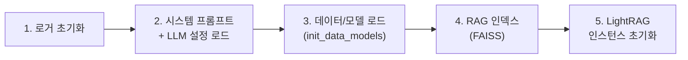

| 단계 | 함수 | 설명 | 실패 시 |
|------|------|------|---------|
| 1 | `setup_logging()` | 로거 설정, PID 기록 | 서버 중단 |
| 2 | `load_system_prompt()` + `load_llm_settings()` | `system_prompt.json` / `llm_settings.json`에서 복원 | 기본값 사용 |
| 3 | `init_data_models()` | CSV 18개 + ML 모델 12개 + SHAP + 스케일러/인코더 + Guardian 모델 로드 | **서버 중단** (핵심 데이터) |
| 4 | `rag_build_or_load_index()` | FAISS 인덱스 생성/로드 (rag_docs/ PDF -> 청킹 -> 임베딩) | 경고 후 계속 |
| 5 | LightRAG 초기화 | 인스턴스 로드 (워밍업은 OpenAI rate limit 방지로 스킵) | 경고 후 계속 |

**데이터 로더 상세** (`data/loader.py` - `load_all_data()`):
| 단계 | 내용 | 수량 | 비고 |
|------|------|------|------|
| 1. CSV 데이터 | 기본 9종 + 분석 7종 | **16개** | `operation_logs`는 `nrows=30000` 메모리 제한 |
| 2. ML 모델 | 핵심 6개 + 신규 6개 | **12개** pkl | `load_model_safe()`로 파일 없어도 None 반환 |
| 3. 공용 도구 | TF-IDF 2개 + Scaler 1개 + LabelEncoder 4개 | **7개** pkl | |
| 4. 매출 예측 | `RevenuePredictor` 싱글턴 auto-training | 1개 | `shop_performance.csv` 기반 LightGBM |
| 5. 마케팅 최적화 | `MarketingOptimizer` import 확인 | 1개 | `mealpy` 없으면 비활성화 |
| 6. 캐시 구성 | `build_caches()` 쇼핑몰-서비스 매핑 | - | |
| 7. 시스템 상태 | `SYSTEM_STATUS` 업데이트 | - | 11개 모델 중 1+ 로드 시 `True` |
| 8. MLflow 복원 | 프론트엔드 선택 모델 버전 재적용 | - | YAML 영속화, Windows/Linux 감지 |

---

## 13. Core 모듈

`core/` 폴더는 프로젝트 전반에서 사용되는 핵심 유틸리티를 제공합니다.

### 13.1 constants.py

| 상수 | 설명 |
|------|------|
| `PLAN_TIERS` | 쇼핑몰 플랜 등급 (`Basic`, `Standard`, `Premium`, `Enterprise`) |
| `SHOP_CATEGORIES` | 쇼핑몰 카테고리 (패션, 뷰티, 식품, 전자기기, 생활용품, IT서비스, 교육, 스포츠) |
| `SELLER_REGIONS` | 셀러 지역 (서울, 경기, 인천, 부산, 대구, 대전, 광주, 제주) |
| `PAYMENT_METHODS` | 결제 수단 (카드, 간편결제, 계좌이체, 가상계좌, 휴대폰결제) |
| `ORDER_STATUSES` | 주문 상태 (주문완료~취소, 8단계) |
| `ECOMMERCE_TERMS` | 이커머스 핵심 용어 (GMV, CVR, AOV, ROAS, SKU, LTV, CAC 등 14개) |
| `FEATURE_COLS_*` | ML 피처 컬럼 정의 (CS 품질 6개, 세그먼트 6개, 이탈 9개) |
| `FEATURE_LABELS` | 피처 한글 라벨 매핑 |
| `ML_MODEL_INFO` | 모델 메타데이터 (이름, 알고리즘, 메트릭) |
| `SELLER_SEGMENT_NAMES` | 세그먼트 이름 (0:성장형, 1:휴면, 2:우수, 3:파워, 4:관리필요) |
| `CS_TICKET_CATEGORIES` | CS 티켓 카테고리 |
| `CS_PRIORITY_GRADES` | CS 우선순위 등급 |
| `DEFAULT_SYSTEM_PROMPT` | 기본 시스템 프롬프트 |
| `CS_SYSTEM_PROMPT` | CS 응답 전용 프롬프트 |
| `SUMMARY_TRIGGERS` | 요약 트리거 키워드 |
| `RAG_DOCUMENTS` | RAG 문서 키워드 매핑 |

#### 13.1.1 시스템 프롬프트 통합 아키텍처

백엔드에서 시스템 프롬프트를 중앙 관리하고, 프론트엔드에서 실시간 수정할 수 있는 구조입니다.

```mermaid
flowchart LR
    subgraph Backend["Backend"]
        C["constants.py<br/>DEFAULT_SYSTEM_PROMPT"]
        S["state.py<br/>CUSTOM_SYSTEM_PROMPT<br/>(system_prompt.json 영속화)"]
        G["get_active_system_prompt()<br/>custom 있으면 custom,<br/>없으면 default 반환"]
        R["runner.py<br/>SystemMessage(content=prompt)"]
    end

    subgraph API["REST API"]
        A1["GET /api/settings/prompt<br/>현재 프롬프트 조회"]
        A2["POST /api/settings/prompt<br/>프롬프트 수정"]
        A3["POST /api/settings/prompt/reset<br/>기본값 복원"]
    end

    subgraph Frontend["Frontend"]
        F["프롬프트 에디터<br/>(실시간 수정)"]
    end

    C --> G
    S --> G
    G --> R
    G --> A1
    A2 --> S
    A3 --> S
    F --> A1 & A2 & A3
```

**흐름:**

1. **기본 프롬프트**: `constants.py`의 `DEFAULT_SYSTEM_PROMPT`에 도구 매핑 규칙, KaTeX 수식 규칙, 분석 가이드라인 등을 정의
2. **커스텀 프롬프트**: `state.py`의 `CUSTOM_SYSTEM_PROMPT`에 사용자 수정 프롬프트 저장 (변경 시 `system_prompt.json`에 영속화)
3. **프롬프트 선택**: `get_active_system_prompt()` — 커스텀이 있으면 커스텀, 없으면 기본 프롬프트 반환
4. **에이전트 적용**: `runner.py`에서 `SystemMessage(content=prompt)`로 LLM에 전달
5. **서버 재시작 복원**: `main.py` startup에서 `load_system_prompt()` 호출하여 `system_prompt.json`에서 복원

**KaTeX 수식 지원**: `DEFAULT_SYSTEM_PROMPT`에 KaTeX 렌더링 규칙이 포함되어 있어, AI 응답에서 `$...$` (인라인), `$$...$$` (블록) 수식을 사용할 수 있습니다. 프론트엔드의 KaTeX 렌더러와 연동됩니다.

### 13.2 utils.py

| 함수 | 설명 |
|------|------|
| `safe_str(obj)` | None-safe 문자열 변환 (NaN 처리 포함) |
| `safe_int(obj, default)` | None-safe 정수 변환 |
| `json_sanitize(obj)` | LangChain 객체 -> JSON 직렬화 가능 형태 |
| `format_openai_error(e)` | OpenAI 에러를 딕셔너리로 변환 |
| `normalize_model_name(name)` | 모델명 정규화 |

### 13.3 memory.py

대화 메모리 관리:

| 함수 | 설명 |
|------|------|
| `append_memory(username, user_text, response)` | 메모리에 대화 추가 |
| `clear_memory(username)` | 특정 유저 메모리 초기화 |
| `memory_messages(username)` | 메모리 조회 (LangChain 메시지 형식) |

### 13.4 parsers.py

텍스트 파싱 유틸리티:

| 함수 | 설명 |
|------|------|
| `extract_top_k_from_text(text)` | "상위 10개", "top 5" 등에서 k 추출 (최대 MAX_TOPN) |
| `parse_date_range_from_text(text)` | "2024-01-01부터 2024-03-31까지" 날짜 범위 파싱 |
| `extract_user_id(text)` | `U0001` 패턴 유저 ID 추출 |
| `_norm_key(s)` | 문자열 정규화 (공백 제거, 소문자) |

---

## 14. DB 보안 감시 (Data Guardian)

### 14.1 개발 배경

이커머스 운영 환경에서 **실수로 인한 대량 데이터 삭제/수정**은 치명적인 비즈니스 손실로 이어진다.

실제 사고 사례:
- 신입 개발자가 `WHERE` 조건 없이 `DELETE FROM orders` 실행 -> 주문 데이터 전체 소실
- 야간 배치 작업 중 정산 테이블 `UPDATE` 시 조건 오류 -> 금액 필드 일괄 0원 처리
- 카테고리 정리 스크립트에서 `products` 테이블 200건 실수 삭제

### 14.2 설계 철학: 왜 멀티 에이전트가 아닌가

초기 설계안은 4개의 에이전트(Watcher, Guard, Recovery, Supervisor)로 구성된 멀티 에이전트 시스템이었으나, 다음 이유로 **단일 에이전트 + 룰엔진 2레이어 구조**로 변경했다:

| 초기 설계 (멀티 에이전트) | 문제점 | 최종 설계 |
|--------------------------|--------|-----------|
| 모든 쿼리에 LLM 호출 | 1~3초 레이턴시 -> 실시간 차단 불가 | **룰엔진 1차 필터 (<1ms)** -> 고위험만 LLM |
| 4개 에이전트 간 통신 | 복잡도 증가, 장애 포인트 증가 | **1 에이전트 + 4 Tools** |
| Recovery Agent 자동 실행 | 복구 SQL 자동 실행은 2차 사고 위험 | **복구 SQL "제안"만** (DBA 승인 필요) |
| Supervisor 에이전트 | 에이전트를 감시하는 에이전트는 over-engineering | 삭제 |

### 14.3 아키텍처

```mermaid
flowchart TD
    A["쿼리 요청"] --> M{"감시 모드"}
    M -->|"rule"| B{"1단계: 룰엔진<br/>< 1ms"}
    M -->|"ml"| ML{"1단계: ML 이상탐지<br/>~50ms"}
    M -->|"rule+ml"| B & ML

    B -->|"pass / warn"| C["즉시 응답"]
    B -->|"block"| D["2단계: AI Agent<br/>3~8초"]
    ML -->|"score <= 0.4"| C
    ML -->|"score > 0.7"| D
    ML -->|"0.4~0.7"| W["경고"]

    D --> T1["Tool 1: analyze_impact<br/>영향도 분석"]
    D --> T2["Tool 2: get_user_pattern<br/>사용자 패턴 조회"]
    D --> T3["Tool 3: search_similar<br/>유사 사례 검색"]
    D --> T4["Tool 4: execute_decision<br/>차단/승인 판단"]
    T1 & T2 & T3 & T4 --> E{"최종 판단"}
    E -->|"차단 유지"| F["차단 로그 기록"]
    E -->|"DBA 승인 요청"| G["Resend 이메일 알림"]

    style M fill:#e0e7ff,stroke:#4f46e5
    style B fill:#fef3c7,stroke:#d97706
    style ML fill:#dbeafe,stroke:#3b82f6
    style D fill:#e0e7ff,stroke:#4f46e5
    style F fill:#fee2e2,stroke:#dc2626
    style G fill:#fef3c7,stroke:#d97706
```

### 14.4 1단계: 룰엔진 (<1ms)

모든 쿼리는 먼저 룰엔진을 통과한다. LLM 호출 없이 **O(1) 조건 분기**로 즉시 판단:

| 규칙 | 조건 | 판정 |
|------|------|------|
| DDL 차단 | `DROP`, `TRUNCATE`, `ALTER` | block |
| 핵심 테이블 대량 변경 | `orders/payments/users/products/shipments` + DELETE/UPDATE > 100건 | block |
| 대량 삭제 | DELETE > 1,000건 (테이블 무관) | block |
| 핵심 테이블 소량 삭제 | 핵심 테이블 + DELETE > 10건 | warn |
| 업무 외 시간 | 22시~06시 + 핵심 테이블 변경 | warn -> block 에스컬레이션 |

### 14.5 ML 이상탐지 (Isolation Forest)

감사 로그 200건으로 학습한 Isolation Forest가 "이 사용자에게 이 쿼리가 정상인가?"를 개인화 기준으로 판단한다.

**7개 피처:**

| # | 피처 | 설명 |
|---|------|------|
| 1 | `action_code` | 작업 유형 (SELECT=0, UPDATE=1, DELETE=2, ALTER=3, DROP/TRUNCATE=4) |
| 2 | `is_core` | 핵심 테이블 여부 (orders, payments, users, products, shipments) |
| 3 | `row_count` | 대상 행 수 |
| 4 | `log_row_count` | log(1 + row_count) -- 스케일 조정 |
| 5 | `affected_amount` | 추정 영향 금액 |
| 6 | `hour` | 실행 시간대 (0~23) |
| 7 | `is_night` | 야간 여부 (22시~06시) |

**이상 점수 계산:**

```python
anomaly_score  = IsolationForest 정규화 점수 (0~1)
user_deviation = 사용자 평소 대비 row_count 이탈도 (0~1)
combined_score = anomaly_score * 0.6 + user_deviation * 0.4
```

| combined_score | 판정 |
|----------------|------|
| > 0.7 | block (Agent 호출) |
| 0.4 ~ 0.7 | warn |
| <= 0.4 | pass |

**SHAP 기반 위험 요인 분석** (`risk_factors`):

ML 이상 점수만으로는 "왜 이상인가?"를 설명할 수 없으므로, SHAP `TreeExplainer`를 사용하여 각 피처의 이상 기여도를 분해합니다.

```python
# IsolationForest는 SHAP 음수 = 이상이므로 부호 반전
contribution = -shap_values[feature_idx]  # 양수 = 이상에 기여
```

| 피처 라벨 | 해석 예시 | severity 기준 |
|-----------|----------|--------------|
| 작업 위험도 | "DELETE 작업" | contribution > 0.05 → high |
| 핵심 테이블 | "orders은 핵심 테이블" | contribution > 0.01 → medium |
| 대상 행 수 | "347건" | |
| 추정 금액 | "₩23,422,500" | |
| 시간대 | "03시" | |
| 야간 여부 | "야간 작업 (03시)" | |

**z-score 폴백**: SHAP 라이브러리 미설치 시, StandardScaler의 z-score `|z| > 0.8`인 피처를 위험 요인으로 추출합니다.

**LLM 해석 (`_guardian_ml_interpret`)**: ML 점수 + risk_factors를 GPT-4o-mini에 전달하여, 비전문가도 이해할 수 있는 1~2문장 자연어 해석을 생성합니다.

```
입력: "종합 이상 점수: 82.3/100, 이상 점수(모델): 75.1%, 사용자 이탈도: 920.0%"
출력: "평소 대비 극단적으로 많은 347건 삭제 시도이며, 핵심 테이블(orders)에 대한
       야간 작업으로 데이터 사고 위험이 매우 높습니다."
```

**감시 모드 (`mode` 파라미터):**

| 모드 | 설명 |
|------|------|
| `rule` | 룰엔진만 사용 |
| `ml` | ML 이상탐지만 사용 |
| `rule+ml` (기본) | 둘 다 사용, 높은 쪽 채택 |

### 14.6 2단계: AI Agent (LangChain create_agent)

룰엔진에서 `block` 판정된 쿼리만 Agent가 상세 분석한다.

**기술 스택:**
- LangChain `create_agent` (v1.2+) -- `CompiledStateGraph` 기반
- GPT-4o-mini (temperature=0) -- 비용 효율 + 결정적 판단
- SQLite 감사 로그 DB -- 사용자 패턴 + 과거 사건 이력 저장

**Agent Tools:**

| Tool | 입력 | 동작 | 출력 예시 |
|------|------|------|-----------|
| `analyze_impact` | 테이블명, 행 수 | 비즈니스 영향도 계산 | `영향: orders 347건, 23,422,500원, 연쇄 3개` |
| `get_user_pattern` | 사용자 ID, 행 수 | 최근 30일 행동 패턴 조회 | `평균 8건/회, 현재 347건 = 43.4배 이탈` |
| `search_similar` | 작업 유형, 테이블명 | 과거 유사 사건 검색 | `유사 9건 중 7건 실수 (78%)` |
| `execute_decision` | 차단/승인, 사유 | 최종 판단 실행 | `차단 실행 완료. 사유: ...` |

### 14.7 복구 Agent

별도의 Recovery Agent가 자연어 복구 요청을 처리합니다. Guardian Agent와 동일한 `create_agent` 패턴을 사용하되, 복구 전용 Tool 2개만 바인딩합니다.

**설계 원칙**: 복구 SQL은 **"제안"만** 하고 **자동 실행은 하지 않습니다**. 복구 SQL 자동 실행은 2차 사고(잘못된 복구로 추가 데이터 손상)의 위험이 있으므로, 반드시 DBA의 수동 승인을 거치도록 설계했습니다.

```mermaid
flowchart TD
    A["자연어 복구 요청<br/>'12월 주문 데이터 347건 복구해주세요'"] --> B["Tool: search_audit_log<br/>감사 로그에서 관련 기록 검색"]
    A --> C["Tool: generate_restore_sql<br/>복구 SQL 생성"]
    B & C --> D["복구 SQL 제안<br/>(DBA 승인 필요 - 자동 실행 안 함)"]

    style D fill:#fef3c7,stroke:#d97706
```

**Recovery Agent Tools:**

| Tool | 입력 | 동작 | 출력 |
|------|------|------|------|
| `search_audit_log` | 키워드 (테이블명, 날짜, 작업 유형) | SQLite audit_log에서 관련 기록 검색 | 매칭된 감사 로그 목록 |
| `generate_restore_sql` | 테이블명, 행 수, 조건 | 복구 SQL 문을 생성 | `INSERT INTO ... SELECT ...` 또는 `UPDATE ... SET ...` 형태의 SQL 제안 |

### 14.8 DBA 알림 시스템

차단된 쿼리에 대해 "그래도 실행"을 요청하면, DBA에게 이메일 알림을 발송한다:

- **발송 채널**: Resend API (REST)
- **이메일 내용**: 차단 사유 + Agent 분석 결과 + 승인/거부 버튼
- **환경 변수**: `RESEND_API_KEY` (미설정 시 시뮬레이션 모드)

### 14.9 데이터 저장소

SQLite (`guardian.db`) -- 서버 시작 시 자동 생성:

| 테이블 | 용도 | 주요 컬럼 |
|--------|------|-----------|
| `audit_log` | 전체 쿼리 감사 로그 | timestamp, user_id, action, table_name, row_count, affected_amount, status, risk_level, agent_reason |
| `incidents` | 과거 사건 이력 (유사 사례 검색용) | action, table_name, row_count, was_mistake, description |

초기 시드 데이터:
- `audit_log` 200건 -- 최근 30일간의 가상 감사 로그 (사용자 5명 x 7개 테이블)
- `incidents` 12건 -- 과거 데이터 사고 사례 (실수 7건 + 정상 5건)

### 14.10 API 엔드포인트

| Method | Path | 설명 |
|--------|------|------|
| `POST` | `/api/guardian/analyze` | 쿼리 위험도 분석 (룰엔진 + ML + Agent), `mode`: rule/ml/rule+ml |
| `POST` | `/api/guardian/recover` | 자연어 복구 요청 |
| `POST` | `/api/guardian/notify-dba` | DBA 이메일 알림 발송 (Resend) |
| `GET` | `/api/guardian/logs` | 감사 로그 조회 (`?limit=30&status_filter=blocked`) |
| `GET` | `/api/guardian/stats` | 통계 (총 로그, 차단, 경고, 복구, 보호 금액, 일별 차단) |

### 14.11 프론트엔드 (GuardianPanel)

3개 서브탭으로 구성:

| 탭 | 기능 |
|----|------|
| **실시간 감시** | 감시 모드 셀렉터(룰/ML/룰+ML) + 시나리오 프리셋 8개 + 쿼리 시뮬레이터 + 룰엔진/ML/Agent 분석 결과 + DBA 알림 발송 |
| **복구 요청** | 자연어 입력 -> Recovery Agent가 복구 SQL 제안 |
| **대시보드** | 통계 카드 (총 로그, 차단, 경고, 보호 금액) + 차단 이력 + 전체 감사 로그 테이블 |

### 14.12 개발 과정에서 해결한 기술적 이슈

#### Issue 1: LangChain 1.2+ API 호환성 (Breaking Change 대응)

**문제**:
```
cannot import name 'AgentExecutor' from 'langchain.agents'
```

LangChain 1.2.7에서 기존 `AgentExecutor` + `create_openai_tools_agent` 패턴이 완전히 제거됨. 이 변경은 LangChain의 LangGraph 기반 아키텍처 전환에 따른 것으로, 기존 에이전트 코드가 모두 동작 불능 상태가 됨.

**해결 과정**:
1. 공식 마이그레이션 가이드 확인: `AgentExecutor` -> `create_agent` (LangGraph 기반 `CompiledStateGraph` 반환)
2. Tool 정의 방식 변경: `@tool` 데코레이터 기반 -> plain function 정의 후 `create_agent`가 자동 변환
3. 결과 추출 방식 변경: `AgentExecutor.invoke()` 결과 딕셔너리 -> `CompiledStateGraph.invoke()` 메시지 리스트

**변경 전:**
```python
from langchain.agents import AgentExecutor, create_openai_tools_agent
agent = create_openai_tools_agent(llm, tools, prompt)
executor = AgentExecutor(agent=agent, tools=tools)
result = executor.invoke({"input": query})
```

**변경 후:**
```python
from langchain.agents import create_agent
graph = create_agent(model=llm, tools=tools, prompt=system_prompt)
result = graph.invoke({"messages": [HumanMessage(content=query)]})
```

#### Issue 2: SQLite 스레드 안전성 (비동기 환경)

**문제**:
```
SQLite objects created in a thread can only be used in that same thread
```

`create_agent`가 내부적으로 Tool 함수를 별도 스레드에서 실행하면서 발생. FastAPI의 비동기 이벤트 루프와 LangGraph의 동기 Tool 실행 간 스레드 경계 충돌.

**해결**: `sqlite3.connect(path, check_same_thread=False)` 적용.

**리스크 평가**: Guardian 전용 DB(`guardian.db`)이므로 동시 쓰기 충돌 위험이 낮음. 감사 로그 INSERT는 단일 요청 내에서만 발생하며, 동시 다수 요청은 실 서비스 규모에서나 문제가 됨. 프로덕션 환경에서는 PostgreSQL 전환을 권장.

#### Issue 3: 레이턴시 최적화 (실시간 차단 요구사항)

**문제**: 전체 쿼리에 LLM을 호출하면 최소 1~3초 레이턴시가 발생하여 실시간 차단이 불가능. 데이터베이스 쿼리 실행 전에 위험 판단이 완료되어야 하므로, 밀리초 단위 응답이 필수.

**해결**: 2레이어 아키텍처 설계

| 레이어 | 대상 | 응답시간 | 처리 비율 |
|--------|------|----------|-----------|
| 룰엔진 | 전체 쿼리 | **< 1ms** | ~99% (정상 통과 + 명확한 차단) |
| AI Agent | 고위험 쿼리만 | 3~8초 | ~1% (룰엔진 block 판정분) |

**성능 측정 결과**:
- `pass` (정상 통과): 평균 **0.009ms**
- `warn` (경고): 평균 **0.012ms**
- `block` + Agent 상세 분석: **3~8초** (GPT-4o-mini 호출 포함)
- 전체 요청 중 Agent 호출 비율: 약 1~2% (대부분 룰엔진에서 처리 완료)

**핵심 인사이트**: "모든 쿼리에 AI를 적용"하는 것보다, "AI가 필요한 쿼리만 선별하여 적용"하는 다단계 구조가 실시간 시스템에 적합. 이는 프로젝트 전체 아키텍처(2단계 라우터, LLM fallback 패턴)에서 일관되게 적용된 설계 원칙.

---

## 15. AI 프로세스 마이너

### 15.1 개발 배경

카페24 우대사항 중 **"다양한 AI 도구를 활용한 개발 생산성 향상, 프로세스 자동화, 성능개선 경험"** 에 직접 부합하는 기능입니다. 이커머스 플랫폼에서 주문/CS/정산 프로세스는 수백 개의 케이스가 다양한 경로로 진행되며, 수작업으로 병목을 식별하거나 비정상 패턴을 탐지하기 어렵습니다.

**프로세스 마이닝(Process Mining)** 기법을 적용하여 이벤트 로그로부터:

1. **프로세스 패턴 발견** — 어떤 경로로 업무가 진행되는지 전이 행렬과 Mermaid 다이어그램으로 시각화
2. **병목 지점 식별** — IQR 기반 통계적 이상치 탐지로 어디서 시간이 가장 많이 소요되는지 분석
3. **AI 자동화 추천** — GPT-4o-mini가 패턴/병목 데이터를 종합 분석하여 자동화 방안 + SOP 문서 생성
4. **다음 활동 예측 (Predictive Process Mining)** — RandomForest가 현재 상태에서 다음 활동을 확률적으로 예측 (Top-3)
5. **이상 프로세스 탐지** — IsolationForest가 정상 경로에서 벗어난 비정상 케이스를 자동 식별

을 수행합니다. 기존 에이전트 시스템(28개 도구)과 완전히 독립된 별도 패키지로, `main.py`에 2줄 추가만으로 통합됩니다.

### 15.2 설계 철학

| 설계 결정 | 근거 |
|-----------|------|
| **별도 패키지** (`process_miner/`) | 기존 API 코드와 분리, 독립적 확장 가능 |
| **별도 라우터** (`pm_router`) | `main.py`에 2줄 추가만으로 통합 (`from process_miner.routes import pm_router` + `app.include_router(pm_router)`) |
| **데모 데이터 자체 생성** | 외부 DB/CSV 의존 없이 `event_generator.py`가 현실적 데이터 생성 |
| **LLM + 규칙 기반 이중화** | OpenAI API 키 유무에 관계없이 항상 동작 (Graceful Degradation) |
| **프론트 하드코딩 Zero** | 모든 분석 데이터는 백엔드 API에서 전달, 프론트는 렌더링만 담당 |

### 15.3 전체 아키텍처

```mermaid
flowchart TD
    subgraph Frontend["Frontend (ProcessMinerPanel.js)"]
        F1["프로세스 발견"]
        F2["병목 분석"]
        F3["AI 자동화 추천"]
        F4["다음활동 예측"]
        F5["이상프로세스"]
    end

    F1 -->|"POST /discover"| Routes
    F2 -->|"POST /bottlenecks"| Routes
    F3 -->|"POST /recommend"| Routes
    F4 -->|"POST /predict"| Routes
    F5 -->|"POST /anomalies"| Routes

    subgraph Backend["Backend (process_miner/)"]
        Routes["routes.py<br/>(API 라우터, 6개 엔드포인트)"]
        EG["event_generator.py<br/>(이벤트 로그 생성)"]
        MN["miner.py<br/>(패턴 발견 + 전이 행렬 + Mermaid)"]
        BN["bottleneck.py<br/>(병목 분석 + IQR 이상치 + 효율성 점수)"]
        RC["recommender.py<br/>(GPT-4o-mini 분석 / 규칙 기반 fallback)"]
        PR["predictor.py<br/>(RandomForest 다음 활동 예측)"]
        AD["anomaly_detector.py<br/>(IsolationForest 경로 이상 탐지)"]
        OpenAI["OpenAI API (gpt-4o-mini)"]

        Routes --> EG
        EG --> MN
        Routes --> BN
        Routes --> RC
        Routes --> PR
        Routes --> AD
        RC --> OpenAI
    end
```

### 15.4 모듈 상세

#### 15.4.1 이벤트 로그 생성 (`event_generator.py`, 266줄)

카페24 운영 시나리오 기반 현실적 데모 이벤트 로그를 생성합니다. 외부 DB나 CSV에 의존하지 않고, `random.Random(seed=42)` 기반으로 동일 파라미터 시 동일 결과를 보장합니다.

**프로세스 유형 3종:**

| 유형 | 정상 경로 | 예외 경로 (분기) |
|------|-----------|------------------|
| **주문** (`order`) | 주문생성 → 결제확인 → 재고차감 → 배송요청 → 배송중 → 배송완료 | 결제실패, 배송지연, 반품요청, CS 이관 |
| **CS** (`cs`) | CS접수 → 자동분류 → 담당자배정 → 1차응대 → 해결완료 | 에스컬레이션(루프), 재문의(루프) |
| **정산** (`settlement`) | 정산요청 → 데이터검증 → 금액계산 → 승인 → 지급완료 | 검증실패(재시도), 재계산, 보류 |

**경로 분기 확률:**
- 정상 경로: **70~80%** (`rng.uniform(0.70, 0.80)`)
- 예외 경로: **20~30%** (가중치 기반 랜덤 선택)

**소요시간 범위 설정 (현실적 시뮬레이션):**

| 활동 | 소요시간 범위 | 비고 |
|------|--------------|------|
| 결제확인 | 3~30분 | PG 처리 시간 |
| 배송중 | 1시간~2일 | 물류 소요시간 |
| 배송완료 | 12시간~3일 | 택배 배송 시간 |
| 반품요청 | 1일~7일 | 고객 결정 시간 |
| 자동분류 | 1~3분 | 시스템 자동 처리 |
| 1차응대 | 10분~2시간 | 담당자 응대 시간 |
| 정산승인 | 2시간~1일 | 관리자 승인 대기 |

**이벤트 레코드 구조:**
```python
{
    "case_id": "ORD-20250201-0001",     # 프로세스별 유니크 ID
    "process_type": "order",
    "activity": "결제확인",
    "timestamp": "2025-02-01T10:23:00",  # ISO 8601
    "actor": "system",                    # 담당자 (system/operator_01/manager_01/finance_01)
    "duration_minutes": 15,               # 이전 활동으로부터 소요시간
    "metadata": {                         # 프로세스별 메타데이터
        "payment_method": "card",
        "product_category": "의류",
        "order_amount": 89000
    }
}
```

**액터 체계:**

| 액터 타입 | 풀 크기 | 담당 활동 예시 |
|-----------|--------|---------------|
| `system` | 1명 | 주문생성, 결제확인, 자동분류, 데이터검증 |
| `operator` | 5명 | 배송중, 배송완료, 1차응대, 해결완료 |
| `manager` | 2명 | 에스컬레이션, 승인, 보류 |
| `finance` | 2명 | 금액계산, 재계산, 지급완료 |

#### 15.4.2 프로세스 발견 (`miner.py`, 192줄)

이벤트 로그에서 프로세스 패턴, 전이 행렬, Mermaid 다이어그램을 생성합니다.

**알고리즘:**

1. **케이스 그룹화**: `defaultdict(list)` + timestamp 정렬
2. **시퀀스 패턴 추출**: 각 케이스의 activity 시퀀스를 `tuple`로 변환 → `Counter.most_common(10)`
3. **전이 행렬 계산**:
   - `(from_act, to_act)` 쌍별 횟수 집계
   - `outgoing_counts[from_act]`로 전이 확률 = `count / total_out`
   - 전이별 평균 소요시간(분) 계산
4. **Mermaid 다이어그램 자동 생성**: `graph LR` 형식, 노드 ID 매핑(한국어 → `A0`, `A1`, ...), 엣지 라벨에 빈도/확률 표시

**출력 구조:**
```python
{
    "total_cases": 200,           # 전체 케이스 수
    "unique_patterns": 8,         # 고유 패턴 수
    "avg_duration_minutes": 4567.8,  # 전체 평균 소요시간(분)
    "top_patterns": [             # Top 10 패턴
        {
            "sequence": ["주문생성", "결제확인", "재고차감", "배송요청", "배송중", "배송완료"],
            "count": 140,
            "ratio": 0.7,         # 전체 대비 비율
            "avg_duration_minutes": 4200.5
        }
    ],
    "transitions": [              # 전이 행렬
        {
            "from": "주문생성",
            "to": "결제확인",
            "count": 195,
            "probability": 0.975,  # 전이 확률
            "avg_minutes": 16.3    # 평균 소요시간
        }
    ],
    "activities": ["주문생성", "결제확인", ...],  # 등장순 전체 활동 목록
    "mermaid_diagram": "graph LR\n    A0[\"주문생성\"]\n    ..."
}
```

#### 15.4.3 병목 분석 (`bottleneck.py`, 226줄)

전이별 소요시간 분포를 분석하여 병목 지점과 이상치 케이스를 식별합니다.

**분석 알고리즘:**

1. **전이별 소요시간 수집**: `(from_act, to_act)` → `[(duration_min, case_id, timestamp), ...]`
2. **통계 계산**: 평균, 중앙값(P50), P95 (선형 보간)
3. **IQR 기반 이상치 탐지**:
   ```
   Q1 = percentile(25)
   Q3 = percentile(75)
   IQR = Q3 - Q1
   Upper Fence = Q3 + 1.5 * IQR
   → duration > Upper Fence인 케이스를 이상치로 분류
   ```
4. **병목 심각도 분류**:
   - `high`: P95 >= 1440분 (24시간)
   - `medium`: P95 >= 240분 (4시간)
   - `low`: P95 < 240분
5. **시간대별 분포**: 전이 완료 시점 기준으로 morning(06-12)/afternoon(12-18)/evening(18-22)/night(22-06) 분류
6. **효율성 점수 (0~100)**: 가중 평균
   - 이상치 비율 (40%): `max(0, 1 - outlier_ratio * 3)` — 33% 이상이면 0점
   - 중앙값/평균 비율 (30%): 1에 가까울수록 좋음 (편차 적음)
   - high severity 비율 (30%): high가 적을수록 좋음

**출력 구조:**
```python
{
    "bottlenecks": [  # 평균 소요시간 내림차순 Top 5
        {
            "from_step": "배송중",
            "to_step": "배송완료",
            "avg_duration_minutes": 2345.6,
            "median_duration_minutes": 2100.0,
            "p95_duration_minutes": 4200.0,
            "case_count": 195,
            "severity": "high",        # high / medium / low
            "outlier_count": 12,
            "outlier_cases": [
                {"case_id": "ORD-20250201-0042", "duration_minutes": 6200.3}
            ]
        }
    ],
    "time_analysis": {
        "morning": 123.4,     # 시간대별 평균 소요시간(분)
        "afternoon": 98.7,
        "evening": 145.2,
        "night": 67.8
    },
    "total_avg_process_hours": 76.1,  # 전체 평균 프로세스 소요시간(시간)
    "efficiency_score": 62.5          # 0~100 스케일
}
```

#### 15.4.4 AI 자동화 추천 (`recommender.py`, 255줄)

프로세스 발견 + 병목 분석 결과를 GPT-4o-mini에 전달하여 자동화 추천안과 SOP 문서를 생성합니다.

**2중 추천 전략:**

| 모드 | 조건 | 방식 |
|------|------|------|
| **LLM 분석** | `OPENAI_API_KEY` 존재 | GPT-4o-mini가 패턴/병목 데이터를 분석하여 추천 |
| **규칙 기반 Fallback** | API 키 없음 또는 LLM 호출 실패 | 규칙 기반 추천 (평균 >60분 → high/ml_based, >20분 → medium/rule_based) |

**LLM 프롬프트 구조:**

```
[역할] e-커머스 운영 자동화 전문가
[입력]
  - 프로세스 유형: CS 문의 처리
  - 패턴 Top 5: CS접수 → 자동분류 → ... (빈도, 비율)
  - 병목 Top 5: 담당자배정 → 1차응대 (평균: 66.3분, P95: 118.2분)
[출력 형식] JSON (recommendations, sop_document, summary, estimated_time_saving_percent)
```

**자동화 유형 분류 (LLM이 데이터 기반으로 판단):**

| 유형 | 설명 | 적용 예시 |
|------|------|-----------|
| `rule_based` | 규칙 기반 자동화 | CS접수 → 자동분류 (조건 분기) |
| `ml_based` | ML 모델 기반 자동화 | 담당자배정 → 1차응대 (예측 모델) |
| `llm_based` | LLM 기반 자동화 | 1차응대 → 해결완료 (자동 응답 생성) |

**SOP 문서 생성:**
- LLM 모드: GPT-4o-mini가 마크다운 형식 SOP 문서 작성
- Fallback 모드: 최빈 패턴 기반 단계별 SOP 자동 생성 (`_generate_fallback_sop`)

**JSON 파싱 안전장치 (`_parse_llm_json`):**

LLM 출력은 프롬프트에 "순수 JSON만 출력"을 지시해도 마크다운 코드 블록이나 설명 텍스트가 섞일 수 있습니다. 3단계 파싱 전략으로 안정성을 확보합니다:

1. ` ```json ... ``` ` 마크다운 코드 블록 추출 시도
2. 직접 `json.loads()` 시도 (순수 JSON인 경우)
3. 첫 `{` ~ 마지막 `}` 구간 추출 후 재시도 (앞뒤 텍스트 제거)
4. 모두 실패 시 -> 규칙 기반 fallback 결과 반환 (서비스 중단 없음)

#### 15.4.5 다음 활동 예측 (`predictor.py`, 261줄)

이벤트 로그에서 RandomForest 기반으로 현재 상태의 다음 활동(activity)을 확률적으로 예측합니다.

**알고리즘:**
- **모델**: RandomForestClassifier (`n_estimators=100`, `max_depth=10`, `class_weight="balanced"`)
- SHA256 해시 기반 모델 캐싱 (동일 데이터 재학습 방지, 데이터 변경 시에만 재학습)

**7개 피처:**

| 인덱스 | 피처명 | 설명 |
|--------|--------|------|
| 0 | `process_type` | 프로세스 유형 인코딩 (order=0, cs=1, settlement=2) |
| 1 | `current_activity` | 현재 활동 (LabelEncoder) |
| 2 | `step_index` | 케이스 내 현재 단계 인덱스 |
| 3 | `hour` | 이벤트 발생 시각 (0~23) |
| 4 | `weekday` | 이벤트 발생 요일 (0~6) |
| 5 | `metadata_0` | 결제수단 / 채널 / 정산유형 |
| 6 | `metadata_1` | 문의유형 / 셀러등급 |

**프로세스별 메타데이터 인코딩:**

| 매핑 | 프로세스 | 값 예시 |
|------|----------|---------|
| `PAYMENT_METHOD_MAP` | 주문 | card=0, bank_transfer=1, virtual_account=2, phone=3, kakao_pay=4 |
| `CHANNEL_MAP` | CS | chat=0, phone=1, email=2, kakao=3 |
| `INQUIRY_TYPE_MAP` | CS | 배송문의=0, 반품/교환=1, 결제문의=2, 상품문의=3, 기타=4 |
| `SETTLEMENT_TYPE_MAP` | 정산 | 일반정산=0, 긴급정산=1, 수동정산=2 |
| `SELLER_TIER_MAP` | 정산 | silver=0, gold=1, platinum=2, diamond=3 |

**학습 데이터 구성:**
- 케이스 시퀀스에서 `(현재 이벤트 피처, 다음 activity)` 쌍을 생성
- `_prepare_training_data()`: 모든 케이스에서 연속 이벤트 쌍 추출

**출력 구조:**
```python
{
    "case_id": "ORD-20250201-0042",
    "current_activity": "결제확인",
    "predictions": [                    # Top-3 확률
        {"activity": "재고차감", "probability": 0.82},
        {"activity": "결제실패", "probability": 0.12},
        {"activity": "CS 이관", "probability": 0.06}
    ],
    "model_accuracy": 0.89,            # 학습 데이터 정확도
    "feature_importance": {             # 피처 중요도
        "process_type": 0.05,
        "current_activity": 0.45,
        "step_index": 0.22,
        "hour": 0.08,
        "weekday": 0.04,
        "metadata_0": 0.10,
        "metadata_1": 0.06
    }
}
```

**주요 함수:**

| 함수 | 역할 |
|------|------|
| `_build_features()` | 단일 이벤트에서 7개 피처 벡터 추출 |
| `_prepare_training_data()` | 케이스 시퀀스에서 학습 쌍 생성 |
| `train_predictor()` | RandomForest 학습 + 정확도 평가 |
| `predict_next_activity()` | 특정 케이스의 다음 활동 Top-3 예측 |

#### 15.4.6 이상 프로세스 탐지 (`anomaly_detector.py`, 286줄)

IsolationForest를 사용하여 비정상적인 활동 시퀀스를 가진 케이스를 탐지합니다. `bottleneck.py`가 **시간 기반**(IQR) 이상치를 찾는 반면, 이 모듈은 **경로 기반** 이상 프로세스를 식별합니다.

**알고리즘:**
- **모델**: IsolationForest (`contamination=0.15`)
- 정상 경로에서 벗어난 케이스를 이상(anomaly)으로 판정

**피처 구성:**

| 피처 | 설명 |
|------|------|
| `sequence_length` | 케이스 내 이벤트 개수 |
| `total_duration_minutes` | 전체 소요시간(분) |
| `unique_activity_count` | 고유 활동 수 |
| `has_loop` | 루프(반복 활동) 존재 여부 (0/1) |
| `exception_step_count` | 정상 경로 외 활동 횟수 |
| activity 등장 횟수 벡터 | 각 활동별 등장 횟수 (가변 길이) |

**정상 활동 집합 (`NORMAL_ACTIVITIES`):**

| 프로세스 | 정상 경로 활동 |
|----------|---------------|
| `order` | 주문생성, 결제확인, 재고차감, 배송요청, 배송중, 배송완료 |
| `cs` | CS접수, 자동분류, 담당자배정, 1차응대, 해결완료 |
| `settlement` | 정산요청, 데이터검증, 금액계산, 승인, 지급완료 |

**bottleneck.py와의 차이:**

| 구분 | bottleneck.py | anomaly_detector.py |
|------|---------------|---------------------|
| 분석 대상 | 전이(transition) 시간 | 케이스(case) 경로 |
| 알고리즘 | IQR (통계적 이상치) | IsolationForest (ML 이상치) |
| 탐지 기준 | 소요시간 > Upper Fence | 경로 패턴 비정상 |
| 출력 단위 | 전이 구간별 이상치 | 케이스별 이상 판정 |

**이상 판정 근거 자동 생성 (`_generate_anomaly_reason()`):**
- 소요시간이 평균 대비 `2배 이상` → "평균 대비 X배 소요"
- 시퀀스 길이가 평균 대비 `1.5배 이상` → "평균 대비 X배 긴 시퀀스"
- 루프(반복 활동) 존재 → "루프 발생"
- 예외 경로 활동 존재 → "예외 경로 활동 포함: [활동명]"

**출력 구조:**
```python
{
    "total_cases": 200,
    "anomaly_count": 30,
    "anomaly_ratio": 0.15,
    "anomalies": [
        {
            "case_id": "ORD-20250201-0042",
            "sequence": ["주문생성", "결제확인", "결제실패", "결제확인", "재고차감", "배송요청", "배송지연", "배송중", "배송완료"],
            "duration_minutes": 8542.3,
            "anomaly_score": -0.23,         # IsolationForest 점수 (음수일수록 이상)
            "reason": "평균 대비 2.1배 소요, 예외 경로 활동 포함: 결제실패, 배송지연"
        }
    ],
    "feature_importance": {
        "sequence_length": 0.18,
        "total_duration_minutes": 0.25,
        "unique_activity_count": 0.12,
        "has_loop": 0.15,
        "exception_step_count": 0.30
    },
    "normal_pattern_summary": {
        "avg_sequence_length": 6.2,
        "avg_duration_minutes": 4200.5,
        "normal_activity_count": 6
    }
}
```

**주요 함수:**

| 함수 | 역할 |
|------|------|
| `_encode_case()` | 단일 케이스를 피처 벡터로 변환 |
| `_prepare_case_features()` | 전체 케이스에서 피처 행렬 생성 |
| `detect_anomalies()` | IsolationForest 학습 + 이상 케이스 탐지 |
| `_generate_anomaly_reason()` | 이상 판정 근거 자연어 생성 |

#### 15.4.7 API 라우터 (`routes.py`, 211줄)

별도 라우터: `APIRouter(prefix="/api/process-miner", tags=["process-miner"])`

| Method | Endpoint | 설명 | 요청 바디 |
|--------|----------|------|-----------|
| POST | `/discover` | 프로세스 패턴 발견 | `{process_type, n_cases}` |
| POST | `/bottlenecks` | 병목 분석 | `{process_type, n_cases}` |
| POST | `/recommend` | AI 자동화 추천 + SOP | `{process_type, n_cases}` |
| POST | `/predict` | 다음 활동 예측 (RandomForest) | `{process_type, n_cases, case_id}` |
| POST | `/anomalies` | 이상 프로세스 탐지 (IsolationForest) | `{process_type, n_cases}` |
| GET | `/dashboard` | 3종 프로세스 요약 대시보드 | - |

**요청 파라미터:**
- `process_type`: `"order"` / `"cs"` / `"settlement"` / `"all"` (기본: `"order"`)
- `n_cases`: 10~5000 (기본: 200)

**데이터 흐름 (recommend 엔드포인트):**
```mermaid
flowchart TD
    API["POST /api/process-miner/recommend"] --> S1["1. generate_event_logs<br/>(process_type, n_cases) → events[]"]
    S1 --> S2["2. discover_process(events)<br/>→ discovery_result"]
    S1 --> S3["3. analyze_bottlenecks(events)<br/>→ bottleneck_result"]
    S2 & S3 --> S4["4. recommend_automation<br/>(discovery, bottleneck)"]
    S4 -->|"API 키 O"| LLM["GPT-4o-mini 분석<br/>→ 자동화 추천 + SOP"]
    S4 -->|"API 키 X"| Rule["규칙 기반 fallback<br/>→ 자동화 추천 + SOP"]
```

### 15.5 프론트엔드 (`ProcessMinerPanel.js`, 927줄)

3개 서브탭으로 구성된 분석 패널:

| 탭 | 기능 | 주요 컴포넌트 | API |
|----|------|---------------|-----|
| **프로세스 발견** | 패턴 목록 + 프로세스 플로우 + 전이 행렬 + Mermaid 코드 + 다음 활동 예측 | `ProcessFlowDiagram` (위상정렬 BFS), `TransitionMatrix` (확률 히트맵), 예측 확률 바 차트, 피처 중요도 | POST `/discover`, POST `/predict` |
| **병목 분석** | 효율성 게이지 + 병목 구간 카드 + 시간대별 바차트 + 이상 프로세스 탐지 | `EfficiencyGauge` (SVG 원형), `BottleneckItem` (심각도 색상 + 이상치 아코디언), `TimeAnalysisChart`, 이상 케이스 리스트 (예외 활동 하이라이트) | POST `/bottlenecks`, POST `/anomalies` |
| **AI 자동화 추천** | 추천 카드 + SOP 문서 뷰어 | 자동화 유형 아이콘 (Zap/Brain/Bot), `SimpleMarkdown` 렌더러 | POST `/recommend` |

**프론트엔드 데이터 정규화:**
- 백엔드 응답 `{ status: "success", data: {...} }` → `setResult(res.data || res)`로 안전하게 언래핑
- 필드명 호환: `from_step` / `from`, `avg_duration_minutes` / `avg_minutes` 양쪽 지원
- 효율성 점수: 0~1 또는 0~100 양쪽 자동 정규화

### 15.6 기술적 특징 요약

| 특징 | 설명 | 관련 모듈 |
|------|------|-----------|
| **Process Mining** | Counter 기반 패턴 빈도 분석, 전이 확률 행렬 | `miner.py` |
| **통계적 이상치 탐지** | IQR (Interquartile Range) 기반 Upper Fence | `bottleneck.py` |
| **백분위수 계산** | 선형 보간 방식 (numpy 없이 순수 Python으로 P50/P95 계산) | `bottleneck.py` |
| **LLM 구조화 출력** | 프롬프트 엔지니어링 + 3단계 JSON 파싱 안전장치 | `recommender.py` |
| **Graceful Degradation** | API 키 유무/LLM 실패 상관없이 항상 결과 반환 (규칙 기반 fallback) | `recommender.py` |
| **Mermaid 자동 생성** | `<br/>` 줄바꿈 사용 (Mermaid에서 `\n` 미지원), 한국어 노드 ID 자동 매핑 | `miner.py` |
| **Predictive Process Mining** | RandomForest 기반 다음 활동 예측 (7피처, Top-3 확률, SHA256 해시 캐싱) | `predictor.py` |
| **Path-based Anomaly Detection** | IsolationForest 기반 경로 이상 탐지 (bottleneck의 시간 기반 IQR과 상호보완) | `anomaly_detector.py` |
| **시드 기반 재현성** | `random.Random(seed=42)` -- 동일 파라미터 시 동일 결과 (데모 안정성) | `event_generator.py` |
| **독립 패키지** | 기존 API 코드와 분리 (8개 도메인 라우터), `main.py`에 2줄 추가로 통합 | `process_miner/` |

### 15.7 프로세스 마이너 vs 기존 ML 모델 비교

| 구분 | 기존 ML 모델 (8장) | 프로세스 마이너 (15장) |
|------|---------------------|----------------------|
| **분석 대상** | 셀러/쇼핑몰 개체(Entity) | 프로세스 경로(Sequence) |
| **데이터** | 합성 CSV (train_models.py) | 자체 생성 이벤트 로그 (event_generator.py) |
| **에이전트 연동** | Tool Calling으로 호출 | 별도 API 엔드포인트 (/api/process-miner/*) |
| **ML 기법** | 지도/비지도 학습 (분류, 회귀, 클러스터링) | 전이 행렬, 통계 분석, 예측, 이상탐지 |
| **LLM 활용** | 에이전트가 결과를 자연어로 설명 | 추천 엔진이 직접 GPT-4o-mini 호출 |
| **시각화** | 프론트엔드 차트 | Mermaid 다이어그램 + 프론트엔드 차트 |

---

<div align="center">

**Version 8.0.0** | 2026-02-10

</div>
