# CAFE24 Ops AI Platform - Backend

<div align="center">

**FastAPI 기반 AI 에이전트 + 이커머스 운영 데이터 분석 API**

[](https://fastapi.tiangolo.com)
[](https://python.org)
[](https://langchain.com)
[](https://langchain-ai.github.io/langgraph/)
[](https://mlflow.org)

v9.8.0 | 개발 기간: 2026.02.06 ~ 진행 중

</div>

---

## 최신 업데이트

> **v9.8.0** (2026-03-16) — 셀러 컨설팅 에이전트 추가

| 영역 | 주요 변경 |
|------|-----------|
| **셀러 컨설팅 에이전트** | 4단계 멀티스텝 워크플로우 (진단 → 전략 수립 → 실행 계획 → 실행), StateGraph 기반, rollback 키워드 감지 지원 |
| **Human-in-the-Loop** | 각 단계 사용자 확인 후 다음 단계 진행, Context Summary Layer로 단계별 요약 전달 |
| **세션 관리** | 30분 TTL, 최대 100세션, 자동 정리 |
| **API 3개 추가** | `POST /api/consulting/stream`, `GET /api/consulting/sessions`, `DELETE /api/consulting/sessions/{id}` |
| **파일 추가** | `agent/consulting_agent.py`, `agent/consulting_prompts.yaml`, `api/routes_consulting.py` |

<details>
<summary><b>v9.7.0</b> (2026-03-12) — 도구 데이터 정합성 수정 + 멀티에이전트 최적화</summary>

| 영역 | 주요 변경 |
|------|-----------|
| **`get_shop_performance` 수정** | 컬럼 매핑 수정 (monthly_revenue/monthly_orders/return_rate 호환), shops.pkl 이름/카테고리 보완, data_warnings 추가 |
| **`get_cs_statistics` 수정** | 카테고리 단순평균 → 티켓 수 기반 가중평균으로 전환, `_llm_instruction` 추가 (플랫폼 전체 데이터 명시) |
| **`get_seller_activity_report` 수정** | total_events 계산에 상품업데이트 포함, 필드명 total_amount → total_revenue |
| **`get_cohort_analysis` 수정** | `_llm_instruction` 추가 (플랫폼 전체 코호트 명시) |
| **워커 도구 배정 최적화** | retention_strategist에서 predict_seller_churn 제거, seller_analyst에 get_cs_statistics 추가 |
| **Supervisor 프롬프트** | 워커 분기 판단 규칙 3개 추가 (seller↔retention, seller↔churn, performance↔report) |
| **RETENTION 키워드 보강** | "리텐션 실행", "전략 실행", "조치 실행" 등 추가 |
| **테스트 스크립트** | 8개 질문 전수 테스트 스크립트(test_all_questions.py) 추가 |

</details>

<details>
<summary><b>v9.5.0</b> (2026-03-10) — 워커 통합 (8→7종) + 도구 출력 마크다운 표 추가 + 라벨 보호 프롬프트</summary>

| 영역 | 주요 변경 |
|------|-----------|
| **워커 통합 (8→7종)** | `fraud_investigator`를 `seller_analyst`에 병합. seller_analyst가 셀러 활동·세그먼트·이상거래 조사·성과 분석을 모두 담당 |
| **도구 출력 마크다운 표 추가** | 주요 도구의 반환값에 마크다운 표 포맷 추가하여 LLM 응답 품질 개선 |
| **라벨 보호 프롬프트** | 워커 프롬프트에 라벨/레이블 임의 변경 방지 규칙 추가 |

</details>

<details>
<summary><b>v9.3.3</b> (2026-03-09) — 멀티에이전트 프롬프트 판단 규칙 강화 + 리텐션 엔진 스마트 분기 + 도구 정밀도 개선</summary>

| 영역 | 주요 변경 |
|------|-----------|
| **retention_engine.py** | `generate_retention_message()` LOW 위험 셀러는 LLM 호출 없이 "리텐션 조치 불필요" 즉시 반환, MEDIUM/HIGH만 LLM 메시지 생성. 시스템 프롬프트에 셀러 데이터 기반 개인화 지시 추가 |
| **multi_agent_prompts.json** | Supervisor: "분석 결과 기반 판단" 규칙 (LOW→retention_strategist 위임 안 함), 복합 요청 시 2개 이상 워커 호출 강제. churn_analyst: "주요 예측 영향 변수" 용어 규칙 + feature importance ≠ 이탈 원인 해석 가이드. retention_strategist: 이전 워커 결과 참조 및 판단 규칙 (LOW→불필요, judgment 필드 존중). performance_analyst/report_writer: 플랫폼 전체 vs 개별 쇼핑몰 데이터 범위 구분 규칙 |
| **tools.py 도구 정밀도** | `churn_probability` 정밀도 `round(...,1)` → `round(...,2)`. `get_cohort_analysis` 요청 월 없으면 에러 대신 전체 코호트 폴백 반환. `get_shop_performance` 총 주문 0건이면 `avg_order_value`도 0 보정. `get_trend_analysis` docstring에 "플랫폼 전체 데이터" 명시 |

</details>

<details>
<summary><b>v9.3.2</b> (2026-03-08) — 멀티에이전트 프롬프트 전면 개편 + 데드코드 대규모 정리</summary>

| 영역 | 주요 변경 |
|------|-----------|
| **워커 프롬프트 전면 개편** | `_WORKER_COMMON_RULES` 공통 응답 규칙 상수 추출 (5가지 분석 관점: 추세 파악·이상값 발견·비교 분석·원인 추론·실행 제안), 7개 워커 각각 역할별 특화 분석 지침 추가 |
| **Supervisor 프롬프트 강화** | 대화 맥락 유지, 형식적 응답 금지, 최소 3개 인사이트 필수, 금액 포맷 규칙(₩+콤마, 억/만원 환산) |
| **데드코드 12파일 삭제** | crag.py, semantic_router.py, parsers.py, n8n/_writer.py, ml/helpers.py, ml/mlflow_tracker.py, 크롤러 2개, 테스트 스크립트 3개, CS 티켓 생성 스크립트 |
| **미사용 함수 제거** | marketing_optimizer.py 2개, revenue_model.py 1개 (`__main__` 전용 함수) |
| **RAG 기법 정정** | 8종 → 7종 (CRAG는 실제 연동되지 않아 제거) |

</details>

<details>
<summary><b>v9.3.0</b> (2026-03-07) — Supervisor 통합 + 7개 전문 워커 + SSE 프로토콜 확립</summary>

#### Supervisor 통합 — 기본 에이전트 경로 (agent/multi_agent.py)

| 변경 | 상세 |
|------|------|
| **Supervisor 기본 경로화** | 프론트엔드에서 항상 `multi_agent: true`로 요청 → Supervisor가 기본 에이전트 경로 |
| **7개 전문 워커** | 기존 3개(search/analysis/cs) → 7개 전문 워커로 확장 (`MULTI_AGENT_WORKERS`) |
| **`build_multi_agent_supervisor(llm)`** | 7종 워커 동적 라우팅 Supervisor 그래프 빌드 (`create_supervisor()`) |
| **`get_cached_multi_supervisor(llm, model_key)`** | 모델별 멀티에이전트 Supervisor 그래프 캐시 |
| **AGENT_DESCRIPTIONS 확장** | 기존 3개 + 멀티에이전트 워커 7개 = 10개 에이전트 설명 등록 |
| **워커별 도구 분리** | 각 워커가 전문 도구만 보유 (churn_analyst 3개, seller_analyst 6개 등) |
| **`_WORKER_COMMON_RULES` 공통 규칙** | 모든 워커가 공유하는 응답 규칙(수치 언급, 형식적 응답 금지, 최소 3개 인사이트, 금액 포맷) + 분석 관점 5가지(추세 파악, 이상값 발견, 비교 분석, 원인 추론, 실행 제안) |
| **워커별 특화 분석 지침** | 7개 워커 각각 역할별 전문 분석 지침 추가 (SHAP 순위 표, 맞춤 전략, 세그먼트 비교, KPI 추세, CS 병목, 경영진 보고서, RAG 할루시네이션 금지 등) |
| **Supervisor 프롬프트 강화** | 대화 맥락 유지, 형식적 응답 금지, 최소 3개 인사이트, 금액 포맷(₩+콤마, 억/만원 환산) |

#### 7개 전문 워커 에이전트

| 워커 | 설명 | 도구 수 |
|------|------|---------|
| **churn_analyst** | 이탈 분석 전문가 — ML 이탈 예측 + SHAP 분석 | 3 |
| **retention_strategist** | 리텐션 전략가 — 맞춤 메시지 생성 + 자동 조치 | 3 |
| **seller_analyst** | 셀러 종합 분석가 — 셀러 활동·세그먼트·이상거래 조사·성과 분석 | 6 |
| **performance_analyst** | 성과 분석가 — 매출/KPI/마케팅 분석 | 8 |
| **cs_quality_analyst** | CS 품질 분석가 — CS 통계 + 자동 응답 + 품질 평가 | 5 |
| **report_writer** | 리포트 작성가 — 대시보드 + KPI 종합 보고서 | 4 |
| **platform_searcher** | RAG 지식 검색 — 쇼핑몰/카테고리/용어 조회 | 2 |

#### SSE 이벤트 프로토콜 (7종)

| 이벤트 | 방향 | 설명 |
|--------|------|------|
| `agent_start` | 백엔드→프론트 | 워커 에이전트 시작 (agent명 + description) |
| `agent_end` | 백엔드→프론트 | 워커 에이전트 완료 |
| `tool_start` | 백엔드→프론트 | 도구 호출 시작 (tool명 + args) |
| `tool_end` | 백엔드→프론트 | 도구 호출 완료 (status) |
| `delta` | 백엔드→프론트 | LLM 응답 토큰 스트리밍 |
| `done` | 백엔드→프론트 | 전체 응답 완료 (final + tool_calls) |
| `error` | 백엔드→프론트 | 에러 발생 |

#### 하이브리드 라우팅 (api/routes_agent.py)

| 변경 | 상세 |
|------|------|
| **키워드 사전라우팅** | 명확한 intent (SHOP, SELLER, CS, ANALYSIS 등) → `get_cached_worker()`로 워커 직접 호출 |
| **Supervisor 경유** | 애매한 intent (PLATFORM, GENERAL) → `get_cached_supervisor()`로 Supervisor 판단 |
| **멀티에이전트 모드** | `multi_agent: true` → `run_multi_agent_stream()` 경유 |
| **재요약 방지** | `worker_responded` 플래그로 supervisor 재요약 제거 |
| **데이터 질문 RAG 스킵** | SHOP, SELLER 등 데이터 조회 카테고리는 RAG 사전검색 건너뜀 |

#### FAQ 자동 생성 개선 (automation/faq_engine.py, api/routes_automation.py)

| 변경 | 상세 |
|------|------|
| **`selected_clusters` 파라미터** | `generate_faq_items(selected_clusters=...)` — 프론트에서 선택된 클러스터를 직접 전달하면 재분석 없이 바로 LLM FAQ 생성 |
| **LLM 모드 카테고리 제한** | 전체 카테고리 분석 시 건수 상위 6개 중 최대 3개만 랜덤 선택 (`random.sample`) — 속도 최적화 |
| **`FaqGenerateRequest` 확장** | `selected_clusters` 필드 추가 (alias: `selectedClusters`), `count` 상한 `le=20` → `le=100`으로 변경 |

</details>

<details>
<summary><b>v9.1.0</b> (2026-03-04) — RAG 검색 품질 근본 개선 (6가설 검증 기반, 정답 문서 1위 달성)</summary>

#### RAG 청킹 개선 (rag/chunking.py)

| 변경 | 상세 |
|------|------|
| **Garbage filter 보정** | `uniq < 100 && ratio < 0.005` — 한국어 대형 문서 39개 누락 해결 |
| **`_split_by_sections`** | `##/###/####` 마크다운 헤더 인식 추가 (기존: 번호 패턴만) |
| **Bullet 청크 parent** | 자기 자신 → 원본 섹션 텍스트로 교체 (상위 문맥 복원) |
| **Bullet 청크 태그** | `[문서:]`, `[섹션:]` 태그 자동 부여 (contextual tag 파이프라인 우회 보정) |

#### RAG 검색 개선 (rag/search.py, rag/service.py)

| 변경 | 상세 |
|------|------|
| **쿼리 확장 정제** | PG사명(이니시스/토스페이먼츠) → 일반 동의어(결제수단/결제방법) |
| **BM25 캐시 저장** | BM25/KG 캐시 디스크 저장 + 로드 시 자동 복원 (재구축 방지) |
| **BM25 진단 로그** | `SEARCH_SINGLE_QUERY` 로그 — hybrid/vector_only/bm25_only 경로 확인 |
| **소스 매칭 보너스** | 파일명 키워드 매칭 + 복합어 분해 + 가이드 문서 가산점(1.2) |
| **검색 후보 확대** | `retrieval_k = max(k * 3, 15)` — 보너스 재정렬 후 정답 상위 노출 |
| **section_title 전파** | vector 검색 결과에 메타데이터 section_title 포함 → 보너스 계산 활용 |

</details>

<details>
<summary><b>v9.0.0</b> (2026-03-04) — 속도 최적화: iterrows() 전면 제거 + 전역 캐시 + 병렬/이벤트 기반 전환</summary>

#### iterrows() 벡터화 제거 (26곳)

| 파일 | 제거 수 | 교체 방식 |
|------|---------|-----------|
| `agent/tools.py` | 11곳 | `to_dict('records')`, `itertuples()`, 벡터화 연산 |
| `api/routes_shop.py` | 8곳 | `to_dict('records')`, `itertuples()`, 벡터화 연산 |
| `api/routes_seller.py` | 4곳 | `to_dict('records')`, `itertuples()`, 벡터화 연산 |
| `automation/retention_engine.py` | 3곳 | 벡터화 피처 추출, SHAP 배치 계산 |

> API 응답 속도 10-100x 향상

#### 전역 캐시 / 데이터 로딩

| 파일 | 주요 변경 |
|------|-----------|
| `state.py` | `SHOP_PERF_MAP: Dict[str, Dict]` 전역 캐시 추가 |
| `data/loader.py` | startup 시 `SHOP_PERF_MAP` 사전 빌드 (`set_index().to_dict('index')`) |
| `agent/tools.py`, `api/routes_*.py` | 매 호출 `perf_map` 재빌드 → `st.SHOP_PERF_MAP` O(1) 딕셔너리 조회로 교체 |

#### ML / 자동화

| 파일 | 주요 변경 |
|------|-----------|
| `data/loader.py` | ML 모델 병렬 로딩: `max_workers=6` 하드코딩 → `cpu_count()` 기반 동적 설정 |
| `automation/retention_engine.py` | SHAP 배치 계산, `iterrows()` → 벡터화 피처 추출 |

#### RAG / 에이전트

| 파일 | 주요 변경 |
|------|-----------|
| `rag/light_rag.py` | `time.sleep` polling → `threading.Event` 기반 대기 (최대 5초 → 즉시) |
| `rag/search.py` | 캐시 히트율 카운터 + 자동 로깅 |
| `agent/llm.py` | LLM 캐시 키 `api_key[:8]` → SHA-256 해시 8자리 (충돌 방지) |

</details>

<details>
<summary><b>v8.5.0</b> (2026-02-18) — 백엔드 전체 코드 최적화 1차+2차 통합 (30파일)</summary>

#### 전역 상태 / 코어 인프라

| 파일 | 주요 변경 |
|------|-----------|
| `state.py` | 로깅 싱글톤, 설정 로드 1회 캐시, `LAST_CONTEXT` TTL + 크기 제한(200) + set/get 함수 |
| `main.py` | RAG 인덱스 비동기 백그라운드 로딩 (`run_in_executor`), `asyncio.get_running_loop()` 전환 |
| `data/loader.py` | 라벨 인코더 `ThreadPoolExecutor` 병렬 로드, `build_caches` groupby 벡터화, `revenue_model` 비동기 학습(`threading.Thread`), MLflow 모델 경로 캐싱 |
| `core/utils.py` | `safe_float` 네이티브 float 우선 처리 |
| `core/memory.py` | cleanup 스로틀(60초 간격) |

#### API 라우터

| 파일 | 주요 변경 |
|------|-----------|
| `api/common.py` | `time_ago()` 유틸 통합, `error_response()` 표준 에러 응답 함수 추가 |
| `routes_shop.py` | `set_index` 캐싱 (`_get_perf_indexed`), 대시보드 인사이트 60초 TTL 캐싱, `.copy()` 3건 제거, `time_ago` common 사용, `error_response` 통일 |
| `routes_seller.py` | `error_response` 통일 |
| `routes_cs.py` | cleanup 호출 빈도 제한 (30초 간격), CS 파이프라인 `asyncio.gather` 병렬화, `error_response` 통일 |
| `routes_ml.py` | MLflow 클라이언트 싱글톤 (`_get_mlflow_client()`), `error_response` 통일 |
| `routes_admin.py` | 불필요한 `.copy()` 제거 |
| `routes_guardian.py` | DB context manager (`_guardian_db()`), `error_response` 통일 |

#### 에이전트 시스템

| 파일 | 주요 변경 |
|------|-----------|
| `agent/tools.py` | `.copy()` 5건 제거, 세그먼트명 캐시, JSON 파싱 헬퍼 (`_sum_order_amount_from_json`) 통합 |
| `agent/multi_agent.py` | 도구 매핑 캐시 (`_all_tool_map`), 프롬프트 캐시, 카테고리-에이전트 매핑 모듈 레벨 이동 |
| `agent/router.py` | 정규식 사전 컴파일 (`_SELLER_ID_RE`) |
| `agent/intent.py` | 키워드 `list` → `frozenset` 변환 |
| `agent/llm.py` | LLM 인스턴스 캐시 (`_llm_cache`) |
| `agent/runner.py` | 도구 매핑 캐시, 정규식 6개 사전 컴파일 |

#### RAG / ML / 자동화

| 파일 | 주요 변경 |
|------|-----------|
| `rag/search.py` | `threading.Lock`(BM25 인덱스), TTL 캐시(5분, OrderedDict LRU), bare except 정리 |
| `rag/service.py` | bare except → 구체적 예외 7곳 |
| `rag/kg.py` | bare except 정리 |
| `rag/k2rag.py` | bare except 정리 |
| `rag/chunking.py` | bare except 정리 |
| `automation/action_logger.py` | 5개 저장소 크기 제한 (ACTION_LOG 5000, FAQ 1000, REPORT 500, RETENTION 1000, PIPELINE 500) |
| `automation/retention_engine.py` | 중복 코드 5개 공통 함수 통합 (`_extract_shap_values`, `_shap_top_factors`, `_heuristic_score`, `_build_feature_df`) |

</details>

---

## 목차

1. [프로젝트 개요](#1-프로젝트-개요)
2. [기술 스택](#2-기술-스택)
3. [프로젝트 구조](#3-프로젝트-구조)
4. [설치 및 실행](#4-설치-및-실행)
5. [전역 상태 관리](#5-전역-상태-관리-statepy)
6. [AI 에이전트 시스템](#6-ai-에이전트-시스템)
7. [RAG 시스템](#7-rag-시스템)
8. [ML 모델](#8-ml-모델)
9. [데이터 생성](#9-데이터-생성)
10. [API 엔드포인트](#10-api-엔드포인트)
11. [n8n 워크플로우 자동화](#11-n8n-워크플로우-자동화)
12. [환경 설정](#12-환경-설정)
13. [Core 모듈](#13-core-모듈)
14. [DB 보안 감시 (Data Guardian)](#14-db-보안-감시-data-guardian)
15. [자동화 엔진](#15-자동화-엔진)

---

## 1. 프로젝트 개요

카페24 AI 운영 플랫폼 백엔드는 **300개 쇼핑몰, 300명 셀러, ~7,500개 상품** 규모의 이커머스 플랫폼 내부 운영을 위한 AI 기반 분석 및 자동화 시스템입니다. Anthropic의 [Building Effective Agents](https://www.anthropic.com/research/building-effective-agents) 패턴을 기반으로 설계된 2단계 라우터(키워드 0ms + LLM fallback)가 **32개 AI 도구**를 정밀 라우팅하며, **12개 ML 모델** + **7종 RAG 기법** + **10개 도메인별 라우터(115개 REST API)**로 운영 전 영역을 커버합니다.

**핵심 기능:**
- **AI 에이전트**: Anthropic Building Effective Agents 패턴 기반 2단계 인텐트 라우터(키워드 분류 0ms + LLM Router fallback). 9개 IntentCategory로 32개 도구를 분류하고 `tool_choice="required"`로 PLATFORM 카테고리의 RAG 강제 호출을 구현. `langgraph-supervisor` 기반 Supervisor 멀티에이전트(Search/Analysis/CS 3개 워커 + 7개 전문 워커) + 하이브리드 라우팅(명확 intent → 워커 직접 호출, 애매 intent → Supervisor 경유)
- **RAG 시스템 (7종 기법)**: Hybrid Search(FAISS + BM25 + RRF), RAG-Fusion(4개 변형 쿼리), Parent-Child Chunking(500자/3,000자), Anthropic [Contextual Retrieval](https://www.anthropic.com/news/contextual-retrieval)(검색 정확도 +20~35%), LightRAG(지식 그래프, 99% 토큰 절감), K2RAG(KG + Corpus Summarization, Longformer LED), Cross-Encoder Reranking
- **ML 파이프라인**: 셀러 이탈 예측(RandomForest + SHAP TreeExplainer, F1 93.3%), 이상거래 탐지(IsolationForest), 셀러 세그먼트(K-Means k=5), 매출 예측(LightGBM) 등 12개 ML 모델 + P-PSO 마케팅 최적화(mealpy) + MLflow 실험 추적/모델 레지스트리
- **합성 데이터**: `np.random.default_rng(42)` 시드 고정으로 재현 가능한 18개 CSV 자동 생성. 로그정규분포(가격/매출), 베타분포(환불률), 포아송분포(주문수) 등 도메인별 통계적 분포로 실제 이커머스 패턴을 모사 (Faker 미사용)
- **CS 자동화**: ML 문의 분류(TF-IDF + RF, 9개 카테고리) -> RAG+LLM 답변 생성(SSE 스트리밍) -> n8n Cloud 워크플로우 -> Resend 이메일 발송. 신뢰도 >= 0.75 자동 처리, 미만 시 담당자 검토 분기
- **DB 보안 감시 (Data Guardian)**: 룰엔진(<1ms, O(1) 조건 분기) + IsolationForest ML(7개 피처) + LangChain `create_agent` AI Agent 3단계 쿼리 위험도 분석. 복구 SQL은 "제안만" (DBA 승인 필수)
- **시스템 프롬프트 통합**: 백엔드 중앙 관리 프롬프트(constants.py -> state.py -> runner.py) + 프론트엔드 실시간 수정. `system_prompt.json` 영속화, KaTeX 수식 렌더링 지원

### 시스템 아키텍처

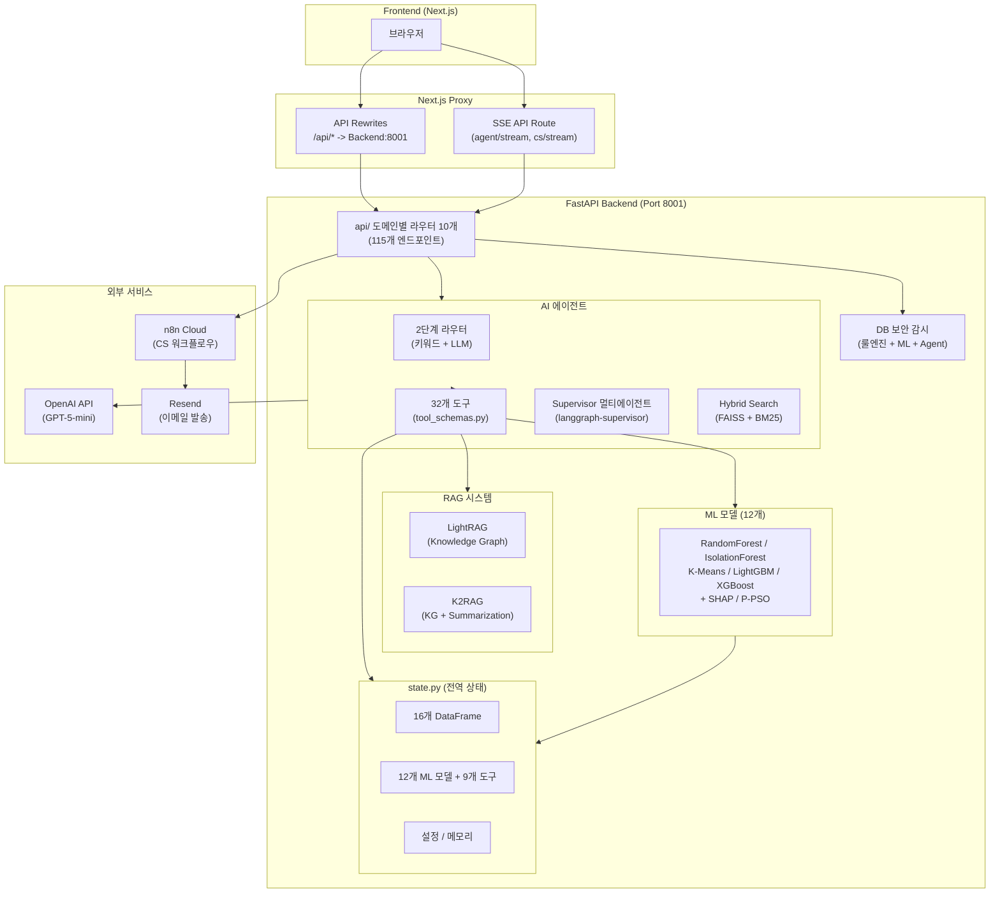
```mermaid
flowchart TB
    subgraph Client["Frontend (Next.js)"]
        FE["브라우저"]
    end

    subgraph Proxy["Next.js Proxy"]
        NP["API Rewrites<br/>/api/* -> Backend:8001"]
        SSE["SSE API Route<br/>(agent/stream, cs/stream)"]
    end

    subgraph Backend["FastAPI Backend (Port 8001)"]
        ROUTES["api/ 도메인별 라우터 10개<br/>(115개 엔드포인트)"]

        subgraph Agent["AI 에이전트"]
            ROUTER["2단계 라우터<br/>(키워드 + LLM)"]
            TOOLS["32개 도구<br/>(tool_schemas.py)"]
            SUPERVISOR["Supervisor 멀티에이전트<br/>(langgraph-supervisor)"]
            HYBRID["하이브리드 라우팅<br/>(워커 직접 / Supervisor 경유)"]
        end

        subgraph RAG["RAG 시스템"]
            HYBRID["Hybrid Search<br/>(FAISS + BM25)"]
            LIGHTRAG["LightRAG<br/>(Knowledge Graph)"]
            K2RAG["K2RAG<br/>(KG + Summarization)"]
        end

        subgraph ML["ML 모델 (12개)"]
            MODELS["RandomForest / IsolationForest<br/>K-Means / LightGBM / XGBoost<br/>+ SHAP / P-PSO"]
        end

        subgraph State["state.py (전역 상태)"]
            DF["16개 DataFrame"]
            MLV["12개 ML 모델 + 9개 도구"]
            CFG["설정 / 메모리"]
        end

        GUARDIAN["DB 보안 감시<br/>(룰엔진 + ML + Agent)"]
    end

    subgraph External["외부 서비스"]
        OPENAI["OpenAI API<br/>(GPT-5-mini)"]
        N8N["n8n Cloud<br/>(CS 워크플로우)"]
        RESEND["Resend<br/>(이메일 발송)"]
    end

    FE --> NP & SSE --> ROUTES
    ROUTES --> Agent --> TOOLS --> ML & RAG
    ROUTES --> GUARDIAN
    Agent --> OPENAI
    ROUTES --> N8N --> RESEND
    TOOLS --> State
    ML --> State
```

---

## 2. 기술 스택

### 프레임워크 및 런타임

| 기술 | 용도 | 비고 |
|------|------|------|
| **FastAPI** | REST API 프레임워크 | 비동기, OpenAPI 자동 문서화 |
| **Uvicorn** | ASGI 서버 | `0.0.0.0:8001` (기본 포트) |
| **Python 3.10+** | 런타임 | `match` 구문 등 3.10+ 기능 사용 |

### AI / LLM

| 기술 | 용도 | 비고 |
|------|------|------|
| **LangChain** (`langchain-openai`) | LLM 래퍼, Tool Calling | `ChatOpenAI` 기반 |
| **LangGraph** | 멀티 에이전트 그래프 | `StateGraph`, `ToolNode`, `create_react_agent` |
| **langgraph-supervisor** | Supervisor 멀티에이전트 패턴 | `create_supervisor()` 기반 워커 오케스트레이션 |
| **OpenAI GPT-5-mini** | LLM 모델 | Tool Calling, 분류, 답변 생성 |
| **OpenAI Embeddings** | 벡터 임베딩 | `text-embedding-3-small` |

### RAG / 검색

| 기술 | 용도 | 비고 |
|------|------|------|
| **FAISS** | 벡터 검색 | 코사인 유사도 기반 |
| **rank-bm25** | 키워드 검색 | BM25 알고리즘 |
| **LightRAG** | 지식 그래프 RAG | 경량 Knowledge Graph |
| **Longformer LED** | 문서 요약 (K2RAG) | `pszemraj/led-base-book-summary` |

### ML / 데이터

| 기술 | 용도 | 비고 |
|------|------|------|
| **scikit-learn** | 분류, 클러스터링, 이상탐지 | RandomForest, K-Means, IsolationForest, DBSCAN |
| **LightGBM** | 매출 예측 | 회귀 모델 |
| **XGBoost** | 수요 예측 | 회귀 모델 |
| **SHAP** | 모델 해석 | TreeExplainer |
| **MLflow** | 실험 추적, 모델 레지스트리 | 로컬 파일 기반 |
| **Pandas / NumPy** | 데이터 처리 | DataFrame 중심 |
| **joblib** | 모델 직렬화 | `.pkl` 파일 |
| **mealpy** | 마케팅 최적화 | P-PSO 알고리즘 |

### 외부 서비스

| 기술 | 용도 | 비고 |
|------|------|------|
| **n8n Cloud** | CS 회신 워크플로우 자동화 | Webhook 트리거 |
| **Resend** | 이메일 발송 API | CS 회신, DBA 알림 |
| **EasyOCR** | 이미지 텍스트 인식 | 선택적 설치 |

---

## 3. 프로젝트 구조

```
backend 리팩토링 시작/
│
├── main.py                          # FastAPI 진입점 (lifespan 패턴, 미들웨어)
├── state.py                         # 전역 상태 관리 (DataFrame, 모델, 설정, TTL 30분/최대 1000세션)
├── Dockerfile                       # Docker 이미지 빌드 (Railway/프로덕션 배포)
├── .env                             # 환경 변수 (API 키, n8n URL 등)
├── requirements.txt                 # Python 의존성 목록
│
├── api/                             # REST API (도메인별 라우터 분리)
│   ├── common.py                    # 공통 유틸리티 (응답 형식, 인증 헬퍼)
│   ├── routes.py                    # 라우터 통합 모듈 (10개 도메인 라우터를 단일 APIRouter로 통합)
│   ├── routes_shop.py               # 쇼핑몰/상품 API
│   ├── routes_seller.py             # 셀러 분석 API
│   ├── routes_cs.py                 # CS/고객지원 API (X-Callback-Token 인증)
│   ├── routes_rag.py                # RAG/LightRAG/K2RAG API
│   ├── routes_ml.py                 # ML/MLflow/마케팅 API
│   ├── routes_guardian.py           # Guardian/보안감시 API
│   ├── routes_automation.py         # 자동화 엔진 API (이탈방지/업그레이드/FAQ/리포트, 17개 엔드포인트)
│   ├── routes_agent.py              # 에이전트/채팅 API (SSE 스트리밍, 하이브리드 라우팅: 워커 직접/Supervisor 경유, 멀티에이전트 모드 분기)
│   ├── routes_consulting.py         # 셀러 컨설팅 에이전트 API (SSE 스트리밍, 세션 관리, 3개 엔드포인트)
│   └── routes_admin.py              # 관리/설정/사용자 API
│
├── agent/                           # AI 에이전트 시스템
│   ├── runner.py                    # Tool Calling 실행기 (동기/스트리밍, KEYWORD_TOOL_MAPPING)
│   ├── tools.py                     # 32개 도구 함수 구현체 (실제 비즈니스 로직, Retention 도구 3개 포함)
│   ├── tool_schemas.py              # @tool 데코레이터 스키마 (LLM 바인딩용)
│   ├── router.py                    # 2단계 라우터 (키워드 분류 + LLM Router, 9개 IntentCategory)
│   ├── intent.py                    # 인텐트 감지 (router.py와 통합된 키워드 분류, RETENTION_KEYWORDS 12개)
│   ├── multi_agent.py               # Supervisor 멀티에이전트 (langgraph-supervisor, Search/Analysis/CS 3워커 + 7개 전문 워커) + 하이브리드 라우팅 (워커 직접/Supervisor 경유) + 워커 프롬프트 (공통 규칙 `_WORKER_COMMON_RULES` + 역할별 특화 지침)
│   ├── multi_agent_prompts.yaml     # 멀티에이전트 프롬프트 (YAML — Supervisor 판단 규칙 + 7개 워커 역할별 지침 + 데이터 품질 해석 규칙)
│   ├── consulting_agent.py          # 셀러 컨설팅 에이전트 (4단계 StateGraph 워크플로우, rollback, 세션 관리)
│   ├── consulting_prompts.yaml      # 컨설팅 에이전트 프롬프트 (단계별 시스템 프롬프트)
│   └── llm.py                       # LLM 호출 래퍼 (프롬프트 인젝션 방어, invoke_with_retry 지수 백오프)
│
├── rag/                             # RAG 시스템 (모듈 분리)
│   ├── service.py                   # RAG 파사드 (831줄, 검색 인터페이스 통합)
│   ├── chunking.py                  # 청킹 로직 (Parent-Child Chunking)
│   ├── search.py                    # 검색 엔진 (BM25, Vector, Hybrid, RAG-Fusion)
│   ├── kg.py                        # Knowledge Graph
│   ├── contextual.py                # Contextual Retrieval (LLM 컨텍스트 생성)
│   ├── light_rag.py                 # LightRAG (지식 그래프 기반 검색, 검색 캐시 Lock)
│   └── k2rag.py                     # K2RAG (ThreadPoolExecutor, 한국어 BM25 토큰화)
│
├── ml/
│   ├── train_models.py              # 합성 데이터 생성 (18개 CSV) + 12개 ML 모델 학습 + if __name__ 가드
│   ├── revenue_model.py             # 매출 예측 (LightGBM 회귀)
│   └── marketing_optimizer.py       # 마케팅 최적화 (P-PSO 알고리즘, mealpy)
│
├── core/                            # 핵심 유틸리티
│   ├── constants.py                 # 상수 (플랜, 카테고리, 피처, 프롬프트, 용어)
│   ├── utils.py                     # 유틸 함수 (extract_seller_id 등 중복 통합)
│   └── memory.py                    # 대화 메모리 관리 (세션별 최대 10턴)
│
├── automation/                      # 자동화 엔진 (탐지→자동실행) + 파이프라인 추적
│   ├── action_logger.py             # 조치 로깅 + FAQ/리포트/리텐션 저장소 + 파이프라인 추적
│   ├── retention_engine.py          # 셀러 이탈 방지 (ML+SHAP→위험등급 분기: LOW→즉시반환 / MEDIUM·HIGH→LLM 개인화 메시지→자동조치)
│   ├── upgrade_engine.py            # 셀러 플랜 업그레이드 추천 (규칙 기반 후보 탐지→LLM 메시지→액션 실행)
│   ├── faq_engine.py                # CS FAQ 자동 생성 (TF-IDF+K-Means+PCA / LLM 듀얼 클러스터링 → FAQ 생성, 선택 클러스터 직접 전달 지원)
│   └── report_engine.py             # 운영 리포트 자동 생성 (KPI→LLM)
│
├── data/
│   └── loader.py                    # 데이터 로더 (CSV 16개 -> DataFrame + ML 모델 12개 + 스케일러/인코더)
│
├── rag_docs/                        # RAG 소스 문서 (카페24 가이드 PDF)
├── rag_faiss/                       # FAISS 인덱스 파일
├── lightrag_data/                   # LightRAG 지식 그래프 데이터
│
├── churn_model_config.json          # 이탈 예측 모델 설정 (피처, SHAP, 성능)
├── revenue_model_config.json        # 매출 예측 모델 설정
│
└── [데이터/모델 파일]
    ├── shops.csv, categories.csv     # 쇼핑몰/카테고리 (300개, 8개)
    ├── sellers.csv, seller_analytics.csv # 셀러 (300명, 쇼핑몰과 1:1)
    ├── products.csv                   # 상품 (~7,500개, 쇼핑몰당 10~40개)
    ├── services.csv                   # 서비스 (~1,200건)
    ├── operation_logs.csv             # 운영 로그 (~30,000행)
    ├── seller_activity.csv            # 셀러 일별 활동 (90일 x 300명 = 27,000건)
    ├── seller_products.csv            # 셀러-상품 매핑 (~7,500건)
    ├── seller_resources.csv           # 셀러 리소스 (300건)
    ├── daily_metrics.csv              # 일별 KPI (GMV, 활성셀러, 주문수, 90일)
    ├── cohort_retention.csv           # 코호트 리텐션 (2024-07 ~ 2024-12)
    ├── conversion_funnel.csv          # 전환 퍼널 (6개월)
    ├── shop_performance.csv           # 쇼핑몰 성과 (매출, 전환율, 300개)
    ├── cs_stats.csv                   # CS 문의/응답 데이터 (9개 카테고리)
    ├── fraud_details.csv              # 이상거래 상세 (~15건)
    ├── platform_docs.csv              # 플랫폼 문서 (12건)
    ├── ecommerce_glossary.csv         # 이커머스 용어 (14건)
    └── model_*.pkl, shap_*.pkl        # ML 모델 + SHAP + 스케일러 (20개+)
```

---

## 4. 설치 및 실행

### 사전 요구사항

- Python 3.10+
- OpenAI API Key

### 설치

```bash
# 의존성 설치
pip install -r requirements.txt

# 환경 변수 설정
cp .env.example .env
# .env 파일에 OPENAI_API_KEY 설정
```

### 데이터 및 모델 초기화

```bash
# 합성 데이터 생성 + ML 모델 학습 (최초 1회)
python ml/train_models.py
```

### 실행

```bash
# 개발 모드
uvicorn main:app --reload --port 8001

# 프로덕션
uvicorn main:app --host 0.0.0.0 --port 8001 --workers 4

# 직접 실행
python main.py  # 0.0.0.0:8001
```

### Docker

```bash
docker build -t cafe24-backend .
docker run -d -p 8000:8000 -e OPENAI_API_KEY=your_key cafe24-backend
```

> **포트 참고**: Dockerfile은 `${PORT:-8000}`을 사용합니다 (Railway 배포 호환). 로컬 개발 시에는 `uvicorn main:app --port 8001`로 8001 포트를 사용합니다.

### 기본 계정

| 사용자 | 비밀번호 | 역할 |
|--------|----------|------|
| `admin` | `admin123` | 관리자 |
| `operator` | `oper123` | 운영자 |
| `analyst` | `analyst123` | 분석가 |
| `user` | `user123` | 사용자 |

---

## 5. 전역 상태 관리 (state.py)

모든 공유 상태를 중앙에서 관리합니다.

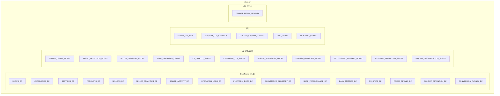
```mermaid
flowchart TB
    subgraph State["state.py"]
        subgraph Data["DataFrame (16개)"]
            SHOPS[SHOPS_DF]
            CATEGORIES[CATEGORIES_DF]
            SERVICES[SERVICES_DF]
            PRODUCTS[PRODUCTS_DF]
            SELLERS[SELLERS_DF]
            ANALYTICS[SELLER_ANALYTICS_DF]
            ACTIVITY[SELLER_ACTIVITY_DF]
            LOGS[OPERATION_LOGS_DF]
            PDOCS[PLATFORM_DOCS_DF]
            GLOSS[ECOMMERCE_GLOSSARY_DF]
            PERF[SHOP_PERFORMANCE_DF]
            METRICS[DAILY_METRICS_DF]
            CS[CS_STATS_DF]
            FRAUD[FRAUD_DETAILS_DF]
            COHORT[COHORT_RETENTION_DF]
            FUNNEL[CONVERSION_FUNNEL_DF]
        end

        subgraph Models["ML 모델 (12개)"]
            CHURN[SELLER_CHURN_MODEL]
            ANOMALY[FRAUD_DETECTION_MODEL]
            SEGMENT[SELLER_SEGMENT_MODEL]
            SHAP[SHAP_EXPLAINER_CHURN]
            CS_Q[CS_QUALITY_MODEL]
            LTV[CUSTOMER_LTV_MODEL]
            SENTIMENT[REVIEW_SENTIMENT_MODEL]
            DEMAND[DEMAND_FORECAST_MODEL]
            SETTLEMENT[SETTLEMENT_ANOMALY_MODEL]
            REVENUE[REVENUE_PREDICTION_MODEL]
            INQUIRY[INQUIRY_CLASSIFICATION_MODEL]
        end

        subgraph Config["설정"]
            API[OPENAI_API_KEY]
            LLM[CUSTOM_LLM_SETTINGS]
            PROMPT[CUSTOM_SYSTEM_PROMPT]
            RAG[RAG_STORE]
            LIGHTRAG[LIGHTRAG_CONFIG]
        end

        subgraph Memory["대화 메모리"]
            CONV[CONVERSATION_MEMORY]
        end
    end
```

### DataFrame 상세

| 변수 | CSV 파일 | 행 수 | 설명 |
|------|----------|-------|------|
| `SHOPS_DF` | `shops.csv` | 300 | 쇼핑몰 정보 (ID, 이름, 플랜, 카테고리, 지역, 상태) |
| `CATEGORIES_DF` | `categories.csv` | 8 | 상품 카테고리 (패션~스포츠) |
| `SERVICES_DF` | `services.csv` | ~1,200 | 쇼핑몰별 서비스 (호스팅/결제/배송/마케팅) |
| `PRODUCTS_DF` | `products.csv` | ~7,500 | 상품 정보 (쇼핑몰당 10~40개) |
| `SELLERS_DF` | `sellers.csv` | 300 | 셀러 기본 정보 (쇼핑몰과 1:1 매핑) |
| `SELLER_ANALYTICS_DF` | `seller_analytics.csv` | 300 | 셀러 분석 (세그먼트, 이탈확률, SHAP) |
| `SELLER_ACTIVITY_DF` | `seller_activity.csv` | 27,000 | 셀러 일별 활동 (90일 x 300명) |
| `OPERATION_LOGS_DF` | `operation_logs.csv` | 30,000 (제한) | 운영 이벤트 로그 |
| `SHOP_PERFORMANCE_DF` | `shop_performance.csv` | 300 | 쇼핑몰 성과 KPI |
| `DAILY_METRICS_DF` | `daily_metrics.csv` | 90 | 일별 플랫폼 KPI |
| `CS_STATS_DF` | `cs_stats.csv` | 9 | CS 카테고리별 통계 |
| `FRAUD_DETAILS_DF` | `fraud_details.csv` | ~15 | 이상거래 상세 (랜덤 추출 셀러) |
| `COHORT_RETENTION_DF` | `cohort_retention.csv` | 6 | 코호트 리텐션 (2024-07~12) |
| `CONVERSION_FUNNEL_DF` | `conversion_funnel.csv` | 6 | 전환 퍼널 (등록→활성→참여→전환→잔존) |
| `PLATFORM_DOCS_DF` | `platform_docs.csv` | 12 | 플랫폼 문서 메타 |
| `ECOMMERCE_GLOSSARY_DF` | `ecommerce_glossary.csv` | 14 | 이커머스 용어 사전 |

### ML 모델 상세

| 변수 | 파일 | 알고리즘 | 용도 |
|------|------|---------|------|
| `SELLER_CHURN_MODEL` | `model_seller_churn.pkl` | RandomForest | 셀러 이탈 예측 |
| `FRAUD_DETECTION_MODEL` | `model_fraud_detection.pkl` | IsolationForest | 이상거래 탐지 |
| `INQUIRY_CLASSIFICATION_MODEL` | `model_inquiry_classification.pkl` | TF-IDF + RF | 문의 자동 분류 |
| `SELLER_SEGMENT_MODEL` | `model_seller_segment.pkl` | K-Means (5) | 셀러 세그먼트 |
| `CS_QUALITY_MODEL` | `model_cs_quality.pkl` | RandomForest | CS 응답 품질 |
| `REVENUE_PREDICTION_MODEL` | `model_revenue_prediction.pkl` | LightGBM | 매출 예측 |
| `CUSTOMER_LTV_MODEL` | `model_customer_ltv.pkl` | GradientBoosting | 고객 LTV 예측 |
| `REVIEW_SENTIMENT_MODEL` | `model_review_sentiment.pkl` | LogisticRegression | 리뷰 감성 분석 |
| `DEMAND_FORECAST_MODEL` | `model_demand_forecast.pkl` | XGBoost | 상품 수요 예측 |
| `SETTLEMENT_ANOMALY_MODEL` | `model_settlement_anomaly.pkl` | DBSCAN | 정산 이상 탐지 |
| `SHAP_EXPLAINER_CHURN` | `shap_explainer_churn.pkl` | TreeExplainer | 이탈 예측 해석 |
| `_GUARDIAN_ISO_MODEL` | `model_guardian_anomaly.pkl` | IsolationForest | Guardian DB 쿼리 이상탐지 |

### 공용 도구 (스케일러/인코더)

| 변수 | 파일 | 용도 |
|------|------|------|
| `TFIDF_VECTORIZER` | `tfidf_vectorizer.pkl` | 문의 분류 텍스트 벡터화 |
| `TFIDF_VECTORIZER_SENTIMENT` | `tfidf_vectorizer_sentiment.pkl` | 감성 분석 벡터화 |
| `SCALER_CLUSTER` | `scaler_cluster.pkl` | 셀러 세그먼트 정규화 |
| `LE_TICKET_CATEGORY` | `le_ticket_category.pkl` | 티켓 카테고리 인코더 |
| `LE_SELLER_TIER` | `le_seller_tier.pkl` | 셀러 등급 인코더 |
| `LE_CS_PRIORITY` | `le_cs_priority.pkl` | CS 우선순위 인코더 |
| `LE_INQUIRY_CATEGORY` | `le_inquiry_category.pkl` | 문의 카테고리 인코더 |
| `_GUARDIAN_SCALER` | `scaler_guardian.pkl` | Guardian ML 피처 정규화 |
| `scaler_revenue` | `scaler_revenue.pkl` | 매출 예측 피처 정규화 (`ml/revenue_model.py`) |

### 설정 변수

| 변수 | 설명 |
|------|------|
| `OPENAI_API_KEY` | API 키 (환경변수 > 파일) |
| `CUSTOM_LLM_SETTINGS` | 모델, temperature, maxTokens, timeoutMs |
| `CUSTOM_SYSTEM_PROMPT` | 사용자 수정 시스템 프롬프트 (`system_prompt.json` 영속화) |
| `LIGHTRAG_CONFIG` | top_k, context_max_chars |
| `CONVERSATION_MEMORY` | 세션별 대화 기록 (최대 10턴, TTL 30분, 최대 1000세션) |
| `CHURN_MODEL_CONFIG` | 이탈 모델 설정 (피처, SHAP, 정확도) |
| `SHOP_SERVICE_MAP` | 쇼핑몰별 서비스 캐시 |
| `CS_JOB_QUEUES` | CS 작업 큐 (TTL 기반 자동 정리) |

---

## 6. AI 에이전트 시스템

> **설계 기반**: Anthropic [Building Effective Agents](https://www.anthropic.com/research/building-effective-agents) - Routing, Tool Use, Agents 패턴을 실제 이커머스 운영에 적용. "빠른 규칙 우선 + AI fallback" 원칙을 프로젝트 전반(라우터, Guardian, CS 파이프라인)에 일관 적용.

### 6.1 아키텍처

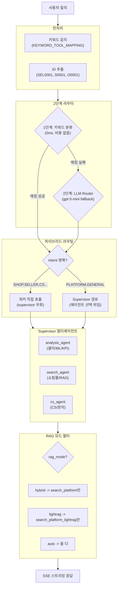
```mermaid
flowchart TB
    Q["사용자 질의"]

    subgraph Preprocess["전처리"]
        KW["키워드 감지<br/>(KEYWORD_TOOL_MAPPING)"]
        ID["ID 추출<br/>(SEL0001, S0001, O0001)"]
    end

    subgraph Router["2단계 라우터"]
        R1{"1단계: 키워드 분류<br/>(0ms, 비용 없음)"}
        R2{"2단계: LLM Router<br/>(gpt-5-mini fallback)"}
    end

    subgraph HybridRoute["하이브리드 라우팅"]
        DR{"intent 명확?"}
        DIRECT["워커 직접 호출<br/>(supervisor 우회)"]
        SUPER["Supervisor 경유<br/>(에이전트 선택 위임)"]
    end

    subgraph Agents["Supervisor 멀티에이전트"]
        A1["analysis_agent<br/>(셀러/ML/KPI)"]
        A2["search_agent<br/>(쇼핑몰/RAG)"]
        A3["cs_agent<br/>(CS/문의)"]
    end

    subgraph RAGFilter["RAG 모드 필터"]
        RF{"rag_mode?"}
        RF1["hybrid -> search_platform만"]
        RF2["lightrag -> search_platform_lightrag만"]
        RF3["auto -> 둘 다"]
    end

    Q --> Preprocess --> Router
    R1 -->|"매칭 성공"| DR
    R1 -->|"매칭 실패"| R2
    R2 --> DR
    DR -->|"SHOP,SELLER,CS..."| DIRECT --> Agents
    DR -->|"PLATFORM,GENERAL"| SUPER --> Agents
    Agents --> RAGFilter --> Response["SSE 스트리밍 응답"]
```

### 6.2 에이전트 상세

| 에이전트 | 역할 | 라우팅 방식 | 트리거 키워드 |
|----------|------|------------|--------------|
| **search_agent** | 플랫폼 정보 검색 (쇼핑몰/카테고리/RAG) | 워커 직접 (SHOP) / Supervisor (PLATFORM, GENERAL) | 플랫폼, 정책, 정산, 가이드, 쇼핑몰 |
| **analysis_agent** | 셀러/쇼핑몰 데이터 분석 (ML, KPI) | 워커 직접 (SELLER, ANALYSIS, DASHBOARD) | 분석, 통계, 세그먼트, 이탈, 이상거래, 매출 |
| **cs_agent** | 셀러 문의 분류/응답 관리 | 워커 직접 (CS) | CS, 셀러 문의, 기술지원, 용어 |
| **Supervisor** | 워커 에이전트 오케스트레이션 | PLATFORM, GENERAL 카테고리 전담 | 기타 일반 질문, 복합 질문 |

### 6.3 RAG 모드 선택

프론트엔드 설정에서 AI 에이전트의 플랫폼 지식 검색 방식을 선택합니다.

| 모드 | 도구 | 설명 | 프론트엔드 상태 |
|------|------|------|----------------|
| `hybrid` | `search_platform` | FAISS + BM25 + RRF 융합 | **활성** (기본값) |
| `lightrag` | `search_platform_lightrag` | 지식 그래프 기반 검색 | 시험용 (비활성) |
| `k2rag` | - | KG + Sub-Q + Hybrid | 시험중 (비활성) |
| `auto` | 둘 다 | AI가 질문에 맞게 자동 선택 | 비활성 |

> **현재 상태**: 프론트엔드에서 `hybrid` 모드만 선택 가능. LightRAG(시험용), K²RAG(시험중), 자동 선택은 UI에서 비활성화됨.

**백엔드 처리 흐름:**

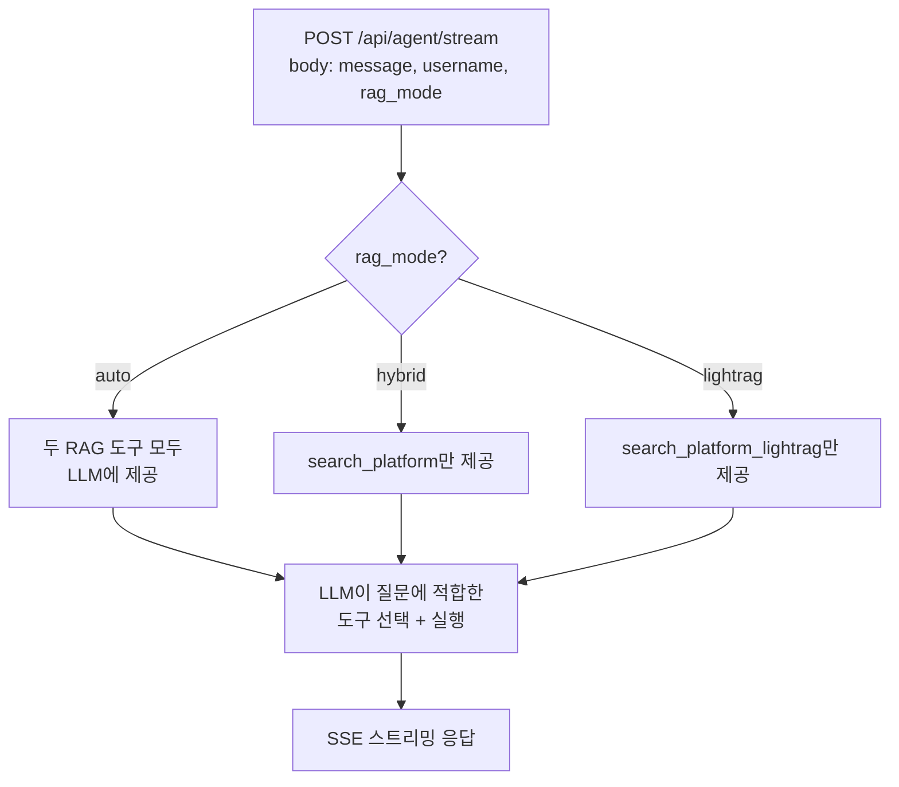
```mermaid
flowchart TD
    REQ["POST /api/agent/stream<br/>body: message, username, rag_mode"] --> MODE{"rag_mode?"}
    MODE -->|"auto"| AUTO["두 RAG 도구 모두<br/>LLM에 제공"]
    MODE -->|"hybrid"| HYB["search_platform만 제공"]
    MODE -->|"lightrag"| LR["search_platform_lightrag만 제공"]
    AUTO & HYB & LR --> LLM["LLM이 질문에 적합한<br/>도구 선택 + 실행"]
    LLM --> SSE["SSE 스트리밍 응답"]
```

### 6.4 2단계 인텐트 라우터

> **설계 출처**: Anthropic [Building Effective Agents](https://www.anthropic.com/research/building-effective-agents) - "For complex systems, rather than letting agents decide all tools, narrow the tool set by classifying the intent first" 패턴 적용

**문제**: 32개 도구를 한 번에 노출하면 LLM이 잘못된 도구 선택 (예: 분석 질문에 RAG 호출). 도구 수가 증가할수록 Tool Calling 정확도가 하락하는 것은 LLM의 알려진 한계.

**해결**: 2단계 Router 패턴으로 도구 선택 공간을 축소. 1단계 키워드 분류(O(1), 비용 0)가 대부분의 질의를 처리하고, 분류 실패 시에만 2단계 LLM Router(gpt-5-mini)가 fallback으로 동작. 이 패턴은 프로젝트 전반(DB 보안 감시의 룰엔진+AI Agent, CS 파이프라인의 신뢰도 분기)에서 일관되게 적용된 **"빠른 규칙 우선 + AI fallback"** 설계 원칙.

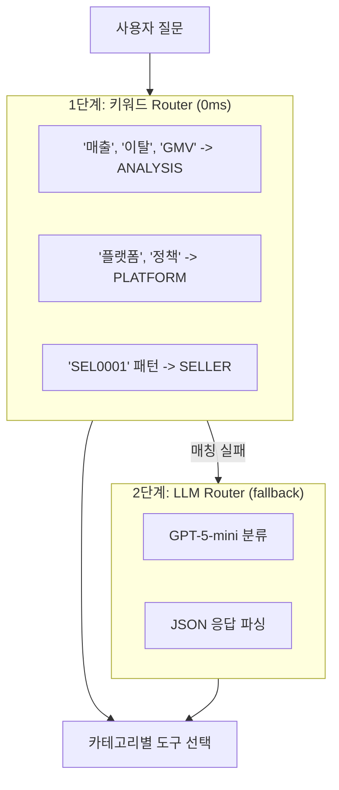
```mermaid
flowchart TB
    Q["사용자 질문"]

    subgraph Stage1["1단계: 키워드 Router (0ms)"]
        K1["'매출', '이탈', 'GMV' -> ANALYSIS"]
        K2["'플랫폼', '정책' -> PLATFORM"]
        K3["'SEL0001' 패턴 -> SELLER"]
    end

    subgraph Stage2["2단계: LLM Router (fallback)"]
        L1["GPT-5-mini 분류"]
        L2["JSON 응답 파싱"]
    end

    Q --> Stage1
    Stage1 -->|"매칭 실패"| Stage2
    Stage1 & Stage2 --> Tools["카테고리별 도구 선택"]
```

**구현 위치** (키워드 분류 로직 통합 - 중복 제거):
- `agent/router.py` - `_keyword_classify()` + `route_intent_llm()` + `classify_and_get_tools()`
- `agent/intent.py` - `detect_intent()` + `run_deterministic_tools()` (router.py와 키워드 분류 로직 통합)
- `agent/runner.py` - `KEYWORD_TOOL_MAPPING` 강제 도구 실행 + `run_agent()`

#### 6.4.1 IntentCategory (9개)

`agent/router.py`에서 정의하는 질문 의도 카테고리:

```python
class IntentCategory(str, Enum):
    CONSULTING = "consulting"   # 셀러 컨설팅 (4단계 워크플로우)
    ANALYSIS = "analysis"       # 매출, GMV, 이탈, DAU, 코호트, 트렌드
    PLATFORM = "platform"       # 플랫폼 정책, 기능, 운영 가이드
    SHOP = "shop"               # 쇼핑몰 정보, 서비스, 성과, 매출
    SELLER = "seller"           # 셀러 분석, 세그먼트, 부정행위 탐지
    CS = "cs"                   # CS 자동응답, 품질 검사, 문의 분류
    RETENTION = "retention"     # 이탈 방지, 리텐션, churn, at-risk
    DASHBOARD = "dashboard"     # 대시보드, 전체 현황
    GENERAL = "general"         # 일반 대화, 인사
```

#### 6.4.2 KEYWORD_TOOL_MAPPING (강제 도구 실행)

`agent/runner.py`에서 키워드 기반 **강제 도구 실행** (LLM 호출 전 선처리):

```python
KEYWORD_TOOL_MAPPING = {
    "detect_fraud": ["부정행위 탐지", "비정상 셀러", "어뷰징", ...],
    "get_fraud_statistics": ["이상거래", "이상 셀러", "부정행위 통계", ...],
    "get_segment_statistics": ["세그먼트 통계", "성장형 셀러", "휴면 셀러", ...],
    "get_order_statistics": ["운영 이벤트", "주문 이벤트", "정산 이벤트", ...],
    "predict_seller_churn": ["이탈 예측", "이탈 확률", "churn", ...],
    "optimize_marketing": ["마케팅 최적화", "광고 전략", "ROAS 최적화", ...],
    "get_trend_analysis": ["트렌드 분석", "활성 셀러", "가입 추이", ...],
    "get_cohort_analysis": ["코호트 분석", "리텐션 분석", ...],
    "get_gmv_prediction": ["매출 예측", "GMV 분석", "ARPU", ...],
    "get_churn_prediction": ["이탈 분석", "이탈 현황", "고위험 셀러", ...],
    "list_shops": ["쇼핑몰 목록", "쇼핑몰 리스트", ...],
    "list_categories": ["카테고리 목록", "업종 목록", ...],
    "get_dashboard_summary": ["대시보드", "전체 현황", ...],
    "get_cs_statistics": ["CS 통계", "상담 현황", ...],
    "classify_inquiry": ["카테고리 분류", "문의 분류", ...],
    "get_shop_performance": ["성과 분석", "쇼핑몰 성과", ...],
    "get_at_risk_sellers": ["이탈 위험", "리텐션", "at-risk", ...],
    "generate_retention_message": ["리텐션 메시지", "이탈 방지 메시지", ...],
    "execute_retention_action": ["리텐션 조치", "이탈 방지 실행", ...],
    # ... 총 19개 도구 매핑
}
```

**동작 방식**: 사용자 질문에 키워드 매칭 -> 매칭된 도구를 LLM 호출 전에 강제 실행 -> 결과를 LLM 컨텍스트에 전달

#### 6.4.3 파라미터 자동 추출

`agent/runner.py`에서 사용자 텍스트로부터 도구 파라미터를 자동 추출합니다:

| 함수 | 추출 대상 | 패턴 예시 |
|------|----------|----------|
| `extract_seller_id()` | 셀러 ID | `SEL0001` ~ `SEL000001` (1~6자리) |
| `extract_shop_id()` | 쇼핑몰 ID | `S0001` ~ `S000001` (4~6자리) |
| `extract_order_id()` | 주문 ID | `O0001` ~ `O00000001` (4~8자리) |
| `extract_days()` | 일수 | "최근 7일", "30일간", "지난 14일" |
| `extract_date_range()` | 날짜 범위 | `2024-01-01` ~ `2024-12-31` |
| `extract_month()` | 월 | `2024-11`, "11월" |
| `extract_risk_level()` | 위험 등급 | "고위험", "중위험", "저위험" |
| `extract_cohort()` | 코호트명 | `2024-11 W1` |

#### 6.4.4 카테고리별 도구 매핑

| 카테고리 | 키워드 | 도구 | 비고 |
|----------|--------|------|------|
| `analysis` | 매출, 이탈, GMV, 코호트, 트렌드 | `get_churn_prediction`, `get_gmv_prediction`, `get_trend_analysis`, `get_cohort_analysis` | |
| `platform` | 플랫폼, 정책, 정산, 가이드 | `search_platform`, `search_platform_lightrag` | **tool_choice="required"** |
| `shop` | 쇼핑몰, 매출, 성과, 카테고리 | `get_shop_info`, `list_shops`, `get_shop_services`, `get_shop_performance`, `predict_shop_revenue`, `optimize_marketing`, `get_category_info`, `list_categories`, `get_dashboard_summary`, `search_platform`, `search_platform_lightrag` | |
| `seller` | 셀러, SEL0001, 세그먼트, 이상 | `analyze_seller`, `predict_seller_churn`, `get_seller_segment`, `detect_fraud`, `get_fraud_statistics`, `get_segment_statistics`, `optimize_marketing`, `get_shop_performance`, `predict_shop_revenue` | |
| `cs` | CS, 문의, 상담, 용어집 | `auto_reply_cs`, `check_cs_quality`, `get_ecommerce_glossary`, `get_cs_statistics`, `classify_inquiry` | |
| `retention` | 이탈 위험, 리텐션, churn, at-risk | `get_at_risk_sellers`, `generate_retention_message`, `execute_retention_action`, `analyze_seller`, `get_cs_statistics` | |
| `dashboard` | 대시보드, 전체 현황 | `get_dashboard_summary`, `get_segment_statistics`, `get_cs_statistics`, `get_order_statistics` | |
| `general` | 안녕, 고마워 | (도구 없음 - 직접 대화) | |

#### 6.4.5 분류 우선순위

```python
# agent/router.py - _keyword_classify()
def _keyword_classify(text: str) -> Optional[IntentCategory]:
    # 0. 셀러 ID(SEL0001) 포함 -> SELLER (최고 우선순위)
    if re.search(r'SEL\d{1,6}', text, re.IGNORECASE):
        return IntentCategory.SELLER

    # 1. 리텐션 키워드 (이탈 위험, 리텐션, retention, churn, at-risk) — ANALYSIS보다 우선
    # 2. 분석 키워드 (매출, 이탈, GMV, 코호트, 트렌드, 활성 셀러)
    # 3. 셀러 분석 (세그먼트 이름, 이상 셀러 등)
    # 4. 쇼핑몰 관련 (성과, 정보, 마케팅)
    # 5. CS 관련
    # 6. 대시보드 관련
    # 7. 플랫폼 관련 (정책, 기능, 용어)
    # 8. 일반 대화
    # 불확실 -> None -> LLM Router (2단계 fallback)
```

#### 6.4.6 PLATFORM 강제 RAG (tool_choice="required")

> **문제**: 플랫폼 정책 질문에서 LLM이 자체 지식으로 답변 -> 부정확/할루시네이션

> **해결**: PLATFORM 카테고리일 때 `tool_choice="required"` 적용 -> RAG 도구 강제 호출

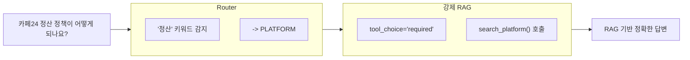
```mermaid
flowchart LR
    Q["카페24 정산 정책이 어떻게 되나요?"]

    subgraph Router["Router"]
        R1["'정산' 키워드 감지"]
        R2["-> PLATFORM"]
    end

    subgraph Force["강제 RAG"]
        F1["tool_choice='required'"]
        F2["search_platform() 호출"]
    end

    Q --> Router --> Force --> Result["RAG 기반 정확한 답변"]
```

#### 6.4.7 성능 최적화

| 최적화 | 설명 |
|--------|------|
| **키워드 우선** | LLM 호출 없이 빠른 분류 (대부분 여기서 처리) |
| **KEYWORD_TOOL_MAPPING** | 키워드 매칭 -> LLM 호출 전 강제 도구 실행 |
| **LLM Fallback** | 키워드 분류 실패 시만 gpt-5-mini 호출 |
| **RAG 스킵** | PLATFORM, GENERAL 외 모든 데이터 카테고리(SHOP, SELLER, ANALYSIS 등)는 RAG 사전검색 건너뜀 |
| **PLATFORM 강제 RAG** | `tool_choice="required"`로 LLM 자체 지식 사용 방지 |
| **GENERAL 모드** | 인사/단답은 도구 없이 직접 LLM 응답 |
| **MAX_TOOL_ITERATIONS** | 무한 루프 방지 (최대 10회) |

### 6.5 도구 함수 목록 (32개)

| # | 도구명 | 설명 | 에이전트 |
|---|--------|------|----------|
| 1 | `get_shop_info` | 쇼핑몰 정보 조회 (ID 또는 이름 검색) | Searcher |
| 2 | `list_shops` | 쇼핑몰 목록 (카테고리/티어/지역 필터) | Searcher |
| 3 | `get_shop_services` | 서비스 정보 조회 | Searcher |
| 4 | `get_category_info` | 카테고리 정보 조회 | Searcher |
| 5 | `list_categories` | 카테고리 목록 | Searcher |
| 6 | `search_platform` | Hybrid RAG 검색 (FAISS + BM25 + RRF) | Searcher |
| 7 | `search_platform_lightrag` | LightRAG 검색 (local/global/hybrid/naive 모드) | Searcher |
| 8 | `auto_reply_cs` | CS 자동 응답 (카테고리별 정책 반영) | CS Agent |
| 9 | `check_cs_quality` | CS 응답 품질 예측 (긴급/보통/낮음) | CS Agent |
| 10 | `analyze_seller` | 셀러 종합 분석 (세그먼트, 지표, 이상 여부) | Analyst |
| 11 | `get_seller_segment` | 세그먼트 예측 (K-Means 기반) | Analyst |
| 12 | `detect_fraud` | 이상거래 탐지 (IsolationForest) | Analyst |
| 13 | `get_segment_statistics` | 세그먼트별 통계 (셀러 수, 평균 GMV) | Analyst |
| 14 | `get_fraud_statistics` | 이상거래 전체 통계 | Analyst |
| 15 | `predict_seller_churn` | 개별 셀러 이탈 예측 + SHAP 해석 | Analyst |
| 16 | `get_churn_prediction` | 이탈 예측 전체 (고/중/저위험 분포) | Analyst |
| 17 | `get_cohort_analysis` | 코호트 리텐션 분석 (Week1~Week12, 요청 월 없으면 전체 코호트 폴백) | Analyst |
| 18 | `get_trend_analysis` | **플랫폼 전체** KPI 트렌드 분석 (활성셀러, ARPU, 변화율) | Analyst |
| 19 | `get_gmv_prediction` | GMV 예측 (ARPU/ARPPU, 티어별 분포) | Analyst |
| 20 | `predict_shop_revenue` | 쇼핑몰 매출 예측 (LightGBM) | Analyst |
| 21 | `get_shop_performance` | 쇼핑몰 개별 성과 조회 (총 주문 0건→avg_order_value=0 보정) | Analyst |
| 22 | `optimize_marketing` | P-PSO 마케팅 최적화 (최대 10개 추천) | Analyst |
| 23 | `get_seller_activity_report` | 셀러 활동 리포트 (N일간) | Analyst |
| 24 | `get_order_statistics` | 운영 이벤트 통계 (8종 이벤트 타입) | Analyst |
| 25 | `classify_inquiry` | 문의 카테고리 분류 (9개 카테고리, 신뢰도) | CS Agent |
| 26 | `get_ecommerce_glossary` | 이커머스 용어 조회 (검색 또는 전체) | CS Agent |
| 27 | `get_cs_statistics` | CS 통계 (카테고리별/채널별) | CS Agent |
| 28 | `get_dashboard_summary` | 대시보드 요약 (쇼핑몰/셀러/CS/주문) | Coordinator |
| 29 | `get_at_risk_sellers` | ML 이탈 예측 + SHAP 분석 (threshold, limit) | Retention |
| 30 | `generate_retention_message` | LLM 맞춤 리텐션 메시지 생성 (LOW→LLM 스킵, MEDIUM/HIGH→LLM 생성) | Retention |
| 31 | `execute_retention_action` | 리텐션 조치 실행 (coupon/upgrade_offer/manager_assign/custom_message) | Retention |

### 6.6 멀티 에이전트 시스템 (Supervisor 패턴)

`agent/multi_agent.py`에서 `langgraph-supervisor` 기반 Supervisor 멀티에이전트를 구현합니다. 프론트엔드에서 항상 `multi_agent: true`로 요청하므로 **Supervisor가 기본 에이전트 경로**입니다.

#### Supervisor 그래프 구조

**기본 Supervisor (3개 워커 — 일반 에이전트 경로):**

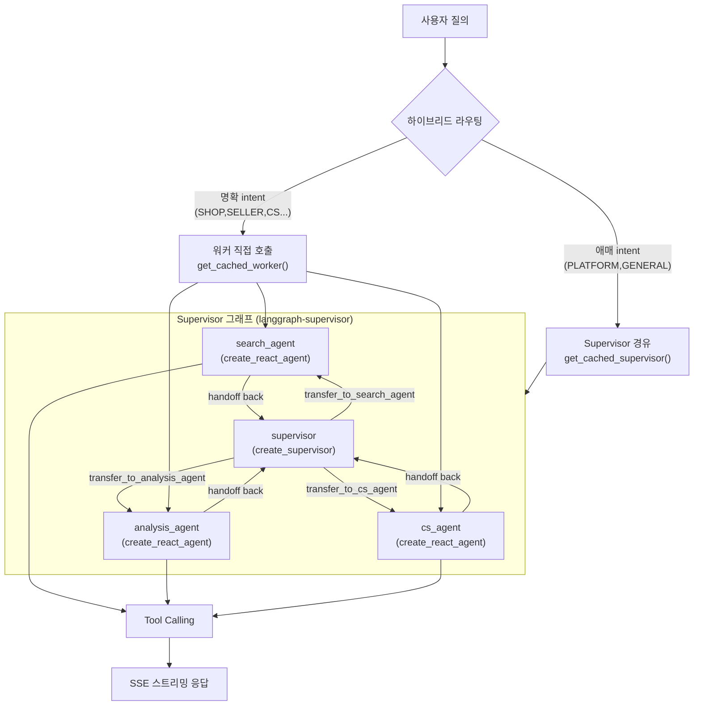
```mermaid
flowchart TD
    INPUT["사용자 질의"] --> ROUTE{"하이브리드 라우팅"}
    ROUTE -->|"명확 intent<br/>(SHOP,SELLER,CS...)"| WORKER["워커 직접 호출<br/>get_cached_worker()"]
    ROUTE -->|"애매 intent<br/>(PLATFORM,GENERAL)"| SUPER["Supervisor 경유<br/>get_cached_supervisor()"]

    subgraph SupervisorGraph["Supervisor 그래프 (langgraph-supervisor)"]
        SUP["supervisor<br/>(create_supervisor)"]
        SUP -->|"transfer_to_search_agent"| SA["search_agent<br/>(create_react_agent)"]
        SUP -->|"transfer_to_analysis_agent"| AA["analysis_agent<br/>(create_react_agent)"]
        SUP -->|"transfer_to_cs_agent"| CA["cs_agent<br/>(create_react_agent)"]
        SA & AA & CA -->|"handoff back"| SUP
    end

    SUPER --> SupervisorGraph
    WORKER --> SA & AA & CA
    SA & AA & CA --> TOOLS["Tool Calling"]
    TOOLS --> SSE["SSE 스트리밍 응답"]
```

**멀티에이전트 Supervisor (7개 전문 워커 — `multi_agent: true` 경로):**

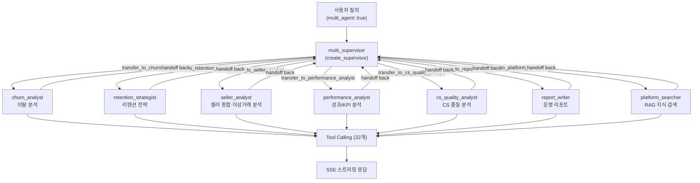
```mermaid
flowchart TD
    INPUT["사용자 질의<br/>(multi_agent: true)"] --> SUB_SUP["multi_supervisor<br/>(create_supervisor)"]

    SUB_SUP -->|"transfer_to_churn_analyst"| W1["churn_analyst<br/>이탈 분석"]
    SUB_SUP -->|"transfer_to_retention_strategist"| W2["retention_strategist<br/>리텐션 전략"]
    SUB_SUP -->|"transfer_to_seller_analyst"| W3["seller_analyst<br/>셀러 종합·이상거래 분석"]
    SUB_SUP -->|"transfer_to_performance_analyst"| W4["performance_analyst<br/>성과/KPI 분석"]
    SUB_SUP -->|"transfer_to_cs_quality_analyst"| W5["cs_quality_analyst<br/>CS 품질 분석"]
    SUB_SUP -->|"transfer_to_report_writer"| W6["report_writer<br/>운영 리포트"]
    SUB_SUP -->|"transfer_to_platform_searcher"| W7["platform_searcher<br/>RAG 지식 검색"]

    W1 & W2 & W3 & W4 & W5 & W6 & W7 -->|"handoff back"| SUB_SUP
    W1 & W2 & W3 & W4 & W5 & W6 & W7 --> TOOLS["Tool Calling (32개)"]
    TOOLS --> SSE["SSE 스트리밍 응답"]
```

#### 7개 전문 워커 에이전트 (`MULTI_AGENT_WORKERS`)

| # | 워커명 | 설명 | 도구 | 라우팅 키워드 |
|---|--------|------|------|---------------|
| 1 | **churn_analyst** | 이탈 분석 전문가 — ML 이탈 예측 + SHAP 분석 | `get_at_risk_sellers`, `predict_seller_churn`, `get_churn_prediction` | 이탈/위험 셀러 분석 |
| 2 | **retention_strategist** | 리텐션 전략가 — 맞춤 메시지 생성 + 자동 조치 | `generate_retention_message`, `execute_retention_action`, `get_at_risk_sellers` | 이탈 방지 전략/메시지/조치 |
| 3 | **seller_analyst** | 셀러 종합 분석가 — 셀러 활동·세그먼트·이상거래 조사·성과 분석 | `analyze_seller`, `get_seller_segment`, `detect_fraud`, `get_segment_statistics`, `get_fraud_statistics`, `get_seller_activity_report` | 셀러 종합 진단/이상거래/부정행위 |
| 4 | **performance_analyst** | 성과 분석가 — 매출/KPI/마케팅 분석 | `get_shop_info`, `get_shop_performance`, `get_trend_analysis`, `get_cohort_analysis`, `predict_shop_revenue`, `get_gmv_prediction`, `optimize_marketing`, `get_order_statistics` | 쇼핑몰 성과/매출/마케팅 |
| 5 | **cs_quality_analyst** | CS 품질 분석가 — CS 통계 + 자동 응답 + 품질 평가 | `get_cs_statistics`, `auto_reply_cs`, `check_cs_quality`, `classify_inquiry`, `get_ecommerce_glossary` | CS 품질/상담/감성 |
| 6 | **report_writer** | 리포트 작성가 — 대시보드 + KPI 종합 보고서 | `get_dashboard_summary`, `get_order_statistics`, `get_trend_analysis`, `get_cohort_analysis` | 대시보드/KPI/리포트 |
| 7 | **platform_searcher** | RAG 지식 검색 — 플랫폼 문서/쇼핑몰/카테고리/용어 조회 | `search_platform`, `search_platform_lightrag` | 플랫폼/정책/가이드/용어 |

#### 워커 프롬프트 구조 (공통 규칙 + 역할별 특화)

각 워커의 시스템 프롬프트는 **역할별 특화 지침 + `_WORKER_COMMON_RULES` 공통 규칙**으로 구성됩니다.

**`_WORKER_COMMON_RULES` (공통 상수):**
- 응답 규칙: 핵심 수치 구체적 언급, 마크다운 표/볼드/리스트 활용, 형식적 응답 금지, 최소 3개 인사이트, 금액 포맷(₩+콤마, 억/만원 환산)
- 분석 관점 5가지: 추세 파악, 이상값 발견, 비교 분석, 원인 추론, 실행 제안

**워커별 특화 분석 지침:**

| 워커 | 특화 지침 |
|------|-----------|
| **churn_analyst** | "주요 예측 영향 변수" 용어 규칙 (feature importance ≠ 이탈 원인), SHAP 영향 변수 순위 표, 이탈 확률 높은 셀러의 공통 패턴, 리텐션 우선순위 추천 |
| **retention_strategist** | 이전 워커 결과 참조 필수 (수치/등급 인용), LOW 위험 → 리텐션 불필요 판단, judgment 필드 존중, 셀러 상황별 맞춤 전략, 조치 유형별 예상 효과, 긴급도별(즉시/단기/중기) 분류 |
| **seller_analyst** | 세그먼트 간 비교 표(매출/주문/환불률), 세그먼트별 관리 전략, 강점/약점/기회/위협, 이상 유형 분류(환불 사기/가짜 주문/비정상 패턴), 위험 점수 분포, 대응 방안(차단/모니터링/경고) |
| **performance_analyst** | 플랫폼 전체 vs 개별 쇼핑몰 데이터 범위 구분 (`get_trend_analysis`=전체, `get_shop_performance`=개별), 코호트 월 미지정 시 전체 조회 후 선택, 기간별 추세(전월/전년 대비), ROI/CPA/ROAS 비교 |
| **cs_quality_analyst** | 카테고리별 비교 표(티켓 수/만족도/해결 시간), 병목 카테고리 지적, 개선 우선순위 액션 |
| **report_writer** | 플랫폼 전체 vs 개별 쇼핑몰 데이터 구분 (혼동 금지), 경영진 의사결정 수준 보고서, KPI 요약 표 선행, 변화량+변화율(%) 표기 |
| **platform_searcher** | RAG 결과 꼼꼼히 읽기, 할루시네이션 금지, 항목 수 세기, 도구 호출 필수 |

**Supervisor 프롬프트 (`MULTI_AGENT_SUPERVISOR_PROMPT`) 강화:**
- 분석 결과 기반 판단: 앞선 워커(예: churn_analyst)의 분석 결과에 따라 후속 워커 실행 여부를 판단 (LOW 위험 → retention_strategist 위임 안 함, 맹목적 순차 실행 금지)
- 복합 요청 강제: "~하고 ~해줘" 패턴 시 반드시 2개 이상 서로 다른 워커에게 순차 위임
- 대화 맥락 유지: 이전 대화에서 언급된 쇼핑몰/셀러를 후속 질문에서도 유지
- 형식적 응답 금지: "확인했습니다" 같은 한 줄 응답 절대 금지
- 최소 3개 이상 인사이트 제공, 워커 반환 데이터 상세 정리
- 금액 포맷: ₩ + 천 단위 콤마, 큰 금액은 억/만원 단위 환산

#### 하이브리드 라우팅 (키워드 사전라우팅 + Supervisor)

**문제**: 모든 질의를 Supervisor에 경유시키면 불필요한 LLM 호출 1회 추가 (~3초 지연).

**해결**: 키워드 라우터로 intent가 명확한 경우 Supervisor를 우회하여 워커를 직접 호출합니다.

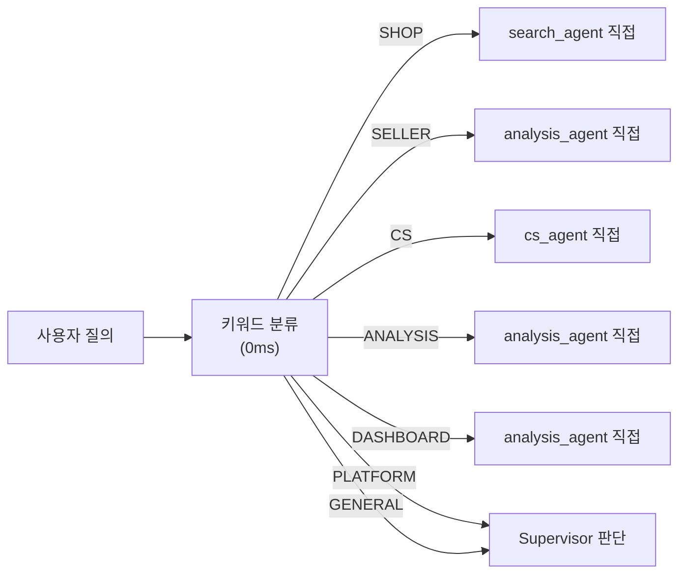
```mermaid
flowchart LR
    Q["사용자 질의"] --> KW["키워드 분류<br/>(0ms)"]
    KW -->|"SHOP"| W1["search_agent 직접"]
    KW -->|"SELLER"| W2["analysis_agent 직접"]
    KW -->|"CS"| W3["cs_agent 직접"]
    KW -->|"ANALYSIS"| W4["analysis_agent 직접"]
    KW -->|"DASHBOARD"| W5["analysis_agent 직접"]
    KW -->|"PLATFORM"| SUP["Supervisor 판단"]
    KW -->|"GENERAL"| SUP
```

**INTENT_AGENT_MAP (supervisor 우회 매핑):**

```python
INTENT_AGENT_MAP = {
    "shop": "search_agent",        # 쇼핑몰 → 검색 에이전트
    "seller": "analysis_agent",    # 셀러 → 분석 에이전트
    "analysis": "analysis_agent",  # 분석 → 분석 에이전트
    "cs": "cs_agent",              # CS → CS 에이전트
    "dashboard": "analysis_agent", # 대시보드 → 분석 에이전트
    "retention": "analysis_agent", # 리텐션 → 분석 에이전트
    # platform, general → supervisor 판단 필요
}
```

#### 핵심 함수

| 함수 | 역할 | 캐시 |
|------|------|------|
| `build_supervisor_graph(llm)` | 3개 워커(search/analysis/cs) + Supervisor 그래프 빌드 | - |
| `get_cached_supervisor(llm, model_key)` | 모델별 Supervisor 그래프 캐시 반환 | `_supervisor_cache` |
| `get_cached_worker(llm, model_key, agent_name)` | 개별 워커 에이전트 캐시 반환 (supervisor 우회) | `_worker_cache` |
| `build_multi_agent_supervisor(llm)` | 7종 워커 동적 라우팅 멀티에이전트 Supervisor 빌드 | - |
| `get_cached_multi_supervisor(llm, model_key)` | 모델별 멀티에이전트 Supervisor 그래프 캐시 반환 | `_multi_supervisor_cache` |

#### SSE 이벤트 프로토콜 (7종)

| 이벤트 | 데이터 | 설명 |
|--------|--------|------|
| `agent_start` | `{agent, description}` | 워커 에이전트 시작 |
| `agent_end` | `{agent, description}` | 워커 에이전트 완료 |
| `tool_start` | `{tool, args}` | 도구 호출 시작 |
| `tool_end` | `{tool, status}` | 도구 호출 완료 |
| `delta` | `{delta}` | LLM 응답 토큰 스트리밍 |
| `done` | `{ok, final, tool_calls}` | 전체 응답 완료 |
| `error` | `{error}` | 에러 발생 |

**워커 직접 호출 시:**
```
agent_start (agent=search_agent) → tool_start/end → delta → agent_end → done
```

**Supervisor 경유 시:**
```
on_tool_start(transfer_to_*) → agent_start
→ tool_start/end (실제 도구) → delta (워커 응답)
→ on_chat_model_start(outer_node=supervisor) → agent_end
→ done
```

- `langgraph_checkpoint_ns` 파싱: `"supervisor:UUID|agent:UUID"` → 첫 세그먼트로 외부 노드 식별
- `worker_responded` 플래그: supervisor 재요약 방지 (워커 응답만 스트리밍)
- `transfer_to_*` 이벤트: handoff 도구 호출을 `agent_start` SSE로 자동 변환

#### 에이전트 설명 (`AGENT_DESCRIPTIONS`)

```python
# 기본 에이전트 (3개)
AGENT_DESCRIPTIONS = {
    "search_agent": "검색 에이전트 — 쇼핑몰/카테고리/플랫폼 정보 검색",
    "analysis_agent": "분석 에이전트 — 셀러 분석, ML 예측, KPI 분석",
    "cs_agent": "CS 에이전트 — CS 응답 생성, 품질 평가",
}
# + 멀티에이전트 워커 7개 자동 등록 (MULTI_AGENT_WORKERS에서 description 추출)
# churn_analyst, retention_strategist, seller_analyst, performance_analyst,
# cs_quality_analyst, report_writer, platform_searcher
```

**에이전트별 도구 분류 (기본 에이전트):**
- `SEARCH_AGENT_TOOLS`: 7개 (쇼핑몰/카테고리/RAG 검색)
- `ANALYSIS_AGENT_TOOLS`: 16개 (셀러 분석, ML 예측, 통계)
- `CS_AGENT_TOOLS`: 5개 (CS 응답, 품질, 용어, 분류)
- `RETENTION_AGENT_TOOLS`: 4개 (`get_at_risk_sellers`, `get_cs_statistics`, `generate_retention_message`, `execute_retention_action`)

**도구 6개 카테고리 (32개):**

| 카테고리 | 도구 수 | 주요 도구 |
|----------|---------|-----------|
| 쇼핑몰 | 5 | `get_shop_info`, `list_shops`, `get_shop_services`, `get_category_info`, `list_categories` |
| 셀러 | 6 | `analyze_seller`, `get_seller_segment`, `detect_fraud`, `get_segment_statistics`, `get_fraud_statistics`, `get_seller_activity_report` |
| ML 예측 | 8 | `predict_seller_churn`, `predict_shop_revenue`, `get_shop_performance`, `optimize_marketing`, `get_churn_prediction`, `get_cohort_analysis`, `get_trend_analysis`, `get_gmv_prediction` |
| CS | 5 | `auto_reply_cs`, `check_cs_quality`, `get_ecommerce_glossary`, `get_cs_statistics`, `classify_inquiry` |
| 대시보드 | 2 | `get_dashboard_summary`, `get_order_statistics` |
| 리텐션/RAG | 5 | `get_at_risk_sellers`, `generate_retention_message`, `execute_retention_action`, `search_platform`, `search_platform_lightrag` |

#### 데이터 질문 RAG 스킵

PLATFORM, GENERAL 외 모든 데이터 카테고리(SHOP, SELLER, ANALYSIS, CS, DASHBOARD, RETENTION)는 RAG 사전검색을 건너뛰어 불필요한 검색 비용을 절감합니다.

```python
skip_rag = category not in [IntentCategory.PLATFORM, IntentCategory.GENERAL]
```

> **참고**: 기존 `StateGraph` 기반 Coordinator→Agent 패턴은 레거시로 유지되며, 실제 `/api/agent/stream`은 Supervisor 패턴 + 하이브리드 라우팅으로 동작합니다. 프론트엔드에서 항상 `multi_agent: true`로 요청하므로 멀티에이전트 Supervisor(7개 전문 워커)가 기본 경로입니다.

**전체 라우팅 데이터 흐름:**
```
사용자 → router(키워드/IntentCategory 감지)
  → 명확 intent (SHOP,SELLER,CS 등): 워커 직접 호출 (get_cached_worker, supervisor 우회)
  → 애매 intent (PLATFORM,GENERAL): Supervisor 경유 (get_cached_supervisor)
  → multi_agent: true → 멀티에이전트 Supervisor (7개 전문 워커, run_multi_agent_stream)
  → SSE 스트리밍 응답
```

### 6.7 대화 메모리

| 설정 | 값 | 설명 |
|------|-----|------|
| `MAX_MEMORY_TURNS` | 10 | 세션당 최대 대화 턴 |
| `SESSION_TTL_SEC` | 1800 | 대화 메모리 TTL (30분, 미사용 세션 자동 정리) |
| `MAX_SESSIONS` | 1000 | 최대 동시 세션 수 (초과 시 오래된 세션 제거) |
| `LAST_CONTEXT_TTL_SEC` | 600 | 컨텍스트 캐시 유효시간 (10분) |

```python
CONVERSATION_MEMORY = {
    "username": [
        {"role": "user", "content": "질문"},
        {"role": "assistant", "content": "답변"},
        # ... 최대 10턴, 초과 시 오래된 것부터 삭제
    ]
}
```

### 6.8 LLM 호출 모듈 (`agent/llm.py`)

LLM 호출의 안정성, 확장성, 세밀한 파라미터 제어를 담당하는 래퍼 모듈입니다.

**API 키 우선순위 체인 (`pick_api_key`):**
```
요청 헤더 api_key > state.OPENAI_API_KEY > 환경 변수 OPENAI_API_KEY
```

**프롬프트 인젝션 방어 (`_sanitize_user_input`):**
- 사용자 입력에서 시스템 프롬프트 변조 시도를 탐지/제거
- 위험한 지시어 패턴(ignore previous instructions 등) 필터링

**자동 재시도 (`invoke_with_retry`):**
- 최대 3회 재시도, 지수 백오프 (1초 → 2초 → 4초)
- `RateLimitError`, `APIConnectionError` 등 일시적 오류 자동 복구
- 3회 실패 시 마지막 예외를 상위로 전파

**고급 LLM 파라미터:**

| 파라미터 | 기본값 | 용도 |
|----------|--------|------|
| `temperature` | 0.7 | 응답 다양성 (0 = 결정적, 2 = 최대 랜덤) |
| `max_tokens` | 4096 | 최대 응답 토큰 수 |
| `top_p` | 1.0 | 누적 확률 기반 토큰 샘플링 (nucleus sampling) |
| `presence_penalty` | 0.0 | 새로운 주제 도입 장려 (-2.0 ~ 2.0) |
| `frequency_penalty` | 0.0 | 반복 억제 (-2.0 ~ 2.0) |
| `seed` | None | 재현 가능한 응답을 위한 시드 값 |

**GPT-5 호환성:**
- `model.startswith("gpt-5")` 감지 시 `temperature` 파라미터 자동 제외 (API 호환성)

**스트리밍 지원:**
- `chunk_text()`: 스트리밍 응답에서 텍스트 청크 추출
- `_tool_context_block()`: 도구 실행 결과를 구조화된 컨텍스트 블록으로 포매팅 (사용 원칙 포함)

### 6.7 셀러 컨설팅 에이전트

`agent/consulting_agent.py`에서 LangGraph `StateGraph` 기반 4단계 멀티스텝 워크플로우를 구현합니다. Supervisor 패턴과 달리 **단계별 순차 진행 + Human-in-the-Loop** 구조입니다.

#### 아키텍처

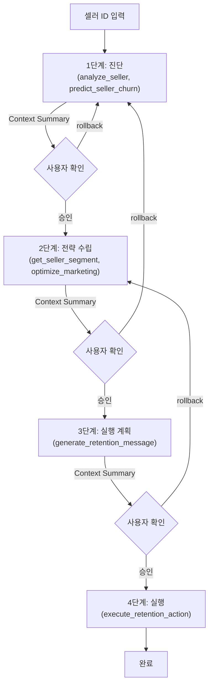
```mermaid
flowchart TD
    INPUT["셀러 ID 입력"] --> DIAG["1단계: 진단<br/>(analyze_seller, predict_seller_churn)"]
    DIAG -->|"Context Summary"| CONFIRM1{"사용자 확인"}
    CONFIRM1 -->|"승인"| STRAT["2단계: 전략 수립<br/>(get_seller_segment, optimize_marketing)"]
    CONFIRM1 -->|"rollback"| DIAG
    STRAT -->|"Context Summary"| CONFIRM2{"사용자 확인"}
    CONFIRM2 -->|"승인"| PLAN["3단계: 실행 계획<br/>(generate_retention_message)"]
    CONFIRM2 -->|"rollback"| DIAG
    PLAN -->|"Context Summary"| CONFIRM3{"사용자 확인"}
    CONFIRM3 -->|"승인"| EXEC["4단계: 실행<br/>(execute_retention_action)"]
    CONFIRM3 -->|"rollback"| STRAT
    EXEC --> DONE["완료"]
```

#### 4단계 워크플로우

| 단계 | 이름 | 사용 도구 | 설명 |
|------|------|-----------|------|
| 1 | **진단** | `analyze_seller`, `predict_seller_churn` | 셀러 현황 분석 + 이탈 위험도 파악 |
| 2 | **전략 수립** | `get_seller_segment`, `optimize_marketing` | 세그먼트 기반 최적 전략 도출 |
| 3 | **실행 계획** | `generate_retention_message` | 맞춤 리텐션 메시지 및 구체적 실행 계획 수립 |
| 4 | **실행** | `execute_retention_action` | 자동 조치 실행 (쿠폰/업그레이드/매니저 배정/메시지) |

#### 주요 특징

| 특징 | 설명 |
|------|------|
| **Human-in-the-Loop** | 각 단계 완료 후 사용자 확인을 받아야 다음 단계 진행 |
| **Rollback** | "다시", "돌아가", "취소" 등 키워드 감지 시 이전 단계로 복귀 |
| **Context Summary Layer** | 각 단계의 분석 결과를 요약하여 다음 단계에 전달 — 컨텍스트 윈도우 효율화 |
| **세션 관리** | 30분 TTL, 최대 100세션, LRU 방식 자동 정리 |
| **SSE 스트리밍** | 기존 에이전트와 동일한 7종 SSE 이벤트 프로토콜 사용 |

#### 파일 구조

| 파일 | 역할 |
|------|------|
| `agent/consulting_agent.py` | StateGraph 정의 + 4단계 노드 + 세션 관리 + rollback 로직 |
| `agent/consulting_prompts.yaml` | 단계별 시스템 프롬프트 (진단/전략/계획/실행) |
| `api/routes_consulting.py` | REST API 3개 엔드포인트 |

#### API 엔드포인트

| Method | Endpoint | 설명 |
|--------|----------|------|
| POST | `/api/consulting/stream` | 컨설팅 세션 SSE 스트리밍 (셀러 ID + 단계 진행) |
| GET | `/api/consulting/sessions` | 활성 컨설팅 세션 목록 |
| DELETE | `/api/consulting/sessions/{id}` | 컨설팅 세션 삭제 |

---

## 7. RAG 시스템

### 7.1 적용 기법 요약 (7종)

단일 RAG 기법만으로는 이커머스 도메인의 다양한 질문 유형(정책 조회, 개념 설명, 절차 안내 등)을 커버하기 어렵습니다. 키워드 매칭이 강한 BM25, 의미 검색이 강한 FAISS, 관계 추론이 강한 Knowledge Graph 등 각 기법의 강점을 조합하여 검색 품질을 극대화합니다.

| # | 기법 | 효과 | 출처/논문 | 런타임 추가 | 프론트엔드 상태 |
|---|------|------|-----------|-------------|----------------|
| 1 | **Hybrid Search** (FAISS + BM25 + RRF) | 의미 + 키워드 검색 결합 | - | ~30ms | 활성 |
| 2 | **RAG-Fusion** (Multi-Query) | 4개 변형 쿼리로 리콜 향상 | - | ~50ms (LLM) | 활성 |
| 3 | **Parent-Child Chunking** | 정밀 검색(500자) + 충분한 컨텍스트(3,000자) | - | 0ms | 활성 |
| 4 | **Contextual Retrieval** | 검색 정확도 +20~35% | [Anthropic Blog](https://www.anthropic.com/news/contextual-retrieval) | 인덱싱 시 | 미적용 |
| 5 | **LightRAG** | 경량 지식그래프, 99% 토큰 절감 | [arXiv:2410.05779](https://arxiv.org/abs/2410.05779) | ~100ms | 시험용 |
| 6 | **K2RAG** | KG + Hybrid + Corpus Summarization | [arXiv:2507.07695](https://arxiv.org/abs/2507.07695) | 가변 | 시험중 |
| 7 | **Cross-Encoder Reranking** | 정밀 재순위 정확도 향상 | - | ~80ms | 비활성 |

### 7.1.1 모듈 아키텍처 (리팩토링)

기존 `service.py` 단일 파일(2,984줄)을 **파사드 패턴**으로 분리하여 유지보수성을 개선했습니다.

| 모듈 | 줄 수 | 역할 |
|------|-------|------|
| `service.py` | 831 | RAG 파사드 (검색 인터페이스 통합, content 짧을 시 parent chunk 보강) |
| `chunking.py` | - | 청킹 로직 (Parent 3,000자 / Child 500자) |
| `search.py` | - | 검색 엔진 (BM25, Vector, Hybrid, RAG-Fusion) |
| `kg.py` | - | Knowledge Graph |
| `contextual.py` | - | Contextual Retrieval (LLM 컨텍스트 생성) |

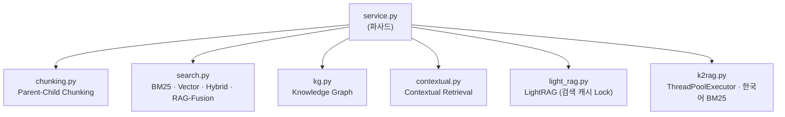
```mermaid
flowchart TD
    SVC["service.py<br/>(파사드)"]
    SVC --> CHK["chunking.py<br/>Parent-Child Chunking"]
    SVC --> SCH["search.py<br/>BM25 · Vector · Hybrid · RAG-Fusion"]
    SVC --> KG["kg.py<br/>Knowledge Graph"]
    SVC --> CTX["contextual.py<br/>Contextual Retrieval"]
    SVC --> LR["light_rag.py<br/>LightRAG (검색 캐시 Lock)"]
    SVC --> K2["k2rag.py<br/>ThreadPoolExecutor · 한국어 BM25"]
```

### 7.2 Hybrid Search (FAISS + BM25)

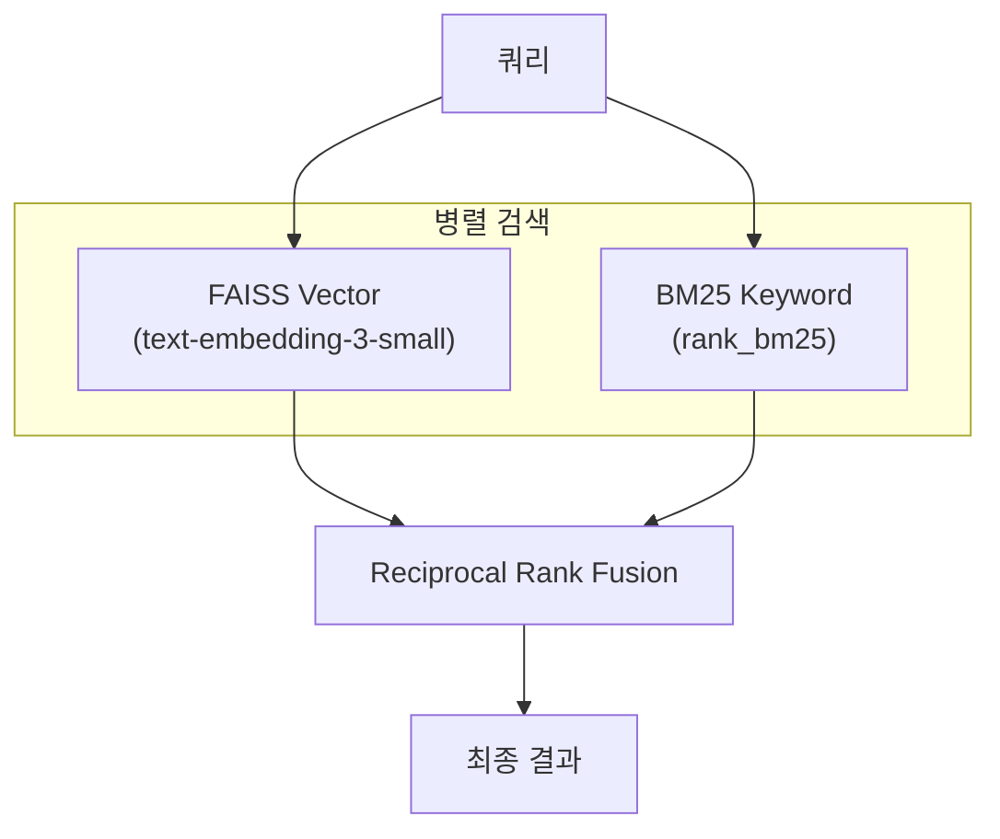
```mermaid
flowchart TB
    Q["쿼리"]

    subgraph Search["병렬 검색"]
        FAISS["FAISS Vector<br/>(text-embedding-3-small)"]
        BM25["BM25 Keyword<br/>(rank_bm25)"]
    end

    RRF["Reciprocal Rank Fusion"]

    Q --> FAISS --> RRF
    Q --> BM25 --> RRF
    RRF --> Result["최종 결과"]
```

- **Vector Search**: 의미적 유사도 (코사인 거리)
- **BM25**: 정확한 키워드 매칭 (TF-IDF 기반)
- **RRF**: 두 결과를 순위 기반으로 융합

### 7.3 RAG-Fusion (Multi-Query)

단일 쿼리를 LLM으로 4개 변형 쿼리로 확장 후 병렬 검색:

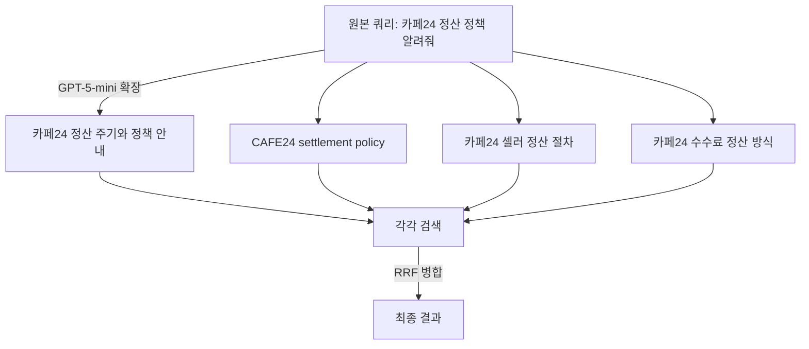
```mermaid
flowchart TD
    A["원본 쿼리: 카페24 정산 정책 알려줘"] -->|GPT-5-mini 확장| B["카페24 정산 주기와 정책 안내"]
    A --> C["CAFE24 settlement policy"]
    A --> D["카페24 셀러 정산 절차"]
    A --> E["카페24 수수료 정산 방식"]
    B --> F["각각 검색"]
    C --> F
    D --> F
    E --> F
    F -->|RRF 병합| G["최종 결과"]
```

### 7.4 Contextual Retrieval

> **출처**: [Anthropic Blog](https://www.anthropic.com/news/contextual-retrieval) | 검색 정확도 +20~35%

인덱싱 시점에 각 청크에 **LLM 생성 컨텍스트**를 추가하여 검색 품질 향상:

```
원본 청크:
"정산은 매월 1일과 15일에 진행됩니다"

-> GPT-5-mini 컨텍스트 생성

컨텍스트 추가된 청크:
"[문서: 카페24 정산 정책 가이드] [섹션: 3. 정산 주기]
이 청크는 카페24 플랫폼의 셀러 정산 주기에 대한 내용입니다.
정산은 매월 1일과 15일에 진행됩니다"
```

**구현**: `rag/contextual.py` - `_generate_contextual_prefix()`

### 7.5 Parent-Child Chunking

작은 청크(Child)로 정밀 검색, 큰 청크(Parent)로 충분한 컨텍스트 반환:

| 레벨 | 크기 | 용도 |
|------|------|------|
| **Parent** | 3,000자 | 최종 반환 (충분한 문맥). content가 짧을 시 parent chunk로 자동 보강 |
| **Child** | 500자 | 검색 인덱싱 (정밀 매칭) |

### 7.6 LightRAG (지식 그래프)

> **출처**: [LightRAG Paper](https://arxiv.org/abs/2410.05779) | 99% 토큰 절감

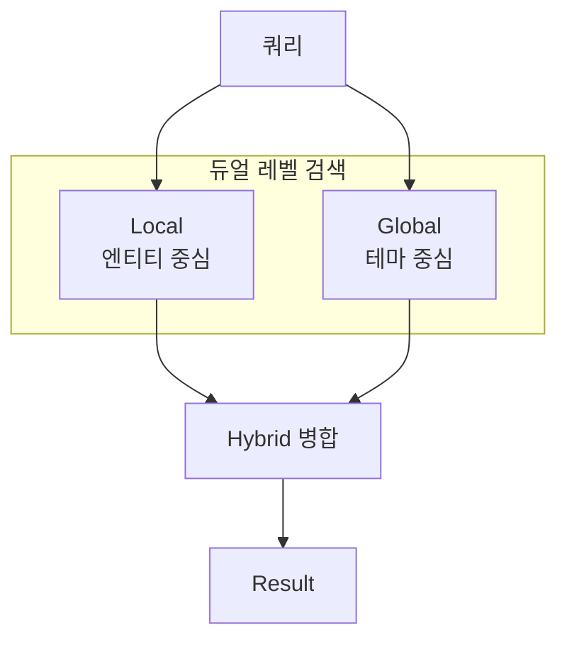
```mermaid
flowchart TB
    Q["쿼리"]

    subgraph DualLevel["듀얼 레벨 검색"]
        LOCAL["Local<br/>엔티티 중심"]
        GLOBAL["Global<br/>테마 중심"]
    end

    Q --> LOCAL & GLOBAL --> HYBRID["Hybrid 병합"] --> Result
```

| 모드 | 용도 | 예시 |
|------|------|------|
| `local` | 구체적 엔티티 | "카페24 정산 주기는?" |
| `global` | 추상적 테마 | "카페24 플랫폼 전체 운영 정책은?" |
| `hybrid` | 조합 (권장) | 대부분의 질문 |
| `naive` | 단순 검색 | 워밍업 등 |

**성능 최적화:**

| 최적화 | 설명 |
|--------|------|
| **검색 캐싱** | TTL 5분, 최대 100개 항목, `threading.Lock` 스레드 안전성 확보 |
| **쿼리 정규화** | 대소문자/공백/물음표 통일 -> 캐시 히트율 향상 |
| **단순 쿼리 스킵** | 인사, 단답, 3글자 이하 -> RAG 호출 생략 |
| **OpenAI 클라이언트 싱글톤** | 연결 오버헤드 감소 |

### 7.7 K2RAG (개발 중)

> **출처**: [arxiv:2507.07695](https://arxiv.org/abs/2507.07695) (July 2025)

K2RAG는 Knowledge Graph + Hybrid Search + Corpus Summarization을 결합한 고급 RAG:

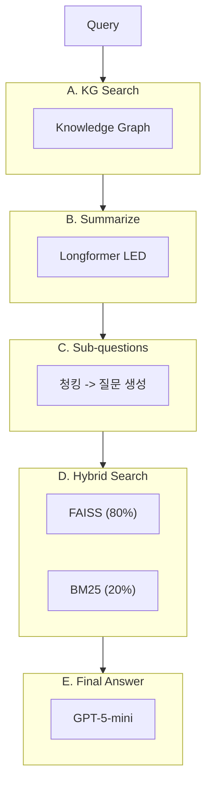
```mermaid
flowchart TB
    Q["Query"]

    subgraph StepA["A. KG Search"]
        KG["Knowledge Graph"]
    end

    subgraph StepB["B. Summarize"]
        Sum["Longformer LED"]
    end

    subgraph StepC["C. Sub-questions"]
        SubQ["청킹 -> 질문 생성"]
    end

    subgraph StepD["D. Hybrid Search"]
        Dense["FAISS (80%)"]
        Sparse["BM25 (20%)"]
    end

    subgraph StepE["E. Final Answer"]
        Final["GPT-5-mini"]
    end

    Q --> StepA --> StepB --> StepC --> StepD --> StepE
```

**핵심 특징:**

| 특징 | 설명 | 효과 |
|------|------|------|
| **Corpus Summarization** | 인덱싱 시 문서 요약 | 학습 시간 93% 감소 |
| **Hybrid Search** | lambda=0.8 (Dense 80% + Sparse 20%) | 정확도 + 리콜 균형 |
| **Sub-question Generation** | KG 결과에서 서브 질문 생성 | 복잡한 질문 분해 |
| **Longformer LED** | `pszemraj/led-base-book-summary` | 긴 문서 요약 (GPU 지원) |
| **ThreadPoolExecutor** | `asyncio.run()` → ThreadPoolExecutor 우회 | 이벤트 루프 충돌 방지 |
| **한국어 BM25 토큰화** | 조사 제거 + 바이그램 생성 | 한국어 검색 정확도 향상 |

### 7.8 문서 소스

`rag_docs/` 폴더의 **카페24 플랫폼 가이드 PDF**:

| 파일 | 내용 |
|------|------|
| `카페24_플랫폼_가이드.pdf` | 플랫폼 종합 가이드 |
| `카페24_정산_정책.pdf` | 정산 주기, 수수료, 정산 절차 |
| `카페24_CS_매뉴얼.pdf` | CS 응대 매뉴얼 |
| `카페24_셀러_온보딩.pdf` | 셀러 가입/쇼핑몰 개설 절차 |
| `카페24_배송_가이드.pdf` | 배송 설정, 택배사 연동 |
| `카페24_마케팅_가이드.pdf` | 프로모션, 쿠폰, 할인 설정 |
| `카페24_API_레퍼런스.pdf` | 외부 연동 API 문서 |
| `카페24_보안_정책.pdf` | 보안 가이드라인, 사기방지 |

---

## 8. ML 모델

### 8.0 왜 ML 모델을 만들었는가

카페24 플랫폼 운영에서 반복적으로 발생하는 **수작업 분석/판단**을 자동화하기 위해 11개의 ML 모델(Guardian 이상탐지 포함) + 마케팅 최적화 메타휴리스틱을 개발했습니다. 각 모델은 실제 운영에서 직면하는 구체적 비즈니스 문제를 해결합니다.

**핵심 설계 원칙:**
- **AI 에이전트 통합**: 모든 ML 모델은 독립 실행이 아닌 AI 에이전트의 Tool Calling을 통해 호출됩니다. 사용자가 자연어로 질문하면 에이전트가 적절한 모델을 선택하여 결과를 자연어로 설명합니다.
- **MLflow 추적**: 모든 학습 실험은 MLflow에 기록되어, 프론트엔드에서 모델 버전을 선택하면 실시간으로 state.py의 모델이 교체됩니다.
- **Graceful Degradation**: LightGBM/XGBoost/SHAP 미설치 시 scikit-learn 기본 알고리즘으로 자동 대체됩니다.

**데이터 부재 해결**: 실제 카페24 데이터에 접근할 수 없으므로, `ml/train_models.py`에서 **NumPy 기반 통계적 분포**로 현실적 합성 데이터를 생성합니다 (Faker 미사용). `np.random.default_rng(42)` 시드 고정으로 재현성을 보장하며, 로그정규분포(가격/매출), 베타분포(환불률), 포아송분포(주문수) 등 도메인에 맞는 분포를 사용하여 실제 이커머스 패턴을 모사합니다.

### 8.1 모델 개요

| # | 모델 | 알고리즘 | 비즈니스 문제 | 출력 |
|---|------|---------|-------------|------|
| 1 | **셀러 이탈 예측** | RandomForest + SHAP | 이탈 위험 셀러를 사전 식별하여 선제적 리텐션 조치 | 확률 (0~1) + SHAP 원인 분석 |
| 2 | **이상거래 탐지** | Isolation Forest | 허위 주문, 리뷰 조작 등 비정상 패턴의 자동 감지 | 정상(1)/이상(-1) + 이상 점수 |
| 3 | **문의 자동 분류** | TF-IDF + RF | CS 담당자 수동 분류 업무를 자동화 (9개 카테고리) | 카테고리 + 신뢰도 |
| 4 | **셀러 세그먼트** | K-Means (5) | 셀러 행동 패턴별 맞춤 운영 전략 수립 | 클러스터 ID (0~4) |
| 5 | **매출 예측** | LightGBM | 다음 달 매출을 예측하여 리소스 배분/KPI 설정 지원 | 금액 (원) |
| 6 | **CS 응답 품질** | RandomForest | CS 문의 긴급도를 자동 판단하여 우선 처리 대상 선별 | urgent/high/normal/low |
| 7 | **고객 LTV 예측** | GradientBoosting | 고객 생애가치를 예측하여 VIP 관리/마케팅 전략 수립 | 금액 (원) |
| 8 | **리뷰 감성 분석** | TF-IDF + LogisticRegression | 상품 리뷰 감성 자동 분류로 셀러 품질 모니터링 | 긍정/부정/중립 |
| 9 | **상품 수요 예측** | XGBoost | 다음 주 주문량을 예측하여 재고 관리/프로모션 기획 | 수량 |
| 10 | **정산 이상 탐지** | DBSCAN | 정산 금액/주기의 이상 패턴을 탐지하여 오류/부정 방지 | 정상/이상 클러스터 |
| 11 | **Guardian 이상탐지** | Isolation Forest | DB 쿼리의 비정상 패턴 탐지 (7개 피처 기반 위험도 스코어링) | 이상 점수 (0~1) |
| + | **마케팅 최적화** | P-PSO (mealpy) | 예산 제약 내 GMV 증가를 최대화하는 채널 조합 탐색 | 채널별 투자 추천 |

### 8.1.1 모델별 데이터 생성 방법

모든 학습 데이터는 `ml/train_models.py`에서 **NumPy random** (`np.random.default_rng(42)`)으로 생성합니다. 외부 라이브러리(Faker 등)는 사용하지 않습니다.

| # | 모델 | 학습 데이터 | 생성 방법 | 데이터 규모 |
|---|------|-----------|----------|-----------|
| 1 | 셀러 이탈 예측 | `seller_analytics_df` | 셀러 상태(active/dormant/churned)를 label로, 9개 피처(주문수, 매출, 환불률, 로그인 경과일 등)를 beta/exponential 분포로 생성 | 300명 (churned ~12%) |
| 2 | 이상거래 탐지 | `seller_analytics_df` (비지도) | 정상 셀러 데이터에서 StandardScaler 정규화 후 비지도 학습, contamination=5% | 300명 |
| 3 | 문의 자동 분류 | `CS_INQUIRY_TEMPLATES` | 9개 카테고리(배송~기타) x 10개 템플릿 x 20개 노이즈 변형 = 1,800건. TF-IDF(1000, ngram 1~2) 벡터화 | ~1,800건 |
| 4 | 셀러 세그먼트 | `seller_analytics_df` (비지도) | 6개 피처를 StandardScaler 정규화 후 K-Means(k=5) 클러스터링. 센트로이드 매출 기준으로 이름 자동 부여 | 300명 |
| 5 | 매출 예측 | 셀러별 매출 + 성장률 | `total_revenue * (1 + growth_rate) + noise`로 다음달 매출 타겟 생성. 업종/지역을 정수 인코딩 | 300건 |
| 6 | CS 응답 품질 | 합성 CS 티켓 | 7개 카테고리 x 4등급 x 6피처를 규칙 기반으로 생성 (환불+부정감성 → urgent 확률 상승 등) | 2,000건 |
| 7 | 고객 LTV | 합성 고객 데이터 | 구매횟수(Poisson), 주문금액(LogNormal), 가입일수 등으로 LTV 공식 적용 (`total * log(count) * (1-return_rate)`) | 3,000명 |
| 8 | 리뷰 감성 분석 | `REVIEW_TEMPLATES_*` | 긍정/부정/중립 각 15개 템플릿 x 30개 노이즈 변형 = 1,200건. TF-IDF(1000, ngram 1~2) 벡터화 | ~1,200건 |
| 9 | 상품 수요 예측 | 합성 주간 주문 데이터 | 4주 주문량(Poisson) + 추세/프로모션 효과로 다음주 수요 산출 | 2,000건 |
| 10 | 정산 이상 탐지 | 합성 정산 데이터 | 정상 ~950건(LogNormal 금액) + 이상 50건(고액/고수수료/장기정산) 결합 후 DBSCAN | ~1,000건 |
| 11 | Guardian 이상탐지 | `guardian.db` 감사 로그 | 7개 피처(액션종류, 코어테이블여부, 행수, log1p(행수), 영향금액, 시간, 야간여부)를 StandardScaler 정규화 후 IsolationForest(contamination=5%) | 감사 로그 수 |

### 8.1.2 알고리즘 선택 근거

| 모델 | 알고리즘 | 선택 이유 |
|------|---------|----------|
| 셀러 이탈 예측 | RandomForest | 피처 중요도 해석 가능 + SHAP 호환성이 좋고, 불균형 데이터에 class_weight 적용 용이 |
| 이상거래 탐지 | Isolation Forest | 라벨 없는 비지도 학습에 적합, 고차원 데이터에서 이상치를 효율적으로 분리 |
| 문의 자동 분류 | TF-IDF + RF | 한국어 텍스트의 n-gram 패턴 포착 + 다중 클래스 분류 성능이 우수 |
| 셀러 세그먼트 | K-Means | 구현 단순, 해석 용이 (센트로이드 비교로 세그먼트 특성 파악 가능) |
| 매출 예측 | LightGBM | 범주형 피처 네이티브 지원, 빠른 학습 속도, 회귀 성능 우수 (미설치 시 GradientBoosting 대체) |
| CS 응답 품질 | RandomForest | 소규모 피처(6개)에서 안정적 성능, class_weight로 불균형 처리 |
| 고객 LTV | GradientBoosting | 비선형 관계 포착, 회귀 문제에 강건한 앙상블 |
| 리뷰 감성 분석 | LogisticRegression | TF-IDF 고차원 희소 행렬에 효율적, 다중 클래스(OvR) 지원 |
| 상품 수요 예측 | XGBoost | 시계열적 피처(주간 주문량)와 정적 피처(가격, 카테고리) 동시 처리 (미설치 시 GradientBoosting 대체) |
| 정산 이상 탐지 | DBSCAN | 클러스터 수를 사전 지정할 필요 없음, noise(-1)로 자연스럽게 이상치 분리 |
| Guardian 이상탐지 | Isolation Forest | 라벨 없는 DB 감사 로그에서 비정상 쿼리 패턴을 비지도 학습으로 탐지, 룰엔진 보완용 |

### 8.2 셀러 이탈 예측 + SHAP 해석

**비즈니스 문제**: 이커머스 플랫폼에서 셀러 이탈은 매출 직결 이슈입니다. 300명 중 약 12%가 churned 상태이며, 이탈 전 징후를 조기에 포착하면 선제적 리텐션 활동(쿠폰 발급, 전담 매니저 배정 등)이 가능합니다.

**기술적 접근**:
- **알고리즘**: RandomForest (`n_estimators=100`, `class_weight="balanced"`) -- 불균형 데이터(active 70% vs churned 12%)에서 소수 클래스 가중치 자동 조정
- **피처 엔지니어링**: 셀러 상태(active/dormant/churned)를 이진 라벨로 변환, 9개 행동/거래 피처 사용
- **모델 해석**: SHAP TreeExplainer로 개별 셀러의 이탈 원인을 피처 기여도로 분해

**이탈 모델 설정** (`churn_model_config.json`):

```json
{
  "features": [
    "total_orders", "total_revenue", "product_count",
    "cs_tickets", "refund_rate", "avg_response_time",
    "days_since_last_login", "days_since_register", "plan_tier_encoded"
  ],
  "feature_importances": {
    "total_orders": 0.357,
    "total_revenue": 0.304,
    "days_since_last_login": 0.188,
    "cs_tickets": 0.094, ...
  },
  "shap_available": true,
  "model_accuracy": 0.983,
  "model_f1": 0.933
}
```

**성능 지표**:
- **Accuracy**: 98.3% (test set 60명)
- **F1-score**: 93.3% (class_weight="balanced"로 소수 클래스 성능 확보)
- **Top 3 피처 중요도**: total_orders (35.7%) > total_revenue (30.4%) > days_since_last_login (18.8%)

**SHAP 출력 예시:**
```
SEL0123 이탈 예측: 73% (high)

피처                              SHAP     영향
--------------------------------------------------
days_since_last_login (14일)      +0.35   이탈 증가 (가장 큰 기여)
order_count (감소)                +0.22   이탈 증가
total_gmv (높음)                  -0.12   이탈 감소 (방어 요인)
```

**에이전트 연동**: `predict_seller_churn(seller_id)` Tool이 호출되면, 해당 셀러의 9개 피처를 추출하여 이탈 확률 + SHAP 기여도를 JSON으로 반환합니다. LLM이 이를 자연어로 설명합니다.

### 8.3 셀러 세그먼트 (K-Means)

**비즈니스 문제**: 300명의 셀러를 일괄적으로 관리하면 리소스 낭비가 발생합니다. 행동 패턴 기반으로 그룹화하여 세그먼트별 차별화된 운영 전략(파워 셀러에게 프리미엄 지원, 휴면 셀러에게 재활성화 프로모션 등)을 수립합니다.

**기술적 접근**:
- **피처**: total_orders, total_revenue, product_count, refund_rate, avg_response_time, days_since_last_login (6개)
- **전처리**: StandardScaler 정규화 (피처 스케일 차이 제거)
- **K=5 선정**: Silhouette Score 기반으로 최적 클러스터 수 결정
- **세그먼트 이름 자동 부여**: 센트로이드의 total_revenue를 기준으로 내림차순 정렬하여 의미 있는 이름 매핑

| ID | 세그먼트 | 특징 | 운영 전략 |
|----|----------|------|-----------|
| 0 | 성장형 셀러 (Growing Seller) | 중간 매출, 성장 가능성 | 교육 프로그램, 성장 가이드 |
| 1 | 휴면 셀러 (Dormant Seller) | 낮은 매출, 높은 환불률 (29%) | 재활성화 쿠폰, 원인 분석 |
| 2 | 우수 셀러 (Excellent Seller) | 높은 GMV (2.1억), 낮은 환불률 (8%) | 전담 매니저, 마케팅 지원 |
| 3 | 파워 셀러 (Power Seller) | 최고 GMV (2.7억), 최다 주문 (3,900+) | VIP 프로그램, 수수료 우대 |
| 4 | 관리 필요 셀러 (At-Risk Seller) | 낮은 매출, 적은 상품 수 | 긴급 개입, 이탈 방지 |

### 8.4 마케팅 최적화 (P-PSO)

**비즈니스 문제**: 마케팅 예산이 제한된 상황에서, 6개 광고 채널에 예산을 어떻게 배분해야 ROAS/매출이 최대화되는지를 결정하는 연속 최적화 문제입니다. 각 채널은 포화점(saturation point)이 있어 투자 대비 수익이 체감하므로, 단순 비례 배분이 아닌 메타휴리스틱 알고리즘을 사용합니다.

**기술적 접근**:
- **1단계 (매출 예측)**: `RevenuePredictor`(LightGBM)로 현재 셀러의 다음 달 매출 베이스라인을 예측
- **2단계 (최적화)**: mealpy 라이브러리의 P-PSO (Phasor Particle Swarm Optimization)로 6개 채널 예산 비율을 연속 변수(`FloatVar`)로 탐색
- **목적함수**: 3가지 목표 모드에 따라 ROAS 가중 / 매출 가중 / 균형 목적함수를 선택

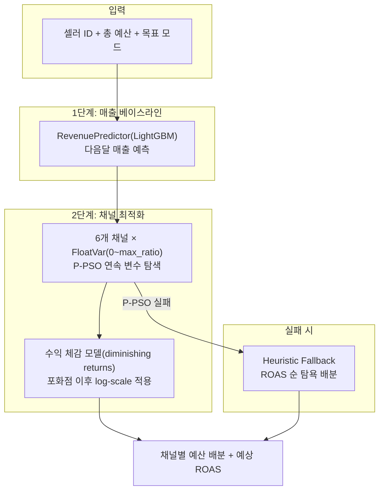
```mermaid
flowchart TB
    subgraph Input["입력"]
        A["셀러 ID + 총 예산 + 목표 모드"]
    end

    subgraph Step1["1단계: 매출 베이스라인"]
        B["RevenuePredictor(LightGBM)<br/>다음달 매출 예측"]
    end

    subgraph Step2["2단계: 채널 최적화"]
        C["6개 채널 × FloatVar(0~max_ratio)<br/>P-PSO 연속 변수 탐색"]
        D["수익 체감 모델(diminishing returns)<br/>포화점 이후 log-scale 적용"]
    end

    subgraph Fallback["실패 시"]
        F["Heuristic Fallback<br/>ROAS 순 탐욕 배분"]
    end

    A --> B --> C
    C --> D --> E["채널별 예산 배분 + 예상 ROAS"]
    C -->|"P-PSO 실패"| F --> E
```

**6개 마케팅 채널** (`ml/marketing_optimizer.py`):

| 채널 | 기대 ROAS | 포화점 (saturation) | 매출 상승 계수 | 최대 예산 비율 |
|------|-----------|---------------------|---------------|---------------|
| **검색 광고** (search_ads) | 4.5x | 300만원 | 0.15 | 40% |
| **디스플레이 광고** (display_ads) | 2.8x | 500만원 | 0.08 | 30% |
| **소셜 미디어** (social_media) | 3.2x | 200만원 | 0.12 | 35% |
| **이메일 마케팅** (email_marketing) | 6.0x | 100만원 | 0.05 | 15% |
| **인플루언서** (influencer) | 2.5x | 400만원 | 0.10 | 25% |
| **콘텐츠 마케팅** (content_marketing) | 3.8x | 150만원 | 0.07 | 20% |

**수익 체감 모델 (Diminishing Returns)**:
```
예산 <= 포화점: revenue_uplift = budget × uplift_coefficient  (선형 구간)
예산 >  포화점: revenue_uplift = saturation_rev × (1 + log(budget / saturation_point))  (체감 구간)
```
포화점 이전에는 투자 금액에 비례하여 매출이 증가하지만, 포화점을 넘으면 로그 스케일로 체감합니다.

**3가지 최적화 목표 모드**:

| 모드 | 목적함수 | 적합한 상황 |
|------|---------|------------|
| `maximize_roas` | `total_revenue / total_cost` 최대화 (ROAS 가중 1.5) | 예산 효율 중시, 소규모 셀러 |
| `maximize_revenue` | `total_revenue` 최대화 (매출 가중 1.5) | 공격적 성장, 파워 셀러 |
| `balanced` | `revenue × roas` 균형 최적화 | 일반적 상황 (기본값) |

**P-PSO 파라미터:**

| 파라미터 | 값 | 설명 |
|----------|-----|------|
| `epoch` | 200 | 최적화 반복 횟수 |
| `pop_size` | 50 | 입자 수 (탐색 다양성) |
| `bounds` | `FloatVar` (0.0 ~ max_ratio) | 각 채널 예산 비율 (연속 변수) |
| `penalty` | 예산 초과 시 -999999 | 제약 조건 위반 패널티 |

**Graceful Degradation**:
- P-PSO 최적화 실패 시 → Heuristic Fallback: ROAS 내림차순으로 채널을 정렬하여 탐욕적(greedy) 배분
- 예산이 최소 채널 비용 미만 시 → Limited Budget Mode: ROAS 최상위 채널 1개에 집중 배분

### 8.5 MLflow 실험 추적

**도입 목적**: 12개 ML 모델의 학습 파라미터, 성능 메트릭, 모델 아티팩트를 체계적으로 관리하여, 모델 재학습 시 이전 실험과 비교하고 최적 버전을 선택할 수 있도록 합니다.

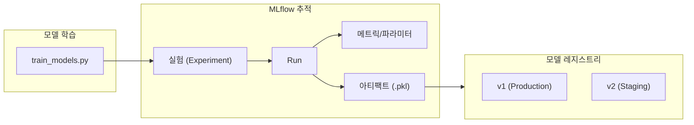
```mermaid
flowchart LR
    subgraph Training["모델 학습"]
        T1["train_models.py"]
    end

    subgraph MLflow["MLflow 추적"]
        E["실험 (Experiment)"]
        R["Run"]
        M["메트릭/파라미터"]
        A["아티팩트 (.pkl)"]
    end

    subgraph Registry["모델 레지스트리"]
        V1["v1 (Production)"]
        V2["v2 (Staging)"]
    end

    T1 --> E --> R --> M & A
    A --> Registry
```

**기술 스택:**
- **저장소**: 로컬 파일 기반 (`file:./mlruns`) -- 별도 서버 불필요
- **실험명**: `cafe24-ops-ai` (단일 실험에 모든 모델 Run 집중)
- **선택적 의존성**: MLflow 미설치 시 실험 추적을 건너뛰고 joblib 직렬화만 수행

**프론트엔드 연동 (실시간 모델 교체):**

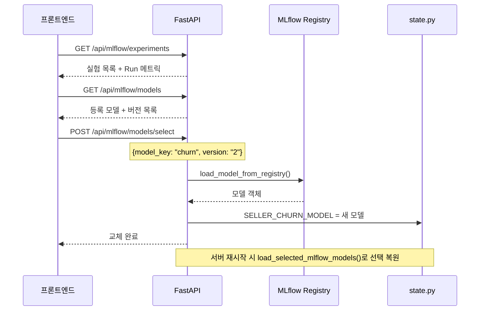
```mermaid
sequenceDiagram
    participant FE as 프론트엔드
    participant BE as FastAPI
    participant ML as MLflow Registry
    participant ST as state.py

    FE->>BE: GET /api/mlflow/experiments
    BE-->>FE: 실험 목록 + Run 메트릭

    FE->>BE: GET /api/mlflow/models
    BE-->>FE: 등록 모델 + 버전 목록

    FE->>BE: POST /api/mlflow/models/select
    Note over BE: {model_key: "churn", version: "2"}
    BE->>ML: load_model_from_registry()
    ML-->>BE: 모델 객체
    BE->>ST: SELLER_CHURN_MODEL = 새 모델
    BE-->>FE: 교체 완료

    Note over BE,ST: 서버 재시작 시 load_selected_mlflow_models()로 선택 복원
```

- 프론트엔드 ML모델 패널에서 실험/모델 목록을 조회하고 버전을 선택
- 선택 즉시 state.py의 글로벌 모델 변수가 교체되어 다음 API 호출부터 새 모델 적용
- 선택 상태는 파일에 영속화되어 서버 재시작 후에도 유지

### 8.6 매출 예측 모듈 상세 (RevenuePredictor)

`ml/revenue_model.py`의 `RevenuePredictor` 클래스는 개별 쇼핑몰의 다음 달 매출을 예측하는 독립 모듈입니다. 마케팅 최적화(8.4)의 베이스라인 매출 계산에도 사용됩니다.

**매출 예측 모델 파일 관계:**

| 파일 | 생성 출처 | 용도 |
|------|----------|------|
| `model_revenue_prediction.pkl` | `ml/train_models.py` | 셀러 매출/성장률 기반 다음달 매출 예측 (state.py 로드) |
| `model_revenue.pkl` | `ml/revenue_model.py` | 쇼핑몰 성과 7개 피처 기반 매출 예측 (RevenuePredictor 전용) |
| `scaler_revenue.pkl` | `ml/revenue_model.py` | RevenuePredictor 피처 정규화용 StandardScaler |

`train_models.py`는 셀러 분석 데이터(7개 피처: total_revenue, txn_count 등)로 학습하여 `model_revenue_prediction.pkl`로 저장합니다. `revenue_model.py`는 쇼핑몰 성과 데이터(7개 피처: monthly_revenue, monthly_orders 등)로 별도 학습하여 `model_revenue.pkl` + `scaler_revenue.pkl`로 저장합니다.

**핵심 설계:**
- **싱글턴 패턴**: `get_predictor()` 함수로 전역 인스턴스를 1회만 생성하여, 서버 전체에서 동일한 모델 객체를 재사용합니다
- **Auto-Training**: 서버 시작 시 `data/loader.py`에서 `shop_performance.csv`가 존재하면 자동으로 학습을 수행합니다
- **MLflow 연동**: 학습 완료 시 자동으로 MLflow에 등록되어 프론트엔드에서 버전 관리가 가능합니다

**7개 입력 피처:**

| # | 피처 | 설명 | 데이터 증강 시 영향 가중치 |
|---|------|------|--------------------------|
| 1 | `monthly_revenue` | 현재 월 매출 | 0.30 |
| 2 | `monthly_orders` | 월간 주문 수 | 0.25 |
| 3 | `monthly_visitors` | 월간 방문자 수 | 0.15 |
| 4 | `avg_order_value` | 평균 주문 금액 | 0.20 |
| 5 | `customer_retention_rate` | 고객 재구매율 | 0.25 |
| 6 | `conversion_rate` | 전환율 | 0.20 |
| 7 | `review_score` | 리뷰 평점 | 0.10 |

**합성 데이터 증강 전략** (`_generate_synthetic_data()`):
```
target_revenue = sum(feature[i] × impact_weight[i]) × (1 + noise)
noise ~ Uniform(-0.1, +0.1)
```
각 피처에 도메인 기반 영향 가중치를 적용하여 현실적인 매출 타겟을 생성합니다. 이 방식으로 실제 데이터가 부족한 상황에서도 모델 학습이 가능합니다.

**모델 사양:**
- **알고리즘**: LightGBM Regressor (`n_estimators=100`, `max_depth=4`, `learning_rate=0.1`)
- **검증**: 5-Fold Cross-Validation (R2 score)

### 8.7 에이전트 도구 레지스트리 (32개 Tool)

모든 ML 모델은 `agent/tool_schemas.py`의 `ALL_TOOLS` 리스트에 등록되어, AI 에이전트의 Tool Calling을 통해 호출됩니다. 사용자가 자연어로 질문하면 2단계 인텐트 라우터(키워드 + LLM fallback)가 적절한 도구를 선택합니다.

| 카테고리 | 도구명 | ML 모델 | 설명 |
|---------|--------|---------|------|
| **쇼핑몰** | `get_shop_info` | - | 쇼핑몰 정보 + 성과 KPI 조인 조회 |
| | `list_shops` | - | 카테고리/플랜/지역 필터링 목록 |
| | `get_shop_services` | - | 쇼핑몰별 이용 서비스 조회 |
| | `get_shop_performance` | - | 쇼핑몰 성과 KPI 상세 (총 주문 0건이면 avg_order_value=0 보정) |
| **카테고리** | `get_category_info` | - | 상품 카테고리 정보 (ID/이름 검색) |
| | `list_categories` | - | 전체 카테고리 목록 |
| **CS** | `auto_reply_cs` | - | CS 자동 응답 초안 생성 (LLM 연계) |
| | `check_cs_quality` | RandomForest | CS 티켓 우선순위 예측 + 권장사항 |
| | `get_cs_statistics` | - | CS 카테고리별 통계 집계 |
| | `get_ecommerce_glossary` | - | 이커머스 용어 검색 (부분 매칭) |
| **셀러 분석** | `analyze_seller` | - | 셀러 운영 데이터 종합 분석 |
| | `get_seller_segment` | K-Means | 셀러 세그먼트 분류 (ID 또는 피처) |
| | `detect_fraud` | IsolationForest | 이상거래 탐지 (기록 조회 + 실시간) |
| | `get_segment_statistics` | K-Means | 세그먼트별 평균 매출/주문/환불률 |
| | `get_fraud_statistics` | - | 전체 이상거래 유형별 통계 |
| **운영 로그** | `get_order_statistics` | - | 이벤트 유형별 통계 + 일별 추이 |
| | `get_seller_activity_report` | - | 셀러 활동 리포트 (2개 데이터소스 폴백) |
| **문의 분류** | `classify_inquiry` | TF-IDF + RF | CS 문의 텍스트 자동 분류 (Top-3 확률) |
| **RAG** | `search_platform` | - | FAISS 벡터 검색 |
| | `search_platform_lightrag` | - | LightRAG 듀얼 레벨 검색 |
| **대시보드** | `get_dashboard_summary` | - | 플랫폼 전체 운영 현황 종합 |
| **예측 분석** | `get_churn_prediction` | RandomForest+SHAP | 이탈 위험 셀러 목록 + SHAP 요인 분석 |
| | `get_gmv_prediction` | - | 월간 GMV 예측 + 플랜별 매출 분포 |
| | `get_cohort_analysis` | - | 코호트 리텐션 분석 (와이드 포맷, 요청 월 없으면 전체 코호트 폴백 반환) |
| | `get_trend_analysis` | - | **플랫폼 전체** KPI 트렌드 + 상관관계 분석 |
| **ML 예측** | `predict_seller_churn` | RandomForest+SHAP | 개별 셀러 이탈 확률 (소수점 2자리 정밀도) + SHAP 해석 |
| | `predict_shop_revenue` | LightGBM | 쇼핑몰 다음달 매출 예측 + 성과 분석 |
| | `optimize_marketing` | P-PSO | 마케팅 예산 최적 배분 (6채널) |
| **리텐션** | `get_at_risk_sellers` | RandomForest+SHAP | ML 이탈 예측 + SHAP 분석 (threshold/limit) |
| | `generate_retention_message` | LLM | 셀러별 맞춤 리텐션 메시지 생성 (LOW 위험은 LLM 스킵, 즉시 "불필요" 판단 반환) |
| | `execute_retention_action` | - | 리텐션 조치 실행 (coupon/upgrade_offer/manager_assign/custom_message) |

**Heuristic Fallback 패턴**: `predict_seller_churn`은 ML 모델 미로드 시 규칙 기반 스코어링(접속 경과일, 주문수, 매출, 환불률, CS 건수 가중합)으로 대체 작동합니다. `churn_probability`는 소수점 2자리(`round(...,2)`)로 반환됩니다.

---

## 9. 데이터 생성

### 9.1 합성 데이터 생성 (train_models.py)

> 데이터 생성의 배경과 설계 원칙은 [8.0 왜 ML 모델을 만들었는가](#80-왜-ml-모델을-만들었는가) 참조. 이 섹션에서는 생성되는 CSV 파일 스펙과 데이터 분포 규칙을 상세 기술합니다.

```bash
python ml/train_models.py
# PART 1: 설정 및 환경
# PART 2: 데이터 생성 (18개 CSV)
# PART 3: 모델 학습 (12개 ML 모델)
# PART 4: 저장 및 테스트 (+ Guardian 이상탐지 모델)
```

### 9.2 생성되는 CSV 파일 (18개)

| # | 파일명 | 행 수 | 설명 | 주요 분포/규칙 |
|---|--------|-------|------|---------------|
| 1 | `shops.csv` | 300 | 쇼핑몰 정보 (이름, 플랜, 카테고리, 지역, 상태) | active 70% / dormant 18% / churned 12% |
| 2 | `categories.csv` | 8 | 상품 카테고리 (패션~스포츠) | 고정 데이터 |
| 3 | `services.csv` | ~1,200 | 쇼핑몰별 서비스 (호스팅/결제/배송/마케팅) | 쇼핑몰당 2~6개 |
| 4 | `products.csv` | ~7,500 | 상품 정보 (이름, 가격, 카테고리) | 가격: LogNormal, 쇼핑몰당 10~40개 |
| 5 | `sellers.csv` | 300 | 셀러 기본 정보 (쇼핑몰과 1:1 매핑) | `S0001` → `SEL0001` |
| 6 | `operation_logs.csv` | ~30,000 | 운영 이벤트 로그 (8종 이벤트) | 셀러 상태별 로그 수 차등 |
| 7 | `seller_analytics.csv` | 300 | 셀러 분석 (세그먼트, 이탈확률, SHAP) | 모델 학습 후 예측값 기록 |
| 8 | `shop_performance.csv` | 300 | 쇼핑몰 성과 (매출, 전환율, 방문수) | 상태별 차등 분포 |
| 9 | `daily_metrics.csv` | 90 | 일별 플랫폼 KPI (90일간) | 주말 효과 1.12배 |
| 10 | `cs_stats.csv` | 9 | CS 카테고리별 통계 | 9개 카테고리 집계 |
| 11 | `fraud_details.csv` | ~15 | 이상거래 상세 (랜덤 추출 셀러) | 4종 이상 유형 |
| 12 | `cohort_retention.csv` | 6 | 코호트 리텐션 (2024-07~12) | Week1~12 감쇠 패턴 |
| 13 | `conversion_funnel.csv` | 6 | 전환 퍼널 (등록→활성→참여→전환→잔존) | 단계별 이탈률 반영 |
| 14 | `seller_activity.csv` | 27,000 | 셀러 일별 활동 (300명 x 90일) | 상태별 활동 승수 적용 |
| 15 | `platform_docs.csv` | 12 | 플랫폼 문서 메타데이터 | 고정 데이터 |
| 16 | `ecommerce_glossary.csv` | 14 | 이커머스 용어 사전 | 고정 데이터 |
| 17 | `seller_products.csv` | ~7,500 | 셀러-상품 매핑 | products.csv 기반 |
| 18 | `seller_resources.csv` | 300 | 셀러 리소스 (스토리지, API 호출, 마케팅 예산) | 플랜별 쿼터 차등 |

### 9.3 데이터 생성 규칙

#### 쇼핑몰/셀러 상태별 데이터 분포

셀러 데이터는 쇼핑몰 상태(active/dormant/churned)에 따라 현실적 차등을 적용합니다:

| 피처 | active | dormant | churned |
|------|--------|---------|---------|
| `total_orders` | 100~5,000 | 50~800 | 5~200 |
| `total_revenue` | 주문수 x 25,000~120,000 | 주문수 x 20,000~90,000 | 주문수 x 15,000~80,000 |
| `last_login` 경과 | 0~7일 | 14~60일 | 가입일+α (오래 전) |
| `refund_rate` | Beta(2,20) 평균 ~9% | Beta(3,10) 평균 ~23% | Beta(3,10) |
| `avg_response_time` | Exponential(4)+0.5 | 동일 | 동일 |

#### 이벤트 로그 분포 (8종)

| 이벤트 | 가중치 | 설명 |
|--------|--------|------|
| `order_received` | 25% | 주문 접수 |
| `cs_ticket` | 15% | CS 문의 |
| `payment_settled` | 13% | 결제 정산 |
| `product_listed` | 12% | 상품 등록 |
| `product_updated` | 10% | 상품 수정 |
| `login` | 10% | 로그인 |
| `refund_processed` | 8% | 환불 처리 |
| `marketing_campaign` | 7% | 마케팅 캠페인 |

#### 이상거래 데이터

전체 300명 중 15명을 랜덤 추출하여 이상거래 플래그 부여:

| 이상 유형 | 설명 |
|----------|------|
| `high_refund` | 환불률 급증 |
| `fake_review` | 비정상 리뷰 패턴 |
| `price_manipulation` | 가격 이상 변동 |
| `unusual_volume` | 주문량 급변 |

---

## 10. API 엔드포인트

모든 API는 `/api` prefix를 사용합니다. `routes.py`가 **10개 도메인별 라우터**를 단일 `APIRouter`로 통합하며, `main.py`에서 이 라우터 하나만 include합니다.

### 라우터 파일 매핑

| 라우터 파일 | 도메인 | 주요 엔드포인트 |
|------------|--------|---------------|
| `routes_shop.py` | 쇼핑몰/상품/대시보드/분석 | `/api/shops/*`, `/api/categories/*`, `/api/orders/*`, `/api/dashboard/*`, `/api/analysis/*`, `/api/stats/*`, `/api/classify/*` |
| `routes_seller.py` | 셀러 관리 | `/api/sellers/*`, `/api/users/segments/*` |
| `routes_cs.py` | CS/고객지원 | `/api/cs/*`, `/api/classify/*` |
| `routes_rag.py` | RAG/LightRAG/K2RAG | `/api/rag/*`, `/api/lightrag/*`, `/api/k2rag/*` |
| `routes_ml.py` | ML/MLflow/마케팅 | `/api/mlflow/*`, `/api/marketing/*` |
| `routes_guardian.py` | Guardian/보안감시 | `/api/guardian/*` |
| `routes_agent.py` | 에이전트/채팅 | `/api/agent/*` |
| `routes_automation.py` | 자동화 엔진 | `/api/automation/retention/*`, `/api/automation/upgrade/*`, `/api/automation/faq/*`, `/api/automation/report/*`, `/api/automation/actions/*` |
| `routes_consulting.py` | 셀러 컨설팅 | `/api/consulting/stream`, `/api/consulting/sessions`, `/api/consulting/sessions/{id}` |
| `routes_admin.py` | 관리/설정/사용자 | `/api/settings/*`, `/api/users`, `/api/login` |

### API 응답 형식

모든 API 응답은 소문자 상태 코드를 사용합니다 (기존 `SUCCESS`/`ERROR`/`FAILED` → `success`/`error`로 통일):

```json
{
  "status": "success",
  "data": { ... }
}
```

### 인증/헬스

| Method | Endpoint | 설명 |
|--------|----------|------|
| POST | `/api/login` | 로그인 (Basic Auth) |
| GET | `/api/health` | 헬스체크 |

### 쇼핑몰/카테고리

| Method | Endpoint | 설명 |
|--------|----------|------|
| GET | `/api/shops` | 쇼핑몰 목록 |
| GET | `/api/shops/{id}` | 쇼핑몰 상세 |
| GET | `/api/shops/{id}/services` | 쇼핑몰 서비스 |
| GET | `/api/categories` | 카테고리 목록 |
| GET | `/api/categories/{id}` | 카테고리 상세 |

### 셀러 분석

| Method | Endpoint | 설명 |
|--------|----------|------|
| GET | `/api/sellers/search` | 셀러 검색 |
| GET | `/api/sellers/autocomplete` | 자동완성 검색 (seller_id + shop_name 매칭, 최대 10건) |
| GET | `/api/sellers/analyze/{seller_id}` | 셀러 종합 분석 |
| GET | `/api/sellers/{seller_id}/activity` | 셀러 활동 이력 (최근 주문/CS/로그인) |
| GET | `/api/sellers/performance` | 셀러 성과 순위 (Top 100, GMV/주문수 기준) |
| POST | `/api/sellers/segment` | 세그먼트 예측 |
| POST | `/api/sellers/fraud` | 이상거래 탐지 |
| GET | `/api/sellers/segments/statistics` | 세그먼트 통계 |
| GET | `/api/users/segments/{segment_name}/details` | 세그먼트 드릴다운 (소속 셀러 목록 + 개별 지표) |

### 분석

| Method | Endpoint | 설명 |
|--------|----------|------|
| GET | `/api/analysis/anomaly` | 이상치 분석 (IsolationForest 기반 이상 메트릭 탐지) |
| GET | `/api/analysis/prediction/churn` | 이탈 예측 전체 |
| GET | `/api/analysis/prediction/churn/user/{user_id}` | 개별 이탈 예측 |
| GET | `/api/analysis/cohort/retention` | 코호트 리텐션 |
| GET | `/api/analysis/trend/kpis` | KPI 트렌드 |
| GET | `/api/analysis/correlation` | Pearson 상관관계 행렬 (KPI 간 상관계수 히트맵) |

### CS

| Method | Endpoint | 설명 |
|--------|----------|------|
| POST | `/api/cs/reply` | CS 자동 응답 |
| POST | `/api/cs/quality` | CS 응답 품질/우선순위 예측 |
| GET | `/api/cs/glossary` | 이커머스 용어집 |
| GET | `/api/cs/statistics` | CS 통계 |

### CS 자동화 파이프라인

> **문의 주체**: 셀러(쇼핑몰 운영자)가 카페24 플랫폼에 보내는 문의 (배송 연동, PG 설정, API 개발 요청, 정산 문의 등)

| Method | Endpoint | 설명 |
|--------|----------|------|
| POST | `/api/classify/inquiry` | 단건 문의 분류 (9개 카테고리, 신뢰도) |
| POST | `/api/cs/pipeline` | 5단계 파이프라인 실행 (분류->검토->답변->회신->통계) |
| POST | `/api/cs/pipeline/answer` | RAG+LLM 답변 초안 생성 (SSE 스트리밍) |
| POST | `/api/cs/send-reply` | 회신 작업 시작 (job_id 발급 + n8n 트리거) |
| GET | `/api/cs/stream` | SSE 스트림 (job_id 기반 실시간 워크플로우 상태) |
| POST | `/api/cs/callback` | n8n 콜백 수신 (X-Callback-Token 인증, 단계별 상태 보고) |

**문의 카테고리 (9개):**
`배송` / `환불` / `결제` / `상품` / `계정` / `정산` / `기술지원` / `마케팅` / `기타`

**파이프라인 흐름:**

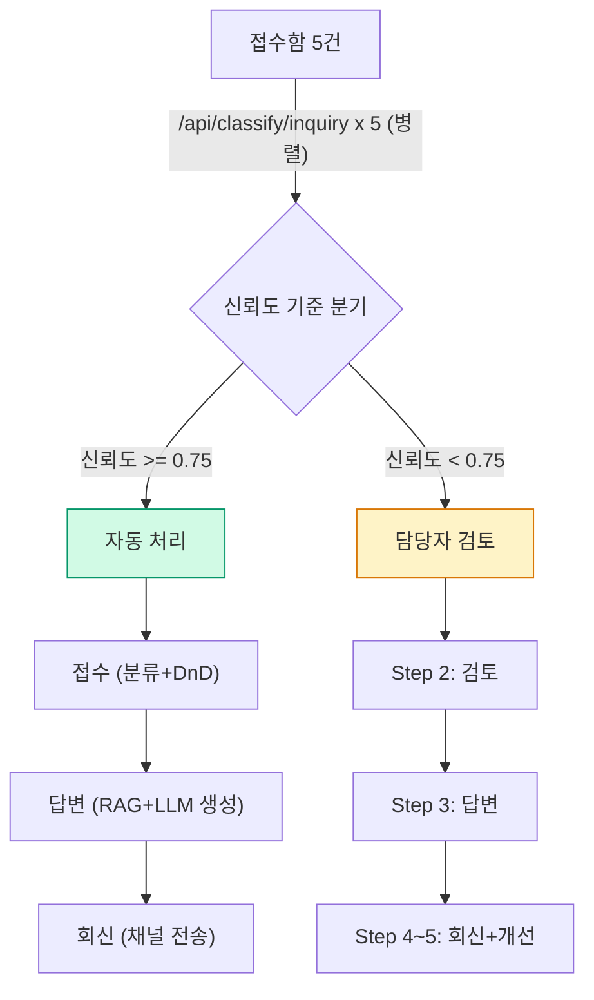
```mermaid
flowchart TD
    A["접수함 5건"] -->|"/api/classify/inquiry x 5 (병렬)"| B{"신뢰도 기준 분기"}
    B -->|"신뢰도 >= 0.75"| C["자동 처리"]
    B -->|"신뢰도 < 0.75"| D["담당자 검토"]

    C --> E["접수 (분류+DnD)"]
    E --> F["답변 (RAG+LLM 생성)"]
    F --> G["회신 (채널 전송)"]

    D --> H["Step 2: 검토"]
    H --> I["Step 3: 답변"]
    I --> J["Step 4~5: 회신+개선"]

    style C fill:#d1fae5,stroke:#059669
    style D fill:#fef3c7,stroke:#d97706
```

**API 엔드포인트 흐름:**

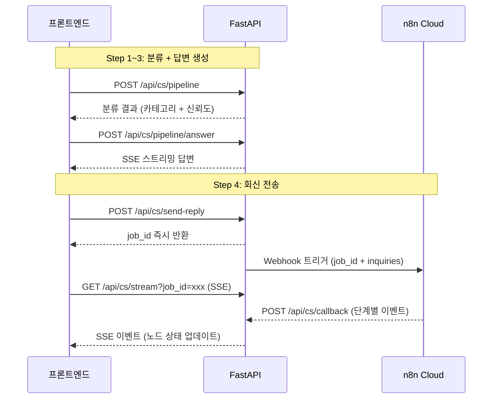
```mermaid
sequenceDiagram
    participant FE as 프론트엔드
    participant BE as FastAPI
    participant N8N as n8n Cloud

    Note over FE,BE: Step 1~3: 분류 + 답변 생성
    FE->>BE: POST /api/cs/pipeline
    BE-->>FE: 분류 결과 (카테고리 + 신뢰도)
    FE->>BE: POST /api/cs/pipeline/answer
    BE-->>FE: SSE 스트리밍 답변

    Note over FE,N8N: Step 4: 회신 전송
    FE->>BE: POST /api/cs/send-reply
    BE-->>FE: job_id 즉시 반환
    BE->>N8N: Webhook 트리거 (job_id + inquiries)
    FE->>BE: GET /api/cs/stream?job_id=xxx (SSE)
    N8N-->>BE: POST /api/cs/callback (단계별 이벤트)
    BE-->>FE: SSE 이벤트 (노드 상태 업데이트)
```

### 운영 통계

| Method | Endpoint | 설명 |
|--------|----------|------|
| GET | `/api/orders/statistics` | 주문/운영 이벤트 통계 (이벤트 유형별, 기간별) |

### 대시보드

| Method | Endpoint | 설명 |
|--------|----------|------|
| GET | `/api/dashboard/summary` | 대시보드 KPI |
| GET | `/api/dashboard/insights` | AI 인사이트 (트렌드/리텐션/CS품질/이상치 4종 동적 생성) |
| GET | `/api/dashboard/alerts` | 실시간 알림 (이상치 기반 자동 경고, severity 3단계) |
| GET | `/api/stats/summary` | 통계 요약 |

### RAG

| Method | Endpoint | 설명 |
|--------|----------|------|
| POST | `/api/rag/search` | 벡터 검색 |
| POST | `/api/rag/search/hybrid` | Hybrid Search |
| GET | `/api/rag/status` | RAG 상태 |
| GET | `/api/rag/files` | 업로드된 RAG 문서 목록 조회 |
| POST | `/api/rag/upload` | 문서 업로드 |
| POST | `/api/rag/delete` | RAG 문서 삭제 |
| POST | `/api/rag/reload` | 인덱스 재빌드 |

### LightRAG

| Method | Endpoint | 설명 |
|--------|----------|------|
| POST | `/api/lightrag/search` | LightRAG 검색 |
| POST | `/api/lightrag/search-dual` | 듀얼 검색 (모든 모드) |
| POST | `/api/lightrag/build` | 지식 그래프 빌드 |
| GET | `/api/lightrag/status` | LightRAG 상태 |
| POST | `/api/lightrag/clear` | 지식 그래프 초기화 (전체 삭제) |

### K2RAG

| Method | Endpoint | 설명 |
|--------|----------|------|
| POST | `/api/k2rag/search` | K2RAG 검색 (KG + Hybrid + Summary) |
| GET | `/api/k2rag/status` | K2RAG 상태 |
| POST | `/api/k2rag/config` | K2RAG 설정 업데이트 |
| POST | `/api/k2rag/load` | 기존 RAG 데이터 로드 |
| POST | `/api/k2rag/summarize` | 문서 요약 (Longformer LED 기반 Corpus Summarization) |

### AI 에이전트

| Method | Endpoint | 설명 |
|--------|----------|------|
| POST | `/api/agent/chat` | 동기 응답 |
| POST | `/api/agent/stream` | **SSE 스트리밍** |
| POST | `/api/agent/memory/clear` | 대화 메모리 초기화 |

#### SSE 스트리밍 상세 (`/api/agent/stream`)

**요청:**
```json
{
  "message": "이탈 예측 분석해줘",
  "username": "admin",
  "rag_mode": "auto",
  "multi_agent": true
}
```

**응답 헤더:**
```
Content-Type: text/event-stream
Cache-Control: no-cache
Connection: keep-alive
X-Accel-Buffering: no
```

**이벤트 흐름 (워커 직접 호출 - SHOP, SELLER 등 명확 intent):**
```
event: agent_start
data: {"agent": "search_agent", "description": "검색 에이전트 — 쇼핑몰/카테고리/플랫폼 정보 검색"}

event: tool_start
data: {"tool": "get_shop_info", "args": {...}}

event: tool_end
data: {"tool": "get_shop_info", "status": "success"}

event: delta
data: {"delta": "해당 쇼핑몰은..."}

event: agent_end
data: {"agent": "search_agent", "description": "검색 에이전트 — 쇼핑몰/카테고리/플랫폼 정보 검색"}

event: done
data: {"ok": true, "final": "...", "tool_calls": [...]}
```

**이벤트 흐름 (Supervisor 경유 - PLATFORM, GENERAL):**
```
event: tool_start (transfer_to_search_agent → agent_start로 변환)
data: → event: agent_start {"agent": "search_agent", ...}

event: tool_start
data: {"tool": "search_platform_docs", "args": {...}}

event: tool_end
data: {"tool": "search_platform_docs", "status": "success"}

event: delta
data: {"delta": "카페24 정산 정책은..."}

event: agent_end (supervisor 복귀 감지)
data: {"agent": "search_agent", ...}

event: done
data: {"ok": true, "final": "...", "tool_calls": [...]}
```

**구현 메커니즘:**
- LangGraph `astream_events` (v2) 사용
- `multi_agent: true` → 멀티에이전트 Supervisor(7개 전문 워커) 경로, 프론트엔드 기본값
- 하이브리드 라우팅: `INTENT_AGENT_MAP` → 워커 직접 / Supervisor 경유 분기
- `langgraph_checkpoint_ns` 파싱으로 외부 노드 식별 (워커 vs supervisor)
- `worker_responded` 플래그로 supervisor 재요약 방지
- 클라이언트 연결 단절 감지: `request.is_disconnected()`
- RAG 모드에 따른 도구 필터링 (데이터 카테고리는 RAG 스킵)
- SSE 이벤트 7종: `agent_start`, `agent_end`, `tool_start`, `tool_end`, `delta`, `done`, `error`

### MLflow

| Method | Endpoint | 설명 |
|--------|----------|------|
| GET | `/api/mlflow/experiments` | 실험 목록 |
| GET | `/api/mlflow/models` | 모델 레지스트리 |
| POST | `/api/mlflow/models/select` | 모델 선택/적용 |
| GET | `/api/mlflow/models/selected` | 현재 선택된 모델 버전 조회 |

### 설정

| Method | Endpoint | 설명 |
|--------|----------|------|
| GET/POST | `/api/settings/llm` | LLM 설정 (모델, temperature, maxTokens, top_p, presence_penalty, frequency_penalty, seed) |
| GET | `/api/settings/default` | 기본 설정 조회 (활성 시스템 프롬프트 포함) |
| GET/POST | `/api/settings/prompt` | 시스템 프롬프트 |
| POST | `/api/settings/prompt/reset` | 프롬프트 초기화 |
| POST | `/api/settings/llm/reset` | LLM 설정 초기화 (admin 전용) |

### OCR

| Method | Endpoint | 설명 |
|--------|----------|------|
| POST | `/api/ocr/extract` | 이미지 텍스트 추출 (EasyOCR, 선택적 RAG 연동으로 추출 텍스트 기반 문서 검색) |
| GET | `/api/ocr/status` | OCR 모듈 사용 가능 여부 (EasyOCR 설치 상태 확인) |

### 데이터 내보내기

| Method | Endpoint | 설명 |
|--------|----------|------|
| GET | `/api/export/csv` | CSV 내보내기 (`StreamingResponse`, sellers/shops/products/cs 지원) |
| GET | `/api/export/excel` | Excel 내보내기 (openpyxl, 다중 시트 + 서식 적용) |

### 마케팅 최적화

| Method | Endpoint | 설명 |
|--------|----------|------|
| GET | `/api/marketing/seller/{seller_id}` | 셀러별 마케팅 현황 (채널별 ROI, 예산 배분) |
| POST | `/api/marketing/optimize` | P-PSO 기반 마케팅 예산 최적화 (mealpy 라이브러리) |
| GET | `/api/marketing/status` | 최적화 작업 상태 조회 (비동기 실행 결과) |

### 사용자 관리 (RBAC)

| Method | Endpoint | 설명 |
|--------|----------|------|
| GET | `/api/users` | 사용자 목록 (admin 전용) |
| POST | `/api/users` | 사용자 생성 (admin 전용, 역할: admin/manager/viewer) |

### 셀러 컨설팅

| Method | Endpoint | 설명 |
|--------|----------|------|
| POST | `/api/consulting/stream` | 컨설팅 세션 SSE 스트리밍 (4단계 워크플로우 진행) |
| GET | `/api/consulting/sessions` | 활성 컨설팅 세션 목록 |
| DELETE | `/api/consulting/sessions/{id}` | 컨설팅 세션 삭제 |

### 도구/유틸리티

| Method | Endpoint | 설명 |
|--------|----------|------|
| GET | `/api/tools` | 사용 가능한 AI 도구 목록 (32개 도구 메타데이터) |

### Pydantic 요청 모델

주요 요청 모델 (`api/common.py` 및 각 도메인 라우터):

| 모델 | 용도 | 주요 필드 |
|------|------|----------|
| `AgentRequest` | 에이전트 호출 | `user_input`, `model`, `rag_mode`, `agent_mode`, `temperature`, `max_tokens` |
| `RagRequest` | RAG 검색 | `query`, `api_key`, `top_k` |
| `CsPipelineRequest` | CS 파이프라인 | `inquiry_text`, `seller_tier`, `confidence_threshold` |
| `CsPipelineAnswerRequest` | CS 답변 생성 | `inquiry_text`, `inquiry_category`, `rag_mode` |
| `HybridSearchRequest` | Hybrid Search | `query`, `top_k`, `use_reranking`, `use_kg` |
| `K2RagSearchRequest` | K2RAG 검색 | `query`, `top_k`, `use_kg`, `use_summary` |
| `MarketingOptimizeRequest` | 마케팅 최적화 | `seller_id`, `top_n`, `budget_constraints`, `max_iterations` |

### 에러 응답 형식

모든 API는 일관된 에러 응답 형식을 사용합니다 (소문자 `error` 상태):

```json
{
  "status": "error",
  "detail": "에러 메시지",
  "error_code": "ERROR_CODE"
}
```

**주요 에러 코드:**

| HTTP | 에러 코드 | 설명 |
|------|-----------|------|
| 400 | `INVALID_REQUEST` | 잘못된 요청 파라미터 |
| 401 | `UNAUTHORIZED` | 인증 실패 |
| 404 | `SELLER_NOT_FOUND` | 셀러 ID 없음 |
| 404 | `SHOP_NOT_FOUND` | 쇼핑몰 ID 없음 |
| 500 | `MODEL_NOT_LOADED` | ML 모델 로드 실패 |
| 500 | `RAG_NOT_READY` | RAG 인덱스 미준비 |
| 500 | `OPENAI_ERROR` | OpenAI API 호출 실패 |

---

## 11. n8n 워크플로우 자동화

### 11.1 아키텍처

CS 회신 전송을 n8n Cloud 워크플로우로 자동화합니다.

```mermaid
flowchart LR
    subgraph Frontend["Next.js"]
        F1["전송 클릭"]
        F2["React Flow<br/>워크플로우 시각화"]
    end

    subgraph Backend["FastAPI"]
        B1["POST /cs/send-reply<br/>job_id 발급"]
        B2["GET /cs/stream<br/>SSE 이벤트"]
        B3["asyncio.Queue<br/>단계별 이벤트"]
    end

    subgraph N8N["n8n Cloud"]
        W1["Webhook 트리거"]
        W2["답변 검증"]
        W3["채널 분기"]
        W4["채널별 발송"]
        W5["이메일 분리"]
        W6["Resend API<br/>개별 전송"]
        W7["결과 기록"]
    end

    subgraph Resend["Resend"]
        R1["POST /emails<br/>건별 발송"]
    end

    F1 --> B1 --> W1 --> W2 --> W3 --> W4 --> W5 --> W6 --> R1
    W6 --> W7 --> B3
    B3 --> B2 --> F2
```

### 11.2 워크플로우 노드 (10개)

| # | 노드 | 타입 | 역할 |
|---|------|------|------|
| 1 | Webhook 트리거 | Webhook v2 | POST `/cs-reply` 수신 |
| 2 | 답변 검증 | Code | `answer_text` 존재 여부 검증 |
| 3 | 채널 분기 | Code | 채널별 문의 매핑 (`channelMap`) |
| 4 | 채널별 발송 | Code | 이메일 아이템 생성 + 결과 배열 |
| 5 | 이메일 있는지 확인 | IF v2.2 | `hasEmail === true` (loose 모드) |
| 6 | 이메일 분리 | Code | `emailItems[]` -> 개별 n8n 아이템 분리 |
| 7 | Resend 이메일 발송 | HTTP Request v4.2 | `POST /emails` 건별 호출 |
| 8 | 이메일 결과 병합 | Code | 개별 응답 수집 -> 메타데이터 병합 |
| 9 | 결과 기록 | Code | 최종 로그 생성 |
| 10 | Respond to Webhook | Respond | JSON 응답 반환 |

#### 11.2.1 노드별 상세

**노드 1: Webhook 트리거** (`n8n-nodes-base.webhook` v2)
- HTTP Method: `POST`
- Path: `/cs-reply`
- Response Mode: `responseNode` (마지막 Respond 노드에서 응답)
- 입력 Payload: `{ job_id, inquiries[], channels[] }`

**노드 2: 답변 검증** (`n8n-nodes-base.code` v2)
- `raw.body || raw`로 webhook body 추출 (n8n 버전 호환)
- `inquiries` 배열에서 `answer_text`가 비어있는 항목 필터링
- 출력: `{ job_id, inquiries: validated[], validated_count }`
- 검증 실패 시 Error throw (`Invalid payload`)

**노드 3: 채널 분기** (`n8n-nodes-base.code` v2)
- `channels[]` 배열을 순회하며 `channelMap` 객체 생성
- 각 채널(email/kakao/sms/inapp)에 해당 문의를 매핑
- 문의의 `channels` 필드와 요청의 `channels` 필드를 교차 매칭

**노드 4: 채널별 발송** (`n8n-nodes-base.code` v2)
- **이메일 채널**: Markdown -> HTML 변환 (`**bold**` -> `<strong>`, `\n` -> `<br>`), 반응형 HTML 이메일 템플릿 생성 (gradient 헤더, 문의/답변 블록, 푸터)
- **카카오/SMS/인앱 채널**: 상태만 `sent`로 기록 (실제 발송은 각 채널 API 연동 필요)
- 출력: `{ results[], emailItems[], hasEmail }`

**노드 5: 이메일 있는지 확인** (`n8n-nodes-base.if` v2.2)
- 조건: `hasEmail === true` (loose type validation)
- True -> 이메일 분리 노드로 진행
- False -> 결과 기록 노드로 바로 이동 (이메일 발송 스킵)

**노드 6: 이메일 분리** (`n8n-nodes-base.code` v2)
- `emailItems[]` 배열을 **개별 n8n 아이템**으로 분리
- n8n의 아이템 기반 처리 방식을 활용하여 다음 HTTP Request 노드가 건별로 실행되도록 함
- 빈 배열 시 `{ _skip: true }` 반환

**노드 7: Resend 이메일 발송** (`n8n-nodes-base.httpRequest` v4.2)
- URL: `https://api.resend.com/emails`
- Authentication: Header Auth (`Authorization: Bearer re_...`)
- Body: `{ from, to[], subject, html }` -- 건별 JSON
- 노드 6에서 분리된 아이템 수만큼 반복 호출

**노드 8: 이메일 결과 병합** (`n8n-nodes-base.code` v2)
- Resend API 응답(email_id, status)을 수집
- 원본 메타데이터(job_id, 채널별 결과)와 병합

**노드 9: 결과 기록** (`n8n-nodes-base.code` v2)
- 최종 처리 로그 생성 (채널별 발송 건수, 성공/실패 집계)
- FastAPI 콜백 URL로 결과 전송 준비

**노드 10: Respond to Webhook** (`n8n-nodes-base.respondToWebhook`)
- 최종 JSON 응답을 Webhook 호출자(FastAPI)에게 반환
- 응답에 job_id, 처리 결과, 채널별 상태 포함

### 11.3 Resend 이메일 발송

| 항목 | 값 |
|------|-----|
| **API** | Resend (`POST https://api.resend.com/emails`) |
| **인증** | Header Auth (`Authorization: Bearer re_...`) |
| **발신자** | `CAFE24 CS <onboarding@resend.dev>` |
| **전송 방식** | 개별 전송 (건별 HTTP Request) |
| **무료 한도** | 100건/일, 3,000건/월 |

### 11.4 SSE 단계별 이벤트

```
event: step  ->  { node: "validate", status: "running" }
event: step  ->  { node: "validate", status: "completed", detail: "2건 검증 완료" }
event: step  ->  { node: "router",   status: "completed", detail: "1개 채널" }
event: step  ->  { node: "channel_email", status: "completed", detail: "2건 전송" }
event: step  ->  { node: "log",      status: "completed", detail: "이력 저장 완료" }
event: done  ->  { total: 2, channels: ["email"] }
```

### 11.5 n8n 워크플로우 설정

1. `cs_reply_workflow.json`을 n8n Cloud에 Import
2. "Resend 이메일 발송" 노드에 Header Auth credential 연결
   - Name: `Authorization`
   - Value: `Bearer {RESEND_API_KEY}`
3. 워크플로우 Activate (Publish)

---

## 12. 환경 설정

### 환경 변수

| 변수 | 필수 | 설명 |
|------|------|------|
| `OPENAI_API_KEY` | O | OpenAI API 키 (`openai_api_key.txt`로 대체 가능) |
| `MLFLOW_TRACKING_URI` | | MLflow 경로 (기본: `file:./mlruns`) |
| `MLFLOW_EXPERIMENT_NAME` | | 실험 이름 (기본: `cafe24-ops-ai`) |
| `N8N_WEBHOOK_URL` | | n8n Cloud 웹훅 URL (미설정 시 시뮬레이션 fallback) |
| `N8N_CALLBACK_URL` | | n8n -> FastAPI 콜백 URL (미설정 시 replay 모드) |
| `RESEND_API_KEY` | | Resend 이메일 API 키 (n8n credential에 설정) |

### LLM 기본 설정

| 설정 | 기본값 |
|------|--------|
| `selectedModel` | `gpt-5-mini` |
| `temperature` | `0.3` |
| `maxTokens` | `8000` |
| `timeoutMs` | `30000` |

### RAG 설정

| 설정 | 기본값 |
|------|--------|
| `RAG_EMBED_MODEL` | `text-embedding-3-small` |
| `RAG_DEFAULT_TOPK` | `5` |
| `RAG_SNIPPET_CHARS` | `1200` |
| `LIGHTRAG_TOP_K` | `3` |

### Startup 초기화 순서

서버 시작 시 `lifespan` 패턴(`@asynccontextmanager`)에서 실행되는 초기화 순서입니다. 기존 `@app.on_event("startup")` 방식에서 FastAPI 권장 lifespan 패턴으로 전환하였으며, 스택트레이스 클라이언트 노출을 제거했습니다. 실패 허용 단계(RAG, LightRAG)와 필수 단계(데이터/모델)를 구분하여, RAG 인덱스가 없어도 서버는 정상 기동됩니다.

```mermaid
flowchart LR
    S1["1. 로거 초기화"] --> S2["2. 시스템 프롬프트<br/>+ LLM 설정 로드"]
    S2 --> S3["3. 데이터/모델 로드<br/>(init_data_models)"]
    S3 --> S4["4. RAG 인덱스<br/>(FAISS)"]
    S4 --> S5["5. LightRAG<br/>인스턴스 초기화"]
```

| 단계 | 함수 | 설명 | 실패 시 |
|------|------|------|---------|
| 1 | `setup_logging()` | 로거 설정, PID 기록 | 서버 중단 |
| 2 | `load_system_prompt()` + `load_llm_settings()` | `system_prompt.json` / `llm_settings.json`에서 복원 | 기본값 사용 |
| 3 | `init_data_models()` | CSV 18개 + ML 모델 12개 + SHAP + 스케일러/인코더 + Guardian 모델 로드 | **서버 중단** (핵심 데이터) |
| 4 | `rag_build_or_load_index()` | FAISS 인덱스 생성/로드 (rag_docs/ PDF -> 청킹 -> 임베딩) | 경고 후 계속 |
| 5 | LightRAG 초기화 | 인스턴스 로드 (워밍업은 OpenAI rate limit 방지로 스킵) | 경고 후 계속 |

**데이터 로더 상세** (`data/loader.py` - `load_all_data()`):
| 단계 | 내용 | 수량 | 비고 |
|------|------|------|------|
| 1. CSV 데이터 | 기본 9종 + 분석 7종 | **16개** | `operation_logs`는 `nrows=30000` 메모리 제한 |
| 2. ML 모델 | 핵심 6개 + 신규 6개 | **12개** pkl | `load_model_safe()`로 파일 없어도 None 반환 |
| 3. 공용 도구 | TF-IDF 2개 + Scaler 1개 + LabelEncoder 4개 | **7개** pkl | |
| 4. 매출 예측 | `RevenuePredictor` 싱글턴 auto-training | 1개 | `shop_performance.csv` 기반 LightGBM |
| 5. 마케팅 최적화 | `MarketingOptimizer` import 확인 | 1개 | `mealpy` 없으면 비활성화 |
| 6. 캐시 구성 | `build_caches()` 쇼핑몰-서비스 매핑 | - | |
| 7. 시스템 상태 | `SYSTEM_STATUS` 업데이트 | - | 11개 모델 중 1+ 로드 시 `True` |
| 8. MLflow 복원 | 프론트엔드 선택 모델 버전 재적용 | - | YAML 영속화, Windows/Linux 감지 |

---

## 13. Core 모듈

`core/` 폴더는 프로젝트 전반에서 사용되는 핵심 유틸리티를 제공합니다.

### 13.1 constants.py

| 상수 | 설명 |
|------|------|
| `PLAN_TIERS` | 쇼핑몰 플랜 등급 (`Basic`, `Standard`, `Premium`, `Enterprise`) |
| `SHOP_CATEGORIES` | 쇼핑몰 카테고리 (패션, 뷰티, 식품, 전자기기, 생활용품, IT서비스, 교육, 스포츠) |
| `SELLER_REGIONS` | 셀러 지역 (서울, 경기, 인천, 부산, 대구, 대전, 광주, 제주) |
| `PAYMENT_METHODS` | 결제 수단 (카드, 간편결제, 계좌이체, 가상계좌, 휴대폰결제) |
| `ORDER_STATUSES` | 주문 상태 (주문완료~취소, 8단계) |
| `ECOMMERCE_TERMS` | 이커머스 핵심 용어 (GMV, CVR, AOV, ROAS, SKU, LTV, CAC 등 14개) |
| `FEATURE_COLS_*` | ML 피처 컬럼 정의 (CS 품질 6개, 세그먼트 6개, 이탈 9개) |
| `FEATURE_LABELS` | 피처 한글 라벨 매핑 |
| `ML_MODEL_INFO` | 모델 메타데이터 (이름, 알고리즘, 메트릭) |
| `SELLER_SEGMENT_NAMES` | 세그먼트 이름 (0:성장형, 1:휴면, 2:우수, 3:파워, 4:관리필요) |
| `CS_TICKET_CATEGORIES` | CS 티켓 카테고리 |
| `CS_PRIORITY_GRADES` | CS 우선순위 등급 |
| `DEFAULT_SYSTEM_PROMPT` | 기본 시스템 프롬프트 |
| `CS_SYSTEM_PROMPT` | CS 응답 전용 프롬프트 |
| `SUMMARY_TRIGGERS` | 요약 트리거 키워드 |
| `RAG_DOCUMENTS` | RAG 문서 키워드 매핑 |

#### 13.1.1 시스템 프롬프트 통합 아키텍처

백엔드에서 시스템 프롬프트를 중앙 관리하고, 프론트엔드에서 실시간 수정할 수 있는 구조입니다.

```mermaid
flowchart LR
    subgraph Backend["Backend"]
        C["constants.py<br/>DEFAULT_SYSTEM_PROMPT"]
        S["state.py<br/>CUSTOM_SYSTEM_PROMPT<br/>(system_prompt.json 영속화)"]
        G["get_active_system_prompt()<br/>custom 있으면 custom,<br/>없으면 default 반환"]
        R["runner.py<br/>SystemMessage(content=prompt)"]
    end

    subgraph API["REST API"]
        A1["GET /api/settings/prompt<br/>현재 프롬프트 조회"]
        A2["POST /api/settings/prompt<br/>프롬프트 수정"]
        A3["POST /api/settings/prompt/reset<br/>기본값 복원"]
    end

    subgraph Frontend["Frontend"]
        F["프롬프트 에디터<br/>(실시간 수정)"]
    end

    C --> G
    S --> G
    G --> R
    G --> A1
    A2 --> S
    A3 --> S
    F --> A1 & A2 & A3
```

**흐름:**

1. **기본 프롬프트**: `constants.py`의 `DEFAULT_SYSTEM_PROMPT`에 도구 매핑 규칙, KaTeX 수식 규칙, 분석 가이드라인 등을 정의
2. **커스텀 프롬프트**: `state.py`의 `CUSTOM_SYSTEM_PROMPT`에 사용자 수정 프롬프트 저장 (변경 시 `system_prompt.json`에 영속화)
3. **프롬프트 선택**: `get_active_system_prompt()` — 커스텀이 있으면 커스텀, 없으면 기본 프롬프트 반환
4. **에이전트 적용**: `runner.py`에서 `SystemMessage(content=prompt)`로 LLM에 전달
5. **서버 재시작 복원**: `main.py` startup에서 `load_system_prompt()` 호출하여 `system_prompt.json`에서 복원

**KaTeX 수식 지원**: `DEFAULT_SYSTEM_PROMPT`에 KaTeX 렌더링 규칙이 포함되어 있어, AI 응답에서 `$...$` (인라인), `$$...$$` (블록) 수식을 사용할 수 있습니다. 프론트엔드의 KaTeX 렌더러와 연동됩니다.

### 13.2 utils.py

| 함수 | 설명 |
|------|------|
| `safe_str(obj)` | None-safe 문자열 변환 (NaN 처리 포함) |
| `safe_int(obj, default)` | None-safe 정수 변환 |
| `json_sanitize(obj)` | LangChain 객체 -> JSON 직렬화 가능 형태 |
| `format_openai_error(e)` | OpenAI 에러를 딕셔너리로 변환 |
| `normalize_model_name(name)` | 모델명 정규화 |

### 13.3 memory.py

대화 메모리 관리:

| 함수 | 설명 |
|------|------|
| `append_memory(username, user_text, response)` | 메모리에 대화 추가 |
| `clear_memory(username)` | 특정 유저 메모리 초기화 |
| `memory_messages(username)` | 메모리 조회 (LangChain 메시지 형식) |

---

## 14. DB 보안 감시 (Data Guardian)

### 14.1 개발 배경

이커머스 운영 환경에서 **실수로 인한 대량 데이터 삭제/수정**은 치명적인 비즈니스 손실로 이어진다.

실제 사고 사례:
- 신입 개발자가 `WHERE` 조건 없이 `DELETE FROM orders` 실행 -> 주문 데이터 전체 소실
- 야간 배치 작업 중 정산 테이블 `UPDATE` 시 조건 오류 -> 금액 필드 일괄 0원 처리
- 카테고리 정리 스크립트에서 `products` 테이블 200건 실수 삭제

### 14.2 설계 철학: 왜 멀티 에이전트가 아닌가

초기 설계안은 4개의 에이전트(Watcher, Guard, Recovery, Supervisor)로 구성된 멀티 에이전트 시스템이었으나, 다음 이유로 **단일 에이전트 + 룰엔진 2레이어 구조**로 변경했다:

| 초기 설계 (멀티 에이전트) | 문제점 | 최종 설계 |
|--------------------------|--------|-----------|
| 모든 쿼리에 LLM 호출 | 1~3초 레이턴시 -> 실시간 차단 불가 | **룰엔진 1차 필터 (<1ms)** -> 고위험만 LLM |
| 4개 에이전트 간 통신 | 복잡도 증가, 장애 포인트 증가 | **1 에이전트 + 4 Tools** |
| Recovery Agent 자동 실행 | 복구 SQL 자동 실행은 2차 사고 위험 | **복구 SQL "제안"만** (DBA 승인 필요) |
| Supervisor 에이전트 | 에이전트를 감시하는 에이전트는 over-engineering | 삭제 |

### 14.3 아키텍처

```mermaid
flowchart TD
    A["쿼리 요청"] --> M{"감시 모드"}
    M -->|"rule"| B{"1단계: 룰엔진<br/>< 1ms"}
    M -->|"ml"| ML{"1단계: ML 이상탐지<br/>~50ms"}
    M -->|"rule+ml"| B & ML

    B -->|"pass / warn"| C["즉시 응답"]
    B -->|"block"| D["2단계: AI Agent<br/>3~8초"]
    ML -->|"score <= 0.4"| C
    ML -->|"score > 0.7"| D
    ML -->|"0.4~0.7"| W["경고"]

    D --> T1["Tool 1: analyze_impact<br/>영향도 분석"]
    D --> T2["Tool 2: get_user_pattern<br/>사용자 패턴 조회"]
    D --> T3["Tool 3: search_similar<br/>유사 사례 검색"]
    D --> T4["Tool 4: execute_decision<br/>차단/승인 판단"]
    T1 & T2 & T3 & T4 --> E{"최종 판단"}
    E -->|"차단 유지"| F["차단 로그 기록"]
    E -->|"DBA 승인 요청"| G["Resend 이메일 알림"]

    style M fill:#e0e7ff,stroke:#4f46e5
    style B fill:#fef3c7,stroke:#d97706
    style ML fill:#dbeafe,stroke:#3b82f6
    style D fill:#e0e7ff,stroke:#4f46e5
    style F fill:#fee2e2,stroke:#dc2626
    style G fill:#fef3c7,stroke:#d97706
```

### 14.4 1단계: 룰엔진 (<1ms)

모든 쿼리는 먼저 룰엔진을 통과한다. LLM 호출 없이 **O(1) 조건 분기**로 즉시 판단:

| 규칙 | 조건 | 판정 |
|------|------|------|
| DDL 차단 | `DROP`, `TRUNCATE`, `ALTER` | block |
| 핵심 테이블 대량 변경 | `orders/payments/users/products/shipments` + DELETE/UPDATE > 100건 | block |
| 대량 삭제 | DELETE > 1,000건 (테이블 무관) | block |
| 핵심 테이블 소량 삭제 | 핵심 테이블 + DELETE > 10건 | warn |
| 업무 외 시간 | 22시~06시 + 핵심 테이블 변경 | warn -> block 에스컬레이션 |

### 14.5 ML 이상탐지 (Isolation Forest)

감사 로그 200건으로 학습한 Isolation Forest가 "이 사용자에게 이 쿼리가 정상인가?"를 개인화 기준으로 판단한다.

**7개 피처:**

| # | 피처 | 설명 |
|---|------|------|
| 1 | `action_code` | 작업 유형 (SELECT=0, UPDATE=1, DELETE=2, ALTER=3, DROP/TRUNCATE=4) |
| 2 | `is_core` | 핵심 테이블 여부 (orders, payments, users, products, shipments) |
| 3 | `row_count` | 대상 행 수 |
| 4 | `log_row_count` | log(1 + row_count) -- 스케일 조정 |
| 5 | `affected_amount` | 추정 영향 금액 |
| 6 | `hour` | 실행 시간대 (0~23) |
| 7 | `is_night` | 야간 여부 (22시~06시) |

**이상 점수 계산:**

```python
anomaly_score  = IsolationForest 정규화 점수 (0~1)
user_deviation = 사용자 평소 대비 row_count 이탈도 (0~1)
combined_score = anomaly_score * 0.6 + user_deviation * 0.4
```

| combined_score | 판정 |
|----------------|------|
| > 0.7 | block (Agent 호출) |
| 0.4 ~ 0.7 | warn |
| <= 0.4 | pass |

**SHAP 기반 위험 요인 분석** (`risk_factors`):

ML 이상 점수만으로는 "왜 이상인가?"를 설명할 수 없으므로, SHAP `TreeExplainer`를 사용하여 각 피처의 이상 기여도를 분해합니다.

```python
# IsolationForest는 SHAP 음수 = 이상이므로 부호 반전
contribution = -shap_values[feature_idx]  # 양수 = 이상에 기여
```

| 피처 라벨 | 해석 예시 | severity 기준 |
|-----------|----------|--------------|
| 작업 위험도 | "DELETE 작업" | contribution > 0.05 → high |
| 핵심 테이블 | "orders은 핵심 테이블" | contribution > 0.01 → medium |
| 대상 행 수 | "347건" | |
| 추정 금액 | "₩23,422,500" | |
| 시간대 | "03시" | |
| 야간 여부 | "야간 작업 (03시)" | |

**z-score 폴백**: SHAP 라이브러리 미설치 시, StandardScaler의 z-score `|z| > 0.8`인 피처를 위험 요인으로 추출합니다.

**LLM 해석 (`_guardian_ml_interpret`)**: ML 점수 + risk_factors를 GPT-5-mini에 전달하여, 비전문가도 이해할 수 있는 1~2문장 자연어 해석을 생성합니다.

```
입력: "종합 이상 점수: 82.3/100, 이상 점수(모델): 75.1%, 사용자 이탈도: 920.0%"
출력: "평소 대비 극단적으로 많은 347건 삭제 시도이며, 핵심 테이블(orders)에 대한
       야간 작업으로 데이터 사고 위험이 매우 높습니다."
```

**감시 모드 (`mode` 파라미터):**

| 모드 | 설명 |
|------|------|
| `rule` | 룰엔진만 사용 |
| `ml` | ML 이상탐지만 사용 |
| `rule+ml` (기본) | 둘 다 사용, 높은 쪽 채택 |

### 14.6 2단계: AI Agent (LangChain create_agent)

룰엔진에서 `block` 판정된 쿼리만 Agent가 상세 분석한다.

**기술 스택:**
- LangChain `create_agent` (v1.2+) -- `CompiledStateGraph` 기반
- GPT-5-mini (temperature=0) -- 비용 효율 + 결정적 판단
- SQLite 감사 로그 DB -- 사용자 패턴 + 과거 사건 이력 저장

**Agent Tools:**

| Tool | 입력 | 동작 | 출력 예시 |
|------|------|------|-----------|
| `analyze_impact` | 테이블명, 행 수 | 비즈니스 영향도 계산 | `영향: orders 347건, 23,422,500원, 연쇄 3개` |
| `get_user_pattern` | 사용자 ID, 행 수 | 최근 30일 행동 패턴 조회 | `평균 8건/회, 현재 347건 = 43.4배 이탈` |
| `search_similar` | 작업 유형, 테이블명 | 과거 유사 사건 검색 | `유사 9건 중 7건 실수 (78%)` |
| `execute_decision` | 차단/승인, 사유 | 최종 판단 실행 | `차단 실행 완료. 사유: ...` |

### 14.7 복구 Agent

별도의 Recovery Agent가 자연어 복구 요청을 처리합니다. Guardian Agent와 동일한 `create_agent` 패턴을 사용하되, 복구 전용 Tool 2개만 바인딩합니다.

**설계 원칙**: 복구 SQL은 **"제안"만** 하고 **자동 실행은 하지 않습니다**. 복구 SQL 자동 실행은 2차 사고(잘못된 복구로 추가 데이터 손상)의 위험이 있으므로, 반드시 DBA의 수동 승인을 거치도록 설계했습니다.

```mermaid
flowchart TD
    A["자연어 복구 요청<br/>'12월 주문 데이터 347건 복구해주세요'"] --> B["Tool: search_audit_log<br/>감사 로그에서 관련 기록 검색"]
    A --> C["Tool: generate_restore_sql<br/>복구 SQL 생성"]
    B & C --> D["복구 SQL 제안<br/>(DBA 승인 필요 - 자동 실행 안 함)"]

    style D fill:#fef3c7,stroke:#d97706
```

**Recovery Agent Tools:**

| Tool | 입력 | 동작 | 출력 |
|------|------|------|------|
| `search_audit_log` | 키워드 (테이블명, 날짜, 작업 유형) | SQLite audit_log에서 관련 기록 검색 | 매칭된 감사 로그 목록 |
| `generate_restore_sql` | 테이블명, 행 수, 조건 | 복구 SQL 문을 생성 | `INSERT INTO ... SELECT ...` 또는 `UPDATE ... SET ...` 형태의 SQL 제안 |

### 14.8 DBA 알림 시스템

차단된 쿼리에 대해 "그래도 실행"을 요청하면, DBA에게 이메일 알림을 발송한다:

- **발송 채널**: Resend API (REST)
- **이메일 내용**: 차단 사유 + Agent 분석 결과 + 승인/거부 버튼
- **환경 변수**: `RESEND_API_KEY` (미설정 시 시뮬레이션 모드)

### 14.9 데이터 저장소

SQLite (`guardian.db`) -- 서버 시작 시 자동 생성:

| 테이블 | 용도 | 주요 컬럼 |
|--------|------|-----------|
| `audit_log` | 전체 쿼리 감사 로그 | timestamp, user_id, action, table_name, row_count, affected_amount, status, risk_level, agent_reason |
| `incidents` | 과거 사건 이력 (유사 사례 검색용) | action, table_name, row_count, was_mistake, description |

초기 시드 데이터:
- `audit_log` 200건 -- 최근 30일간의 가상 감사 로그 (사용자 5명 x 7개 테이블)
- `incidents` 12건 -- 과거 데이터 사고 사례 (실수 7건 + 정상 5건)

### 14.10 API 엔드포인트

| Method | Path | 설명 |
|--------|------|------|
| `POST` | `/api/guardian/analyze` | 쿼리 위험도 분석 (룰엔진 + ML + Agent), `mode`: rule/ml/rule+ml |
| `POST` | `/api/guardian/recover` | 자연어 복구 요청 |
| `POST` | `/api/guardian/notify-dba` | DBA 이메일 알림 발송 (Resend) |
| `GET` | `/api/guardian/logs` | 감사 로그 조회 (`?limit=30&status_filter=blocked`) |
| `GET` | `/api/guardian/stats` | 통계 (총 로그, 차단, 경고, 복구, 보호 금액, 일별 차단) |

### 14.11 프론트엔드 (GuardianPanel)

3개 서브탭으로 구성:

| 탭 | 기능 |
|----|------|
| **실시간 감시** | 감시 모드 셀렉터(룰/ML/룰+ML) + 시나리오 프리셋 8개 + 쿼리 시뮬레이터 + 룰엔진/ML/Agent 분석 결과 + DBA 알림 발송 |
| **복구 요청** | 자연어 입력 -> Recovery Agent가 복구 SQL 제안 |
| **대시보드** | 통계 카드 (총 로그, 차단, 경고, 보호 금액) + 차단 이력 + 전체 감사 로그 테이블 |

### 14.12 개발 과정에서 해결한 기술적 이슈

#### Issue 1: LangChain 1.2+ API 호환성 (Breaking Change 대응)

**문제**:
```
cannot import name 'AgentExecutor' from 'langchain.agents'
```

LangChain 1.2.7에서 기존 `AgentExecutor` + `create_openai_tools_agent` 패턴이 완전히 제거됨. 이 변경은 LangChain의 LangGraph 기반 아키텍처 전환에 따른 것으로, 기존 에이전트 코드가 모두 동작 불능 상태가 됨.

**해결 과정**:
1. 공식 마이그레이션 가이드 확인: `AgentExecutor` -> `create_agent` (LangGraph 기반 `CompiledStateGraph` 반환)
2. Tool 정의 방식 변경: `@tool` 데코레이터 기반 -> plain function 정의 후 `create_agent`가 자동 변환
3. 결과 추출 방식 변경: `AgentExecutor.invoke()` 결과 딕셔너리 -> `CompiledStateGraph.invoke()` 메시지 리스트

**변경 전:**
```python
from langchain.agents import AgentExecutor, create_openai_tools_agent
agent = create_openai_tools_agent(llm, tools, prompt)
executor = AgentExecutor(agent=agent, tools=tools)
result = executor.invoke({"input": query})
```

**변경 후:**
```python
from langchain.agents import create_agent
graph = create_agent(model=llm, tools=tools, prompt=system_prompt)
result = graph.invoke({"messages": [HumanMessage(content=query)]})
```

#### Issue 2: SQLite 스레드 안전성 (비동기 환경)

**문제**:
```
SQLite objects created in a thread can only be used in that same thread
```

`create_agent`가 내부적으로 Tool 함수를 별도 스레드에서 실행하면서 발생. FastAPI의 비동기 이벤트 루프와 LangGraph의 동기 Tool 실행 간 스레드 경계 충돌.

**해결**: `sqlite3.connect(path, check_same_thread=False)` 적용.

**리스크 평가**: Guardian 전용 DB(`guardian.db`)이므로 동시 쓰기 충돌 위험이 낮음. 감사 로그 INSERT는 단일 요청 내에서만 발생하며, 동시 다수 요청은 실 서비스 규모에서나 문제가 됨. 프로덕션 환경에서는 PostgreSQL 전환을 권장.

#### Issue 3: 레이턴시 최적화 (실시간 차단 요구사항)

**문제**: 전체 쿼리에 LLM을 호출하면 최소 1~3초 레이턴시가 발생하여 실시간 차단이 불가능. 데이터베이스 쿼리 실행 전에 위험 판단이 완료되어야 하므로, 밀리초 단위 응답이 필수.

**해결**: 2레이어 아키텍처 설계

| 레이어 | 대상 | 응답시간 | 처리 비율 |
|--------|------|----------|-----------|
| 룰엔진 | 전체 쿼리 | **< 1ms** | ~99% (정상 통과 + 명확한 차단) |
| AI Agent | 고위험 쿼리만 | 3~8초 | ~1% (룰엔진 block 판정분) |

**성능 측정 결과**:
- `pass` (정상 통과): 평균 **0.009ms**
- `warn` (경고): 평균 **0.012ms**
- `block` + Agent 상세 분석: **3~8초** (GPT-5-mini 호출 포함)
- 전체 요청 중 Agent 호출 비율: 약 1~2% (대부분 룰엔진에서 처리 완료)

**핵심 인사이트**: "모든 쿼리에 AI를 적용"하는 것보다, "AI가 필요한 쿼리만 선별하여 적용"하는 다단계 구조가 실시간 시스템에 적합. 이는 프로젝트 전체 아키텍처(2단계 라우터, LLM fallback 패턴)에서 일관되게 적용된 설계 원칙.

---

## 15. 자동화 엔진

`automation/` 패키지는 기존 ML 탐지 결과를 **자동 조치로 연결**하는 "데이터 분석 → AI 판단 → 자동 실행" 패턴을 구현합니다.

### 15.1 아키텍처

```mermaid
flowchart LR
    subgraph Detection["탐지 (기존)"]
        CHURN["이탈 예측<br/>(RandomForest + SHAP)"]
        PLAN["플랜 성장 탐지<br/>(규칙 기반 임계값)"]
        CS["CS 문의 분류<br/>(TF-IDF + RF)"]
        KPI["KPI 집계<br/>(16개 DataFrame)"]
    end

    subgraph Automation["자동 실행 (4종)"]
        RET["retention_engine<br/>리텐션 메시지 생성"]
        UPG["upgrade_engine<br/>업그레이드 추천"]
        FAQ["faq_engine<br/>FAQ 자동 생성"]
        RPT["report_engine<br/>리포트 자동 작성"]
    end

    subgraph LLM["LLM"]
        GPT["GPT-5-mini"]
    end

    CHURN --> RET --> GPT
    PLAN --> UPG --> GPT
    CS --> FAQ --> GPT
    KPI --> RPT --> GPT
```

### 15.2 모듈 구성

| 모듈 | 역할 | 주요 함수 |
|------|------|----------|
| `action_logger.py` | 모든 자동 조치의 로깅 + FAQ/리포트/리텐션 저장소 + 파이프라인 추적 | `log_action()`, `save_faq()`, `save_report()`, `save_retention_action()`, `create_pipeline_run()`, `update_pipeline_step()`, `get_pipeline_run()` |
| `retention_engine.py` | ML 이탈 예측 → 위험 등급 분기 (LOW: LLM 스킵 즉시 반환 / MEDIUM·HIGH: LLM 맞춤 메시지 생성) → 자동 조치. 시스템 프롬프트에 셀러 데이터 기반 개인화 지시 포함 | `get_at_risk_sellers()`, `generate_retention_message()`, `execute_retention_action()` |
| `upgrade_engine.py` | 규칙 기반 후보 탐지 → LLM 추천 메시지 → 업그레이드 실행 | `get_upgrade_candidates()`, `generate_upgrade_message()`, `execute_upgrade()` |
| `faq_engine.py` | TF-IDF+K-Means+PCA 2D / LLM 듀얼 클러스터링 → FAQ 생성 → 승인 관리. LLM 모드 전체 분석 시 건수 상위 6개 중 3개 카테고리 랜덤 선택 (속도 최적화) | `analyze_cs_patterns(mode='kmeans'/'llm')`, `generate_faq_items(selected_clusters=...)`, `approve_faq()`, `list_faqs()` |
| `report_engine.py` | KPI 집계 → LLM 마크다운 리포트 | `collect_report_data()`, `generate_report()`, `get_history()` |

### 15.2.1 업그레이드 엔진 (`upgrade_engine.py`)

셀러의 매출/주문 데이터를 분석하여 상위 플랜으로의 업그레이드가 적합한 후보를 자동 탐지하고, LLM으로 맞춤 추천 메시지를 생성한 뒤 업그레이드 액션을 실행합니다.

**플랜 티어:**

```
Basic → Standard → Premium → Enterprise
```

**업그레이드 임계값:**

| 현재 플랜 | 추천 플랜 | 매출 기준 | 주문수 기준 |
|-----------|-----------|-----------|------------|
| Basic | Standard | 500만원 이상 | 100건 이상 |
| Standard | Premium | 2,000만원 이상 | 500건 이상 |
| Premium | Enterprise | 5,000만원 이상 | 2,000건 이상 |

**점수 산출:** 매출 60% + 주문수 40% 가중 합산으로 후보 우선순위를 결정합니다.

**처리 흐름:** 규칙 기반 후보 탐지 → 매출/주문 가중 점수 산출 → LLM 맞춤 추천 메시지 생성 → 업그레이드 액션 실행

### 15.3 API 엔드포인트 (20개)

| Method | Endpoint | 설명 |
|--------|----------|------|
| GET | `/api/automation/retention/at-risk` | 이탈 위험 셀러 목록 (threshold, limit) |
| POST | `/api/automation/retention/message` | LLM 리텐션 메시지 생성 |
| POST | `/api/automation/retention/execute` | 자동 조치 실행 (coupon/upgrade/manager/message) |
| POST | `/api/automation/retention/execute-bulk` | 벌크 조치 실행 (다중 셀러 일괄 처리) |
| GET | `/api/automation/retention/history` | 리텐션 조치 이력 |
| GET | `/api/automation/upgrade/candidates` | 업그레이드 후보 셀러 목록 |
| POST | `/api/automation/upgrade/message` | 맞춤 추천 메시지 생성 |
| POST | `/api/automation/upgrade/execute` | 업그레이드 조치 실행 |
| POST | `/api/automation/faq/analyze` | CS 문의 클러스터링 분석 (mode: kmeans/llm) |
| POST | `/api/automation/faq/generate` | LLM FAQ 자동 생성 (카테고리 필터 + 프롬프트 강제, `selectedClusters` 전달 시 재분석 생략, count 상한 100) |
| GET | `/api/automation/faq/list` | FAQ 목록 (status 필터) |
| PUT | `/api/automation/faq/{id}/approve` | FAQ 승인 |
| PUT | `/api/automation/faq/{id}` | FAQ 수정 |
| DELETE | `/api/automation/faq/{id}` | FAQ 삭제 |
| POST | `/api/automation/report/generate` | LLM 운영 리포트 생성 (daily/weekly/monthly) |
| GET | `/api/automation/report/history` | 리포트 생성 이력 |
| GET | `/api/automation/actions/log` | 자동화 액션 로그 |
| GET | `/api/automation/actions/stats` | 자동화 액션 통계 |
| GET | `/api/automation/categories` | CS 카테고리 목록 (9종) |
| GET | `/api/automation/pipeline/{run_id}` | 파이프라인 실행 상태 조회 |

### 15.4 파이프라인 추적

각 엔진 함수는 실행 시 `create_pipeline_run()`으로 파이프라인을 생성하고, 단계별로 `update_pipeline_step()`으로 상태를 업데이트합니다. 프론트엔드 PipelineFlow 컴포넌트가 이 상태를 시각화합니다.

| 엔진 | 파이프라인 스텝 |
|------|----------------|
| `retention_engine` | detect → analyze (위험 셀러 탐지) / execute → log (조치 실행) |
| `upgrade_engine` | scan → score (후보 탐지) / message → execute → log (업그레이드 실행) |
| `faq_engine` | analyze (TF-IDF+PCA / LLM, 또는 `selected_clusters` 전달 시 생략) → generate → review → approve |
| `report_engine` | collect → aggregate → write → save |

---

<div align="center">

**Version 9.8.0** | 2026-03-16

</div>
