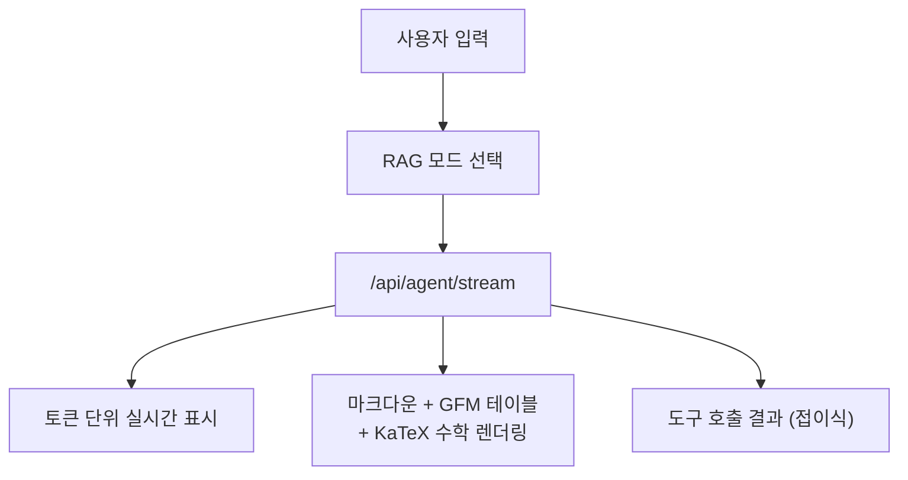
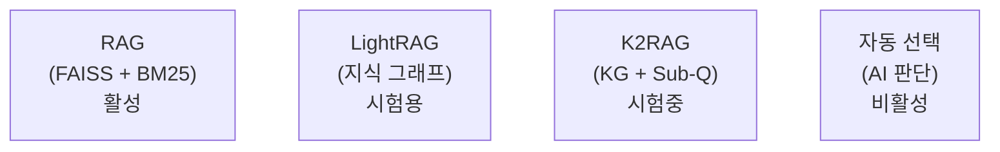
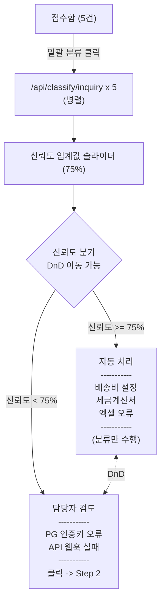
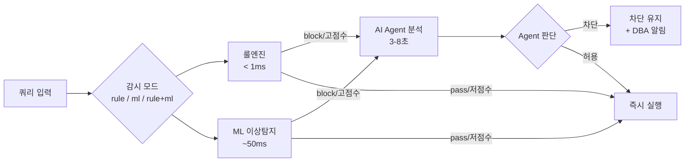
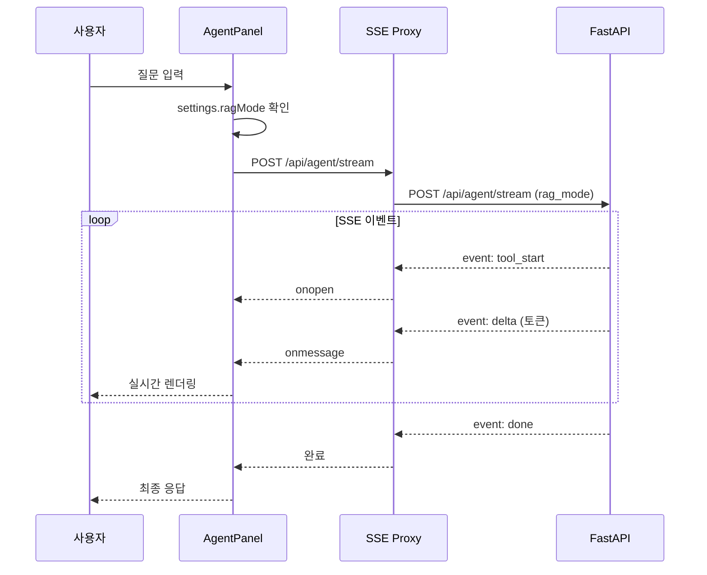

# CAFE24 AI 운영 플랫폼 - Frontend

<div align="center">

**Next.js 기반 카페24 이커머스 AI 운영 플랫폼 UI**

[](https://nextjs.org)
[](https://react.dev)
[](https://tailwindcss.com)

</div>

---

## 목차

1. [프로젝트 구조](#1-프로젝트-구조)
2. [패널 (11개)](#2-패널-11개)
3. [컴포넌트](#3-컴포넌트)
4. [API 통신](#4-api-통신)
5. [상태 관리](#5-상태-관리)
6. [디자인 시스템](#6-디자인-시스템)
7. [환경 설정](#7-환경-설정)

---

## 1. 프로젝트 구조

```
nextjs/
│
├── pages/                          # Next.js 페이지 라우팅
│   ├── _app.js                     # App 진입점 (NProgress, Toast)
│   ├── index.js                    # 랜딩 페이지 (세션 체크)
│   ├── login.js                    # 로그인 페이지 (CAFE24 SVG 로고)
│   ├── app.js                      # 메인 앱 (탭 기반 패널 라우팅)
│   └── api/
│       ├── agent/
│       │   └── stream.js           # SSE 프록시 (백엔드 → 클라이언트)
│       └── cs/
│           ├── pipeline-answer.js  # CS 파이프라인 답변 SSE 프록시
│           ├── send-reply.js       # CS 회신 전송 프록시 (n8n SSE)
│           ├── stream.js           # CS 회신 SSE 스트리밍 (job_id 기반)
│           └── callback.js         # CS 콜백 프록시 (POST)
│
├── components/                     # React 컴포넌트
│   ├── Layout.js                   # 12-column 그리드 레이아웃 (Noto Sans KR)
│   ├── Sidebar.js                  # 예시 질문, 셀러 정보, CAFE24 SVG 로고
│   ├── Topbar.js                   # 사용자 정보, 로그아웃, CAFE24 SVG 로고
│   ├── Tabs.js                     # 탭 네비게이션
│   ├── KpiCard.js                  # KPI 지표 카드
│   ├── SectionHeader.js            # 섹션 제목 + 액션 버튼
│   ├── EmptyState.js               # 빈 상태 UI
│   ├── Skeleton.js                 # 로딩 스켈레톤 (SkeletonCard 포함)
│   │
│   └── panels/                     # 기능별 패널 (메인 콘텐츠)
│       ├── AgentPanel.js           # AI 에이전트 채팅 (KaTeX 수학 렌더링)
│       ├── DashboardPanel.js       # 대시보드 (KPI, 차트, AI 인사이트)
│       ├── AnalysisPanel.js        # 상세 분석 (9개 탭)
│       ├── ModelsPanel.js          # MLflow 모델 관리
│       ├── RagPanel.js             # RAG 문서 관리 (모드 선택, 기능 모니터링)
│       ├── SettingsPanel.js        # LLM/시스템 설정 (프롬프트 읽기전용)
│       ├── UsersPanel.js           # 셀러 관리
│       ├── LogsPanel.js            # 활동 로그 뷰어
│       ├── LabPanel.js             # 실험실 - CS 자동화 파이프라인
│       ├── GuardianPanel.js        # 실험실 - DB 보안 감시
│       └── ProcessMinerPanel.js    # 실험실 - 프로세스 마이닝 & ML 분석
│
├── lib/                            # 유틸리티 함수
│   ├── api.js                      # API 호출 (Basic Auth, 타임아웃)
│   ├── storage.js                  # 로컬/세션 스토리지 관리
│   ├── cn.js                       # 클래스명 병합
│   ├── utils.js                    # 공통 유틸리티
│   └── progress.js                 # NProgress 페이지 전환 설정
│
├── styles/
│   ├── globals.css                 # 전역 스타일 (Tailwind + CAFE24 토큰)
│   └── nprogress.css               # 페이지 전환 진행바
│
├── next.config.js                  # Next.js 설정 (API 프록시)
├── tailwind.config.js              # Tailwind 커스텀 설정
└── package.json
```

---

## 2. 패널 (11개)

### 접근 권한 체계

| 역할 | 접근 가능 패널 | 탭 수 |
|------|---------------|-------|
| **관리자** | 11개 전부 | 11 |
| **비관리자** (운영자/분석가/사용자) | Agent, Dashboard, Analysis, Lab, Guardian, ProcessMiner | 6 |

---

### 2.1 AgentPanel (AI 에이전트)

| 항목 | 내용 |
|------|------|
| **파일** | `components/panels/AgentPanel.js` |
| **역할** | AI 에이전트와 실시간 채팅, 도구 호출 결과 표시, 수학 수식 렌더링 |
| **API** | `POST /api/agent/stream` (SSE) |
| **라이브러리** | `@microsoft/fetch-event-source`, `react-markdown`, `remark-gfm`, `remark-math`, `rehype-katex`, `katex` |



**RAG 모드 선택** (RagPanel에서 설정):

| 모드 | 설명 | 특징 | 상태 |
|------|------|------|------|
| `rag` | FAISS + BM25 | 싱글홉 질문에 최적 | **활성** (기본값) |
| `lightrag` | 지식 그래프 기반 | 멀티홉 질문에 최적 | 시험용 (비활성) |
| `k2rag` | KG + Sub-Q + Hybrid | 고정밀 검색 | 시험중 (비활성) |
| `auto` | AI가 자동 선택 | 두 RAG 도구 모두 제공 | 비활성 |

**예시 질문 카테고리:**

| 카테고리 | 예시 |
|----------|------|
| **쇼핑몰 & 플랫폼** | "카페24 쇼핑몰 생성 절차가 어떻게 돼?" |
| **CS & 운영** | "최근 7일간 CS 문의 유형별 통계 보여줘" |
| **AI 예측 분석** | "SEL0001 셀러 이탈 확률 예측해줘" |
| **비즈니스 KPI** | "최근 7일 KPI 트렌드 분석해줘" |
| **셀러 분석** | "우수 셀러 세그먼트 통계 알려줘" |

**UI 특징:**
- CAFE24 블루 테마
- 진행 표시 애니메이션
- 도구 실행 결과 접이식 표시 (tool_start/tool_end 실시간 상태)
- 응답 복사 버튼, 다시 질문 버튼
- GFM 테이블 + KaTeX 수학 수식 지원
- 스트리밍 중단 버튼

---

### 2.2 DashboardPanel (대시보드)

| 항목 | 내용 |
|------|------|
| **파일** | `components/panels/DashboardPanel.js` |
| **역할** | 전체 플랫폼 KPI 및 통계 시각화, AI 인사이트, 알림 |
| **API** | `GET /api/dashboard/summary`, `GET /api/dashboard/insights`, `GET /api/dashboard/alerts`, `GET /api/users/segments/{name}/details` |
| **라이브러리** | `recharts` (PieChart, BarChart, AreaChart) |

| 섹션 | 내용 | 차트 |
|------|------|------|
| **쇼핑몰 통계** | 플랜별 분포 | PieChart |
| **셀러 통계** | 세그먼트별 분포 (드릴다운) | RadialBarChart |
| **주문 통계** | 유형별 분포 | PieChart |
| **GMV 추이** | 7일간 GMV | AreaChart |
| **AI 인사이트** | 자동 생성 운영 인사이트 | 카드 |
| **알림** | 최근 알림 5건 | 리스트 |

---

### 2.3 AnalysisPanel (상세 분석)

| 항목 | 내용 |
|------|------|
| **파일** | `components/panels/AnalysisPanel.js` |
| **역할** | 셀러/쇼핑몰 데이터 심층 분석 |
| **탭 수** | 9개 |
| **라이브러리** | `recharts` (LineChart, RadarChart, AreaChart, BarChart) |

| # | 탭 | 설명 | API | 차트 |
|---|-----|------|-----|------|
| 1 | **셀러 분석** | 개별 셀러 프로필 | `/api/sellers/search` | RadarChart |
| 2 | **세그먼트** | 셀러 세그먼트별 통계 | `/api/sellers/segments/statistics` | BarChart |
| 3 | **이상거래 탐지** | 이상 거래 목록, 점수 분포 | `/api/analysis/anomaly` | ScatterPlot |
| 4 | **예측 분석** | 이탈/매출/LTV 예측 | `/api/analysis/prediction/*` | AreaChart |
| 5 | **코호트** | 셀러 리텐션/LTV/전환율 | `/api/analysis/cohort/*` | HeatMap |
| 6 | **트렌드** | GMV, 활성셀러 등 KPI 추이 | `/api/analysis/trend/kpis` | LineChart |
| 7 | **쇼핑몰 분석** | 쇼핑몰별 매출, 전환율 | `/api/shops` | BarChart |
| 8 | **CS 분석** | CS 응답 품질, 유형별 분포 | `/api/cs/statistics` | PieChart |
| 9 | **마케팅 최적화** | 마케팅 채널별 ROI 최적화 | `/api/marketing/optimize` | Table |

**세그먼트 정의:**

| ID | 이름 | 특징 |
|----|------|------|
| 0 | 성장형 셀러 | 중간 매출, 성장 가능성 |
| 1 | 휴면 셀러 | 낮은 매출, 높은 환불률 (29%) |
| 2 | 우수 셀러 | 높은 GMV (2.1억), 낮은 환불률 (8%) |
| 3 | 파워 셀러 | 최고 GMV (2.7억), 최다 주문 (3,900+) |
| 4 | 관리 필요 셀러 | 낮은 매출, 적은 상품 수 |

---

### 2.4 ModelsPanel (ML 모델 관리)

| 항목 | 내용 |
|------|------|
| **파일** | `components/panels/ModelsPanel.js` |
| **역할** | MLflow 모델 레지스트리 조회 및 버전 선택 |
| **API** | `/api/mlflow/models`, `/api/mlflow/experiments`, `/api/mlflow/models/selected`, `POST /api/mlflow/models/select` |
| **권한** | 관리자 전용 |

**표시 모델:**

| 모델명 | 알고리즘 |
|--------|----------|
| 셀러이탈예측 | RandomForest + SHAP |
| 이상거래탐지 | IsolationForest |
| 문의자동분류 | TF-IDF + RF |
| 셀러세그먼트 | KMeans |
| 매출예측 | LightGBM |
| CS응답품질 | RandomForest |
| 고객LTV예측 | GradientBoosting |
| 리뷰감성분석 | LogisticRegression |
| 상품수요예측 | XGBoost |
| 정산이상탐지 | DBSCAN |

---

### 2.5 RagPanel (RAG 관리)

| 항목 | 내용 |
|------|------|
| **파일** | `components/panels/RagPanel.js` |
| **역할** | RAG 인덱스 관리, 모드 선택, LightRAG 빌드, 기능 상태 모니터링 |
| **API** | `GET /api/rag/status`, `GET /api/rag/files`, `POST /api/rag/reload`, `POST /api/rag/upload`, `POST /api/rag/delete`, `GET /api/lightrag/status`, `POST /api/lightrag/build`, `POST /api/ocr/extract` |
| **권한** | 관리자 전용 |

**RAG 모드 선택 UI:**



**RAG 기능 상태 모니터링:**

| 기능 | 상태 |
|------|------|
| **Contextual Retrieval** | 미적용 |
| **Hybrid Search** (BM25 + Vector) | 인덱스 빌드 시 활성 |
| **Reranking** (Cross-Encoder) | 비활성 |
| **Simple KG** | 비활성 |

**관리 기능:**

| 기능 | API | 상태 |
|------|-----|------|
| **인덱스 재빌드** | `POST /api/rag/reload` | 활성 (관리자) |
| **LightRAG 빌드** | `POST /api/lightrag/build` | 활성 (관리자) |
| **파일 업로드** | `POST /api/rag/upload` | 비활성 |
| **문서 삭제** | `POST /api/rag/delete` | 비활성 |
| **OCR 업로드** | `POST /api/ocr/extract` | 비활성 |

---

### 2.6 SettingsPanel (LLM 설정)

| 항목 | 내용 |
|------|------|
| **파일** | `components/panels/SettingsPanel.js` |
| **역할** | LLM 모델 및 파라미터 설정, 시스템 프롬프트 (읽기 전용) |
| **API** | `GET/POST /api/settings/llm`, `GET/POST /api/settings/prompt`, `POST /api/settings/llm/reset`, `POST /api/settings/prompt/reset` |
| **권한** | 관리자 전용 |

**LLM 설정 항목:**

| 설정 | 타입 | 기본값 | 비고 |
|------|------|--------|------|
| **selectedModel** | select | `gpt-4o-mini` | 읽기 전용 (UI 비활성) |
| **customModel** | text | 빈 값 | 비활성 |
| **temperature** | slider (0~2) | `0.3` | |
| **topP** | slider (0~1) | `1.0` | |
| **presencePenalty** | slider (-2~2) | `0.0` | |
| **frequencyPenalty** | slider (-2~2) | `0.0` | |
| **maxTokens** | number | `8000` | 고정 (UI 비활성) |
| **seed** | number | 빈 값 | 선택 |
| **timeoutMs** | number (1000~120000) | `30000` | |
| **retries** | number (0~10) | `2` | |
| **stream** | checkbox | `true` | |
| **apiKey** | password | 빈 값 | 로컬 전용 |

**모델 목록:**

| 모델 |
|------|
| gpt-4o |
| gpt-4o-mini |
| gpt-4.1 |
| gpt-4.1-mini |
| gpt-4-turbo |

**LLM 프리셋:**

| 프리셋 | temperature | topP | presencePenalty | frequencyPenalty |
|--------|-------------|------|-----------------|------------------|
| 정확한 응답 | 0.1 | 0.9 | 0.0 | 0.0 |
| 균형잡힌 | 0.5 | 1.0 | 0.0 | 0.0 |
| 창의적 | 0.9 | 1.0 | 0.3 | 0.2 |

**시스템 프롬프트:**
- 백엔드에서 중앙 관리 (`GET /api/settings/prompt`)
- UI에서는 **읽기 전용** (disabled textarea)으로 표시
- "백엔드 관리" 배지 표시

---

### 2.7 UsersPanel (셀러 관리)

| 항목 | 내용 |
|------|------|
| **파일** | `components/panels/UsersPanel.js` |
| **역할** | 플랫폼 셀러 계정 관리 |
| **API** | `/api/users` |
| **권한** | 관리자 전용 |

---

### 2.8 LogsPanel (활동 로그)

| 항목 | 내용 |
|------|------|
| **파일** | `components/panels/LogsPanel.js` |
| **역할** | 세션 내 활동 로그 조회 |
| **저장소** | localStorage |
| **권한** | 관리자 전용 |

---

### 2.9 LabPanel (실험실 - CS 자동화 파이프라인)

| 항목 | 내용 |
|------|------|
| **파일** | `components/panels/LabPanel.js` |
| **역할** | 셀러 문의 자동화 5단계 파이프라인 (일괄 분류 + DnD 자동/수동 분기 + 일괄 답변) |
| **API** | `POST /api/classify/inquiry` (일괄), `POST /api/cs/pipeline`, `POST /api/cs/pipeline/answer` (SSE), `POST /api/cs/send-reply` (JSON), `GET /api/cs/stream` (SSE) |
| **권한** | 전체 사용자 |

> **핵심 컨셉**: 단순/반복 문의는 자동 처리, 복잡한 문의만 담당자 검토

**5단계 파이프라인:**

| 단계 | 이름 | 기능 | AS-IS → TO-BE |
|------|------|------|---------------|
| 1 | 접수 | 접수함 5건 일괄 분류 → 자동/수동 2열 분기 | 수동 분류 → ML 일괄 분류 + 신뢰도 라우팅 |
| 2 | 검토 | 선택 문의 상세 분석 + 우선순위 예측 | 전건 수동 → 임계값 기반 분기 |
| 3 | 답변 | RAG + LLM(gpt-4o-mini) 스트리밍 답변 초안 | 처음부터 작성 → AI 초안 생성 |
| 4 | 회신 | React Flow 워크플로우 + n8n 연동 (job_id + SSE + 콜백) | 수동 발송 → n8n 워크플로우 시각화 + 실시간 전송 |
| 5 | 개선 | CS 통계 대시보드 + 파이프라인 이력 | 별도 관리 없음 → 실시간 대시보드 |

**Step 1 접수함 (일괄 분류 + DnD):**



DnD: HTML5 Drag and Drop으로 문의를 자동 처리 <-> 담당자 검토 간 이동
자동 처리: 접수(분류만) → 답변(RAG 일괄 생성) → 회신 (검토 스킵)
  - Step 1(접수)에서는 DnD 분류만 수행, 답변 생성은 Step 3(답변)에서 수행
  - 체크박스 선택 → "선택 답변 생성" 또는 "전체 답변 생성" (SSE 순차 호출)
  - 이미 생성된 답변은 체크박스로 재선택 시에만 재생성
  - 답변 인라인 수정 가능 (StepAnswer + StepReply)
담당자 검토: 문의 클릭 → 풀 파이프라인 실행 → Step 2(검토) → Step 3(답변) → Step 4(회신)

**샘플 셀러 문의 (5건):**

| # | 문의 내용 | 셀러 등급 | 희망 채널 | 예상 분기 |
|---|----------|----------|----------|----------|
| 1 | 배송비 조건부 무료 설정 방법 | Basic | 이메일 | 자동 |
| 2 | 세금계산서 자동 발행 설정 | Standard | 카카오톡 | 자동 |
| 3 | 상품 대량 등록 엑셀 업로드 오류 | Standard | 이메일, 카카오 | 자동/수동 |
| 4 | PG사 이니시스 인증키 오류 + 네이버페이 정산 누락 | Premium | 무관 | 수동 |
| 5 | 카페24 API 웹훅 콜백 간헐적 실패 | Enterprise | 이메일, SMS | 수동 |

**UI 구성:**
- 접수함 테이블 (5건, 셀러 등급 배지, 희망 채널 배지, 분류 결과 인라인 표시)
- 신뢰도 임계값 슬라이더 (50%~95%, 기본 75%)
- HTML5 DnD 2열 분기 (드래그로 자동 처리 <-> 담당자 검토 이동)
- DraggableCard 컴포넌트 (draggable 카드, 드롭존 하이라이트, 카테고리 배지)
- 자동 처리: 접수에서는 DnD 분류만, 답변(StepAnswer)에서 체크박스 선택 → 일괄 답변 생성
- 일괄 답변 결과: StepAnswer 인라인 수정 (수정 버튼 → textarea → 저장/취소) + StepReply에서도 수정 가능
- 자동 처리 플로우: 접수(분류만) → 답변(RAG 생성) → 회신 (검토만 스킵)
- 담당자 검토: 문의 클릭 → 풀 파이프라인 실행 → Step 2~5 연결
- 회신 채널 다중 선택 (복수 채널 동시 전송) + 고객 희망 채널(preferredChannels) 표시
- 자동 처리: per-inquiry 채널 할당 (고객 선호 채널 기반 초기화, 운영자가 조정 가능)
- 수동 처리: 고객 희망 채널 표시 + '희망' 배지, "어느 방식이든 상관없음" 안내
- SSE 스트리밍 답변 표시 + 편집 가능 textarea
- React Flow n8n 워크플로우 다이어그램 (8노드: webhook→검증→분기→채널x4→기록)
- 전송 클릭 → SSE 스트리밍으로 노드 순차 활성화 (idle→running→completed 애니메이션)
- 미선택 채널 노드 자동 비활성(disabled), 활성 엣지 animated
- 이메일 채널 선택 시 수신자 이메일 입력 필드 (auto/manual)
- 카테고리별 BarChart + KPI 카드 + 파이프라인 처리 이력 테이블

---

### 2.10 GuardianPanel (실험실 - DB 보안 감시)

| 항목 | 내용 |
|------|------|
| **파일** | `components/panels/GuardianPanel.js` |
| **역할** | DB 쿼리 실시간 감시 -- 룰엔진 + ML 이상탐지(Isolation Forest) + AI Agent 3단계 분석으로 위험 쿼리 차단 |
| **API** | `POST /api/guardian/analyze`, `POST /api/guardian/recover`, `POST /api/guardian/notify-dba`, `GET /api/guardian/logs`, `GET /api/guardian/stats` |
| **권한** | 전체 사용자 |

> **핵심 컨셉**: 룰엔진(<1ms) + ML 이상탐지(~50ms)로 1차 필터링, 위험 쿼리만 AI Agent(GPT-4o-mini)가 정밀 분석. 사용자가 감시 모드(룰/ML/룰+ML) 선택 가능

**아키텍처:**



**3개 서브탭:**

| 탭 | 이름 | 기능 |
|-----|------|------|
| 1 | **실시간 감시** | 감시 모드 선택(룰/ML/룰+ML) + 쿼리 입력 → 룰엔진 + ML 이상탐지 + Agent 분석 → 차단/허용 판단 |
| 2 | **복구 요청** | 차단된 쿼리 복구 SQL 생성 (Recovery Agent) |
| 3 | **대시보드** | 감사 로그, 차단 이력, KPI 통계 |

**실시간 감시 탭 -- 입력 폼:**

| 필드 | 타입 | 설명 |
|------|------|------|
| 사용자 ID | text | 실행 사용자 (kim, park 등) |
| 작업 | select | DELETE, UPDATE, DROP, TRUNCATE, ALTER, INSERT, SELECT |
| 테이블 | text | 대상 테이블명 |
| 대상 행 수 | number | 영향받는 행 수 |

**분석 결과 표시:**
- **감시 모드 셀렉터**: 3버튼 토글 (룰 + ML / 룰엔진만 / ML만) -- 모드에 따라 결과 섹션 조건부 표시
- **룰엔진 결과**: pass(녹색) / warn(주황) / block(빨강) + 사유 목록 + 응답 시간
- **ML 이상탐지 결과**: anomaly_score + user_deviation 프로그레스 바 + combined_score 종합 점수 (색상: >70 빨강, >40 주황, <=40 초록)
- **Agent 출력**: Tool 호출 단계별 표시 (접이식) + 최종 판단 텍스트
- **액션 버튼**: "차단 유지" / "그래도 실행 (DBA 승인 필요)"
- **DBA 알림**: 이메일 입력 → Resend API로 차단 내역 + Agent 분석 결과 전송
- **시나리오 프리셋 8개**: 신입 대량 삭제, 야간 데이터 수정, 정상 로그 정리, DDL 명령어, 전체 초기화, 정상 조회, 반복 소량 삭제, 신규 테이블 접근

**Agent Tool 호출 (LangChain `create_agent`):**

| Tool | 설명 |
|------|------|
| `analyze_impact` | 테이블 행 수, 금액 영향도 분석 |
| `get_user_pattern` | 사용자 최근 30일 활동 패턴 조회 |
| `search_similar` | 과거 유사 사건 검색 (incidents DB) |
| `execute_decision` | 최종 차단/허용 결정 + 감사 로그 기록 |

**복구 요청 탭:**
- 차단된 쿼리 선택 → Recovery Agent가 복구 SQL 자동 생성
- Tool: `search_audit_log` (감사 기록 검색), `generate_restore_sql` (복구 쿼리 생성)

**대시보드 탭:**
- KPI 카드 4개: 총 감사 로그, 차단된 쿼리, 경고, 보호된 금액
- 최근 차단 이력 (시간, 사용자, 작업, 테이블, 금액)
- 전체 감사 로그 테이블 (최근 20건, 상태별 색상 배지)

**데이터 저장소:**
- SQLite (`guardian.db`) -- 감사 로그 (`audit_log`) + 유사 사건 (`incidents`)
- 서버 시작 시 시드 데이터 200건 자동 생성 (테이블 비었을 때만)
- 실제 분석/차단 결과는 실시간 기록

---

### 2.11 ProcessMinerPanel (실험실 - 프로세스 마이닝)

| 항목 | 내용 |
|------|------|
| **파일** | `components/panels/ProcessMinerPanel.js` |
| **역할** | 이커머스 프로세스 마이닝 -- 프로세스 발견 + ML 다음 활동 예측 + 병목 분석 + ML 이상 프로세스 탐지 + AI 자동화 추천 |
| **API** | `POST /api/process-miner/discover`, `POST /api/process-miner/predict`, `POST /api/process-miner/bottlenecks`, `POST /api/process-miner/anomalies`, `POST /api/process-miner/recommend` |
| **권한** | 전체 사용자 |

> **핵심 컨셉**: 이벤트 로그 기반 프로세스 플로우 시각화 + ML 모델로 다음 활동 예측 및 이상 프로세스 탐지

**3개 서브탭:**

| 탭 | 이름 | 기능 |
|-----|------|------|
| 1 | **프로세스 발견** | 프로세스 플로우 시각화 + 통계 + ML 다음 활동 예측 |
| 2 | **병목 분석** | 병목 구간 분석 + ML 이상 프로세스 탐지 |
| 3 | **AI 자동화 추천** | 자동화 가능 구간 추천 + ROI 분석 |

**프로세스 유형:**

| 값 | 이름 |
|----|------|
| `order` | 주문 프로세스 |
| `cs` | CS 문의 프로세스 |
| `settlement` | 정산 프로세스 |

**ML 기능 1 -- 다음 활동 예측 (프로세스 발견 탭):**

| 항목 | 내용 |
|------|------|
| **API** | `POST /api/process-miner/predict` |
| **입력** | 케이스 ID |
| **출력** | 현재 활동 기준 다음 활동 Top-3 (확률 가로 막대 바) |
| **부가 정보** | 모델 정확도 배지, 피처 중요도 차트 (접기/펼치기) |
| **스타일** | Brain 아이콘, indigo 그라데이션 |

**ML 기능 2 -- 이상 프로세스 탐지 (병목 분석 탭):**

| 항목 | 내용 |
|------|------|
| **API** | `POST /api/process-miner/anomalies` |
| **요약 카드** | 전체 케이스 수, 이상 케이스 수, 이상 비율 |
| **정상 패턴** | 정상 프로세스 요약 텍스트 (emerald 박스) |
| **이상 케이스** | 최대 10건 표시 -- 시퀀스 화살표, 예외 활동 빨간색 하이라이트, anomaly_score, 루프 배지 |
| **부가 정보** | 피처 중요도 차트 (접기/펼치기) |
| **스타일** | AlertTriangle 아이콘, red-to-orange 그라데이션 |

**공통 컴포넌트:**

| 컴포넌트 | 설명 |
|----------|------|
| `FeatureImportanceChart` | ML 피처 중요도 가로 막대 차트 (indigo/red/teal 색상) |

**아이콘 (lucide-react):**
`GitBranch`, `Timer`, `Sparkles`, `Play`, `Loader2`, `ChevronDown`, `ChevronRight`, `ArrowRight`, `AlertTriangle`, `CheckCircle2`, `Zap`, `Brain`, `Bot`, `BarChart3`, `Clock`, `Activity`, `TrendingUp`, `FileText`, `Target`, `Search`, `ShieldAlert`, `RefreshCw`

---

## 3. 컴포넌트

### 레이아웃

| 컴포넌트 | 파일 | 설명 |
|----------|------|------|
| **Layout** | `Layout.js` | 12-column 그리드 (Sidebar 3열 + Main 9열), Noto Sans KR 폰트 |
| **Sidebar** | `Sidebar.js` | CAFE24 SVG 로고, 예시 질문 아코디언, 셀러 정보, 환영 팝업 |
| **Topbar** | `Topbar.js` | CAFE24 SVG 로고, 사용자명, 로그아웃 버튼 |
| **Tabs** | `Tabs.js` | 역할별 필터링된 탭 네비게이션 |

### CAFE24 로고/브랜딩

Sidebar, Topbar, Login 페이지에 CAFE24 공식 SVG 로고 적용:
```
https://img.echosting.cafe24.com/imgcafe24com/images/common/cafe24.svg
```

### UI 컴포넌트

| 컴포넌트 | Props | 설명 |
|----------|-------|------|
| **KpiCard** | `title, value, icon, color, trend` | KPI 지표 카드 |
| **SectionHeader** | `title, subtitle, right` | 섹션 제목 + 우측 액션 |
| **EmptyState** | `icon, title, desc` | 데이터 없음 상태 |
| **Skeleton** | `width, height, className` | 로딩 스켈레톤 (SkeletonCard 포함) |

---

## 4. API 통신

### 4.1 API 호출 함수

```javascript
// lib/api.js
export async function apiCall({
  endpoint,           // API 경로 (예: '/api/shops')
  method = 'GET',     // HTTP 메서드
  data = null,        // POST body
  auth = null,        // { username, password }
  timeoutMs = 60000,  // 타임아웃
}) {
  const options = {
    method,
    headers: {
      'Content-Type': 'application/json',
      ...(auth ? { 'Authorization': `Basic ${btoa(...)}` } : {}),
    },
  };
  // ...
}
```

### 4.2 SSE 스트리밍

```javascript
import { fetchEventSource } from '@microsoft/fetch-event-source';

await fetchEventSource('/api/agent/stream', {
  method: 'POST',
  body: JSON.stringify({ message }),
  onmessage: (event) => {
    const data = JSON.parse(event.data);
    if (data.type === 'token') {
      onToken(data.content);
    }
  },
});
```

**SSE 프록시 (5개):**

| 프록시 파일 | 타깃 백엔드 | 용도 |
|------------|-----------|------|
| `pages/api/agent/stream.js` | `/api/agent/stream` | AI 에이전트 스트리밍 |
| `pages/api/cs/pipeline-answer.js` | `/api/cs/pipeline/answer` | CS 파이프라인 답변 스트리밍 |
| `pages/api/cs/send-reply.js` | `/api/cs/send-reply` | CS 회신 전송 (n8n SSE) |
| `pages/api/cs/stream.js` | `/api/cs/stream?job_id=` | CS 회신 SSE 스트리밍 (job_id 기반) |
| `pages/api/cs/callback.js` | `/api/cs/callback` | CS 콜백 프록시 (POST) |

| 설정 | 설명 |
|------|------|
| `bodyParser: false` | POST 바디 원본 전달 |
| `responseLimit: false` | 스트리밍 크기 제한 없음 |
| `duplex: 'half'` | Node.js 18+ 스트림 필수 |

**SSE 이벤트 타입:**

| 이벤트 | 설명 | data 예시 |
|--------|------|-----------|
| `tool_start` | 도구 실행 시작 | `{"tool": "search_platform"}` |
| `tool_end` | 도구 실행 완료 | `{"tool": "...", "result": {...}}` |
| `delta` | 토큰 스트리밍 | `{"delta": "이탈"}` |
| `done` | 응답 완료 | `{"ok": true, "final": "...", "tool_calls": [...]}` |
| `error` | 오류 발생 | `{"message": "..."}` |

### 4.3 Next.js API 프록시

```javascript
// next.config.js
async rewrites() {
  const backend = process.env.BACKEND_INTERNAL_URL || 'http://127.0.0.1:8001';
  return [
    // SSE 스트리밍은 Next API Route로 처리
    { source: '/api/agent/stream', destination: '/api/agent/stream' },
    // 나머지 /api/* 는 전부 백엔드로 프록시
    { source: '/api/:path*', destination: `${backend}/api/:path*` },
  ];
}
```

---

## 5. 상태 관리

### 5.1 페이지 레벨 상태 (`pages/app.js`)

```javascript
// 인증
const [auth, setAuth] = useState(null);

// 데이터
const [shops, setShops] = useState([]);
const [categories, setCategories] = useState([]);
const [selectedShop, setSelectedShop] = useState(null);

// LLM 설정
const [settings, setSettings] = useState({
  apiKey: '',
  selectedModel: 'gpt-4o-mini',
  maxTokens: 8000,
  temperature: 0.3,
  systemPrompt: '',
  ragMode: 'rag',  // 'rag' | 'lightrag' | 'k2rag' | 'auto'
});

// AI 에이전트
const [agentMessages, setAgentMessages] = useState([]);
const [totalQueries, setTotalQueries] = useState(0);
```

### 5.2 스토리지 키

| 키 | 저장소 | 용도 |
|----|-------|------|
| `cafe24_auth` | sessionStorage | 인증 정보 (탭 닫으면 만료) |
| `cafe24_settings` | localStorage | LLM 설정 (영구) |
| `cafe24_agent_messages` | localStorage | 채팅 히스토리 |
| `cafe24_activity_log` | localStorage | 활동 로그 |
| `cafe24_total_queries` | localStorage | 총 쿼리 수 |

---

## 6. 디자인 시스템

### 6.1 CAFE24 브랜드 컬러

```javascript
// tailwind.config.js
colors: {
  cafe24: {
    blue: '#5B9BF5',     // CAFE24 블루 (primary)
    navy: '#4A8AE5',     // CAFE24 네이비
    dark: '#1A1A2E',     // CAFE24 다크
    light: '#F5F7FA',    // CAFE24 라이트
    gray: '#E8ECF0',     // CAFE24 그레이
    accent: '#00C853',   // 성공/액센트
    warning: '#FF9800',  // 경고
    error: '#F44336',    // 에러
  },
  // 호환성 매핑 (cookie-* 클래스)
  cookie: {
    yellow: '#7CB9F7',   // 밝은 블루
    orange: '#5B9BF5',   // CAFE24 블루
    brown: '#1A1A2E',    // 다크
    cream: '#F5F7FA',    // 라이트
    beige: '#E8ECF0',    // 베이지
  },
  // 셀러 등급별 컬러
  grade: {
    common: '#9CA3AF',
    rare: '#42A5F5',
    superrare: '#7C3AED',
    epic: '#AB47BC',
    legendary: '#1B6FF0',
    ancient: '#0D47A1',
  },
}
```

### 6.2 CSS 변수

```css
/* styles/globals.css */
:root {
  --bg: #F5F7FA;
  --panel: #ffffff;
  --text: #1A1A2E;
  --muted: #64748B;

  --cookie-yellow: #7CB9F7;
  --cookie-orange: #5B9BF5;
  --cookie-brown: #1A1A2E;
  --cookie-cream: #F5F7FA;
  --cookie-beige: #E8ECF0;

  --primary: #5B9BF5;
  --primary2: #4A8AE5;
  --success: #00C853;
  --danger: #F44336;
}
```

### 6.3 커스텀 클래스

```css
/* 버튼 */
.btn { /* CAFE24 블루 그라데이션 (#7CB9F7 → #5B9BF5) */ }
.btn-secondary { /* 흰색 배경 */ }
.btn-ghost { /* 투명 배경 */ }
.btn-green { /* 성공 그라데이션 */ }

/* 카드 */
.card { /* 흰색 배경, 라운드 16px */ }
.cookie-card { /* CAFE24 호버 효과 카드 */ }

/* 배지 */
.badge-success { /* 녹색 */ }
.badge-danger { /* 빨간색 */ }
.badge-orange { /* CAFE24 블루 */ }
.badge-common / .badge-rare / .badge-epic / .badge-legendary / .badge-ancient { /* 셀러 등급별 */ }

/* 채팅 버블 */
.chat-bubble-user { /* 라이트 블루 배경 */ }
.chat-bubble-ai { /* 흰색 배경 */ }

/* 그라데이션 텍스트 */
.cookie-text { /* CAFE24 블루 그라데이션 텍스트 */ }
```

### 6.4 애니메이션

| 클래스 | 설명 |
|--------|------|
| `.fade-in` | 페이드 인 (0.3s) |
| `.slide-in` | 슬라이드 인 (0.25s) |
| `.cookie-float` | 플로팅 (3s) |
| `.pulse-soft` | 부드러운 펄스 (2s) |
| `.cookie-spin` | 회전 (8s) |
| `.cookie-bounce` | 바운스 (0.5s) |
| `.cookie-glow` | 글로우 효과 |

### 6.5 반응형 브레이크포인트

| 브레이크포인트 | 크기 | 레이아웃 |
|--------------|------|---------|
| **xl** | 1280px+ | 사이드바 고정 |
| **lg** | 1024px | 사이드바 토글 |
| **md** | 768px | 탭 축소 |
| **sm** | 640px | 모바일 최적화 |

---

## 7. 환경 설정

### 환경 변수

`.env.local` 파일:

```env
# 서버 사이드에서 백엔드로 프록시할 주소
BACKEND_INTERNAL_URL=http://127.0.0.1:8001
```

### 실행

```bash
# 개발
npm install
npm run dev

# 프로덕션
npm run build
npm start
```

### 기술 스택

| 라이브러리 | 버전 | 용도 |
|-----------|------|------|
| **Next.js** | 14.2 | React 프레임워크 |
| **React** | 18.2 | UI 라이브러리 |
| **Tailwind CSS** | 3.4 | 유틸리티 CSS |
| **Recharts** | 3.7 | 차트/그래프 |
| **Framer Motion** | 11.0 | 애니메이션 |
| **Lucide React** | 0.452 | 아이콘 |
| **react-markdown** | 9.0 | 마크다운 렌더링 |
| **remark-gfm** | 4.0 | GFM 마크다운 |
| **remark-math** | 6.0 | 수학 수식 파싱 |
| **rehype-katex** | 7.0 | KaTeX rehype 플러그인 |
| **katex** | 0.16 | 수학 수식 렌더링 |
| **@microsoft/fetch-event-source** | 2.0 | SSE 스트리밍 |
| **@xyflow/react** | 12.10 | React Flow 다이어그램 (LabPanel) |
| **react-hot-toast** | 2.4 | 토스트 알림 |
| **clsx** | 2.1 | 클래스명 조건부 결합 |
| **tailwind-merge** | 2.5 | Tailwind 클래스 병합 |
| **nprogress** | 0.2 | 페이지 전환 진행바 |
| **swr** | 2.2 | 데이터 페칭 |

---

## 8. 추가 컴포넌트

### ToastProvider.js

전역 토스트 알림 관리:

```javascript
// 사용 예시
import toast from 'react-hot-toast';
toast.success('저장되었습니다');
toast.error('오류가 발생했습니다');
```

### Skeleton.js

로딩 상태 스켈레톤:

```jsx
<Skeleton width="100%" height="40px" />
<Skeleton width="60%" height="20px" />
```

### progress.js

NProgress 페이지 전환 진행바 설정.

---

## 9. 데이터 흐름



---

<div align="center">

**Version 7.5.0** · Last Updated 2026-02-10

</div>
