# CAFE24 AI 운영 플랫폼 - Frontend

<div align="center">

**Next.js 기반 카페24 이커머스 AI 운영 플랫폼 UI**

[](https://nextjs.org)
[](https://react.dev)
[](https://tailwindcss.com)

</div>

---

## 목차

0. [프로젝트 개요](#프로젝트-개요)
1. [프로젝트 구조](#1-프로젝트-구조)
2. [패널 (12개)](#2-패널-12개)
3. [컴포넌트](#3-컴포넌트)
4. [API 통신](#4-api-통신)
5. [상태 관리](#5-상태-관리)
6. [디자인 시스템](#6-디자인-시스템)
7. [환경 설정](#7-환경-설정)
8. [인증 및 라우팅](#8-인증-및-라우팅)
9. [데이터 흐름](#9-데이터-흐름)
10. [에러 핸들링](#10-에러-핸들링)
11. [성능 최적화](#11-성능-최적화)
12. [접근성](#12-접근성)

---

## 프로젝트 개요

CAFE24 AI 운영 플랫폼 프론트엔드는 **이커머스 SaaS 운영 전반을 단일 인터페이스**에서 관리하기 위한 Next.js 애플리케이션이다. AI 에이전트 채팅, 실시간 KPI 대시보드, 9종 심층 분석, ML 모델 관리, RAG 문서 관리, CS 자동화 파이프라인, DB 보안 감시, 프로세스 마이닝 등 **12개 기능 패널**을 탭 기반 SPA로 제공한다.

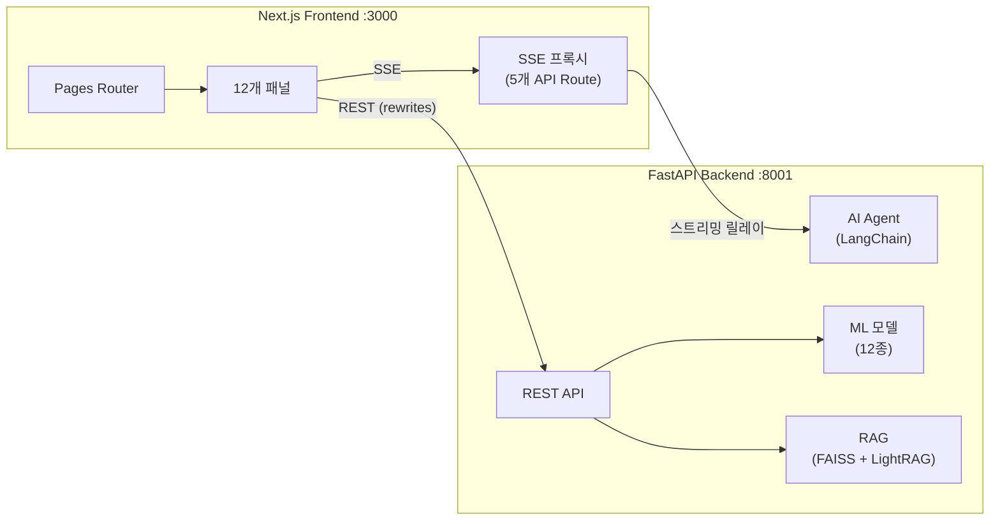

**UX 설계 원칙:**

| 원칙 | 구현 |
|------|------|
| **점진적 노출** | 핵심 정보 먼저 표시, 상세 데이터는 접이식/드릴다운으로 제공 |
| **실시간 피드백** | SSE 스트리밍으로 AI 응답을 토큰 단위 표시, 도구 호출 상태 실시간 업데이트 |
| **직접 조작** | DnD로 CS 문의 자동/수동 분기, 슬라이더로 신뢰도 임계값 조정 |
| **상태 가시성** | 로딩 스켈레톤, NProgress 전환 바, 토스트 알림으로 시스템 상태 투명 전달 |
| **역할 기반 접근 제어** | 관리자/비관리자 역할에 따라 패널 접근 자동 필터링 |
| **접근성** | ARIA 속성, 키보드 네비게이션으로 웹 접근성 표준 준수 |

---

## 1. 프로젝트 구조

```
nextjs/
│
├── pages/                          # Next.js Pages Router
│   ├── _app.js                     # App 진입점 (NProgress, Toast)
│   ├── index.js                    # 랜딩 페이지 (세션 체크 → 리다이렉트)
│   ├── login.js                    # 로그인 페이지 (Basic Auth)
│   ├── app.js                      # 메인 앱 (탭 기반 12개 패널 라우팅)
│   └── api/
│       ├── agent/
│       │   └── stream.js           # SSE 프록시 (AI 에이전트)
│       └── cs/
│           ├── pipeline-answer.js  # CS 파이프라인 답변 SSE 프록시
│           ├── send-reply.js       # CS 회신 전송 프록시 (JSON)
│           ├── stream.js           # CS 회신 SSE 스트리밍 (job_id 기반)
│           └── callback.js         # CS 콜백 프록시 (JSON)
│
├── components/                     # React 컴포넌트
│   ├── Layout.js                   # 12-column 그리드 레이아웃
│   ├── Sidebar.js                  # 예시 질문 아코디언, 셀러 정보
│   ├── Topbar.js                   # 사용자 정보, 로그아웃
│   ├── Tabs.js                     # 역할별 탭 네비게이션 (ARIA, 키보드)
│   ├── KpiCard.js                  # KPI 지표 카드
│   ├── SectionHeader.js            # 섹션 제목 + 액션 버튼
│   ├── EmptyState.js               # 빈 상태 UI
│   ├── Skeleton.js                 # 로딩 스켈레톤 (CSS shimmer)
│   ├── ToastProvider.js            # 전역 토스트 알림 (react-hot-toast)
│   ├── next.config.js              # next.config.js 사본 (백엔드 기본 포트 8001)
│   │
│   ├── common/                     # 공통 컴포넌트 (신규)
│   │   ├── CustomTooltip.js        # 차트 공통 툴팁 (DashboardPanel, AnalysisPanel 공유)
│   │   ├── StatCard.js             # 통합 통계 카드 (GuardianPanel + ProcessMinerPanel)
│   │   └── constants.js            # 공통 상수 (COLORS 등)
│   │
│   └── panels/                     # 기능별 패널 (12개)
│       ├── AgentPanel.js           # AI 에이전트 채팅
│       ├── DashboardPanel.js       # 대시보드 (KPI, 차트, 인사이트)
│       ├── AnalysisPanel.js        # 상세 분석 (→ analysis/ 위임)
│       ├── ModelsPanel.js          # MLflow 모델 관리
│       ├── RagPanel.js             # RAG 문서 관리
│       ├── SettingsPanel.js        # LLM/시스템 설정
│       ├── UsersPanel.js           # 셀러 관리
│       ├── LogsPanel.js            # 활동 로그 뷰어
│       ├── LabPanel.js             # CS 자동화 파이프라인 (→ lab/ 위임)
│       ├── GuardianPanel.js        # DB 보안 감시
│       ├── ProcessMinerPanel.js    # 프로세스 마이닝
│       ├── AutomationPanel.js     # 자동화 엔진 (이탈방지/FAQ/리포트 3탭)
│       │
│       ├── lab/                    # LabPanel 분리 (11개 파일)
│       │   ├── LabPanel.js         # 메인 컨테이너
│       │   ├── StepIndicator.js    # 5단계 진행 표시기
│       │   ├── StepClassify.js     # Step 1: 접수함 + DnD 분기
│       │   ├── StepReview.js       # Step 2: 상세 분석 + 우선순위
│       │   ├── StepAnswer.js       # Step 3: RAG+LLM 답변 생성
│       │   ├── StepReply.js        # Step 4: React Flow 워크플로우
│       │   ├── StepImprove.js      # Step 5: 통계 대시보드
│       │   ├── DraggableCard.js    # HTML5 DnD 카드
│       │   ├── WorkflowNode.js     # React Flow 커스텀 노드
│       │   ├── constants.js        # 샘플 데이터, 채널 메타
│       │   └── utils.js            # 유틸리티 함수
│       │
│       └── analysis/               # AnalysisPanel 분리 (10개 파일)
│           ├── AnalysisPanel.js    # 메인 컨테이너 (9개 탭 오케스트레이션)
│           ├── SellerTab.js        # 셀러 분석
│           ├── SegmentTab.js       # 세그먼트 분석
│           ├── AnomalyTab.js       # 이상거래 탐지
│           ├── PredictionTab.js    # 예측 분석
│           ├── CohortTab.js        # 코호트 분석
│           ├── TrendTab.js         # 트렌드 분석
│           ├── ShopTab.js          # 쇼핑몰 분석
│           ├── CsTab.js            # CS 분석
│           └── MarketingTab.js     # 마케팅 최적화
│
├── lib/                            # 유틸리티
│   ├── api.js                      # API 호출 (Basic Auth, AbortController)
│   ├── sse.js                      # SSE 파싱/인증 헤더 공통 유틸 (신규)
│   ├── storage.js                  # 로컬/세션 스토리지 (SSR 안전)
│   ├── cn.js                       # 클래스명 병합 (flat + filter)
│   └── progress.js                 # NProgress 중첩 카운터
│
├── styles/
│   ├── globals.css                 # 전역 스타일 (Tailwind + CAFE24 토큰)
│   └── nprogress.css               # 페이지 전환 진행바
│
├── next.config.js                  # API 프록시 rewrites 설정
├── tailwind.config.js              # CAFE24 테마 (cafe24/grade 색상, @tailwindcss/typography)
├── postcss.config.js               # PostCSS (Tailwind + Autoprefixer)
└── package.json
```

---

## 2. 패널 (12개)

### 접근 권한 체계

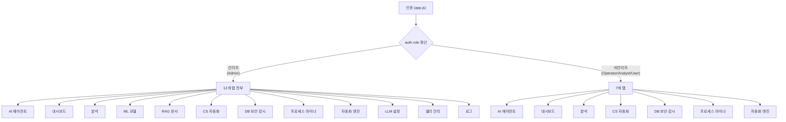

| 역할 | 접근 가능 패널 | 탭 수 |
|------|---------------|-------|
| **관리자** (Admin) | 12개 전부 | 12 |
| **비관리자** (Operator / Analyst / User) | Agent, Dashboard, Analysis, Lab, Guardian, ProcessMiner, Automation | 7 |

---

### 2.1 AgentPanel (AI 에이전트)

| 항목 | 내용 |
|------|------|
| **파일** | `components/panels/AgentPanel.js` |
| **역할** | AI 에이전트와 실시간 채팅, 도구 호출 결과 표시, 수학 수식 렌더링 |
| **API** | `POST /api/agent/stream` (SSE) |
| **라이브러리** | `@microsoft/fetch-event-source`, `react-markdown`, `remark-gfm`, `remark-math`, `rehype-katex`, `katex` |

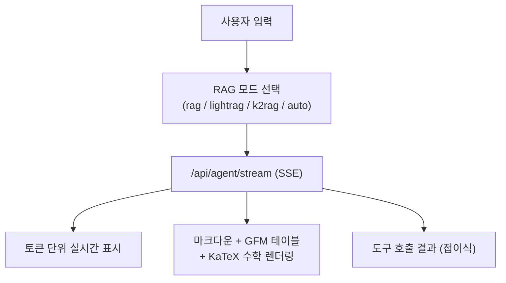

**RAG 모드 선택** (RagPanel에서 설정, `settings.ragMode`로 전달):

| 모드 | 설명 | 특징 | 상태 |
|------|------|------|------|
| `rag` | FAISS + BM25 Hybrid | 싱글홉 질문에 최적 | **활성** (기본값) |
| `lightrag` | 지식 그래프 기반 | 멀티홉 질문에 최적 | 시험용 (비활성) |
| `k2rag` | KG + Sub-Q + Hybrid | 고정밀 검색 | 시험중 (비활성) |
| `auto` | AI가 자동 선택 | 두 RAG 도구 모두 제공 | 비활성 |

**예시 질문 카테고리** (Sidebar 아코디언 클릭 시 자동 입력, `app.js` 하드코딩 62개):

| 카테고리 | 질문 수 | 예시 |
|----------|---------|------|
| 쇼핑몰 & 플랫폼 | 10 | "카페24 쇼핑몰 생성 절차가 어떻게 돼?" |
| CS & 운영 | 6 | "최근 7일간 CS 문의 유형별 통계 보여줘" |
| AI 예측 분석 | 12 | "SEL0001 셀러 이탈 확률 예측해줘" |
| 비즈니스 KPI | 12 | "최근 7일 KPI 트렌드 분석해줘" |
| 셀러 분석 | 12 | "우수 셀러 세그먼트 통계 알려줘" |
| 카페24 FAQ | 10 | "카페24 결제수단 설정 방법 알려줘" |

**빠른 분석 버튼 (AgentPanel 하단):**

| 버튼 | API |
|------|-----|
| 쇼핑몰 전체 조회 | `GET /api/shops` |
| 카테고리 조회 | `GET /api/categories` |
| 이커머스 용어집 | `GET /api/cs/glossary` |
| 세그먼트 통계 | `GET /api/sellers/segments/statistics` |

**인터랙션 패턴:**
- SSE 스트리밍으로 토큰 단위 실시간 렌더링 (타이핑 효과)
- `tool_start` 이벤트 수신 시 도구명 표시 + 로딩 스피너, `tool_end`에서 결과를 접이식 패널로 전환
- 스트리밍 도중 **중단 버튼**으로 AbortController를 통한 즉시 중단
- 완료된 응답에 **복사 버튼**, **다시 질문 버튼** 제공
- GFM 테이블과 KaTeX 수학 수식(`$...$`, `$$...$$`) 혼합 렌더링
- CAFE24 블루 테마 채팅 버블 (사용자: 라이트 블루, AI: 흰색)

---

### 2.2 DashboardPanel (대시보드)

| 항목 | 내용 |
|------|------|
| **파일** | `components/panels/DashboardPanel.js` |
| **역할** | 전체 플랫폼 KPI 및 통계 시각화, AI 인사이트, 알림 |
| **API** | `GET /api/dashboard/summary`, `GET /api/dashboard/insights`, `GET /api/dashboard/alerts`, `GET /api/users/segments/{name}/details` |
| **라이브러리** | `recharts` (PieChart, BarChart, AreaChart, RadialBarChart) |
| **공통 컴포넌트** | `common/CustomTooltip.js` (차트 툴팁) |

**대시보드 섹션 구성:**

| 섹션 | 내용 | 차트 | 인터랙션 |
|------|------|------|----------|
| **쇼핑몰 통계** | 플랜별(Basic/Standard/Premium/Enterprise) 분포 | PieChart | 호버 시 툴팁 |
| **셀러 통계** | 5개 세그먼트별 분포 | RadialBarChart | 세그먼트 클릭 시 드릴다운 상세 |
| **주문 통계** | 유형별(일반/정기/취소/환불) 분포 | PieChart | 호버 시 건수 + 비율 |
| **GMV 추이** | 최근 7일간 일별 GMV | AreaChart (gradient fill) | 날짜별 포인트 호버 |
| **AI 인사이트** | 백엔드 자동 생성 운영 인사이트 | 카드 리스트 | 인사이트 유형별 아이콘 |
| **알림** | 최근 알림 5건 (위험도별 색상) | 리스트 | 시간순 정렬 |

---

### 2.3 AnalysisPanel (상세 분석 -- 9개 탭)

| 항목 | 내용 |
|------|------|
| **파일** | `components/panels/analysis/AnalysisPanel.js` (메인 컨테이너) |
| **구조** | `components/panels/analysis/` 디렉토리 10개 파일로 분리 |
| **역할** | 셀러/쇼핑몰 데이터 심층 분석, ML 예측 결과 시각화, 마케팅 최적화 |
| **탭 수** | 9개 (탭별 독립 컴포넌트) |
| **공통 기능** | 기간 필터(7일/30일/90일), LIVE/NO DATA 상태 배지, 커스텀 툴팁 |
| **공통 컴포넌트** | `common/CustomTooltip.js` (차트 툴팁) |
| **라이브러리** | `recharts` (LineChart, RadarChart, AreaChart, BarChart, ComposedChart, Scatter, PieChart) |

> 페이지 진입 시 `/api/stats/summary`, `/api/analysis/anomaly`, `/api/analysis/prediction/churn`, `/api/analysis/cohort/retention`, `/api/analysis/trend/kpis` 를 병렬 호출하여 전 탭의 데이터를 미리 로드한다.

**탭별 분리 구조:**

| # | 탭 | 파일 | 설명 | 주요 API | 차트 |
|---|-----|------|------|---------|------|
| 1 | **셀러 분석** | `SellerTab.js` | 개별 셀러 프로필 + ML 예측 | `/api/sellers/search`, `/api/sellers/autocomplete` | RadarChart, AreaChart |
| 2 | **세그먼트** | `SegmentTab.js` | 셀러 세그먼트별 통계 비교 | `/api/stats/summary` | BarChart |
| 3 | **이상거래 탐지** | `AnomalyTab.js` | 이상 거래 목록, 유형별 분포, 추이 | `/api/analysis/anomaly` | ComposedChart + Scatter, BarChart |
| 4 | **예측 분석** | `PredictionTab.js` | 이탈/매출/인게이지먼트 (3 서브탭) | `/api/analysis/prediction/churn`, `/api/sellers/search` | AreaChart |
| 5 | **코호트** | `CohortTab.js` | 셀러 리텐션/LTV/전환율 (3 서브탭) | `/api/analysis/cohort/retention` | HeatMap, BarChart, LineChart |
| 6 | **트렌드** | `TrendTab.js` | GMV, 활성셀러 등 KPI 추이 + 예측 | `/api/analysis/trend/kpis` | LineChart, AreaChart |
| 7 | **쇼핑몰 분석** | `ShopTab.js` | 쇼핑몰별 운영점수/전환율/인기도 | `/api/shops` | BarChart (플랜 등급별 색상) |
| 8 | **CS 분석** | `CsTab.js` | CS 채널별 건수/품질/미처리 | `/api/stats/summary` | PieChart, 테이블 |
| 9 | **마케팅 최적화** | `MarketingTab.js` | 셀러별 채널 ROI 최적화 추천 | `/api/marketing/seller/{id}`, `/api/marketing/optimize` | 테이블, 카드 |

#### 탭 1. 셀러 분석

- **API**: `GET /api/sellers/search?q={id}&days={n}`, `GET /api/sellers/autocomplete?q={query}&limit=8`
- **차트**: RadarChart (활동 지표 5축), AreaChart (일별 활동 트렌드)
- **흐름**: 셀러 ID 입력 (자동완성 300ms debounce) 또는 빠른 선택(SEL0001 등) -> 프로필 카드(ID, 세그먼트, 등급, 지역, 이상감지) + KPI 4종(상품수, 주문수, 활동일수, CS건수) + ML 예측(이탈확률, 매출, 인게이지먼트)

#### 탭 2. 세그먼트

- **API**: `/api/stats/summary` (segment_metrics 필드)
- **차트**: BarChart (세그먼트별 셀러수/평균매출/리텐션 비교)

**세그먼트 정의 (KMeans 클러스터링):**

| ID | 이름 | 특징 |
|----|------|------|
| 0 | 성장형 셀러 | 중간 매출, 성장 가능성 |
| 1 | 휴면 셀러 | 낮은 매출, 높은 환불률 (29%) |
| 2 | 우수 셀러 | 높은 GMV (2.1억), 낮은 환불률 (8%) |
| 3 | 파워 셀러 | 최고 GMV (2.7억), 최다 주문 (3,900+) |
| 4 | 관리 필요 셀러 | 낮은 매출, 적은 상품 수 |

#### 탭 3~9 요약

- **이상거래 탐지**: `GET /api/analysis/anomaly?days={n}` -- 요약 카드 + 유형별 BarChart + 최근 알림 리스트 + 일별 추이
- **예측 분석**: 이탈/매출/인게이지먼트 3 서브탭 + 개별 셀러 검색으로 ML 예측(이탈확률, 예상매출, LTV) 확인
- **코호트**: 리텐션 HeatMap (가입월 x 경과월, 색상 강도) / LTV BarChart / 전환율 LineChart
- **트렌드**: KPI 요약 카드 + 일별 메트릭 LineChart + 상관관계 분석 + 예측 구간 AreaChart
- **쇼핑몰 분석**: 상위 10개 쇼핑몰 BarChart (Enterprise=보라, Premium=금, Standard=파랑, Basic=회색)
- **CS 분석**: 채널별 건수/품질/미처리를 PieChart + 테이블로 표시
- **마케팅 최적화**: 예시 셀러 3종 또는 직접 입력 -> 셀러 현황 조회 -> 채널별 ROI 추천, 예산 배분, 예상 효과 테이블

---

### 2.4 ModelsPanel (ML 모델 관리)

| 항목 | 내용 |
|------|------|
| **파일** | `components/panels/ModelsPanel.js` |
| **역할** | MLflow 모델 레지스트리 조회 및 버전 선택 |
| **API** | `GET /api/mlflow/models`, `GET /api/mlflow/experiments`, `GET /api/mlflow/models/selected`, `POST /api/mlflow/models/select` |
| **권한** | 관리자 전용 |

**관리 모델 13종** (MLflow 등록 11 + 프로세스마이너 비등록 2):

| 모델명 | 알고리즘 | 용도 |
|--------|----------|------|
| 셀러이탈예측 | RandomForest + SHAP | 이탈 위험 셀러 사전 식별 |
| 이상거래탐지 | IsolationForest | 비정상 거래 패턴 감지 |
| 문의자동분류 | TF-IDF + RF | CS 문의 카테고리 자동 분류 |
| 셀러세그먼트 | KMeans | 셀러 군집 분류 (5개 세그먼트) |
| 매출예측 | LightGBM | 셀러별 매출 예측 |
| CS응답품질 | RandomForest | CS 응답 품질 점수 예측 |
| 고객LTV예측 | GradientBoosting | 셀러 생애가치 예측 |
| 리뷰감성분석 | LogisticRegression | 리뷰 긍/부정 분류 |
| 상품수요예측 | XGBoost | 상품별 수요 예측 |
| 정산이상탐지 | DBSCAN | 정산 이상 패턴 탐지 |
| Guardian감사로그이상탐지 | IsolationForest | 감사 로그 이상 패턴 탐지 |
| 다음활동예측 | RandomForest Classifier | 프로세스 다음 활동 Top-3 예측 |
| 이상프로세스탐지 | IsolationForest | 경로 기반 이상 프로세스 케이스 탐지 |

---

### 2.5 RagPanel (RAG 관리)

| 항목 | 내용 |
|------|------|
| **파일** | `components/panels/RagPanel.js` |
| **역할** | RAG 인덱스 관리, 모드 선택, LightRAG 빌드, 기능 상태 모니터링 |
| **API** | `GET /api/rag/status`, `GET /api/rag/files`, `POST /api/rag/reload`, `POST /api/rag/upload`, `POST /api/rag/delete`, `GET /api/lightrag/status`, `POST /api/lightrag/build`, `POST /api/ocr/extract` |
| **권한** | 관리자 전용 |
| **변경** | `alert()`/`confirm()` → toast 통일 |

**RAG 모드 선택 UI:**

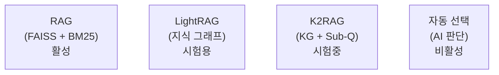

**RAG 기능 상태 모니터링:**

| 기능 | 상태 |
|------|------|
| **Contextual Retrieval** | 미적용 |
| **Hybrid Search** (BM25 + Vector) | 인덱스 빌드 시 활성 |
| **Reranking** (Cross-Encoder) | 비활성 |
| **Simple KG** | 비활성 |

**관리 기능:**

| 기능 | API | 상태 |
|------|-----|------|
| **인덱스 재빌드** | `POST /api/rag/reload` | 활성 (관리자) |
| **LightRAG 빌드** | `POST /api/lightrag/build` | 활성 (관리자) |
| **파일 업로드** | `POST /api/rag/upload` | 비활성 |
| **문서 삭제** | `POST /api/rag/delete` | 비활성 |
| **OCR 업로드** | `POST /api/ocr/extract` | 비활성 |

---

### 2.6 SettingsPanel (LLM 설정)

| 항목 | 내용 |
|------|------|
| **파일** | `components/panels/SettingsPanel.js` |
| **역할** | LLM 모델 및 파라미터 설정, 시스템 프롬프트 관리 |
| **API** | `GET/POST /api/settings/llm`, `GET/POST /api/settings/prompt`, `POST /api/settings/llm/reset`, `POST /api/settings/prompt/reset` |
| **권한** | 관리자 전용 |
| **변경** | 미사용 함수 4개 제거 |

**LLM 설정 항목:**

| 설정 | 타입 | 기본값 | 비고 |
|------|------|--------|------|
| **selectedModel** | select | `gpt-4o-mini` | 읽기 전용 (UI 비활성) |
| **customModel** | text | 빈 값 | 비활성 |
| **temperature** | slider (0~2) | `0.3` | |
| **topP** | slider (0~1) | `1.0` | |
| **presencePenalty** | slider (-2~2) | `0.0` | |
| **frequencyPenalty** | slider (-2~2) | `0.0` | |
| **maxTokens** | number | `8000` | 고정 (UI 비활성) |
| **seed** | number | 빈 값 | 선택 |
| **timeoutMs** | number (1000~120000) | `30000` | |
| **retries** | number (0~10) | `2` | |
| **stream** | checkbox | `true` | |
| **apiKey** | password | 빈 값 | 로컬 전용 |

**모델 목록:**

| 모델 |
|------|
| gpt-4o |
| gpt-4o-mini |
| gpt-4.1 |
| gpt-4.1-mini |
| gpt-4-turbo |

**LLM 프리셋 3종** (원클릭 파라미터 적용):

| 프리셋 | temperature | topP | presencePenalty | frequencyPenalty | 적합한 용도 |
|--------|-------------|------|-----------------|------------------|-------------|
| 정확한 응답 | 0.1 | 0.9 | 0.0 | 0.0 | 수치 분석, 데이터 조회 |
| 균형잡힌 | 0.5 | 1.0 | 0.0 | 0.0 | 일반 운영 질문 |
| 창의적 | 0.9 | 1.0 | 0.3 | 0.2 | 마케팅 문안, 아이디어 |

**시스템 프롬프트:**
- 백엔드에서 중앙 관리 (`GET /api/settings/prompt`)
- UI에서는 **읽기 전용** (disabled textarea)으로 표시
- "백엔드 관리" 배지 표시
- 관리자가 저장/초기화 가능 (`POST /api/settings/prompt`, `POST /api/settings/prompt/reset`)

---

### 2.7 UsersPanel (셀러 관리)

| 항목 | 내용 |
|------|------|
| **파일** | `components/panels/UsersPanel.js` |
| **역할** | 플랫폼 셀러 계정 관리 |
| **API** | `GET/POST /api/users` |
| **권한** | 관리자 전용 |
| **변경** | `Object.keys()` 동적 컬럼 → 화이트리스트 방식으로 변경 |

---

### 2.8 LogsPanel (활동 로그)

| 항목 | 내용 |
|------|------|
| **파일** | `components/panels/LogsPanel.js` |
| **역할** | 세션 내 활동 로그 조회 |
| **저장소** | localStorage (`cafe24_activity_log`) |
| **권한** | 관리자 전용 |

---

### 2.9 LabPanel (실험실 - CS 자동화 파이프라인)

| 항목 | 내용 |
|------|------|
| **파일** | `components/panels/lab/LabPanel.js` (메인 컨테이너) |
| **구조** | `components/panels/lab/` 디렉토리 11개 파일로 분리 |
| **역할** | 셀러 문의 자동화 5단계 파이프라인 (일괄 분류 + DnD 자동/수동 분기 + 일괄 답변) |
| **API** | `POST /api/classify/inquiry` (일괄), `POST /api/cs/pipeline`, `POST /api/cs/pipeline-answer` (SSE), `POST /api/cs/send-reply` (JSON), `GET /api/cs/stream` (SSE), `GET /api/cs/statistics` |
| **SSE 유틸** | `lib/sse.js` (SSE 파싱/인증 헤더 공통 추출) |
| **권한** | 전체 사용자 |

> **핵심 컨셉**: 단순/반복 문의는 자동 처리, 복잡한 문의만 담당자 검토

**5단계 파이프라인:**

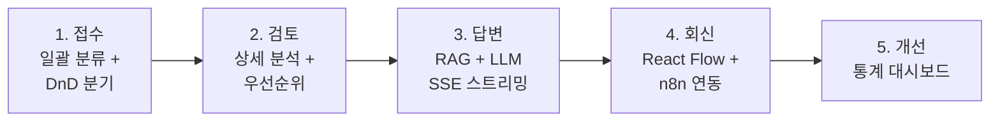

| 단계 | 이름 | 기능 | AS-IS → TO-BE |
|------|------|------|---------------|
| 1 | 접수 | 접수함 5건 일괄 분류 → 자동/수동 2열 분기 | 수동 분류 → ML 일괄 분류 + 신뢰도 라우팅 |
| 2 | 검토 | 선택 문의 상세 분석 + 우선순위 예측 | 전건 수동 → 임계값 기반 분기 |
| 3 | 답변 | RAG + LLM(gpt-4o-mini) 스트리밍 답변 초안 | 처음부터 작성 → AI 초안 생성 |
| 4 | 회신 | React Flow 워크플로우 + n8n 연동 (job_id + SSE + 콜백) | 수동 발송 → n8n 워크플로우 시각화 + 실시간 전송 |
| 5 | 개선 | CS 통계 대시보드 + 파이프라인 이력 | 별도 관리 없음 → 실시간 대시보드 |

**Step 1 접수함 (일괄 분류 + DnD):**

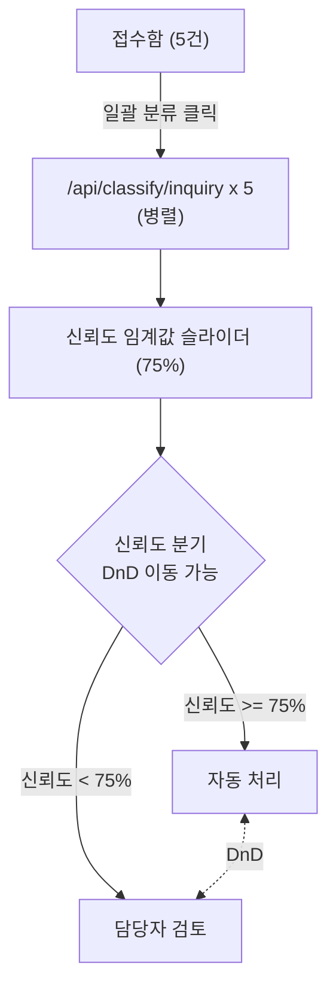

- DnD: HTML5 Drag and Drop으로 문의를 자동 처리 <-> 담당자 검토 간 이동
- 자동 처리: 접수(분류만) → 답변(RAG 일괄 생성) → 회신 (검토 스킵)
- 담당자 검토: 문의 클릭 → 풀 파이프라인 실행 → Step 2(검토) → Step 3(답변) → Step 4(회신)

**샘플 셀러 문의 (5건):**

| # | 문의 내용 | 셀러 등급 | 희망 채널 | 예상 분기 |
|---|----------|----------|----------|----------|
| 1 | 배송비 조건부 무료 설정 방법 | Basic | 이메일 | 자동 |
| 2 | 세금계산서 자동 발행 설정 | Standard | 카카오톡 | 자동 |
| 3 | 상품 대량 등록 엑셀 업로드 오류 | Standard | 이메일, 카카오 | 자동/수동 |
| 4 | PG사 이니시스 인증키 오류 + 네이버페이 정산 누락 | Premium | 무관 | 수동 |
| 5 | 카페24 API 웹훅 콜백 간헐적 실패 | Enterprise | 이메일, SMS | 수동 |

**회신 채널 (4종):**

| 채널 | 아이콘 | 색상 | 활성 상태 |
|------|--------|------|----------|
| 이메일 | `Mail` | blue | **활성** |
| 카카오톡 | `MessageCircle` | yellow | 비활성 (데모) |
| SMS | `Smartphone` | green | 비활성 (데모) |
| 인앱 알림 | `Bell` | purple | 비활성 (데모) |

> 자동 처리: per-inquiry 채널 할당 (고객 `preferredChannels` 기반). 수동 처리: 고객 희망 채널 표시 + '희망' 배지.

**Step 4 React Flow 워크플로우 (`@xyflow/react`):**

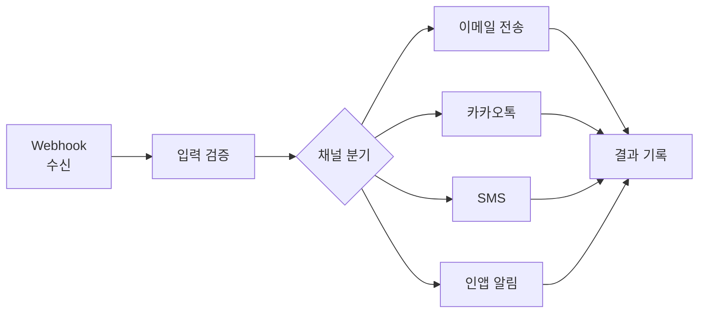

- 전송 클릭 시 SSE 스트리밍(`job_id` 기반)으로 노드 상태 순차 업데이트: `idle` → `running` (pulse 애니메이션) → `completed` (녹색)
- 미선택 채널 노드: 자동 `disabled` (회색 처리), 활성 엣지만 `animated`
- 이메일 채널 선택 시 수신자 이메일 입력 필드 표시

**Step 5 개선 대시보드:**
- 카테고리별 BarChart (`recharts`)
- KPI 카드 (총 처리 건수, 자동 처리율, 평균 응답 시간)
- 파이프라인 처리 이력 테이블 (시간, 문의 요약, 카테고리, 라우팅, 우선순위)

**분리된 내부 컴포넌트:**

| 컴포넌트 | 파일 | 역할 |
|----------|------|------|
| `LabPanel` | `lab/LabPanel.js` | 메인 컨테이너 (상태 관리, 스텝 라우팅) |
| `StepIndicator` | `lab/StepIndicator.js` | 5단계 진행 표시기 (완료/현재/미완료 상태, 클릭 이동) |
| `StepClassify` | `lab/StepClassify.js` | 접수함 테이블 + DnD 2열 분기 + 신뢰도 슬라이더 |
| `StepReview` | `lab/StepReview.js` | 파이프라인 결과 상세 (분류/우선순위/라우팅) |
| `StepAnswer` | `lab/StepAnswer.js` | SSE 스트리밍 답변 + 일괄 답변 생성 + 인라인 수정 |
| `StepReply` | `lab/StepReply.js` | React Flow 워크플로우 + 채널 선택 + 전송 |
| `StepImprove` | `lab/StepImprove.js` | 카테고리 BarChart + KPI + 이력 테이블 |
| `DraggableCard` | `lab/DraggableCard.js` | HTML5 DnD 카드 (드래그 핸들, 카테고리 배지, 드롭존 하이라이트) |
| `WorkflowNode` | `lab/WorkflowNode.js` | React Flow 커스텀 노드 |
| `constants` | `lab/constants.js` | 샘플 문의 데이터, 채널 메타정보 |
| `utils` | `lab/utils.js` | 유틸리티 함수 |

**애니메이션 (Framer Motion):**
- `AnimatePresence` + `motion.div`로 스텝 전환 시 슬라이드 인/아웃 (`x: 20 → 0 → -20`, 0.2s)

---

### 2.10 GuardianPanel (실험실 - DB 보안 감시)

| 항목 | 내용 |
|------|------|
| **파일** | `components/panels/GuardianPanel.js` |
| **역할** | DB 쿼리 실시간 감시 -- 룰엔진 + ML 이상탐지(Isolation Forest) + AI Agent 3단계 분석으로 위험 쿼리 차단 |
| **API** | `POST /api/guardian/analyze`, `POST /api/guardian/recover`, `POST /api/guardian/notify-dba`, `GET /api/guardian/logs`, `GET /api/guardian/stats` |
| **공통 컴포넌트** | `common/StatCard.js` (통계 카드) |
| **권한** | 전체 사용자 |

> **핵심 컨셉**: 룰엔진(<1ms) + ML 이상탐지(~50ms)로 1차 필터링, 위험 쿼리만 AI Agent(GPT-4o-mini)가 정밀 분석. 사용자가 감시 모드(룰/ML/룰+ML) 선택 가능

**아키텍처:**

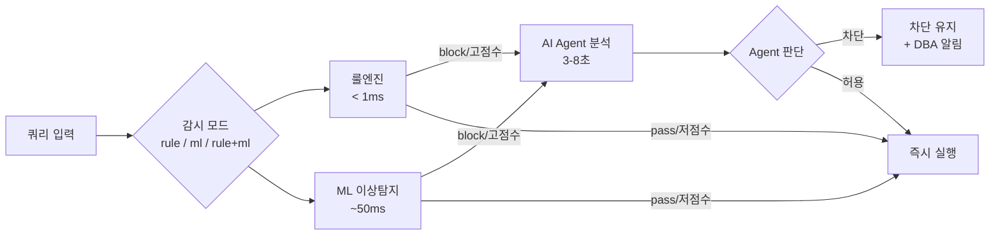

**3개 서브탭:**

| 탭 | 이름 | 기능 |
|-----|------|------|
| 1 | **실시간 감시** | 감시 모드 선택(룰/ML/룰+ML) + 쿼리 입력 → 룰엔진 + ML 이상탐지 + Agent 분석 → 차단/허용 판단 |
| 2 | **복구 요청** | 차단된 쿼리 복구 SQL 생성 (Recovery Agent) |
| 3 | **대시보드** | 감사 로그, 차단 이력, KPI 통계 |

**실시간 감시 탭 -- 입력 폼:**

| 필드 | 타입 | 설명 |
|------|------|------|
| 사용자 ID | text | 실행 사용자 (kim, park 등) |
| 작업 | select | DELETE, UPDATE, DROP, TRUNCATE, ALTER, INSERT, SELECT |
| 테이블 | text | 대상 테이블명 |
| 대상 행 수 | number | 영향받는 행 수 |

**분석 결과 표시:**
- **감시 모드 셀렉터**: 3버튼 토글 (룰 + ML / 룰엔진만 / ML만) -- 모드에 따라 결과 섹션 조건부 표시
- **룰엔진 결과**: pass(녹색) / warn(주황) / block(빨강) + 사유 목록 + 응답 시간
- **ML 이상탐지 결과**: anomaly_score + user_deviation 프로그레스 바 + combined_score 종합 점수 (색상: >70 빨강, >40 주황, <=40 초록)
- **Agent 출력**: Tool 호출 단계별 표시 (접이식) + 최종 판단 텍스트
- **액션 버튼**: "차단 유지" / "그래도 실행 (DBA 승인 필요)"
- **DBA 알림**: 이메일 입력 → Resend API로 차단 내역 + Agent 분석 결과 전송
- **시나리오 프리셋 8개**: 신입 대량 삭제, 야간 데이터 수정, 정상 로그 정리, DDL 명령어, 전체 초기화, 정상 조회, 반복 소량 삭제, 신규 테이블 접근

**작업별 위험도 (ACTION_META):**

| 작업 | 위험도 | 행 수 관련 | 설명 |
|------|--------|-----------|------|
| `DROP` | **critical** | N/A | 테이블 삭제 |
| `TRUNCATE` | **critical** | N/A | 전체 행 삭제 |
| `DELETE` | high | 대상 행 수 | 행 삭제 |
| `UPDATE` | high | 대상 행 수 | 행 수정 |
| `ALTER` | medium | N/A | 스키마 변경 |
| `INSERT` | low | 대상 행 수 | 행 추가 |
| `SELECT` | none | 대상 행 수 | 조회 |

**시뮬레이션 테이블 (TABLE_META, 7종):**

| 테이블 | 행 수 | 핵심 데이터 |
|--------|-------|-----------|
| `orders` | 12,847 | O |
| `payments` | 9,532 | O |
| `users` | 3,210 | O |
| `products` | 18,423 | O |
| `shipments` | 7,891 | O |
| `logs` | 54,320 | X |
| `temp_reports` | 1,205 | X |

**Agent Tool 호출 (LangChain `create_agent`):**

| Tool | 설명 |
|------|------|
| `analyze_impact` | 테이블 행 수, 금액 영향도 분석 |
| `get_user_pattern` | 사용자 최근 30일 활동 패턴 조회 |
| `search_similar` | 과거 유사 사건 검색 (incidents DB) |
| `execute_decision` | 최종 차단/허용 결정 + 감사 로그 기록 |

**복구 요청 탭:**
- 차단된 쿼리 선택 → Recovery Agent가 복구 SQL 자동 생성
- Tool: `search_audit_log` (감사 기록 검색), `generate_restore_sql` (복구 쿼리 생성)

**대시보드 탭:**
- KPI 카드 4개: 총 감사 로그, 차단된 쿼리, 경고, 보호된 금액
- 최근 차단 이력 (시간, 사용자, 작업, 테이블, 금액)
- 전체 감사 로그 테이블 (최근 20건, 상태별 색상 배지)

**내부 컴포넌트:**

| 컴포넌트 | 역할 |
|----------|------|
| `MonitorTab` | 실시간 감시 -- 입력 폼 + 감시 모드 토글 + 프리셋 + 분석 결과 표시 |
| `RecoverTab` | 복구 요청 -- 차단 쿼리 선택 + Recovery Agent 복구 SQL 생성 |
| `DashboardTab` | 대시보드 -- KPI 카드 + 차단 이력 + 감사 로그 테이블 |

**라이브러리:** `react-markdown` (Agent 분석 결과 마크다운 렌더링)

---

### 2.11 ProcessMinerPanel (실험실 - 프로세스 마이닝)

| 항목 | 내용 |
|------|------|
| **파일** | `components/panels/ProcessMinerPanel.js` |
| **역할** | 이커머스 프로세스 마이닝 -- 프로세스 발견 + ML 다음 활동 예측 + 병목 분석 + ML 이상 프로세스 탐지 + AI 자동화 추천 |
| **API** | `POST /api/process-miner/discover`, `POST /api/process-miner/predict`, `POST /api/process-miner/bottlenecks`, `POST /api/process-miner/anomalies`, `POST /api/process-miner/recommend` |
| **공통 컴포넌트** | `common/StatCard.js` (통계 카드) |
| **권한** | 전체 사용자 |

> **핵심 컨셉**: 이벤트 로그 기반 프로세스 플로우 시각화 + ML 모델로 다음 활동 예측 및 이상 프로세스 탐지

**3개 서브탭:**

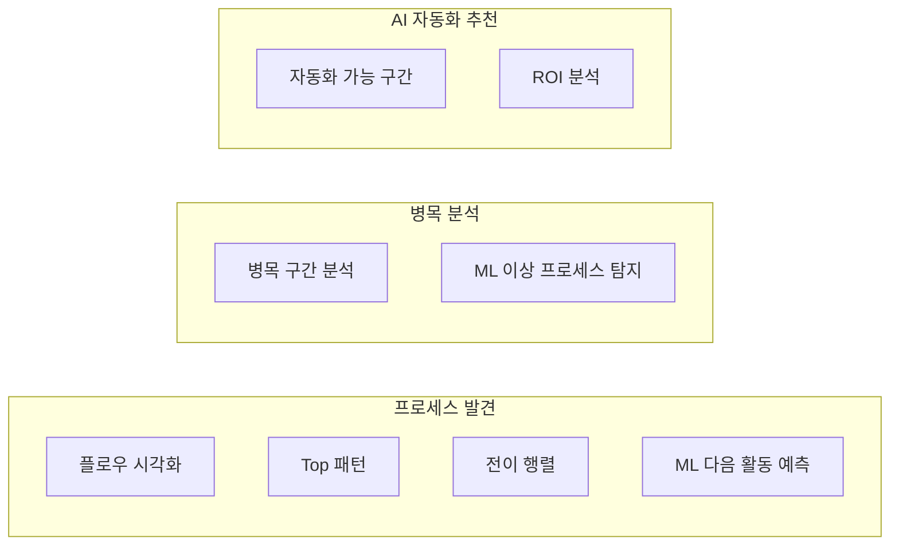

| 탭 | 이름 | 기능 |
|-----|------|------|
| 1 | **프로세스 발견** | 프로세스 플로우 시각화 + 통계 + ML 다음 활동 예측 |
| 2 | **병목 분석** | 병목 구간 분석 + ML 이상 프로세스 탐지 |
| 3 | **AI 자동화 추천** | 자동화 가능 구간 추천 + ROI 분석 |

**프로세스 유형:**

| 값 | 이름 |
|----|------|
| `order` | 주문 프로세스 |
| `cs` | CS 문의 프로세스 |
| `settlement` | 정산 프로세스 |

**ML 기능 1 -- 다음 활동 예측 (프로세스 발견 탭):**

| 항목 | 내용 |
|------|------|
| **API** | `POST /api/process-miner/predict` |
| **입력** | 케이스 ID |
| **출력** | 현재 활동 기준 다음 활동 Top-3 (확률 가로 막대 바) |
| **부가 정보** | 모델 정확도 배지, 피처 중요도 차트 (접기/펼치기) |

**ML 기능 2 -- 이상 프로세스 탐지 (병목 분석 탭):**

| 항목 | 내용 |
|------|------|
| **API** | `POST /api/process-miner/anomalies` |
| **요약 카드** | 전체 케이스 수, 이상 케이스 수, 이상 비율 |
| **정상 패턴** | 정상 프로세스 요약 텍스트 (emerald 박스) |
| **이상 케이스** | 최대 10건 표시 -- 시퀀스 화살표, 예외 활동 빨간색 하이라이트, anomaly_score, 루프 배지 |

**공통 컨트롤** (모든 탭 상단):
- 프로세스 유형 select (`order` / `cs` / `settlement`)
- 케이스 수 select (`100` / `200` / `500` 건)

**내부 컴포넌트:**

| 컴포넌트 | 역할 |
|----------|------|
| `DiscoverTab` | 프로세스 발견 -- 플로우 시각화 + Top 패턴 + 전이 행렬 + ML 예측 |
| `BottleneckTab` | 병목 분석 -- 병목 구간 테이블 + ML 이상 프로세스 탐지 |
| `RecommendTab` | AI 자동화 추천 -- 자동화 가능 구간 + ROI 분석 |
| `ProcessFlowDiagram` | 프로세스 플로우 커스텀 렌더링 (위상 정렬 BFS + 노드 클릭 상세) |
| `TransitionMatrix` | 전이 행렬 테이블 (활동 간 빈도/확률 매트릭스) |
| `FeatureImportanceChart` | ML 피처 중요도 가로 막대 차트 |
| `SimpleMarkdown` | 간이 마크다운 렌더러 (h1~h3, 리스트, 볼드, 줄바꿈) |

**유틸리티 함수:**

| 함수 | 설명 |
|------|------|
| `formatMinutes(min)` | 분 → 초/분/시간/일 자동 변환 |
| `formatNumber(n)` | 숫자 콤마 포맷 |
| `formatPercent(n)` | 소수 → 백분율 변환 (예: 0.85 → "85.0%") |
| `isSuccess(res)` | API 응답 성공 여부 (`success` or `ok`) |

---

### 2.12 AutomationPanel (자동화 엔진)

| 항목 | 내용 |
|------|------|
| **파일** | `components/panels/AutomationPanel.js` |
| **역할** | 탐지 → 자동 실행: 셀러 이탈 방지 + CS FAQ 자동 생성 + 운영 리포트 자동 생성 |
| **API** | `/api/automation/retention/*`, `/api/automation/faq/*`, `/api/automation/report/*`, `/api/automation/actions/*` (14개) |
| **권한** | 전체 사용자 |

> **핵심 컨셉**: 기존 ML 탐지 결과를 LLM으로 자동 조치까지 연결 (카페24 PRO CS/Marketing 패턴)

**3개 서브탭:**

| 탭 | 이름 | 기능 |
|-----|------|------|
| 1 | **이탈 방지** | ML 이탈 예측(threshold 조절) → 위험 셀러 목록 → LLM 맞춤 메시지 생성 → 자동 조치 (쿠폰/업그레이드/매니저/메시지) |
| 2 | **FAQ 자동 생성** | CS 패턴 분석 → LLM FAQ Q&A 생성 → 초안/승인/수정/삭제 관리 |
| 3 | **운영 리포트** | 리포트 유형 선택(일간/주간/월간) → LLM 마크다운 리포트 생성 → 이력 조회 |

**내부 컴포넌트:**

| 컴포넌트 | 역할 |
|----------|------|
| `RetentionTab` | 이탈 위험 셀러 탐지 + LLM 메시지 생성 + 4종 자동 조치 실행 |
| `FaqTab` | CS 패턴 분석 + FAQ 생성/승인/수정/삭제 CRUD |
| `ReportTab` | 리포트 생성 + 마크다운 뷰어 + 생성 이력 |

---

### 인터랙션 & 애니메이션 패턴

**Framer Motion 애니메이션:**

| 패턴 | 적용 위치 | 설정 |
|------|----------|------|
| 슬라이드 전환 | LabPanel 스텝 전환 | `AnimatePresence` + `x: 20→0→-20`, 0.2s |
| 스프링 로고 | Login 페이지 CAFE24 로고 | `spring` 이징, 바운스 |
| 플로팅 아이콘 | Login 배경 이커머스 아이콘 5개 | `y` 반복 애니메이션 |
| 에러 메시지 | Login 에러 텍스트 | 페이드 인 + 슬라이드 |

**CSS 애니메이션 (`globals.css`):**

| 클래스 | 효과 | 지속시간 |
|--------|------|---------|
| `.fade-in` | 투명→불투명 | 0.3s |
| `.slide-in` | 좌→우 슬라이드 | 0.25s |
| `.cafe24-float` | 상하 플로팅 | 3s (반복) |
| `.pulse-soft` | 부드러운 펄스 | 2s (반복) |
| `.cafe24-bounce` | 바운스 | 0.5s |
| `.skeleton::after` | 로딩 시머 (shimmer) | CSS 키프레임 |

**반응형 레이아웃:**

| 브레이크포인트 | 변화 |
|--------------|------|
| **xl** (1280px+) | 12-column 그리드: Sidebar 3열 고정 + Main 9열 |
| **lg** (1024px) | Sidebar 토글 (오버레이) |
| **md** (768px) | 탭 축소, 카드 1열 |
| **sm** (640px) | 모바일 최적화, 풀 위드 |

> 전역 90% 줌(`document.documentElement.style.zoom = '0.9'`)으로 정보 밀도를 높이고, Noto Sans KR + Pretendard 폰트로 한글 가독성을 확보한다.

---

## 3. 컴포넌트

### 레이아웃

| 컴포넌트 | 파일 | 설명 |
|----------|------|------|
| **Layout** | `Layout.js` | 12-column 그리드 (Sidebar 3열 + Main 9열), Noto Sans KR 폰트 |
| **Sidebar** | `Sidebar.js` | CAFE24 SVG 로고, 예시 질문 아코디언 (6카테고리 62개), 셀러 정보, 환영 팝업 |
| **Topbar** | `Topbar.js` | CAFE24 SVG 로고, 사용자명, 로그아웃 버튼 |
| **Tabs** | `Tabs.js` | 역할별 필터링된 탭 네비게이션, ARIA 접근성 (`role="tablist"`, `role="tab"`, `aria-selected`), ArrowLeft/ArrowRight 키보드 네비게이션 |

### 공통 컴포넌트 (신규)

| 컴포넌트 | 파일 | 설명 |
|----------|------|------|
| **CustomTooltip** | `common/CustomTooltip.js` | Recharts 차트 공통 툴팁 (DashboardPanel, AnalysisPanel에서 중복 추출) |
| **StatCard** | `common/StatCard.js` | 통합 통계 카드 (GuardianPanel StatCard + ProcessMinerPanel SummaryCard 통합) |
| **constants** | `common/constants.js` | 공통 상수 (COLORS 등 차트/UI 색상) |

### UI 컴포넌트

| 컴포넌트 | Props | 설명 |
|----------|-------|------|
| **KpiCard** | `title, value, icon, color, trend` | KPI 지표 카드 |
| **SectionHeader** | `title, subtitle, right` | 섹션 제목 + 우측 액션 |
| **EmptyState** | `icon, title, desc` | 데이터 없음 상태 |
| **Skeleton** | `width, height, className` | 로딩 스켈레톤 (SkeletonCard 포함) |

---

## 4. API 통신

### 4.1 프록시 아키텍처

프론트엔드와 백엔드 간 API 통신은 **두 가지 프록시 방식**을 병용한다.

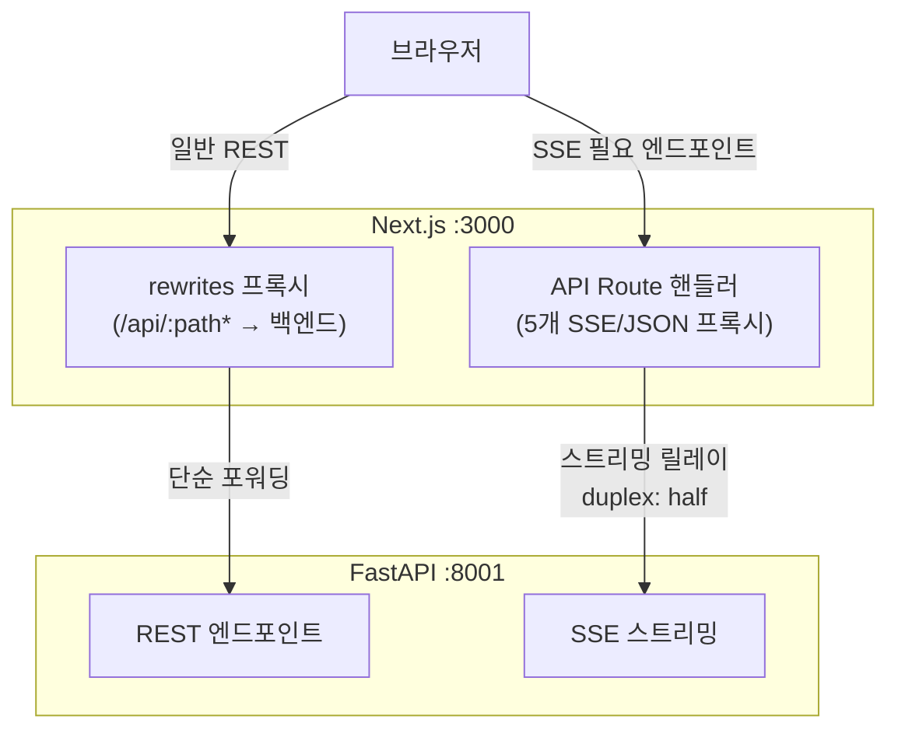

> **SSE 엔드포인트가 전용 API Route를 필요로 하는 이유**: rewrites는 `bodyParser: false`, `duplex: 'half'`, `ReadableStream` 청크 릴레이, `req.on('close')` 클라이언트 해제 감지 등을 지원하지 않음

### 4.2 API 호출 함수

```javascript
// lib/api.js
export async function apiCall({
  endpoint,           // API 경로 (예: '/api/shops')
  method = 'GET',     // HTTP 메서드
  data = null,        // POST body
  auth = null,        // { username, password }
  timeoutMs = 60000,  // 타임아웃
}) {
  // Basic Auth 헤더, AbortController 타임아웃, cache: 'no-store'
  // 에러 시 throw 하지 않고 { status: "FAILED", error } 반환
}
```

### 4.3 SSE 스트리밍

**SSE 공통 유틸 (`lib/sse.js`):**

SSE 파싱과 인증 헤더 생성 로직을 공통 모듈로 추출하여 LabPanel 내 3회 반복되던 코드를 제거했다.

클라이언트에서 `@microsoft/fetch-event-source`로 SSE 연결:

```javascript
import { fetchEventSource } from '@microsoft/fetch-event-source';

await fetchEventSource('/api/agent/stream', {
  method: 'POST',
  body: JSON.stringify({ message }),
  onmessage: (event) => {
    const data = JSON.parse(event.data);
    if (data.type === 'token') onToken(data.content);
  },
});
```

**SSE 이벤트 타입:**

| 이벤트 | 설명 | data 필드 |
|--------|------|-----------|
| `tool_start` | 도구 실행 시작 | `{"tool": "search_platform", "args": {...}}` |
| `tool_end` | 도구 실행 완료 | `{"tool": "...", "status": "SUCCESS"}` |
| `delta` | 토큰 스트리밍 | `{"delta": "이탈"}` |
| `done` | 응답 완료 | `{"ok": true, "final": "...", "tool_calls": [...]}` |
| `error` | 오류 발생 | `{"message": "..."}` |

### 4.4 SSE 프록시 (5개)

Next.js API Route로 구현한 SSE 프록시. 브라우저는 같은 오리진만 호출하고, 서버에서 백엔드로 릴레이한다.

| # | 프록시 파일 | 타깃 백엔드 | 메서드 | 전송 방식 | 용도 |
|---|------------|-----------|--------|----------|------|
| 1 | `pages/api/agent/stream.js` | `/api/agent/stream` | POST | SSE 스트리밍 | AI 에이전트 실시간 응답 |
| 2 | `pages/api/cs/pipeline-answer.js` | `/api/cs/pipeline/answer` | POST | SSE 스트리밍 | CS 파이프라인 답변 생성 |
| 3 | `pages/api/cs/send-reply.js` | `/api/cs/send-reply` | POST | JSON (버퍼링) | CS 회신 전송 (n8n 연동) |
| 4 | `pages/api/cs/stream.js` | `/api/cs/stream?job_id=` | GET | SSE 스트리밍 | CS 회신 SSE (job_id 기반) |
| 5 | `pages/api/cs/callback.js` | `/api/cs/callback` | POST | JSON (버퍼링) | CS 콜백 수신 |

**프록시 공통 설정 (Next.js API Config):**

| 설정 | 값 | 설명 |
|------|----|------|
| `bodyParser` | `false` | POST 바디를 파싱하지 않고 원본 스트림으로 전달 |
| `responseLimit` | `false` | SSE 응답 크기 제한 해제 (스트리밍용) |
| `externalResolver` | `true` | Next.js 내장 경고 억제 (외부에서 응답 처리) |

**SSE 프록시 (#1, #2, #4) 상세:**

| 항목 | 설명 |
|------|------|
| **바디 전달** | `init.body = req` (원본 스트림 그대로 릴레이) |
| **duplex** | `'half'` -- Node.js 18+ `fetch(undici)`에서 스트림 바디 전송 시 필수 |
| **응답 헤더** | `Content-Type: text/event-stream`, `Cache-Control: no-cache, no-transform`, `X-Accel-Buffering: no` |
| **CORS** | `Access-Control-Allow-Origin: *`, OPTIONS preflight 204 응답 |
| **클라이언트 해제** | `req.on('close')` 시 `reader.cancel()` + `res.end()` |
| **청크 전달** | `ReadableStream.getReader()` 루프로 바이트 단위 릴레이 |

**JSON 프록시 (#3, #5) 상세:**

| 항목 | 설명 |
|------|------|
| **바디 수집** | `for await (const chunk of req)` 으로 전체 버퍼링 후 백엔드 전달 |
| **응답** | 백엔드 응답 텍스트를 그대로 클라이언트에 반환 |

> `cs/stream.js`(#4)는 GET 전용이며 `job_id` 쿼리 파라미터 필수 (없으면 400 반환)

### 4.5 Next.js API 프록시 (rewrites)

SSE 이외의 일반 API는 `next.config.js` rewrites로 백엔드에 직접 프록시:

```javascript
// next.config.js
async rewrites() {
  const backend = process.env.BACKEND_INTERNAL_URL || 'http://127.0.0.1:8001';
  return [
    // SSE 스트리밍 → Next API Route에서 처리 (위 5개 프록시)
    { source: '/api/agent/stream', destination: '/api/agent/stream' },
    // 나머지 /api/* → 백엔드 직접 프록시
    { source: '/api/:path*', destination: `${backend}/api/:path*` },
  ];
}
```

### 4.6 API 상태 포맷

백엔드 API 응답의 `status` 필드는 소문자(`success`, `failed` 등)로 통일되었으며, 프론트엔드는 이에 대응 완료.

---

## 5. 상태 관리

### 5.1 페이지 레벨 상태 (`pages/app.js`)

| 상태 | 타입 | 초기값 | 영속화 | 설명 |
|------|------|--------|--------|------|
| `auth` | object \| null | `null` | sessionStorage | 인증 정보 (username, password, user_name, user_role) |
| `shops` | array | `[]` | - | 쇼핑몰 목록 (`/api/shops`에서 로드) |
| `categories` | array | `[]` | - | 카테고리 목록 (`/api/categories`에서 로드) |
| `selectedShop` | string \| null | `null` | - | 선택된 쇼핑몰 ID (첫 번째 자동 선택) |
| `settings` | object | DEFAULT_SETTINGS | localStorage | LLM 설정 (아래 상세) |
| `settingsLoaded` | boolean | `false` | - | 스토리지에서 설정 로드 완료 여부 |
| `agentMessages` | array | `[]` | localStorage | AI 채팅 히스토리 |
| `activityLog` | array | `[]` | localStorage | 활동 로그 (시간, 사용자, 작업, 상세) |
| `totalQueries` | number | `0` | localStorage | 누적 쿼리 수 |
| `activeTab` | string | `'agent'` | - | 현재 활성 탭 키 |

**DEFAULT_SETTINGS:**

```javascript
{
  apiKey: '',
  selectedModel: 'gpt-4o-mini',
  maxTokens: 8000,
  temperature: 0.3,
  systemPrompt: '',    // 백엔드에서 자동 로드
  ragMode: 'rag',      // 'rag' | 'lightrag' | 'k2rag' | 'auto'
}
```

**초기 데이터 로딩 (마운트 시):**

| API | 용도 | 저장 상태 |
|-----|------|----------|
| `GET /api/settings/prompt` | 시스템 프롬프트 자동 로드 | `settings.systemPrompt` |
| `GET /api/settings/default` | 프롬프트 로드 실패 시 fallback | `settings.systemPrompt` |
| `GET /api/shops` | 쇼핑몰 목록 | `shops`, `selectedShop` |
| `GET /api/categories` | 카테고리 목록 | `categories` |

**이중 메모리 구조 (프론트엔드 + 백엔드):**

| 레이어 | 저장소 | 크기 제한 | 용도 |
|--------|--------|----------|------|
| **프론트엔드** | localStorage `cafe24_agent_messages` | 무제한 (브라우저 5MB 한도) | UI 채팅 히스토리 표시 |
| **백엔드** | `core/memory.py` deque(maxlen=20) | 10턴 (user+assistant 쌍) | LLM 컨텍스트 주입 |

> LLM은 최근 10턴만 보지만, 프론트엔드는 전체 히스토리를 표시한다. 토큰 사용량 제어를 위한 의도적 설계.

**활동 로그 시스템:**

| 함수 | 설명 |
|------|------|
| `addLog(action, detail)` | 활동 기록 추가 (시간, 사용자명 자동 포함) |
| `clearLog()` | 전체 로그 초기화 (LogsPanel에서 호출) |

**CustomEvent 기반 예시 질문 브릿지:**

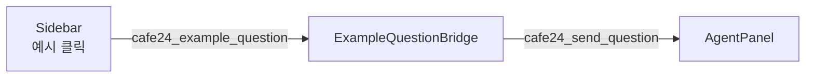

> 사이드바의 예시 질문 클릭 시 `window.dispatchEvent(CustomEvent)` 체인으로 AgentPanel에 질문 전달. React state가 아닌 window 이벤트를 사용하여 컴포넌트 간 느슨한 결합 유지

### 5.2 스토리지 키 (`lib/storage.js`)

| 상수명 | 키 | 저장소 | 용도 | 만료 |
|--------|-----|-------|------|------|
| `STORAGE_KEYS.AUTH` | `cafe24_auth` | sessionStorage | 인증 정보 | 탭 닫으면 만료 |
| `STORAGE_KEYS.SETTINGS` | `cafe24_settings` | localStorage | LLM 설정 | 영구 |
| `STORAGE_KEYS.AGENT_MESSAGES` | `cafe24_agent_messages` | localStorage | AI 채팅 히스토리 | 영구 |
| `STORAGE_KEYS.ACTIVITY_LOG` | `cafe24_activity_log` | localStorage | 활동 로그 | 영구 |
| `STORAGE_KEYS.TOTAL_QUERIES` | `cafe24_total_queries` | localStorage | 누적 쿼리 수 | 영구 |

### 5.3 스토리지 유틸리티

| 함수 | 대상 | 설명 |
|------|------|------|
| `loadFromStorage(key, fallback)` | localStorage | JSON 파싱, 실패 시 fallback 반환 |
| `saveToStorage(key, value)` | localStorage | JSON 직렬화 후 저장 |
| `removeFromStorage(key)` | localStorage | 키 삭제 |
| `loadFromSession(key, fallback)` | sessionStorage | JSON 파싱, 실패 시 fallback 반환 |
| `saveToSession(key, value)` | sessionStorage | JSON 직렬화 후 저장 |
| `removeFromSession(key)` | sessionStorage | 키 삭제 |

> SSR 안전: 모든 함수에서 `typeof window === 'undefined'` 가드 -- 서버 사이드에서 호출해도 에러 없음

---

## 6. 디자인 시스템

### 6.1 CAFE24 브랜드 컬러

```javascript
// tailwind.config.js
colors: {
  cafe24: {
    blue: '#5B9BF5',     // primary
    navy: '#4A8AE5',
    dark: '#1A1A2E',
    light: '#F8FAFC',
    gray: '#E8ECF0',
    accent: '#00C853',   // 성공
    warning: '#FF9800',
    error: '#F44336',
    white: '#FFFFFF',
    slate: '#64748B',
    primary: '#5B9BF5',
    secondary: '#4A8AE5',
    success: '#00C853',
    info: '#7CB9F7',
    yellow: '#7CB9F7',
    orange: '#5B9BF5',
    brown: '#1A1A2E',
    cream: '#F5F7FA',
    beige: '#E8ECF0',
    pink: '#F472B6',
  },
  grade: {                // 셀러 등급별
    common: '#9CA3AF',
    rare: '#42A5F5',
    superrare: '#7C3AED',
    epic: '#AB47BC',
    legendary: '#1B6FF0',
    ancient: '#0D47A1',
  },
}
// plugins: [require('@tailwindcss/typography')]
```

### 6.2 CSS 변수

```css
/* styles/globals.css -- cafe24 테마 */
:root {
  --bg: #F5F7FA;
  --panel: #ffffff;
  --text: #1A1A2E;
  --muted: #64748B;
  --primary: #5B9BF5;
  --primary2: #4A8AE5;
  --success: #00C853;
  --danger: #F44336;

  /* --cafe24-* 변수 */
  --cafe24-yellow: #7CB9F7;
  --cafe24-orange: #5B9BF5;
  --cafe24-brown: #1A1A2E;
  --cafe24-cream: #F5F7FA;
  /* ... */
}
```

> CSS 변수와 클래스명 모두 `cafe24-*` 접두사로 통일되어 있다. Tailwind 유틸리티(`text-cafe24-brown`, `bg-cafe24-orange` 등)와 커스텀 클래스(`.cafe24-card`, `.cafe24-text` 등)가 일관된 네이밍을 사용한다.

### 6.3 커스텀 클래스

| 카테고리 | 클래스 | 설명 |
|----------|--------|------|
| **버튼** | `.btn` | CAFE24 블루 그라데이션 (#7CB9F7 → #5B9BF5) |
| | `.btn-secondary` | 흰색 배경 |
| | `.btn-ghost` | 투명 배경 |
| | `.btn-green` | 성공 그라데이션 |
| **카드** | `.card` | 흰색 배경, 라운드 16px |
| | `.cafe24-card` | CAFE24 호버 효과 카드 |
| **배지** | `.badge-success` / `.badge-danger` / `.badge-orange` | 상태별 색상 |
| | `.badge-common` ~ `.badge-ancient` | 셀러 등급별 |
| **채팅** | `.chat-bubble-user` | 라이트 블루 배경 |
| | `.chat-bubble-ai` | 흰색 배경 |
| **텍스트** | `.cafe24-text` | CAFE24 블루 그라데이션 텍스트 |

### 6.4 애니메이션

| 클래스 | 설명 |
|--------|------|
| `.fade-in` | 페이드 인 (0.3s) |
| `.slide-in` | 슬라이드 인 (0.25s) |
| `.cafe24-float` | 플로팅 (3s) |
| `.pulse-soft` | 부드러운 펄스 (2s) |
| `.cafe24-spin` | 회전 (8s) |
| `.cafe24-bounce` | 바운스 (0.5s) |
| `.cafe24-glow` | 글로우 효과 |
| `.cafe24-border` | 보더 그라데이션 |

### 6.5 반응형 브레이크포인트

| 브레이크포인트 | 크기 | 레이아웃 |
|--------------|------|---------|
| **xl** | 1280px+ | 사이드바 고정, 12-column 그리드 |
| **lg** | 1024px | 사이드바 토글 (오버레이) |
| **md** | 768px | 탭 축소, 카드 1열 |
| **sm** | 640px | 모바일 최적화, 풀 위드 |

---

## 7. 환경 설정

### 7.1 환경 변수

| 변수 | 용도 | 기본값 | 스코프 |
|------|------|--------|--------|
| `BACKEND_INTERNAL_URL` | 서버 사이드에서 백엔드 프록시 주소 | `http://127.0.0.1:8001` | 서버 전용 |
| `NEXT_PUBLIC_API_BASE` | 클라이언트 API 베이스 URL | `''` (같은 오리진) | 클라이언트 공개 |

`.env.local` 파일:

```env
BACKEND_INTERNAL_URL=http://127.0.0.1:8001
# NEXT_PUBLIC_API_BASE=http://127.0.0.1:8001  # 백엔드가 다른 포트일 때만
```

### 7.2 실행

```bash
# 개발
npm install
npm run dev          # http://localhost:3000

# 프로덕션
npm run build
npm start
```

### 7.3 Vercel 배포

| 항목 | 설정 |
|------|------|
| **Framework** | Next.js (자동 감지) |
| **Build Command** | `npm run build` |
| **Output** | `.next/` |
| **환경 변수** | Vercel Dashboard > Settings > Environment Variables에서 `BACKEND_INTERNAL_URL` 설정 |
| **SSE 주의** | Vercel Serverless Functions 최대 실행 시간 제한 (Hobby: 10s, Pro: 60s) |

### 7.4 기술 스택

| 라이브러리 | 버전 | 용도 |
|-----------|------|------|
| **Next.js** | 14.2 | React 프레임워크 (Pages Router) |
| **React** | 18.2 | UI 라이브러리 |
| **Tailwind CSS** | 3.4 | 유틸리티 CSS |
| **@tailwindcss/typography** | 0.5 | prose 타이포그래피 플러그인 |
| **Recharts** | 3.7 | 차트/그래프 |
| **Framer Motion** | 11.0 | 애니메이션 |
| **Lucide React** | 0.452 | 아이콘 |
| **react-markdown** | 9.0 | 마크다운 렌더링 |
| **remark-gfm** | 4.0 | GFM 마크다운 |
| **remark-math** | 6.0 | 수학 수식 파싱 |
| **rehype-katex** | 7.0 | KaTeX rehype 플러그인 |
| **katex** | 0.16 | 수학 수식 렌더링 |
| **@microsoft/fetch-event-source** | 2.0 | SSE 스트리밍 |
| **@xyflow/react** | 12.10 | React Flow 다이어그램 (LabPanel) |
| **react-hot-toast** | 2.4 | 토스트 알림 |
| **nprogress** | 0.2 | 페이지 전환 진행바 |
| **plotly.js-dist-min** | 2.30 | Plotly 차트 (경량) |
| **react-plotly.js** | 2.6 | React Plotly 래퍼 |

---

## 8. 인증 및 라우팅

### 8.1 페이지 라우팅 흐름

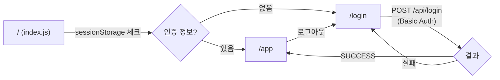

| 페이지 | 파일 | 역할 |
|--------|------|------|
| `/` | `pages/index.js` | 세션 체크 후 `/app` 또는 `/login`으로 리다이렉트 |
| `/login` | `pages/login.js` | 로그인 폼 (Basic Auth, 테스트 계정 퀵필) |
| `/app` | `pages/app.js` | 메인 앱 (탭 기반 패널 라우팅, 12개 패널) |

### 8.2 로그인 페이지 (`pages/login.js`)

| 기능 | 설명 |
|------|------|
| **인증 방식** | `POST /api/login` (Basic Auth 헤더) |
| **세션 저장** | 성공 시 `{ username, password, user_name, user_role }` → sessionStorage |
| **자동 리다이렉트** | 이미 인증된 상태면 `/app`으로 자동 이동 |
| **테스트 계정 퀵필** | 아코디언 토글로 4개 테스트 계정 원클릭 입력 |
| **Enter 키 로그인** | 비밀번호 필드에서 Enter 키로 바로 로그인 |
| **에러 표시** | Framer Motion 애니메이션 에러 메시지 |
| **플로팅 아이콘** | 배경에 이커머스 아이콘 5개 플로팅 애니메이션 |
| **CAFE24 SVG 로고** | 로그인 카드 상단 스프링 애니메이션 로고 |

**테스트 계정:**

| 라벨 | 아이디 | 비밀번호 | 역할 | 접근 패널 |
|------|--------|---------|------|-----------|
| 관리자 | `admin` | `admin123` | Admin | 12개 전부 |
| 운영자 | `operator` | `oper123` | Operator | 6개 (공개) |
| 분석가 | `analyst` | `analyst123` | Analyst | 6개 (공개) |
| 사용자 | `user` | `user123` | User | 6개 (공개) |

### 8.3 앱 초기화 (`pages/app.js`)

마운트 시 순서:

1. `document.documentElement.style.zoom = '0.9'` (전역 90% 줌 적용)
2. sessionStorage에서 인증 정보 로드 (없으면 `/login` 리다이렉트)
3. localStorage에서 설정, 채팅 히스토리, 활동 로그, 쿼리 수 복원
4. 백엔드에서 시스템 프롬프트 자동 로드 (`/api/settings/prompt`, fallback: `/api/settings/default`)
5. `/api/shops`, `/api/categories` 병렬 로드
6. 모든 상태 변경은 즉시 localStorage에 자동 동기화 (`useEffect` 워치)

### 8.4 예시 질문 시스템

사이드바에 6개 카테고리, 총 62개 예시 질문 내장 (`app.js` 하드코딩):

| 카테고리 | 질문 수 | 예시 |
|----------|---------|------|
| 쇼핑몰 & 플랫폼 | 10 | "S0001 쇼핑몰 정보 알려줘" |
| CS & 운영 | 6 | "CS 문의 통계 보여줘" |
| AI 예측 분석 | 12 | "SEL0001 셀러 이탈 확률 예측해줘" |
| 비즈니스 KPI | 12 | "최근 7일 KPI 트렌드 분석해줘" |
| 셀러 분석 | 12 | "SEL0001 셀러 분석해줘" |
| 카페24 FAQ | 10 | "카페24 결제수단 설정 방법 알려줘" |

> 예시 질문은 백엔드 API가 아닌 프론트엔드 하드코딩. `CustomEvent` 브릿지를 통해 AgentPanel로 전달 (섹션 5.1 참조)

---

## 9. 데이터 흐름

### 9.1 AI 에이전트 SSE 흐름

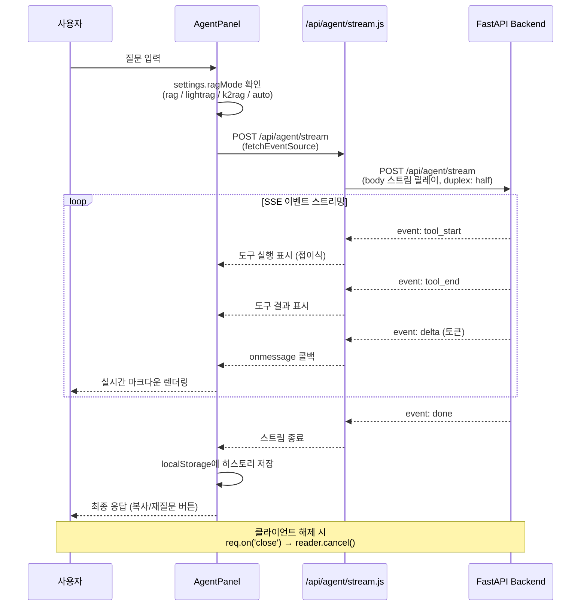

### 9.2 CS 파이프라인 흐름

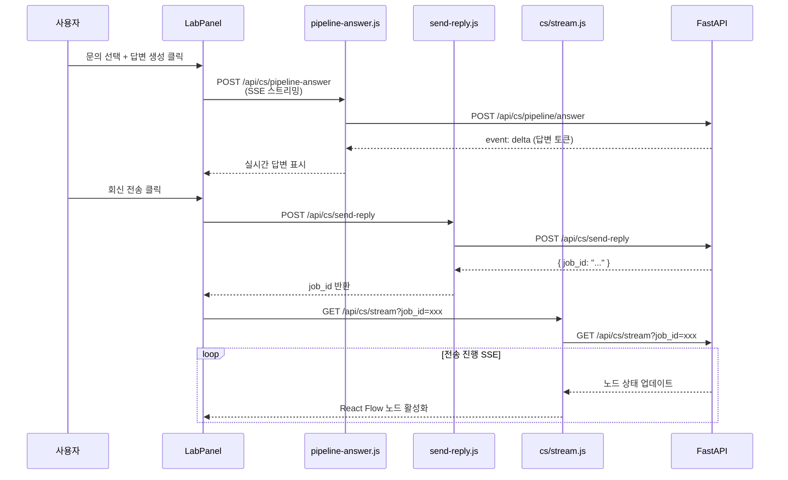

---

## 10. 에러 핸들링

### 10.1 API 호출 에러 (`lib/api.js`)

| 상황 | 처리 |
|------|------|
| **타임아웃** | `AbortController` + `setTimeout(timeoutMs)` -- 기본 60초 |
| **네트워크 에러** | `{ status: "FAILED", error: "..." }` 반환 (throw 하지 않음) |
| **JSON 파싱 실패** | `resp.json().catch(() => ({}))` -- 빈 객체 fallback |
| **인증 실패** | Basic Auth 헤더 누락/잘못된 경우 백엔드에서 401 반환 |

### 10.2 SSE 프록시 에러

| 상황 | 처리 |
|------|------|
| **백엔드 미응답** | HTTP 500 + `{ status: "FAILED", error }` JSON 응답 |
| **클라이언트 연결 끊김** | `req.on('close')` → `reader.cancel()` 호출로 업스트림 정리 |
| **업스트림 body 없음** | `if (!upstream.body) res.end()` -- 빈 응답으로 종료 |
| **job_id 누락** (`cs/stream`) | HTTP 400 + `{ error: "job_id required" }` |

### 10.3 스토리지 에러

| 상황 | 처리 |
|------|------|
| **JSON 파싱 실패** | `safeJsonParse()` -- try/catch로 fallback 값 반환 |
| **SSR 환경** | `typeof window === 'undefined'` 가드 |
| **스토리지 용량 초과** | 브라우저 기본 제한 (5MB). 채팅 히스토리가 커지면 수동 정리 필요 |

---

## 11. 성능 최적화

| 기법 | 적용 위치 | 설명 |
|------|----------|------|
| **SSE 청크 릴레이** | SSE 프록시 | `ReadableStream.getReader()` 바이트 단위 릴레이 -- 버퍼링 없이 실시간 전달 |
| **NProgress (중첩 카운터)** | `lib/progress.js` | `inflight` 카운터로 중첩 라우트 전환 추적 |
| **AbortController** | `lib/api.js` | 모든 API 호출에 타임아웃 적용 (기본 60초) |
| **sessionStorage 인증** | `lib/storage.js` | 인증 정보는 sessionStorage -- 탭 닫으면 자동 만료 |
| **cache: no-store** | `lib/api.js` | 모든 fetch에 `cache: 'no-store'` -- 항상 최신 데이터 |
| **X-Accel-Buffering: no** | SSE 프록시 | Nginx 프록시 뒤에서도 SSE 버퍼링 방지 |
| **flushHeaders** | SSE 프록시 | 응답 헤더 즉시 전송으로 SSE 연결 지연 최소화 |
| **전역 90% 줌** | `pages/app.js` | `zoom = '0.9'` -- 더 많은 정보를 한 화면에 표시 |
| **Noto Sans KR + Pretendard** | `Layout.js` / `globals.css` | `next/font/google`로 Noto Sans KR 최적 로딩 |
| **CSS shimmer 스켈레톤** | `globals.css` | `.skeleton::after` 키프레임 (순수 CSS, JS 없음) |
| **safeReplace** | `pages/app.js` | 동일 경로 중복 `router.replace()` 방지 |
| **useCallback/useMemo** | `pages/app.js` | `apiCall`, `addLog`, `tabs` 등 주요 함수/값 메모이제이션 |
| **mount 가드** | `pages/app.js` | `mounted` 플래그로 언마운트 후 상태 업데이트 방지 |
| **SSE 유틸 공통화** | `lib/sse.js` | LabPanel 내 SSE 파싱/인증 헤더 3회 반복 코드를 공통 모듈로 추출 |
| **컴포넌트 분리** | `panels/lab/`, `panels/analysis/` | 대형 단일 파일을 기능별 모듈로 분리하여 번들 최적화 |

---

## 12. 접근성

### ARIA 속성

| 컴포넌트 | 적용 내용 |
|----------|----------|
| **Tabs.js** | `role="tablist"` (탭 컨테이너), `role="tab"` (개별 탭), `aria-selected` (선택 상태) |
| **5개 패널** | 주요 인터랙션 요소에 ARIA 속성 추가 |

### 키보드 네비게이션

| 키 | 동작 | 적용 위치 |
|----|------|----------|
| `ArrowLeft` | 이전 탭으로 이동 | Tabs.js |
| `ArrowRight` | 다음 탭으로 이동 | Tabs.js |

---

<div align="center">

**Version 8.0.0** · Last Updated 2026-02-10

</div>
