---
html:
  embed_local_images: true
print_background: true
---

<style>
@import url('https://fonts.googleapis.com/css2?family=Noto+Sans+KR:wght@300;400;500;700&display=swap');

/* === 기본 === */
body { background-color: #fdf6e3 !important; color: #586e75; font-family: 'Noto Sans KR', sans-serif; line-height: 1.8; }

/* === 제목 === */
h1 { color: #073642; border-bottom: 3px solid #268bd2; padding-bottom: 8px; }
h2 { color: #073642; border-bottom: 2px solid #93a1a1; padding-bottom: 6px; margin-top: 2em; }
h3, h4 { color: #073642; }
strong { color: #073642; }

/* === 테이블 === */
table { border-collapse: collapse; width: 100%; margin: 16px 0; font-size: 0.92em; }
table th { background-color: #d3cbb7; color: #073642; padding: 10px 12px; text-align: left; font-weight: bold; }
table td { padding: 8px 12px; border-bottom: 1px solid #d3cbb7; }
table tr:nth-child(even) { background-color: #eee8d5; }

/* === 인용문 === */
blockquote { border-left: 4px solid #268bd2; background-color: #eee8d5; padding: 12px 20px; border-radius: 4px; margin: 16px 0; }

/* === 코드 블록 === */
pre { background-color: #eee8d5 !important; color: #073642 !important; padding: 16px; border-radius: 6px; overflow-x: auto; font-size: 0.88em; border: 1px solid #d3cbb7; }
code { font-size: 0.9em; color: #073642; }

/* === 링크 === */
a { color: #268bd2; text-decoration: none; }
a:hover { text-decoration: underline; }

/* === 구분선 === */
hr { border: none; border-top: 2px solid #d3cbb7; margin: 2em 0; }

/* === Mermaid === */
.mermaid { background-color: transparent; border-radius: 8px; padding: 16px; margin: 16px auto; max-width: 800px; text-align: center; }
.mermaid svg { max-width: 100%; height: auto; }

/* === 인쇄 === */
@media print {
  body { background-color: #fdf6e3 !important; -webkit-print-color-adjust: exact; print-color-adjust: exact; }
  table th { background-color: #d3cbb7 !important; color: #073642 !important; -webkit-print-color-adjust: exact; print-color-adjust: exact; }
  table tr:nth-child(even) { background-color: #eee8d5 !important; }
  pre { background-color: #eee8d5 !important; color: #073642 !important; }
  .mermaid { background-color: transparent; }
  h2 { page-break-before: auto; }
}
</style>

# CAFE24 AI 운영 플랫폼

<div align="center">

### 이커머스 SaaS 플랫폼을 위한 LLM + ML 하이브리드 AI 운영 시스템

**자연어 한 마디로 셀러 이탈 예측, 이상거래 탐지, CS 자동화, 매출 예측을 수행하는 AI 에이전트 플랫폼**

<p style="display:flex; flex-wrap:wrap; justify-content:center; gap:4px;"><a href="https://python.org"></a> <a href="https://fastapi.tiangolo.com"></a> <a href="https://nextjs.org"></a> <a href="https://langchain.com"></a> <a href="https://langchain-ai.github.io/langgraph/"></a> <a href="https://openai.com"></a> <a href="https://mlflow.org"></a> <a href="https://github.com/facebookresearch/faiss"></a> <a href="https://shap.readthedocs.io"></a></p>

[웹앱 (Vercel)](https://cafe24-frontend.vercel.app/) · [API 문서 (Swagger)](https://cafe24-backend-production.up.railway.app/docs) · 개발 기간: 2026.02.06 ~ 진행 중


**웹앱 바로가기 QR**

</div>

> **아래 모든 기능은 웹앱에서 직접 사용해볼 수 있습니다.**
> 더 자세한 기술 문서는 [GitHub 리포지토리](https://github.com/ASNGG/cafe24-demo)에서 확인할 수 있습니다.

---

## At a Glance

| 지표 | 수치 |
|:----:|:----:|
| **AI 도구** | 31개 (Tool Calling) |
| **ML 모델** | 12개 (6종 알고리즘) |
| **RAG 엔진** | 8종 기법 적용 |
| **API 엔드포인트** | 106개 REST API |
| **프론트엔드 패널** | 13개 기능 패널 |
| **자동화 엔진** | 3종 (이탈방지 · FAQ · 리포트) |
| **합성 데이터** | 18개 CSV, ~100K 행 |

---

## 목차

1. [프로젝트 개요](#1-프로젝트-개요)
2. [시스템 아키텍처](#2-시스템-아키텍처)
3. [AI 에이전트 시스템](#3-ai-에이전트-시스템)
4. [RAG 시스템 (8종 기법)](#4-rag-시스템-8종-기법)
5. [ML 파이프라인 (12개 모델)](#5-ml-파이프라인-12개-모델)
6. [CS 자동화 파이프라인](#6-cs-자동화-파이프라인)
7. [DB 보안 감시 (Data Guardian)](#7-db-보안-감시-data-guardian)
8. [AI 프로세스 마이너](#8-ai-프로세스-마이너)
9. [자동화 엔진 (이탈방지 · FAQ · 리포트)](#9-자동화-엔진-이탈방지--faq--리포트)
10. [프론트엔드 (13개 패널)](#10-프론트엔드-13개-패널)
11. [기술 스택 및 아키텍처 결정](#11-기술-스택-및-아키텍처-결정)
12. [프로젝트 구조](#12-프로젝트-구조)
13. [설치 및 배포](#13-설치-및-배포)

---

## 1. 프로젝트 개요

### 배경 및 목표

카페24 같은 이커머스 플랫폼을 운영한다면 어떤 문제가 발생할지 직접 고민하고, 그 문제들을 AI로 해결하는 데모 프로젝트를 풀스택으로 개발했습니다. "셀러가 이탈하기 전에 미리 알 수 있다면?", "이상거래를 사람 대신 자동으로 잡아낼 수 있다면?", "CS 문의를 AI가 분류하고 답변 초안까지 만들어준다면?", "운영 프로세스의 병목을 데이터로 발견할 수 있다면?" — 이런 질문들에서 출발했습니다.

백엔드(FastAPI + LangChain + 12개 ML 모델)부터 프론트엔드(Next.js 14, 13개 패널)까지 전 과정을 직접 설계·구현했으며, 자연어 한 마디로 31개 AI 도구를 호출하여 이커머스 운영 전반을 하나의 에이전트로 통합하는 것을 목표로 했습니다. 시스템은 실시간 데이터 연동을 가정하고 설계했으나, 현재 데모에서는 도메인별 통계적 분포로 생성한 합성 데이터(18개 CSV, ~100K행)를 사용합니다.

### 해결하는 문제

| 문제 | 기존 방식 | AI 플랫폼 솔루션 |
|------|----------|------------------|
| **셀러 이탈** | 이탈 후 사후 분석 | RandomForest + SHAP 사전 예측 + 원인 분석 |
| **이상거래** | 수동 모니터링, 신고 기반 | Isolation Forest 실시간 자동 탐지 |
| **CS 문의** | 담당자 수동 분류/응답 | TF-IDF + RF 자동 분류 + RAG+LLM 답변 + DnD 자동/수동 분기 |
| **정산 이상** | 수작업 검증 | DBSCAN 이상 패턴 탐지 |
| **매출 예측** | 경험 기반 추정 | LightGBM 다변량 매출 예측 |
| **데이터 분석** | SQL 직접 작성 | 자연어 질의 → AI 에이전트 자동 분석 (31개 도구) |
| **DB 보안** | 수동 모니터링 | 룰엔진 + ML + LangChain Agent 3단계 실시간 차단 |
| **운영 프로세스** | 경험 기반 병목 파악 | 이벤트 로그 기반 프로세스 마이닝 + ML 이상 탐지 + 자동화 추천 |

### 핵심 설계 원칙

프로젝트 전반에 일관되게 적용한 **"빠른 규칙 우선 + AI fallback"** 원칙:

| 적용 영역 | 1차: 규칙 기반 (빠름, 비용 0) | 2차: AI fallback (정확, 비용 발생) |
|----------|------------------------------|-----------------------------------|
| **에이전트 라우터** | 키워드 분류 (0ms) | LLM Router (gpt-4o-mini) |
| **DB 보안 감시** | 룰엔진 (<1ms) | LangChain Agent (3~8초) |
| **CS 파이프라인** | 신뢰도 >= 0.75 자동 처리 | 신뢰도 < 0.75 담당자 검토 |
| **ML 예측** | Heuristic 스코어링 | ML 모델 (RandomForest, LightGBM) |

> **설계 기반**: Anthropic [Building Effective Agents](https://www.anthropic.com/research/building-effective-agents) — "빠른 규칙 우선 + AI fallback" 패턴을 이커머스 운영에 적용

---

## 2. 시스템 아키텍처

### 전체 아키텍처

```mermaid
%%{init: {'theme': 'default', 'themeVariables': {'fontSize': '14px'}}}%%
flowchart TB
    subgraph Frontend["Frontend · Next.js 14"]
        Login[로그인]
        Panels["13개 기능 패널"]
    end

    subgraph Backend["Backend · FastAPI"]
        subgraph Router["2단계 라우터"]
            R1["키워드 분류 · 0ms"]
            R2["LLM Router · fallback"]
        end

        subgraph Agent["AI 에이전트"]
            Runner["Tool Calling 실행기"]
            MultiAgent["LangGraph 멀티 에이전트"]
            Tools["31개 도구 함수"]
        end

        subgraph RAGSystem["RAG 시스템"]
            HybridRAG["Hybrid Search"]
            LightRAG["LightRAG"]
            K2RAG["K2RAG"]
        end

        subgraph MLModels["ML 12개 모델"]
            Churn["이탈 예측 · RF+SHAP"]
            Fraud["이상거래 · IsolationForest"]
            Revenue["매출 예측 · LightGBM"]
            Others["+ 9개 모델"]
        end

        State["전역 상태 관리"]
    end

    subgraph External["외부 서비스"]
        OpenAI["OpenAI API"]
        n8n["n8n Cloud"]
        Resend["Resend Email"]
    end

    Frontend -->|"REST / SSE"| Backend
    Router --> Agent
    Agent --> RAGSystem & MLModels & OpenAI
    Backend --> n8n & Resend
```

### End-to-End 요청 처리 흐름

사용자가 "SEL0001 셀러가 이탈할 확률은?"이라고 질문하면:

```mermaid
%%{init: {'theme': 'default', 'themeVariables': {'fontSize': '14px'}}}%%
sequenceDiagram
    autonumber
    participant User as 사용자
    participant FE as Next.js
    participant Router as 2단계 라우터
    participant Agent as AI Agent
    participant Tool as Tool Executor
    participant ML as ML Model (.pkl)
    participant LLM as GPT-4o-mini

    User->>FE: "SEL0001 셀러가 이탈할 확률은?"
    FE->>Router: SSE 연결 (/api/agent/stream)

    Note over Router: 1단계: 키워드 "이탈" + "SEL" ID 감지<br/>→ IntentCategory.SELLER<br/>→ predict_seller_churn 강제 실행
    Router->>Agent: 셀러 도구 9개만 전달

    Agent->>LLM: Tool Calling 요청
    LLM-->>Agent: predict_seller_churn("SEL0001")

    Agent->>Tool: predict_seller_churn("SEL0001")
    Tool->>ML: RandomForest.predict_proba() + SHAP
    ML-->>Tool: 이탈 확률 73% + SHAP 피처 기여도
    Tool-->>Agent: 예측 결과 JSON

    Agent->>LLM: 도구 결과 + 시스템 프롬프트
    LLM-->>FE: SSE 스트리밍 (토큰 단위)
    FE-->>User: "이탈 확률 73%, 주요 원인: 매출 감소..."
```

---

## 3. AI 에이전트 시스템

### 3.1 2단계 인텐트 라우터

**문제**: 31개 도구를 한 번에 노출하면 LLM이 잘못된 도구를 선택합니다 (예: 분석 질문에 RAG 호출). 도구 수가 증가할수록 Tool Calling 정확도가 하락하는 것은 LLM의 알려진 한계입니다.

**해결**: 2단계 Router 패턴으로 도구 선택 공간을 7개 카테고리로 축소합니다.

```mermaid
flowchart TB
    Q["사용자 질문"]

    subgraph Stage1["1단계: 키워드 Router"]
        K1["매출 · 이탈 · GMV → ANALYSIS"]
        K2["플랫폼 · 정책 → PLATFORM"]
        K3["SEL0001 패턴 → SELLER"]
    end

    subgraph Stage2["2단계: LLM Router"]
        L1["GPT-4o-mini 분류"]
        L2["JSON 응답 파싱"]
    end

    Q -->|"0ms, 비용 0"| Stage1
    Stage1 -->|"매칭 실패 → fallback"| Stage2
    Stage1 & Stage2 --> Tools["카테고리별 도구 4~19개만 노출"]
```

**IntentCategory (7개)**:

| 카테고리 | 트리거 키워드 | 노출 도구 수 | 비고 |
|----------|-------------|:-----------:|------|
| `ANALYSIS` | 매출, 이탈, GMV, 코호트, 트렌드 | 4 | |
| `PLATFORM` | 플랫폼, 정책, 정산, 가이드 | 2 | `tool_choice="required"` (RAG 강제) |
| `SHOP` | 쇼핑몰, 매출, 성과, 카테고리 | 11 | |
| `SELLER` | 셀러, SEL0001, 세그먼트 | 9 | |
| `CS` | CS, 문의, 상담, 용어집 | 5 | |
| `DASHBOARD` | 대시보드, 전체 현황 | 4 | |
| `GENERAL` | 안녕, 고마워 | 0 | 도구 없이 직접 대화 |

### 3.2 KEYWORD_TOOL_MAPPING (강제 도구 실행)

LLM 호출 **전에** 키워드 매칭으로 필수 도구를 강제 실행합니다. LLM이 도구를 놓칠 수 있는 상황을 방지하는 안전장치입니다.

```
사용자: "이탈 예측 분석해줘"
  ↓ 키워드 "이탈" 매칭
  ↓ predict_seller_churn 강제 실행 (LLM 호출 전)
  ↓ 실행 결과를 LLM 컨텍스트에 전달
  ↓ LLM이 결과를 자연어로 설명
```

### 3.3 파라미터 자동 추출 (8종)

사용자 텍스트에서 도구 파라미터를 정규식으로 자동 추출합니다:

| 추출 대상 | 패턴 예시 | 정규식 |
|----------|----------|--------|
| 셀러 ID | `SEL0001` | `SEL\d{1,6}` |
| 쇼핑몰 ID | `S0001` | `S\d{4,6}` |
| 주문 ID | `O0001` | `O\d{4,8}` |
| 일수 | "최근 7일" | `(\d+)\s*일` |
| 날짜 범위 | `2024-01-01 ~ 2024-12-31` | `\d{4}-\d{2}-\d{2}` |
| 월 | "3월", "2024-03" | `(\d{1,2})월`, `\d{4}-\d{2}` |
| 위험 등급 | "고위험" | `고위험\|중위험\|저위험` |
| 코호트 | `2024-01 W1` | `\d{4}-\d{2}\s*W\d` |

### 3.4 도구 함수 (31개)

| 카테고리 | 도구 | ML 모델 | 설명 |
|---------|------|:-------:|------|
| **쇼핑몰** | `get_shop_info`, `list_shops`, `get_shop_services`, `get_shop_performance`, `get_category_info`, `list_categories` | - | 쇼핑몰/카테고리 조회 |
| **RAG** | `search_platform`, `search_platform_lightrag` | - | FAISS Hybrid / LightRAG 검색 |
| **셀러 분석** | `analyze_seller`, `get_seller_segment`, `detect_fraud`, `get_segment_statistics`, `get_fraud_statistics`, `get_seller_activity_report` | K-Means, IsolationForest | 셀러 종합 분석 |
| **예측** | `predict_seller_churn`, `get_churn_prediction`, `predict_shop_revenue`, `get_gmv_prediction`, `optimize_marketing` | RF+SHAP, LightGBM, P-PSO | ML 예측 + 최적화 |
| **분석** | `get_cohort_analysis`, `get_trend_analysis`, `get_order_statistics`, `get_dashboard_summary` | - | KPI/코호트/트렌드 |
| **CS** | `auto_reply_cs`, `check_cs_quality`, `classify_inquiry`, `get_cs_statistics`, `get_ecommerce_glossary` | TF-IDF+RF, RF | CS 자동화 |
| **리텐션** | `get_at_risk_sellers`, `generate_retention_message`, `execute_retention_action` | RF+SHAP, GPT-4o-mini | 이탈 위험 셀러 탐지 + 맞춤 메시지 + 자동 조치 |

### 3.5 멀티 에이전트 (LangGraph)

LangGraph `StateGraph` 기반으로 Coordinator가 질의를 분석하여 전문 에이전트로 라우팅하는 실험적 기능도 구현했습니다.

```mermaid
flowchart TD
    C["Coordinator · GPT-4o"] -->|"검색"| S["Search Agent · 7개 도구"]
    C -->|"분석"| A["Analysis Agent · 16개 도구"]
    C -->|"CS"| T["CS Agent · 5개 도구"]
    C -->|"리텐션"| R["Sub-Agent · 5개 도구"]
    S & A & T & R --> Tools["Tool Executor"]
    Tools --> S & A & T & R -->|"최종 응답"| END
```

**Sub-Agent (서브에이전트)**: 복합 리텐션 요청을 오케스트레이션하는 에이전트입니다. Coordinator → Dispatcher → Retention 사이클로 동작하며, 이탈 위험 셀러 탐지 → 맞춤 메시지 생성 → 자동 조치 실행을 순차적으로 수행합니다.

> 기본 운영은 single 모드 (1 LLM + 2단계 라우터 + Tool Calling). multi 모드는 에이전트별 독립 프롬프트 + 도구 세트로 동작하며, 실험 모드로 제공합니다.

---

## 4. RAG 시스템 (8종 기법)

단일 RAG 기법만으로는 이커머스 도메인의 다양한 질문 유형(정책 조회, 개념 설명, 절차 안내)을 커버하기 어렵습니다. 각 기법의 강점을 조합하여 검색 품질을 극대화합니다.

### 적용 기법 요약

| # | 기법 | 효과 | 논문/출처 | 상태 |
|:-:|------|------|-----------|:----:|
| 1 | **Hybrid Search** (FAISS + BM25 + RRF) | 의미 + 키워드 검색 결합 | - | 활성 |
| 2 | **RAG-Fusion** (Multi-Query) | 4개 변형 쿼리로 리콜 향상 | - | 활성 |
| 3 | **Parent-Child Chunking** | 정밀 검색(500자) + 충분한 컨텍스트(3,000자) | - | 활성 |
| 4 | **Contextual Retrieval** | 검색 정확도 +20~35% | [Anthropic](https://www.anthropic.com/news/contextual-retrieval) | 미적용 |
| 5 | **LightRAG** (GraphRAG) | 경량 지식 그래프, 99% 토큰 절감 | [arXiv:2410.05779](https://arxiv.org/abs/2410.05779) | 시험용 |
| 6 | **K2RAG** | KG + Hybrid + Corpus Summarization | [arXiv:2507.07695](https://arxiv.org/abs/2507.07695) | 시험중 |
| 7 | **CRAG** (Corrective RAG) | 검색 품질 자동 교정 | [arXiv:2401.15884](https://arxiv.org/abs/2401.15884) | 모듈 완료 |
| 8 | **Cross-Encoder Reranking** | 정밀 재순위 | - | 비활성 |

### 4.1 Hybrid Search (FAISS + BM25 + RRF)

```mermaid
flowchart LR
    Q["쿼리"] --> FAISS["FAISS · 의미적 유사도"]
    Q --> BM25["BM25 · 키워드 매칭"]
    FAISS & BM25 --> RRF["RRF 병합"] --> Result["최종 결과"]
```

### 4.2 RAG-Fusion (Multi-Query)

단일 쿼리를 GPT-4o-mini로 4개 변형 쿼리로 확장 후 병렬 검색:

```
원본: "카페24 정산 정책 알려줘"
  → 변형 1: "카페24 정산 주기와 정책 안내"
  → 변형 2: "CAFE24 settlement policy"
  → 변형 3: "카페24 셀러 정산 절차"
  → 변형 4: "카페24 수수료 정산 방식"
  → 각각 Hybrid Search → RRF 병합 → 최종 결과
```

### 4.3 Parent-Child Chunking

| 레벨 | 크기 | 용도 |
|------|:----:|------|
| **Child** | 500자 | 검색 인덱싱 (정밀 매칭) |
| **Parent** | 3,000자 | 최종 반환 (충분한 문맥) |

### 4.4 LightRAG (지식 그래프)

```mermaid
flowchart LR
    Q["쿼리"] --> LOCAL["Local · 엔티티 중심"]
    Q --> GLOBAL["Global · 테마 중심"]
    LOCAL & GLOBAL --> HYBRID["Hybrid 병합"] --> Result
```

- **Local**: 구체적 엔티티 ("카페24 정산 주기는?")
- **Global**: 추상적 테마 ("카페24 플랫폼 전체 운영 정책은?")
- **Hybrid**: Local + Global 결합 (기본값)

### 4.5 Corrective RAG (CRAG)

검색 결과를 LLM이 자동 평가하여, 품질이 낮으면 쿼리를 재작성하고 재검색합니다.

```mermaid
flowchart LR
    Q["쿼리"] --> S["검색"] --> G{"Retrieval Grader"}
    G -->|"CORRECT"| USE["바로 사용"]
    G -->|"INCORRECT"| RW["Query Rewriter"] --> S2["재검색 · 최대 2회"]
    G -->|"AMBIGUOUS"| RW
```

---

## 5. ML 파이프라인 (12개 모델)

### 설계 원칙

- **AI 에이전트 통합**: 모든 ML 모델은 에이전트의 Tool Calling을 통해 호출됩니다. 사용자가 자연어로 질문하면 에이전트가 적절한 모델을 선택하여 결과를 자연어로 설명합니다.
- **MLflow 추적**: 모든 학습 실험은 MLflow에 기록되어, 프론트엔드에서 모델 버전을 선택하면 실시간으로 교체됩니다.
- **Graceful Degradation**: LightGBM/XGBoost 미설치 시 scikit-learn 기본 알고리즘으로 자동 대체됩니다.
- **합성 데이터**: `np.random.default_rng(42)` 시드 고정. 로그정규분포(가격/매출), 베타분포(환불률), 포아송분포(주문수) 등 도메인별 통계적 분포로 실제 이커머스 패턴을 모사합니다.

### 모델 개요

| # | 모델 | 알고리즘 | 비즈니스 목적 | 출력 |
|:-:|------|---------|-------------|------|
| 1 | **셀러 이탈 예측** | RandomForest + SHAP | 이탈 위험 셀러 사전 식별 | 확률 + SHAP 원인 분석 |
| 2 | **이상거래 탐지** | Isolation Forest | 허위 주문/리뷰 조작 탐지 | 정상/이상 + 이상 점수 |
| 3 | **문의 자동 분류** | TF-IDF + RandomForest | 9개 카테고리 자동 분류 | 카테고리 + 신뢰도 |
| 4 | **셀러 세그먼트** | K-Means (k=5) | 행동 패턴 기반 군집화 | 클러스터 ID |
| 5 | **매출 예측** | LightGBM | 다음 달 매출 예측 | 금액 (원) |
| 6 | **CS 응답 품질** | RandomForest | 긴급도 자동 판단 | urgent/high/normal/low |
| 7 | **고객 LTV** | GradientBoosting | 생애가치 예측 | 금액 (원) |
| 8 | **리뷰 감성** | TF-IDF + LogisticRegression | 감성 자동 분류 | 긍정/부정/중립 |
| 9 | **상품 수요** | XGBoost | 다음 주 수요 예측 | 수량 |
| 10 | **정산 이상** | DBSCAN | 정산 이상 패턴 탐지 | 정상/이상 클러스터 |
| 11 | **다음 활동 예측** | RandomForest Classifier | 프로세스 다음 활동 Top-3 | 활동명 + 확률 |
| 12 | **이상 프로세스** | Isolation Forest | 경로 기반 이상 케이스 탐지 | 정상/이상 + 점수 |

### 5.1 셀러 이탈 예측 + SHAP 해석 (대표 모델)

> 합성 데이터 Baseline — 실 데이터 적용 시 피처 분포 변화에 따른 재학습 + 드리프트 모니터링 필요

**9개 입력 피처**:

| 피처 | 중요도 | 설명 |
|------|:------:|------|
| `total_orders` | 35.7% | 누적 주문 수 |
| `total_revenue` | 30.4% | 누적 매출 |
| `days_since_last_login` | 18.8% | 최근 접속 경과일 |
| `cs_tickets` | 9.4% | CS 문의 건수 |
| `refund_rate` | 3.2% | 환불률 |
| + 4개 | 2.5% | 응답시간, 상품수, 가입일수, 플랜 |

**SHAP 출력 예시**:

```
SEL0123 이탈 확률: 73% (high)

피처                              SHAP     영향
──────────────────────────────────────────────
days_since_last_login (14일)      +0.35   이탈 증가 ← 가장 큰 기여
total_orders (감소)               +0.22   이탈 증가
total_revenue (높음)              -0.12   이탈 감소 (방어 요인)
```

### 5.2 마케팅 최적화 (P-PSO)

6개 마케팅 채널에 예산을 최적 배분하는 메타휴리스틱 최적화:

```mermaid
flowchart LR
    A["셀러 ID + 총 예산"] --> B["LightGBM 매출 예측"]
    B --> C["P-PSO 최적화 · 6채널"]
    C --> D["채널별 예산 배분 + ROAS"]
    C -->|"실패 시"| F["Heuristic Fallback"]
    F --> D
```

| 채널 | 기대 ROAS | 포화점 | 수익 체감 모델 |
|------|:---------:|:------:|--------------|
| 검색 광고 | 4.5x | 300만 | 포화점 이후 log-scale |
| 이메일 마케팅 | 6.0x | 100만 | 선형 → 로그 전환 |
| 소셜 미디어 | 3.2x | 200만 | |
| 콘텐츠 마케팅 | 3.8x | 150만 | |
| 디스플레이 | 2.8x | 500만 | |
| 인플루언서 | 2.5x | 400만 | |

### 5.3 MLflow 실험 추적

```mermaid
sequenceDiagram
    participant FE as 프론트엔드
    participant BE as FastAPI
    participant ML as MLflow Registry
    participant ST as state.py

    FE->>BE: GET /api/mlflow/models
    BE-->>FE: 등록 모델 + 버전 목록

    FE->>BE: POST /api/mlflow/models/select
    Note over BE: {model_key: "churn", version: "2"}
    BE->>ML: load_model_from_registry()
    ML-->>BE: 모델 객체
    BE->>ST: SELLER_CHURN_MODEL = 새 모델
    BE-->>FE: 교체 완료 (즉시 적용)
```

---

## 6. CS 자동화 파이프라인

### 5단계 파이프라인

단순/반복 문의는 자동 처리하고, 복잡한 문의만 담당자가 검토하는 구조입니다.

```mermaid
%%{init: {'theme': 'default', 'themeVariables': {'fontSize': '14px'}}}%%
flowchart TD
    A["접수 · TF-IDF+RF 분류"] --> B{"DnD 분기"}
    B -->|"신뢰도 >= 0.75"| C["자동 처리"]
    B -->|"신뢰도 < 0.75"| D["담당자 검토"]
    C --> E["RAG+LLM 답변 생성"]
    D --> F["상세 검토 · 우선순위 예측"]
    F --> E
    E --> G["React Flow + n8n 회신"]
    G --> H["개선 대시보드 · KPI"]
```

| 단계 | 기능 | AS-IS → TO-BE |
|:----:|------|---------------|
| 1. 접수 | ML 일괄 분류 + DnD 자동/수동 분기 | 수동 분류 → ML 분류 + 신뢰도 라우팅 |
| 2. 검토 | 우선순위 예측 + 상세 분석 | 전건 수동 → 임계값 기반 분기 |
| 3. 답변 | RAG + LLM 스트리밍 답변 초안 | 처음부터 작성 → AI 초안 |
| 4. 회신 | React Flow + n8n + Resend 이메일 | 수동 발송 → 워크플로우 자동화 |
| 5. 개선 | CS 통계 대시보드 + 이력 | 별도 관리 없음 → 실시간 대시보드 |

### n8n 워크플로우 (10개 노드)

```mermaid
flowchart LR
    W1["Webhook 수신"] --> W2["답변 검증"]
    W2 --> W3["채널 분기"]
    W3 --> W4["채널별 발송"]
    W4 --> W5{"이메일?"}
    W5 -->|Yes| W6["이메일 분리"]
    W6 --> W7["Resend API 발송"]
    W7 --> W8["결과 병합"]
    W5 -->|No| W9["결과 기록"]
    W8 --> W9
    W9 --> W10["Respond"]
```

프론트엔드에서 전송 클릭 시 `job_id` 기반 SSE 스트리밍으로 React Flow 노드 상태가 순차 업데이트됩니다: `idle` → `running` (pulse 애니메이션) → `completed` (녹색)

---

## 7. DB 보안 감시 (Data Guardian)

### 개발 배경

실수로 인한 대량 데이터 삭제/수정은 치명적 비즈니스 손실로 이어집니다.
- 신입 개발자가 `WHERE` 없이 `DELETE FROM orders` 실행 → 주문 전체 소실
- 야간 배치에서 정산 테이블 `UPDATE` 조건 오류 → 금액 일괄 0원

### 3단계 + Recovery Agent

```mermaid
%%{init: {'theme': 'default', 'themeVariables': {'fontSize': '14px'}}}%%
flowchart TD
    A["SQL 쿼리 입력"] --> M{"감시 모드 선택"}
    M --> B["룰엔진 · 패턴 매칭 · 1ms 미만"]
    M --> ML["ML 이상탐지 · IsolationForest"]
    B & ML -->|"고위험"| D["AI Agent · 위험 분석"]
    B & ML -->|"저위험"| SAFE["즉시 실행"]
    D --> E{"판정"}
    E --> SAFE
    E --> WARN["WARNING"]
    E --> BLOCK["BLOCKED · DBA 알림"]
    BLOCK -.->|"복구 요청"| R["Recovery Agent · 복구 SQL 제안"]
```

**설계 결정 — 멀티 에이전트를 채택하지 않은 이유**:

| 초기 설계 (멀티 에이전트) | 문제점 | 최종 설계 |
|--------------------------|--------|-----------|
| 모든 쿼리에 LLM 호출 | 1~3초 레이턴시 → 실시간 차단 불가 | 룰엔진 1차 필터 (<1ms) |
| 4개 에이전트 간 통신 | 복잡도/장애 포인트 증가 | 1 에이전트 + 4 Tools |
| Recovery Agent 자동 실행 | 2차 사고 위험 | 복구 SQL "제안"만 (DBA 승인 필수) |

**Guardian Agent 도구**: `analyze_impact` (비즈니스 영향도) · `get_user_pattern` (사용자 행동 패턴) · `search_similar` (과거 유사 사건) · `execute_decision` (차단/승인)

---

## 8. AI 프로세스 마이너

이벤트 로그(주문/CS/정산 3종) 기반으로 프로세스 패턴을 발견하고, ML로 예측 및 이상 탐지를 수행합니다.

```mermaid
flowchart LR
    A["이벤트 로그 · 주문/CS/정산"] --> B["프로세스 발견 · 패턴 추출"]
    B --> C["병목 분석 · IQR 이상치"]
    C --> D["AI 자동화 추천 · SOP 생성"]
    B --> E["다음 활동 예측 · RF Top-3"]
    B --> F["이상 프로세스 · IsolationForest"]
```

| 기능 | 기술 | 설명 |
|------|------|------|
| **프로세스 발견** | Counter 빈도 분석 + 전이 행렬 | 프로세스 플로우 자동 시각화 |
| **병목 분석** | IQR 이상치 탐지 | 병목 구간 식별 + 효율성 점수 |
| **자동화 추천** | GPT-4o-mini | 자동화 가능 구간 + ROI 분석 + SOP 문서 |
| **다음 활동 예측** | RandomForest (7개 피처) | 현재 활동 기준 다음 활동 Top-3 확률 |
| **이상 프로세스** | Isolation Forest | 경로 기반 이상 케이스 탐지 |

---

## 9. 자동화 엔진 (이탈방지 · FAQ · 리포트)

ML 예측 결과를 기반으로 자동 조치까지 수행하는 3종 자동화 엔진입니다. "탐지 → 판단 → 실행"을 하나의 파이프라인으로 연결합니다.

```mermaid
%%{init: {'theme': 'default', 'themeVariables': {'fontSize': '14px'}}}%%
flowchart TD
    subgraph Retention["이탈 방지 엔진"]
        R1["ML 이탈 예측 · RF+SHAP"] --> R2["위험 셀러 탐지"]
        R2 --> R3["LLM 맞춤 메시지 생성"]
        R3 --> R4["자동 조치 실행<br/>(쿠폰·업그레이드·매니저 배정)"]
    end

    subgraph FAQ["FAQ 자동 생성 엔진"]
        F1["CS 문의 패턴 분석"] --> F2["LLM FAQ 자동 생성"]
        F2 --> F3["관리자 승인/편집"]
    end

    subgraph Report["운영 리포트 엔진"]
        P1["플랫폼 KPI 집계"] --> P2["LLM 리포트 작성"]
        P2 --> P3["일간/주간/월간 리포트"]
    end

    ActionLog["Action Logger · 전 조치 이력 추적"]
    Retention & FAQ & Report --> ActionLog
```

### 9.1 이탈 방지 자동 조치

| 단계 | 기능 | 기술 |
|:----:|------|------|
| 1. 탐지 | 이탈 확률 >= 임계값 셀러 일괄 탐지 | RandomForest + SHAP |
| 2. 메시지 | SHAP 원인 분석 기반 맞춤 리텐션 메시지 | GPT-4o-mini |
| 3. 조치 | 쿠폰 발급 / 업그레이드 제안 / 매니저 배정 / 맞춤 메시지 | 4종 action_type |
| 4. 추적 | 모든 조치 이력 로깅 + 파이프라인 단계별 추적 | Action Logger |

### 9.2 CS FAQ 자동 생성

CS 문의 패턴을 분석하여 FAQ를 자동 생성하고, 관리자가 승인/편집/삭제할 수 있습니다.

- **카테고리별 생성**: 배송, 환불, 결제, 상품, 계정 등 9개 카테고리
- **승인 워크플로우**: draft → approved 상태 관리
- **CRUD**: 생성 · 조회 · 수정 · 삭제 · 승인

### 9.3 운영 리포트 자동 생성

플랫폼 전체 KPI를 집계하여 LLM이 자연어 리포트를 자동 작성합니다.

| 리포트 유형 | 주기 | 포함 내용 |
|:----------:|:----:|----------|
| 일간 | 매일 | GMV, 활성 셀러, 주문수, CS 현황 |
| 주간 | 매주 | 주간 트렌드 + 전주 대비 변화율 |
| 월간 | 매월 | 월간 종합 + 세그먼트 분석 + 개선 제안 |

### API 엔드포인트 (17개)

| 영역 | 엔드포인트 | 설명 |
|------|-----------|------|
| **이탈 방지** | `GET /retention/at-risk` | 위험 셀러 목록 |
| | `POST /retention/message` | 맞춤 메시지 생성 |
| | `POST /retention/execute` | 단건 조치 실행 |
| | `POST /retention/execute-bulk` | 일괄 조치 실행 |
| | `GET /retention/history` | 조치 이력 |
| **FAQ** | `POST /faq/analyze` | 문의 패턴 분석 |
| | `POST /faq/generate` | FAQ 자동 생성 |
| | `GET /faq/list` | FAQ 목록 |
| | `PUT /faq/{id}/approve` | FAQ 승인 |
| | `PUT /faq/{id}` | FAQ 수정 |
| | `DELETE /faq/{id}` | FAQ 삭제 |
| **리포트** | `POST /report/generate` | 리포트 생성 |
| | `GET /report/history` | 리포트 이력 |
| **공통** | `GET /actions/log` | 전체 액션 로그 |
| | `GET /actions/stats` | 액션 통계 |
| | `GET /categories` | 카테고리 목록 |
| | `GET /pipeline/{run_id}` | 파이프라인 추적 |

---

## 10. 프론트엔드 (13개 패널)

### UX 설계 원칙

| 원칙 | 적용 |
|------|------|
| **점진적 노출** | 핵심 정보 먼저, 상세는 접이식/드릴다운 |
| **실시간 피드백** | SSE 토큰 스트리밍, 도구 호출 상태 실시간 업데이트 |
| **직접 조작** | DnD로 CS 문의 분기, 슬라이더로 신뢰도 조정 |
| **상태 가시성** | 스켈레톤, NProgress, 토스트 알림 |
| **RBAC** | 관리자 13개 / 비관리자 8개 패널 |

### 패널 구성

| # | 패널 | 핵심 기능 | 주요 기술 |
|:-:|------|----------|----------|
| 1 | **AI 에이전트** | 자연어 채팅 + 도구 호출 + 수학 수식 | SSE, react-markdown, KaTeX |
| 2 | **대시보드** | KPI, 차트, AI 인사이트, 알림 | Recharts (6종 차트) |
| 3 | **분석 (9탭)** | 셀러/세그먼트/이상탐지/예측/코호트/트렌드/쇼핑몰/CS/마케팅 | RadarChart, HeatMap, Recharts |
| 4 | **ML 모델** | MLflow 레지스트리, 버전 선택 | 실시간 모델 교체 |
| 5 | **RAG 관리** | 모드 선택, 인덱스 빌드, 상태 모니터링 | FAISS/LightRAG/K2RAG |
| 6 | **설정** | LLM 파라미터, 프리셋 3종, 시스템 프롬프트 | 슬라이더 UI |
| 7 | **셀러 관리** | 플랫폼 셀러 계정 관리 | 관리자 전용 |
| 8 | **활동 로그** | 세션 활동 이력 | localStorage |
| 9 | **CS 파이프라인** | 5단계 자동화 (DnD + React Flow + n8n) | Framer Motion, @xyflow/react |
| 10 | **DB 보안 감시** | 3단계 쿼리 분석 + 복구 | 감시 모드 토글, 프리셋 8개 |
| 11 | **프로세스 마이너** | 프로세스 발견 + ML 예측 + 이상 탐지 | 위상 정렬 BFS 렌더링 |
| 12 | **서브에이전트** | 복합 리텐션 오케스트레이션 (탐지→메시지→조치) | LangGraph, SSE 파이프라인 |
| 13 | **자동화 엔진** | 이탈방지 · FAQ 자동생성 · 운영 리포트 (3탭) | 탭 분리, 파이프라인 추적 |

### 대시보드 패널 상세

| 영역 | 표시 내용 |
|------|----------|
| **KPI 카드 (4개)** | 쇼핑몰 수 (티어별), 전체 셀러 수 (이상거래 건수), CS 문의 (만족도), 운영 이벤트 (30일) |
| **GMV 추이** | 일별 GMV AreaChart (그라디언트) |
| **셀러 세그먼트** | 도넛 차트 (클릭 시 드릴다운: 평균 매출·상품수·주문수·리텐션) |
| **운영 이벤트** | 이벤트 유형별 가로 BarChart |
| **쇼핑몰 플랜** | RadialBarChart + 플랜별(Basic/Standard/Premium/Enterprise) 카드 |
| **CS 카테고리** | 카테고리별 문의 통계 가로 BarChart |
| **AI 인사이트** | 긍정/경고/중립 3종 인사이트 자동 생성 |
| **실시간 알림** | 색상별 이상 알림 (최신 항목 pulse 애니메이션) |

### 분석 패널 상세 (9개 서브탭)

| 서브탭 | 차트 | API |
|--------|------|-----|
| 셀러 분석 | RadarChart (5축) + AreaChart | `/api/sellers/search` |
| 세그먼트 | BarChart (5 클러스터 비교) | `/api/stats/summary` |
| 이상탐지 | ComposedChart + Scatter | `/api/analysis/anomaly` |
| 예측 분석 | AreaChart (이탈/매출/인게이지먼트) | `/api/analysis/prediction/churn` |
| 코호트 | HeatMap + LineChart | `/api/analysis/cohort/retention` |
| 트렌드 | LineChart + 상관관계 | `/api/analysis/trend/kpis` |
| 쇼핑몰 | BarChart (플랜별 색상) | `/api/shops` |
| CS 분석 | PieChart + 테이블 | `/api/stats/summary` |
| 마케팅 최적화 | 채널별 ROI 테이블 | `/api/marketing/optimize` |

---

## 11. 기술 스택 및 아키텍처 결정

### 백엔드

| 분류 | 기술 | 선택 이유 |
|------|------|----------|
| **프레임워크** | FastAPI | 비동기, SSE 네이티브 지원, OpenAPI 자동 문서화 |
| **LLM** | OpenAI GPT-4o / GPT-4o-mini | Tool Calling 정확도 + 비용 효율 (Coordinator: GPT-4o) |
| **에이전트** | LangChain + LangGraph | Tool Calling 추상화 + StateGraph 멀티 에이전트 |
| **벡터 검색** | FAISS (faiss-cpu) | 로컬 실행, 별도 서버 불필요 |
| **GraphRAG** | LightRAG | 99% 토큰 절감, 경량 지식 그래프 |
| **ML** | scikit-learn, LightGBM, XGBoost | 범주형 피처 네이티브 지원 (LightGBM), 해석 가능 |
| **ML 해석** | SHAP | TreeExplainer로 피처 기여도 분해 |
| **최적화** | mealpy (P-PSO) | 연속 변수 탐색, 포화점 체감 모델 적합 |
| **MLOps** | MLflow | 로컬 파일 기반, 별도 서버 불필요 |
| **워크플로우** | n8n Cloud | 시각적 워크플로우, Webhook 트리거 |

### 프론트엔드

| 분류 | 기술 | 선택 이유 |
|------|------|----------|
| **프레임워크** | Next.js 14 (Pages Router) | SSR/CSR 하이브리드, API Route로 SSE 프록시 |
| **스타일링** | Tailwind CSS 3.4 | 유틸리티 퍼스트, CAFE24 브랜드 커스텀 |
| **차트** | Recharts | 선언적 React 차트 |
| **SSE** | @microsoft/fetch-event-source | POST SSE 지원, 재연결 |
| **워크플로우** | @xyflow/react (React Flow) | n8n 워크플로우 시각화, 노드 상태 애니메이션 |
| **애니메이션** | Framer Motion | 스텝 전환, 아코디언, 스프링 로고 |
| **마크다운** | react-markdown + KaTeX | GFM 테이블 + 수학 수식 렌더링 |

### 인프라

| 분류 | 기술 |
|------|------|
| **프론트엔드** | Vercel |
| **백엔드** | Railway (Docker, python:3.11-slim) |
| **컨테이너** | Docker |

### 알고리즘 선택 근거

| 모델 | 알고리즘 | 선택 이유 |
|------|---------|----------|
| 셀러 이탈 | RandomForest | SHAP 호환성, 불균형 데이터 class_weight 지원 |
| 이상거래 | Isolation Forest | 라벨 없는 비지도 학습, 고차원 이상치 분리 |
| 문의 분류 | TF-IDF + RF | 한국어 n-gram 패턴 포착 + 다중 클래스 성능 |
| 셀러 세그먼트 | K-Means | 구현 단순, 센트로이드 비교로 해석 용이 |
| 매출 예측 | LightGBM | 범주형 피처 네이티브, 빠른 학습 |
| 정산 이상 | DBSCAN | k 사전 지정 불필요, noise(-1)로 이상치 분리 |
| 수요 예측 | XGBoost | 시계열 + 정적 피처 동시 처리 |

### Production 전환 시 고려사항

현재 데모는 합성 데이터 + 무료 티어 인프라 기반입니다. 실 서비스 전환 시 아래 리스크를 식별하고 있습니다.

| 영역 | 데모 현재 | Production 리스크 | 대응 방향 |
|------|----------|------------------|----------|
| **데이터** | 합성 CSV (~100K행) | 데이터 드리프트, 라벨 품질 | MLflow 모니터링 + 재학습 파이프라인 |
| **라벨링** | 규칙 기반 자동 라벨 | 라벨링 비용, 노이즈 | Active Learning + 휴먼 인더루프 |
| **개인정보** | 합성 데이터 (PII 없음) | 셀러/주문 실 데이터 PII | 익명화 + 접근 제어 + 감사 로그 |
| **LLM 비용** | GPT-4o-mini (~$0.15/1K req) | 트래픽 증가 시 비용 폭증 | 캐싱 + 규칙 우선 라우팅 (현재 적용) |
| **RAG 문서** | 정적 정책 문서 12개 | 문서 버전 관리, 최신성 | 문서 파이프라인 + 임베딩 갱신 주기 |
| **ML 성능** | 합성 데이터 Accuracy ~98% | 실 분포에서 성능 하락 예상 | A/B 테스트 + 점진적 롤아웃 |
| **인프라** | Railway 무료 티어 | Cold start, 메모리 제한 | K8s + Auto-scaling |

---

## 12. 프로젝트 구조

```
카페24 프로젝트/
├── README.md                          # 프로젝트 루트 문서
├── portfolio/PORTFOLIO.md              # 포트폴리오 문서 (이 파일)
│
├── backend 리팩토링 시작/             # FastAPI 백엔드
│   ├── main.py                        # 앱 진입점 (미들웨어, startup)
│   ├── state.py                       # 전역 상태 (DataFrame 16개 + 모델 12개)
│   │
│   ├── api/                           # REST API (도메인별 분리, 100개 엔드포인트)
│   │   ├── common.py                  # 공통 의존성 (인증, 요청 모델)
│   │   ├── routes.py                  # 라우터 통합 (9개 도메인 라우터)
│   │   ├── routes_shop.py             # 쇼핑몰/카테고리/대시보드/분석/통계
│   │   ├── routes_seller.py           # 셀러 검색/세그먼트/활동
│   │   ├── routes_cs.py               # CS 파이프라인/자동화
│   │   ├── routes_rag.py              # RAG/LightRAG/K2RAG 검색, OCR
│   │   ├── routes_ml.py               # MLflow/마케팅 최적화
│   │   ├── routes_guardian.py         # DB 보안 감시
│   │   ├── routes_agent.py            # AI 에이전트 (SSE 스트리밍)
│   │   ├── routes_admin.py            # 관리자/설정/시스템
│   │   └── routes_automation.py       # 자동화 엔진 (이탈방지/FAQ/리포트, 17개)
│   │
│   ├── agent/                         # AI 에이전트 시스템
│   │   ├── runner.py                  # Tool Calling 실행기
│   │   ├── tools.py                   # 31개 도구 함수 (+ 에이전트별 분류)
│   │   ├── tool_schemas.py            # 도구 스키마 정의
│   │   ├── router.py                  # 2단계 라우터
│   │   ├── intent.py                  # 인텐트 분류
│   │   ├── semantic_router.py         # 시맨틱 라우터
│   │   ├── multi_agent.py             # LangGraph 멀티 에이전트 + 서브에이전트
│   │   ├── crag.py                    # Corrective RAG
│   │   └── llm.py                     # LLM 호출 래퍼 (재시도, GPT-5 호환)
│   │
│   ├── rag/                           # RAG 시스템 (모듈 분리)
│   │   ├── service.py                 # 퍼사드 (외부 인터페이스)
│   │   ├── search.py                  # FAISS + BM25 Hybrid Search
│   │   ├── chunking.py                # Parent-Child Chunking
│   │   ├── kg.py                      # 지식 그래프 빌더
│   │   ├── contextual.py              # Contextual Retrieval
│   │   ├── light_rag.py               # LightRAG (GraphRAG)
│   │   └── k2rag.py                   # K2RAG (KG + Hybrid + Summarization)
│   │
│   ├── ml/                            # ML 파이프라인
│   │   ├── train_models.py            # 18개 CSV + 12개 모델 학습
│   │   ├── helpers.py                 # ML 유틸리티 함수
│   │   ├── revenue_model.py           # LightGBM 매출 예측
│   │   ├── marketing_optimizer.py     # P-PSO 마케팅 최적화
│   │   └── mlflow_tracker.py          # MLflow 실험 추적
│   │
│   ├── automation/                    # 자동화 엔진
│   │   ├── retention_engine.py        # 셀러 이탈 방지 (ML+LLM 자동 조치)
│   │   ├── faq_engine.py              # CS FAQ 자동 생성 (패턴 분석+LLM)
│   │   ├── report_engine.py           # 운영 리포트 자동 생성
│   │   └── action_logger.py           # 전 조치 이력 로깅 + 파이프라인 추적
│   │
│   ├── n8n/                           # n8n 워크플로우 연동
│   │   ├── _writer.py                 # 워크플로우 JSON 생성
│   │   └── cs_reply_workflow.json     # CS 회신 워크플로우
│   │
│   ├── process_miner/                 # 프로세스 마이너 (6개 엔드포인트)
│   │   ├── routes.py                  # 프로세스 마이너 API 라우터
│   │   ├── miner.py                   # 프로세스 발견
│   │   ├── bottleneck.py              # 병목 분석
│   │   ├── predictor.py               # 다음 활동 예측
│   │   ├── anomaly_detector.py        # 이상 프로세스 탐지
│   │   ├── recommender.py             # AI 자동화 추천
│   │   ├── event_generator.py         # 이벤트 로그 생성
│   │   └── helpers.py                 # 프로세스 마이너 유틸리티
│   │
│   ├── core/                          # 유틸리티 (상수, 파서, 메모리)
│   ├── data/loader.py                 # CSV 16개 → DataFrame + 모델 12개 로더
│   └── Dockerfile
│
└── nextjs/                            # Next.js 프론트엔드
    ├── pages/                         # Pages Router (login, app, API Routes)
    │   ├── _document.js               # HTML 문서 설정
    │   ├── app.js                     # 메인 앱 (탭 기반 13개 패널)
    │   └── api/                       # SSE 프록시 5개
    ├── components/
    │   ├── panels/                    # 13개 기능 패널
    │   │   ├── hooks/                 # SSE 스트리밍 훅
    │   │   │   ├── useBaseStream.js   # 공통 SSE 베이스 훅
    │   │   │   ├── useAgentStream.js  # 에이전트 스트리밍
    │   │   │   └── useSubAgentStream.js # 서브에이전트 스트리밍
    │   │   ├── lab/                   # CS 파이프라인 (11개 컴포넌트)
    │   │   ├── analysis/              # 상세 분석 (10개 컴포넌트, 9탭)
    │   │   ├── guardian/              # DB 보안 감시 (MonitorTab, RecoverTab, DashboardTab)
    │   │   │   └── common/ToolStep.js # 도구 실행 단계 공통 컴포넌트
    │   │   ├── automation/            # 자동화 엔진 (RetentionTab, FaqTab, ReportTab)
    │   │   ├── process-miner/         # 프로세스 마이너 (Discover, Bottleneck, Recommend)
    │   │   ├── SubAgentPanel.js       # 서브에이전트 패널
    │   │   ├── AutomationPanel.js     # 자동화 엔진 패널
    │   │   └── ...                    # 기타 패널
    │   └── common/                    # 공유 컴포넌트
    │       ├── constants.js           # 차트 색상 상수 + 유틸
    │       ├── CustomTooltip.js       # 차트 툴팁
    │       ├── StatCard.js            # KPI 카드
    │       ├── EditableAnswer.js      # 편집 가능 답변
    │       ├── DataState.js           # 데이터 로딩/에러 상태
    │       └── buttonStyles.js        # CAFE24 버튼 스타일
    ├── lib/                           # API 호출, SSE 파서, 스토리지
    └── styles/globals.css             # CAFE24 디자인 시스템
```

---

## 13. 설치 및 배포

### 로컬 실행

```bash
# 백엔드
cd "backend 리팩토링 시작"
pip install -r requirements.txt
export OPENAI_API_KEY=sk-...
python ml/train_models.py          # 합성 데이터 + 모델 학습 (최초 1회)
uvicorn main:app --port 8001 --reload

# 프론트엔드
cd nextjs
npm install
npm run dev
```

### 배포 아키텍처

```mermaid
flowchart LR
    User[사용자] --> Vercel["Vercel · Next.js"]
    Vercel -->|"API 프록시"| Railway["Railway · FastAPI"]
    Railway --> OpenAI["OpenAI API"]
    Railway --> n8n["n8n Cloud"]
    n8n --> Resend["Resend Email"]
```

| 서비스 | URL |
|--------|-----|
| **프론트엔드** | https://cafe24-frontend.vercel.app/ |
| **백엔드 API** | https://cafe24-backend-production.up.railway.app |
| **Swagger 문서** | https://cafe24-backend-production.up.railway.app/docs |

### 테스트 계정

| 계정 | 비밀번호 | 역할 | 접근 패널 |
|------|---------|:----:|:---------:|
| `admin` | `admin123` | 관리자 | 13개 전체 |
| `analyst` | `analyst123` | 분석가 | 8개 |
| `user` | `user123` | 사용자 | 8개 |
| `operator` | `oper123` | 운영자 | 8개 |

---

<div align="center">

### 기술 요약

**LLM**: GPT-4o / GPT-4o-mini (Tool Calling + SSE 스트리밍)
**ML**: RandomForest · LightGBM · XGBoost · Isolation Forest · K-Means · DBSCAN + SHAP + P-PSO
**RAG**: FAISS + BM25 Hybrid · RAG-Fusion · Parent-Child Chunking · LightRAG · K2RAG · CRAG
**Backend**: FastAPI · LangChain · LangGraph · MLflow · n8n · Resend · 106개 API
**Frontend**: Next.js 14 · Tailwind CSS · Recharts · React Flow · Framer Motion · KaTeX · 13개 패널
**Automation**: 이탈방지 엔진 · FAQ 자동생성 · 운영 리포트 · 서브에이전트 오케스트레이션

---

**CAFE24 AI 운영 플랫폼** · 카페24 이커머스 AI 기반 내부 운영 시스템

**🔗 [웹앱에서 모든 기능 직접 체험하기](https://cafe24-frontend.vercel.app/)** · **[GitHub에서 전체 소스코드 및 상세 기술 문서 보기](https://github.com/ASNGG/cafe24-demo)**

</div>
