# CAFE24 AI 운영 플랫폼

<div align="center">

### 이커머스 SaaS 플랫폼을 위한 LLM + ML 하이브리드 AI 운영 시스템

**자연어 한 마디로 셀러 이탈 예측, 이상거래 탐지, CS 자동화, 매출 예측을 수행하는 AI 에이전트 플랫폼**

[](https://python.org)
[](https://fastapi.tiangolo.com)
[](https://nextjs.org)
[](https://langchain.com)
[](https://langchain-ai.github.io/langgraph/)
[](https://openai.com)
[](https://mlflow.org)
[](https://github.com/facebookresearch/faiss)
[](https://shap.readthedocs.io)

[웹앱 (Vercel)](https://cafe24-frontend.vercel.app/) · [API 문서 (Swagger)](https://cafe24-backend-production.up.railway.app/docs) · 개발 기간: 2026.02.06 ~ 진행 중

</div>

---

## At a Glance

| 지표 | 수치 |
|:----:|:----:|
| **AI 도구** | 28개 (Tool Calling) |
| **ML 모델** | 12개 (6종 알고리즘) |
| **RAG 엔진** | 8종 기법 적용 |
| **API 엔드포인트** | 89개 REST API |
| **프론트엔드 패널** | 11개 기능 패널 |
| **합성 데이터** | 18개 CSV, ~100K 행 |

---

## 목차

1. [프로젝트 개요](#1-프로젝트-개요)
2. [시스템 아키텍처](#2-시스템-아키텍처)
3. [AI 에이전트 시스템](#3-ai-에이전트-시스템)
4. [RAG 시스템 (8종 기법)](#4-rag-시스템-8종-기법)
5. [ML 파이프라인 (12개 모델)](#5-ml-파이프라인-12개-모델)
6. [CS 자동화 파이프라인](#6-cs-자동화-파이프라인)
7. [DB 보안 감시 (Data Guardian)](#7-db-보안-감시-data-guardian)
8. [AI 프로세스 마이너](#8-ai-프로세스-마이너)
9. [프론트엔드 (11개 패널)](#9-프론트엔드-11개-패널)
10. [기술 스택 및 아키텍처 결정](#10-기술-스택-및-아키텍처-결정)
11. [프로젝트 구조](#11-프로젝트-구조)
12. [설치 및 배포](#12-설치-및-배포)

---

## 1. 프로젝트 개요

### 배경

이커머스 플랫폼 운영에서 반복적으로 발생하는 문제들 — 셀러 이탈을 사후에야 인지하고, 이상거래를 수동으로 모니터링하며, CS 문의를 담당자가 일일이 분류하고 응답하는 비효율 — 을 AI로 해결하기 위해 이 프로젝트를 시작했습니다.

### 해결하는 문제

| 문제 | 기존 방식 | AI 플랫폼 솔루션 |
|------|----------|------------------|
| **셀러 이탈** | 이탈 후 사후 분석 | RandomForest + SHAP 사전 예측 + 원인 분석 |
| **이상거래** | 수동 모니터링, 신고 기반 | Isolation Forest 실시간 자동 탐지 |
| **CS 문의** | 담당자 수동 분류/응답 | TF-IDF + RF 자동 분류 + RAG+LLM 답변 + DnD 자동/수동 분기 |
| **정산 이상** | 수작업 검증 | DBSCAN 이상 패턴 탐지 |
| **매출 예측** | 경험 기반 추정 | LightGBM 다변량 매출 예측 |
| **데이터 분석** | SQL 직접 작성 | 자연어 질의 → AI 에이전트 자동 분석 (28개 도구) |
| **DB 보안** | 수동 모니터링 | 룰엔진 + ML + LangChain Agent 3단계 실시간 차단 |

### 핵심 설계 원칙

프로젝트 전반에 일관되게 적용한 **"빠른 규칙 우선 + AI fallback"** 원칙:

| 적용 영역 | 1차: 규칙 기반 (빠름, 비용 0) | 2차: AI fallback (정확, 비용 발생) |
|----------|------------------------------|-----------------------------------|
| **에이전트 라우터** | 키워드 분류 (0ms) | LLM Router (gpt-4o-mini) |
| **DB 보안 감시** | 룰엔진 (<1ms) | LangChain Agent (3~8초) |
| **CS 파이프라인** | 신뢰도 >= 0.75 자동 처리 | 신뢰도 < 0.75 담당자 검토 |
| **ML 예측** | Heuristic 스코어링 | ML 모델 (RandomForest, LightGBM) |

> **설계 기반**: Anthropic [Building Effective Agents](https://www.anthropic.com/research/building-effective-agents) — "빠른 규칙 우선 + AI fallback" 패턴을 이커머스 운영에 적용

---

## 2. 시스템 아키텍처

### 전체 아키텍처

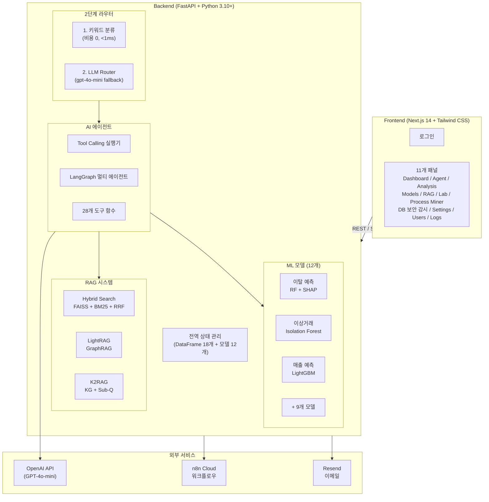

### End-to-End 요청 처리 흐름

사용자가 "SEL0001 셀러가 이탈할 확률은?"이라고 질문하면:

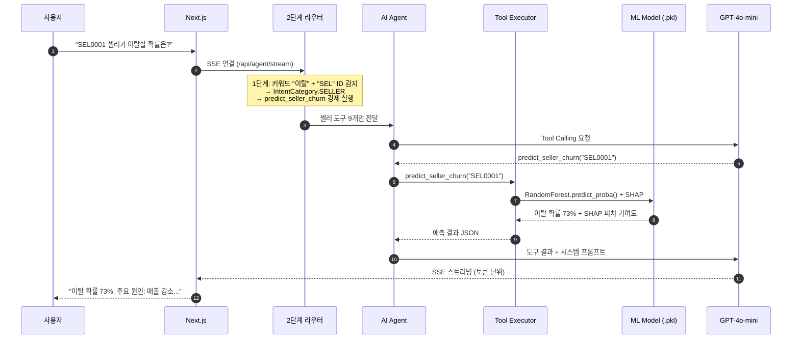

---

## 3. AI 에이전트 시스템

### 3.1 2단계 인텐트 라우터

**문제**: 28개 도구를 한 번에 노출하면 LLM이 잘못된 도구를 선택합니다 (예: 분석 질문에 RAG 호출). 도구 수가 증가할수록 Tool Calling 정확도가 하락하는 것은 LLM의 알려진 한계입니다.

**해결**: 2단계 Router 패턴으로 도구 선택 공간을 7개 카테고리로 축소합니다.

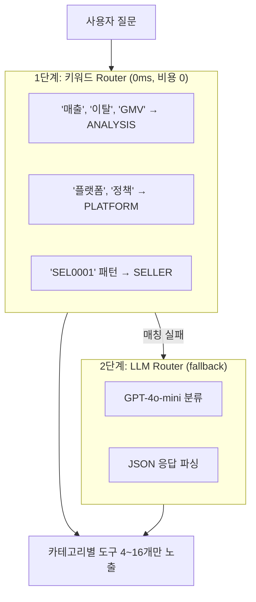

**IntentCategory (7개)**:

| 카테고리 | 트리거 키워드 | 노출 도구 수 | 비고 |
|----------|-------------|:-----------:|------|
| `ANALYSIS` | 매출, 이탈, GMV, 코호트, 트렌드 | 4 | |
| `PLATFORM` | 플랫폼, 정책, 정산, 가이드 | 2 | `tool_choice="required"` (RAG 강제) |
| `SHOP` | 쇼핑몰, 매출, 성과, 카테고리 | 11 | |
| `SELLER` | 셀러, SEL0001, 세그먼트 | 9 | |
| `CS` | CS, 문의, 상담, 용어집 | 5 | |
| `DASHBOARD` | 대시보드, 전체 현황 | 4 | |
| `GENERAL` | 안녕, 고마워 | 0 | 도구 없이 직접 대화 |

### 3.2 KEYWORD_TOOL_MAPPING (강제 도구 실행)

LLM 호출 **전에** 키워드 매칭으로 필수 도구를 강제 실행합니다. LLM이 도구를 놓칠 수 있는 상황을 방지하는 안전장치입니다.

```
사용자: "이탈 예측 분석해줘"
  ↓ 키워드 "이탈" 매칭
  ↓ predict_seller_churn 강제 실행 (LLM 호출 전)
  ↓ 실행 결과를 LLM 컨텍스트에 전달
  ↓ LLM이 결과를 자연어로 설명
```

### 3.3 파라미터 자동 추출 (8종)

사용자 텍스트에서 도구 파라미터를 정규식으로 자동 추출합니다:

| 추출 대상 | 패턴 예시 | 정규식 |
|----------|----------|--------|
| 셀러 ID | `SEL0001` | `SEL\d{1,6}` |
| 쇼핑몰 ID | `S0001` | `S\d{4,6}` |
| 주문 ID | `O0001` | `O\d{4,8}` |
| 일수 | "최근 7일" | `(\d+)\s*일` |
| 날짜 범위 | `2024-01-01 ~ 2024-12-31` | `\d{4}-\d{2}-\d{2}` |
| 위험 등급 | "고위험" | `고위험\|중위험\|저위험` |

### 3.4 도구 함수 (28개)

| 카테고리 | 도구 | ML 모델 | 설명 |
|---------|------|:-------:|------|
| **쇼핑몰** | `get_shop_info`, `list_shops`, `get_shop_services`, `get_shop_performance`, `get_category_info`, `list_categories` | - | 쇼핑몰/카테고리 조회 |
| **RAG** | `search_platform`, `search_platform_lightrag` | - | FAISS Hybrid / LightRAG 검색 |
| **셀러 분석** | `analyze_seller`, `get_seller_segment`, `detect_fraud`, `get_segment_statistics`, `get_fraud_statistics`, `get_seller_activity_report` | K-Means, IsolationForest | 셀러 종합 분석 |
| **예측** | `predict_seller_churn`, `get_churn_prediction`, `predict_shop_revenue`, `get_gmv_prediction`, `optimize_marketing` | RF+SHAP, LightGBM, P-PSO | ML 예측 + 최적화 |
| **분석** | `get_cohort_analysis`, `get_trend_analysis`, `get_order_statistics`, `get_dashboard_summary` | - | KPI/코호트/트렌드 |
| **CS** | `auto_reply_cs`, `check_cs_quality`, `classify_inquiry`, `get_cs_statistics`, `get_ecommerce_glossary` | TF-IDF+RF, RF | CS 자동화 |

### 3.5 멀티 에이전트 (LangGraph)

LangGraph `StateGraph` 기반으로 Coordinator가 질의를 분석하여 전문 에이전트로 라우팅하는 실험적 기능도 구현했습니다.

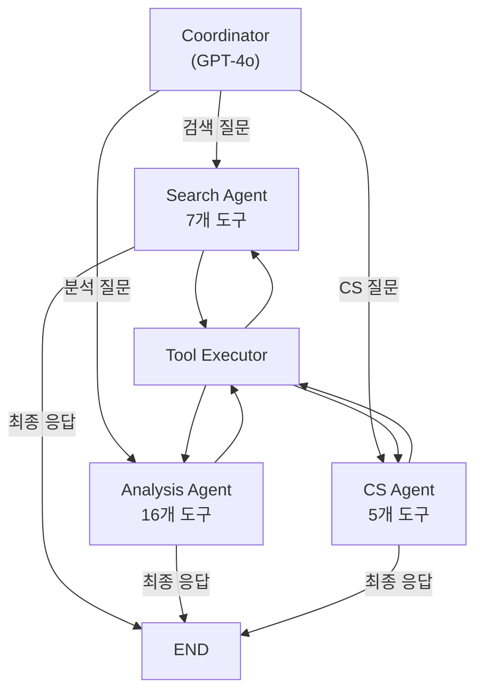

> 기본 운영은 single 모드 (1 LLM + 2단계 라우터 + Tool Calling). multi 모드는 에이전트별 독립 프롬프트 + 도구 세트로 동작하며, 실험 모드로 제공합니다.

---

## 4. RAG 시스템 (8종 기법)

단일 RAG 기법만으로는 이커머스 도메인의 다양한 질문 유형(정책 조회, 개념 설명, 절차 안내)을 커버하기 어렵습니다. 각 기법의 강점을 조합하여 검색 품질을 극대화합니다.

### 적용 기법 요약

| # | 기법 | 효과 | 논문/출처 | 상태 |
|:-:|------|------|-----------|:----:|
| 1 | **Hybrid Search** (FAISS + BM25 + RRF) | 의미 + 키워드 검색 결합 | - | 활성 |
| 2 | **RAG-Fusion** (Multi-Query) | 4개 변형 쿼리로 리콜 향상 | - | 활성 |
| 3 | **Parent-Child Chunking** | 정밀 검색(500자) + 충분한 컨텍스트(3,000자) | - | 활성 |
| 4 | **Contextual Retrieval** | 검색 정확도 +20~35% | [Anthropic](https://www.anthropic.com/news/contextual-retrieval) | 미적용 |
| 5 | **LightRAG** (GraphRAG) | 경량 지식 그래프, 99% 토큰 절감 | [arXiv:2410.05779](https://arxiv.org/abs/2410.05779) | 시험용 |
| 6 | **K2RAG** | KG + Hybrid + Corpus Summarization | [arXiv:2507.07695](https://arxiv.org/abs/2507.07695) | 시험중 |
| 7 | **CRAG** (Corrective RAG) | 검색 품질 자동 교정 | [arXiv:2401.15884](https://arxiv.org/abs/2401.15884) | 모듈 완료 |
| 8 | **Cross-Encoder Reranking** | 정밀 재순위 | - | 비활성 |

### 4.1 Hybrid Search (FAISS + BM25 + RRF)

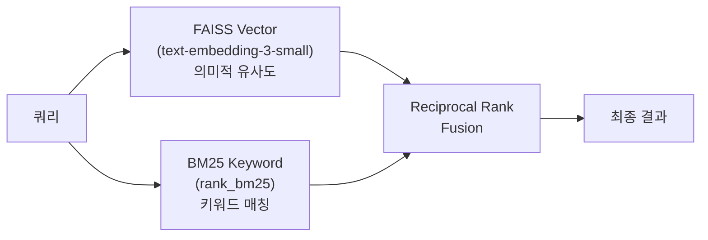

### 4.2 RAG-Fusion (Multi-Query)

단일 쿼리를 GPT-4o-mini로 4개 변형 쿼리로 확장 후 병렬 검색:

```
원본: "카페24 정산 정책 알려줘"
  → 변형 1: "카페24 정산 주기와 정책 안내"
  → 변형 2: "CAFE24 settlement policy"
  → 변형 3: "카페24 셀러 정산 절차"
  → 변형 4: "카페24 수수료 정산 방식"
  → 각각 Hybrid Search → RRF 병합 → 최종 결과
```

### 4.3 Parent-Child Chunking

| 레벨 | 크기 | 용도 |
|------|:----:|------|
| **Child** | 500자 | 검색 인덱싱 (정밀 매칭) |
| **Parent** | 3,000자 | 최종 반환 (충분한 문맥) |

### 4.4 LightRAG (지식 그래프)

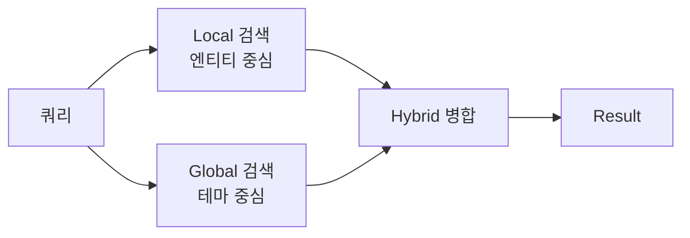

- **Local**: 구체적 엔티티 ("카페24 정산 주기는?")
- **Global**: 추상적 테마 ("카페24 플랫폼 전체 운영 정책은?")
- **Hybrid**: Local + Global 결합 (기본값)

### 4.5 Corrective RAG (CRAG)

검색 결과를 LLM이 자동 평가하여, 품질이 낮으면 쿼리를 재작성하고 재검색합니다.

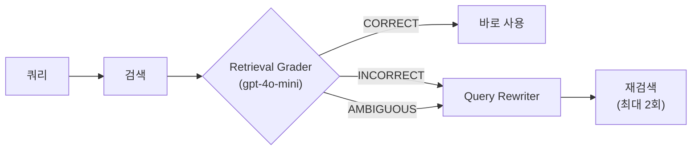

---

## 5. ML 파이프라인 (12개 모델)

### 설계 원칙

- **AI 에이전트 통합**: 모든 ML 모델은 에이전트의 Tool Calling을 통해 호출됩니다. 사용자가 자연어로 질문하면 에이전트가 적절한 모델을 선택하여 결과를 자연어로 설명합니다.
- **MLflow 추적**: 모든 학습 실험은 MLflow에 기록되어, 프론트엔드에서 모델 버전을 선택하면 실시간으로 교체됩니다.
- **Graceful Degradation**: LightGBM/XGBoost 미설치 시 scikit-learn 기본 알고리즘으로 자동 대체됩니다.
- **합성 데이터**: `np.random.default_rng(42)` 시드 고정. 로그정규분포(가격/매출), 베타분포(환불률), 포아송분포(주문수) 등 도메인별 통계적 분포로 실제 이커머스 패턴을 모사합니다.

### 모델 개요

| # | 모델 | 알고리즘 | 비즈니스 목적 | 출력 |
|:-:|------|---------|-------------|------|
| 1 | **셀러 이탈 예측** | RandomForest + SHAP | 이탈 위험 셀러 사전 식별 | 확률 + SHAP 원인 분석 |
| 2 | **이상거래 탐지** | Isolation Forest | 허위 주문/리뷰 조작 탐지 | 정상/이상 + 이상 점수 |
| 3 | **문의 자동 분류** | TF-IDF + RandomForest | 9개 카테고리 자동 분류 | 카테고리 + 신뢰도 |
| 4 | **셀러 세그먼트** | K-Means (k=5) | 행동 패턴 기반 군집화 | 클러스터 ID |
| 5 | **매출 예측** | LightGBM | 다음 달 매출 예측 | 금액 (원) |
| 6 | **CS 응답 품질** | RandomForest | 긴급도 자동 판단 | urgent/high/normal/low |
| 7 | **고객 LTV** | GradientBoosting | 생애가치 예측 | 금액 (원) |
| 8 | **리뷰 감성** | TF-IDF + LogisticRegression | 감성 자동 분류 | 긍정/부정/중립 |
| 9 | **상품 수요** | XGBoost | 다음 주 수요 예측 | 수량 |
| 10 | **정산 이상** | DBSCAN | 정산 이상 패턴 탐지 | 정상/이상 클러스터 |
| 11 | **다음 활동 예측** | RandomForest Classifier | 프로세스 다음 활동 Top-3 | 활동명 + 확률 |
| 12 | **이상 프로세스** | Isolation Forest | 경로 기반 이상 케이스 탐지 | 정상/이상 + 점수 |

### 5.1 셀러 이탈 예측 + SHAP 해석 (대표 모델)

> Accuracy 98.3% · F1-score 93.3%

**9개 입력 피처**:

| 피처 | 중요도 | 설명 |
|------|:------:|------|
| `total_orders` | 35.7% | 누적 주문 수 |
| `total_revenue` | 30.4% | 누적 매출 |
| `days_since_last_login` | 18.8% | 최근 접속 경과일 |
| `cs_tickets` | 9.4% | CS 문의 건수 |
| `refund_rate` | 3.2% | 환불률 |
| + 4개 | 2.5% | 응답시간, 상품수, 가입일수, 플랜 |

**SHAP 출력 예시**:

```
SEL0123 이탈 확률: 73% (high)

피처                              SHAP     영향
──────────────────────────────────────────────
days_since_last_login (14일)      +0.35   이탈 증가 ← 가장 큰 기여
order_count (감소)                +0.22   이탈 증가
total_gmv (높음)                  -0.12   이탈 감소 (방어 요인)
```

### 5.2 마케팅 최적화 (P-PSO)

6개 마케팅 채널에 예산을 최적 배분하는 메타휴리스틱 최적화:

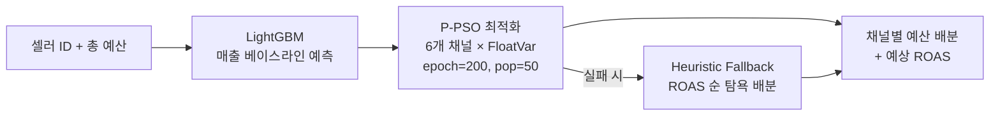

| 채널 | 기대 ROAS | 포화점 | 수익 체감 모델 |
|------|:---------:|:------:|--------------|
| 검색 광고 | 4.5x | 300만 | 포화점 이후 log-scale |
| 이메일 마케팅 | 6.0x | 100만 | 선형 → 로그 전환 |
| 소셜 미디어 | 3.2x | 200만 | |
| 콘텐츠 마케팅 | 3.8x | 150만 | |
| 디스플레이 | 2.8x | 500만 | |
| 인플루언서 | 2.5x | 400만 | |

### 5.3 MLflow 실험 추적

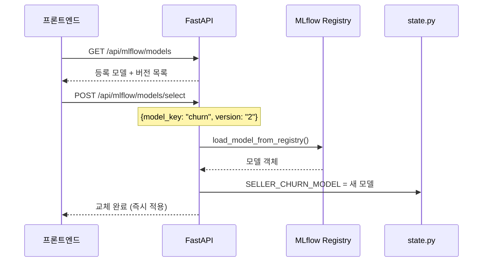

---

## 6. CS 자동화 파이프라인

### 5단계 파이프라인

단순/반복 문의는 자동 처리하고, 복잡한 문의만 담당자가 검토하는 구조입니다.

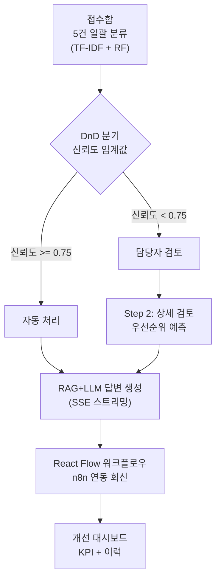

| 단계 | 기능 | AS-IS → TO-BE |
|:----:|------|---------------|
| 1. 접수 | ML 일괄 분류 + DnD 자동/수동 분기 | 수동 분류 → ML 분류 + 신뢰도 라우팅 |
| 2. 검토 | 우선순위 예측 + 상세 분석 | 전건 수동 → 임계값 기반 분기 |
| 3. 답변 | RAG + LLM 스트리밍 답변 초안 | 처음부터 작성 → AI 초안 |
| 4. 회신 | React Flow + n8n + Resend 이메일 | 수동 발송 → 워크플로우 자동화 |
| 5. 개선 | CS 통계 대시보드 + 이력 | 별도 관리 없음 → 실시간 대시보드 |

### n8n 워크플로우 (10개 노드)

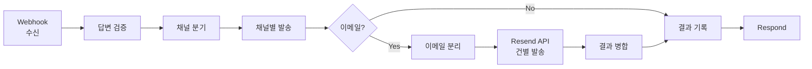

프론트엔드에서 전송 클릭 시 `job_id` 기반 SSE 스트리밍으로 React Flow 노드 상태가 순차 업데이트됩니다: `idle` → `running` (pulse 애니메이션) → `completed` (녹색)

---

## 7. DB 보안 감시 (Data Guardian)

### 개발 배경

실수로 인한 대량 데이터 삭제/수정은 치명적 비즈니스 손실로 이어집니다.
- 신입 개발자가 `WHERE` 없이 `DELETE FROM orders` 실행 → 주문 전체 소실
- 야간 배치에서 정산 테이블 `UPDATE` 조건 오류 → 금액 일괄 0원

### 3단계 + Recovery Agent

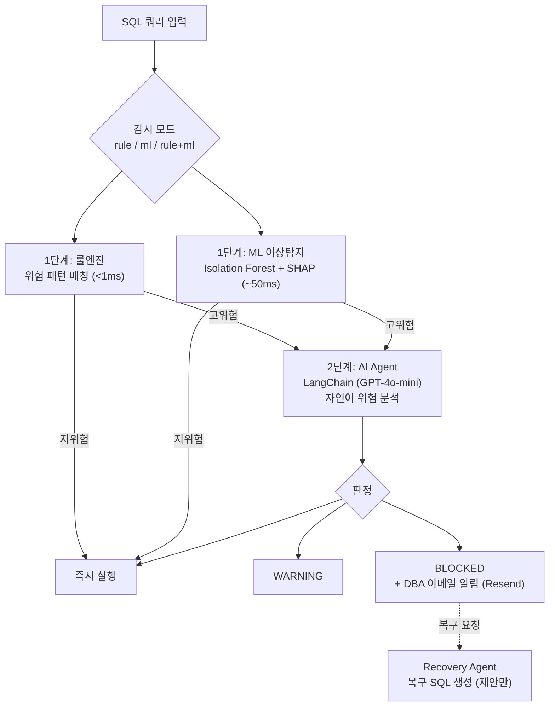

**설계 결정 — 멀티 에이전트를 채택하지 않은 이유**:

| 초기 설계 (멀티 에이전트) | 문제점 | 최종 설계 |
|--------------------------|--------|-----------|
| 모든 쿼리에 LLM 호출 | 1~3초 레이턴시 → 실시간 차단 불가 | 룰엔진 1차 필터 (<1ms) |
| 4개 에이전트 간 통신 | 복잡도/장애 포인트 증가 | 1 에이전트 + 4 Tools |
| Recovery Agent 자동 실행 | 2차 사고 위험 | 복구 SQL "제안"만 (DBA 승인 필수) |

**Guardian Agent 도구**: `analyze_impact` (비즈니스 영향도) · `get_user_pattern` (사용자 행동 패턴) · `search_similar` (과거 유사 사건) · `execute_decision` (차단/승인)

---

## 8. AI 프로세스 마이너

이벤트 로그(주문/CS/정산 3종) 기반으로 프로세스 패턴을 발견하고, ML로 예측 및 이상 탐지를 수행합니다.

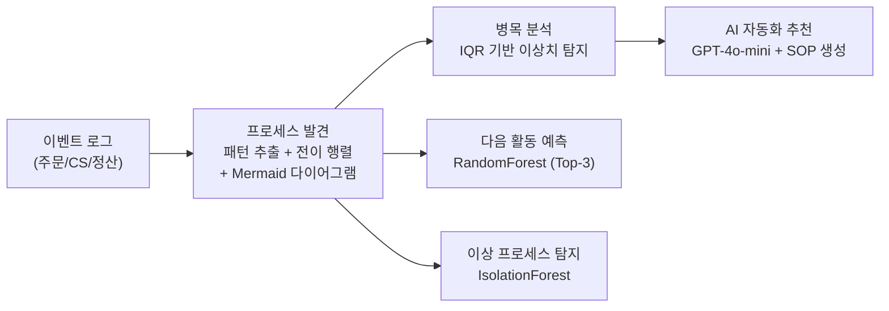

| 기능 | 기술 | 설명 |
|------|------|------|
| **프로세스 발견** | Counter 빈도 분석 + 전이 행렬 | 프로세스 플로우 자동 시각화 |
| **병목 분석** | IQR 이상치 탐지 | 병목 구간 식별 + 효율성 점수 |
| **자동화 추천** | GPT-4o-mini | 자동화 가능 구간 + ROI 분석 + SOP 문서 |
| **다음 활동 예측** | RandomForest (7개 피처) | 현재 활동 기준 다음 활동 Top-3 확률 |
| **이상 프로세스** | Isolation Forest | 경로 기반 이상 케이스 탐지 |

---

## 9. 프론트엔드 (11개 패널)

### UX 설계 원칙

| 원칙 | 적용 |
|------|------|
| **점진적 노출** | 핵심 정보 먼저, 상세는 접이식/드릴다운 |
| **실시간 피드백** | SSE 토큰 스트리밍, 도구 호출 상태 실시간 업데이트 |
| **직접 조작** | DnD로 CS 문의 분기, 슬라이더로 신뢰도 조정 |
| **상태 가시성** | 스켈레톤, NProgress, 토스트 알림 |
| **RBAC** | 관리자 11개 / 비관리자 6개 패널 |

### 패널 구성

| # | 패널 | 핵심 기능 | 주요 기술 |
|:-:|------|----------|----------|
| 1 | **AI 에이전트** | 자연어 채팅 + 도구 호출 + 수학 수식 | SSE, react-markdown, KaTeX |
| 2 | **대시보드** | KPI, 차트, AI 인사이트, 알림 | Recharts (6종 차트) |
| 3 | **분석 (9탭)** | 셀러/세그먼트/이상탐지/예측/코호트/트렌드/쇼핑몰/CS/마케팅 | RadarChart, HeatMap, Plotly |
| 4 | **ML 모델** | MLflow 레지스트리, 버전 선택 | 실시간 모델 교체 |
| 5 | **RAG 관리** | 모드 선택, 인덱스 빌드, 상태 모니터링 | FAISS/LightRAG/K2RAG |
| 6 | **설정** | LLM 파라미터, 프리셋 3종, 시스템 프롬프트 | 슬라이더 UI |
| 7 | **셀러 관리** | 플랫폼 셀러 계정 관리 | 관리자 전용 |
| 8 | **활동 로그** | 세션 활동 이력 | localStorage |
| 9 | **CS 파이프라인** | 5단계 자동화 (DnD + React Flow + n8n) | Framer Motion, @xyflow/react |
| 10 | **DB 보안 감시** | 3단계 쿼리 분석 + 복구 | 감시 모드 토글, 프리셋 8개 |
| 11 | **프로세스 마이너** | 프로세스 발견 + ML 예측 + 이상 탐지 | 위상 정렬 BFS 렌더링 |

### 분석 패널 상세 (9개 서브탭)

| 서브탭 | 차트 | API |
|--------|------|-----|
| 셀러 분석 | RadarChart (5축) + AreaChart | `/api/sellers/search` |
| 세그먼트 | BarChart (5 클러스터 비교) | `/api/stats/summary` |
| 이상탐지 | ComposedChart + Scatter | `/api/analysis/anomaly` |
| 예측 분석 | AreaChart (이탈/매출/인게이지먼트) | `/api/analysis/prediction/churn` |
| 코호트 | HeatMap + LineChart | `/api/analysis/cohort/retention` |
| 트렌드 | LineChart + 상관관계 | `/api/analysis/trend/kpis` |
| 쇼핑몰 | BarChart (플랜별 색상) | `/api/shops` |
| CS 분석 | PieChart + 테이블 | `/api/stats/summary` |
| 마케팅 최적화 | 채널별 ROI 테이블 | `/api/marketing/optimize` |

---

## 10. 기술 스택 및 아키텍처 결정

### 백엔드

| 분류 | 기술 | 선택 이유 |
|------|------|----------|
| **프레임워크** | FastAPI | 비동기, SSE 네이티브 지원, OpenAPI 자동 문서화 |
| **LLM** | OpenAI GPT-4o-mini | Tool Calling 정확도 + 비용 효율 |
| **에이전트** | LangChain + LangGraph | Tool Calling 추상화 + StateGraph 멀티 에이전트 |
| **벡터 검색** | FAISS (faiss-cpu) | 로컬 실행, 별도 서버 불필요 |
| **GraphRAG** | LightRAG | 99% 토큰 절감, 경량 지식 그래프 |
| **ML** | scikit-learn, LightGBM, XGBoost | 범주형 피처 네이티브 지원 (LightGBM), 해석 가능 |
| **ML 해석** | SHAP | TreeExplainer로 피처 기여도 분해 |
| **최적화** | mealpy (P-PSO) | 연속 변수 탐색, 포화점 체감 모델 적합 |
| **MLOps** | MLflow | 로컬 파일 기반, 별도 서버 불필요 |
| **워크플로우** | n8n Cloud | 시각적 워크플로우, Webhook 트리거 |

### 프론트엔드

| 분류 | 기술 | 선택 이유 |
|------|------|----------|
| **프레임워크** | Next.js 14 (Pages Router) | SSR/CSR 하이브리드, API Route로 SSE 프록시 |
| **스타일링** | Tailwind CSS 3.4 | 유틸리티 퍼스트, CAFE24 브랜드 커스텀 |
| **차트** | Recharts + Plotly.js | 선언적 React 차트 + 고급 시각화 |
| **SSE** | @microsoft/fetch-event-source | POST SSE 지원, 재연결 |
| **워크플로우** | @xyflow/react (React Flow) | n8n 워크플로우 시각화, 노드 상태 애니메이션 |
| **애니메이션** | Framer Motion | 스텝 전환, 아코디언, 스프링 로고 |
| **마크다운** | react-markdown + KaTeX | GFM 테이블 + 수학 수식 렌더링 |

### 인프라

| 분류 | 기술 |
|------|------|
| **프론트엔드** | Vercel |
| **백엔드** | Railway (Docker, python:3.11-slim) |
| **컨테이너** | Docker |

### 알고리즘 선택 근거

| 모델 | 알고리즘 | 선택 이유 |
|------|---------|----------|
| 셀러 이탈 | RandomForest | SHAP 호환성, 불균형 데이터 class_weight 지원 |
| 이상거래 | Isolation Forest | 라벨 없는 비지도 학습, 고차원 이상치 분리 |
| 문의 분류 | TF-IDF + RF | 한국어 n-gram 패턴 포착 + 다중 클래스 성능 |
| 셀러 세그먼트 | K-Means | 구현 단순, 센트로이드 비교로 해석 용이 |
| 매출 예측 | LightGBM | 범주형 피처 네이티브, 빠른 학습 |
| 정산 이상 | DBSCAN | k 사전 지정 불필요, noise(-1)로 이상치 분리 |
| 수요 예측 | XGBoost | 시계열 + 정적 피처 동시 처리 |

---

## 11. 프로젝트 구조

```
카페24 프로젝트/
├── README.md                          # 프로젝트 루트 문서
├── PORTFOLIO.md                       # 포트폴리오 문서 (이 파일)
│
├── backend 리팩토링 시작/             # FastAPI 백엔드
│   ├── main.py                        # 앱 진입점 (미들웨어, startup)
│   ├── state.py                       # 전역 상태 (DataFrame 18개 + 모델 12개)
│   ├── api/routes.py                  # 89개 REST API
│   │
│   ├── agent/                         # AI 에이전트 시스템
│   │   ├── runner.py                  # Tool Calling 실행기
│   │   ├── tools.py                   # 28개 도구 함수
│   │   ├── router.py                  # 2단계 라우터
│   │   ├── multi_agent.py             # LangGraph 멀티 에이전트
│   │   ├── crag.py                    # Corrective RAG
│   │   └── llm.py                     # LLM 호출 래퍼 (재시도, GPT-5 호환)
│   │
│   ├── rag/                           # RAG 시스템
│   │   ├── service.py                 # FAISS + BM25 Hybrid Search
│   │   ├── light_rag.py               # LightRAG (GraphRAG)
│   │   └── k2rag.py                   # K2RAG (KG + Hybrid + Summarization)
│   │
│   ├── ml/                            # ML 파이프라인
│   │   ├── train_models.py            # 18개 CSV + 12개 모델 학습
│   │   ├── revenue_model.py           # LightGBM 매출 예측
│   │   ├── marketing_optimizer.py     # P-PSO 마케팅 최적화
│   │   └── mlflow_tracker.py          # MLflow 실험 추적
│   │
│   ├── process_miner/                 # 프로세스 마이너 (발견/병목/예측/이상/추천)
│   ├── core/                          # 유틸리티 (상수, 파서, 메모리)
│   ├── data/loader.py                 # CSV 18개 + 모델 12개 로더
│   └── Dockerfile
│
└── nextjs/                            # Next.js 프론트엔드
    ├── pages/                         # Pages Router (login, app, API Routes)
    │   ├── app.js                     # 메인 앱 (탭 기반 11개 패널)
    │   └── api/                       # SSE 프록시 5개
    ├── components/panels/             # 11개 기능 패널
    ├── lib/                           # API 호출, 스토리지, 유틸리티
    └── styles/globals.css             # CAFE24 디자인 시스템
```

---

## 12. 설치 및 배포

### 로컬 실행

```bash
# 백엔드
cd "backend 리팩토링 시작"
pip install -r requirements.txt
export OPENAI_API_KEY=sk-...
python ml/train_models.py          # 합성 데이터 + 모델 학습 (최초 1회)
uvicorn main:app --port 8001 --reload

# 프론트엔드
cd nextjs
npm install
npm run dev
```

### 배포 아키텍처

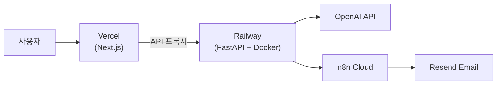

| 서비스 | URL |
|--------|-----|
| **프론트엔드** | https://cafe24-frontend.vercel.app/ |
| **백엔드 API** | https://cafe24-backend-production.up.railway.app |
| **Swagger 문서** | https://cafe24-backend-production.up.railway.app/docs |

### 테스트 계정

| 계정 | 비밀번호 | 역할 | 접근 패널 |
|------|---------|:----:|:---------:|
| `admin` | `admin123` | 관리자 | 11개 전체 |
| `analyst` | `analyst123` | 분석가 | 6개 |
| `user` | `user123` | 사용자 | 6개 |
| `operator` | `oper123` | 운영자 | 6개 |

---

<div align="center">

### 기술 요약

**LLM**: GPT-4o-mini (Tool Calling + SSE 스트리밍)
**ML**: RandomForest · LightGBM · XGBoost · Isolation Forest · K-Means · DBSCAN + SHAP + P-PSO
**RAG**: FAISS + BM25 Hybrid · RAG-Fusion · Parent-Child Chunking · LightRAG · K2RAG · CRAG
**Backend**: FastAPI · LangChain · LangGraph · MLflow · n8n · Resend
**Frontend**: Next.js 14 · Tailwind CSS · Recharts · Plotly · React Flow · Framer Motion · KaTeX

---

**CAFE24 AI 운영 플랫폼** · 카페24 이커머스 AI 기반 내부 운영 시스템

</div>
